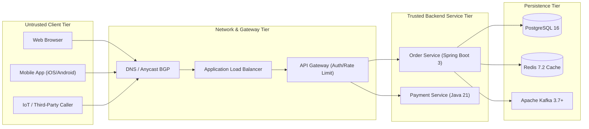
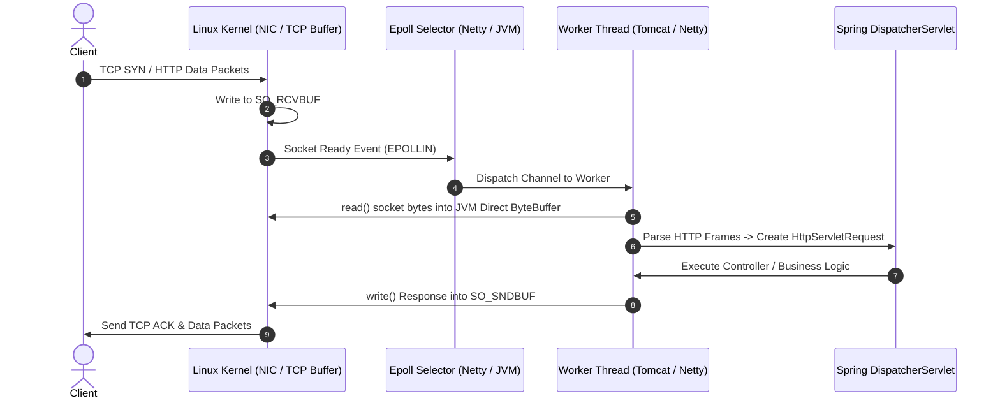

# What is a Backend & The Client-Server Model

Master the architectural boundaries, transport mechanisms, and contract guarantees governing modern client-server communication.

---

## 1. What Is It?
A **backend** is the server-side infrastructure responsible for business logic execution, transactional persistence, authorization, data validation, and integration with third-party systems.

In the **Client-Server Model**, a client (browser, mobile application, IoT device, or another microservice) initiates a request over an untrusted network, and the server processes the request, mutates state or queries a data store, and returns a structured response.

---

## 2. Why Does It Exist?
Without a centralized backend:
- **Zero Trust Security**: Business logic running on clients can be reverse-engineered, tampered with, or bypassed.
- **Data Inconsistency**: Clients cannot maintain a single source of truth across millions of concurrent users without distributed consensus.
- **Resource Constraints**: Clients lack the compute, memory, and high-bandwidth network pipelines required for large-scale data queries and heavy processing.

---

## 3. Mental Model



---

## 4. How Does It Work?
1. **Connection Negotiation**: The client performs DNS resolution to obtain an IP address, then establishes a TCP connection (3-way handshake) and negotiates TLS encryption.
2. **Request Dispatch**: The client serializes an application payload (HTTP/JSON, Protobuf, gRPC) and transmits it across the socket.
3. **Gateway Ingress**: The reverse proxy/API Gateway terminates TLS, enforces rate limits, validates authentication tokens (JWT), and forwards the request to the upstream backend service.
4. **Execution & Persistence**: The backend validates the request DTO, executes domain business invariants, mutates state inside a database transaction, and optionally publishes domain events.
5. **Response Serialization**: The backend formats the domain output into a DTO, serializes it to JSON/binary, and flushes it back through the TCP socket.

---

## 5. Internal Working: OS Socket to Application Space



---

## 6. Example & Production Java 21 Code

A production-grade, thread-safe service boundary demonstrating request validation, error domain mapping, and structured immutability using Java 21 Records and Pattern Matching:

```java
package com.backend.fundamentals.boundary;

import java.time.Instant;
import java.util.Objects;
import java.util.UUID;

// 1. Immutable Request DTO
public record CreateOrderRequest(
    String customerId,
    String idempotencyKey,
    long amountCents
) {
    public CreateOrderRequest {
        Objects.requireNonNull(customerId, "customerId must not be null");
        Objects.requireNonNull(idempotencyKey, "idempotencyKey must not be null");
        if (amountCents <= 0) {
            throw new IllegalArgumentException("amountCents must be positive");
        }
    }
}

// 2. Domain Response Hierarchy using Sealed Interfaces
public sealed interface OrderResult permits OrderResult.Success, OrderResult.Rejected, OrderResult.Duplicate {
    record Success(UUID orderId, String status, Instant timestamp) implements OrderResult {}
    record Rejected(String reasonCode, String userMessage) implements OrderResult {}
    record Duplicate(UUID originalOrderId, String message) implements OrderResult {}
}

// 3. Service Interface Defining Clean Boundary
public interface OrderBoundaryService {
    OrderResult processOrder(CreateOrderRequest request);
}

// 4. Production Service Implementation
public class OrderBoundaryServiceImpl implements OrderBoundaryService {

    @Override
    public OrderResult processOrder(CreateOrderRequest request) {
        // Business logic validation & pattern matching
        if (request.amountCents() > 10_000_000) { // $100,000 threshold
            return new OrderResult.Rejected("EXCEEDS_LIMIT", "Transaction exceeds maximum allowed limit");
        }

        UUID generatedId = UUID.randomUUID();
        return new OrderResult.Success(generatedId, "CONFIRMED", Instant.now());
    }
}
```

---

## 7. Performance Characteristics
- **Transport Overhead**: DNS (~10-50ms cold, ~1ms cached), TCP 3-way handshake (~1 RTT), TLS 1.3 (~1 RTT).
- **Serialization Cost**: JSON reflection-based deserialization (Jackson) consumes ~5-15 microseconds per request. Protobuf binary parsing takes ~1-3 microseconds.
- **Context Switches**: Under heavy concurrency, thread-per-request models incur CPU degradation due to OS context switches (~1-2 microseconds per switch).

---

## 8. Failure Scenarios & Edge Cases
- **Broken Socket (Client Disconnects Mid-Stream)**: The client drops connection while the backend is executing a mutation. Without transactional rollbacks or idempotency checks, duplicate records or orphaned writes occur.
- **Buffer Bloat / Slow Clients**: A slow client fails to read TCP ACKs promptly, causing the server's `SO_SNDBUF` to fill, blocking the worker thread if non-blocking I/O is not utilized.

---

## 9. Observability (Logs, Metrics, Traces)
```json
{
  "timestamp": "2026-09-01T18:00:00.123Z",
  "level": "INFO",
  "trace_id": "4bf92f3577b34da6a3ce929d0e0e4736",
  "span_id": "00f067aa0ba902b7",
  "http_method": "POST",
  "http_path": "/api/v1/orders",
  "status_code": 201,
  "duration_ms": 14.2,
  "client_ip": "203.0.113.42",
  "user_agent": "iOS-App/4.2.0"
}
```

---

## 10. Debugging & Troubleshooting
1. **Verify Socket State via `ss` / `netstat`**:
   ```bash
   ss -tan state established '( dport = :8080 or sport = :8080 )'
   ```
2. **Inspect Kernel Drops**:
   ```bash
   netstat -s | grep -E "buffer errors|TCPBacklogDrop"
   ```

---

## 11. Scaling Considerations
- **Stateless Tier**: Scale backend nodes horizontally behind Layer 7 Application Load Balancers.
- **Connection Draining**: When terminating nodes during autoscaling, allow in-flight TCP connections 30-60 seconds to complete gracefully.

---

## 12. Architectural Trade-offs
| Dimension | Client-Heavy Architecture | Backend-Heavy Architecture |
|---|---|---|
| **Security** | Low (Vulnerable to tampering) | High (Guarded behind trust boundary) |
| **Upgrade Velocity** | Slow (Dependent on app stores) | Instant (Deploy server container) |
| **Compute Cost** | Offloaded to user devices | Borne by infrastructure |

---

## 13. When to Use
- When data integrity, regulatory compliance, multi-user collaboration, or private business algorithms are required.

## 14. When NOT to Use
- Pure client-side offline tools (e.g., local text editors, local calculators, standalone canvas tools).

---

## 15. SDE2 / Senior Interview Questions & Answers
### Q1: What happens if a client disconnects immediately after sending a POST request to create a payment?
<details>
<summary>Reveal Answer</summary>

**Answer**:
The server-side TCP stack will receive an `RST` or `FIN` packet. If the backend thread is already executing the business logic in application memory, it will continue executing unless the framework checks for client socket cancellation (`isCancelled()` or checking I/O writer errors on flush).

To prevent data corruption:
1. The backend must enforce **Idempotency Keys**. If the client retries after the disconnect, the duplicate request returns the cached result.
2. Long-running operations should pass cancellation tokens or use transactional rollback if the response cannot be flushed.
</details>

---

## 16. Practical Exercise
1. Implement a client-server socket drill in Java 21 where the server artificially delays responses by 5 seconds.
2. Send requests from a client, immediately terminate the client process, and observe the server thread state using `jcmd <pid> Thread.print`.

---

## 17. Quick Revision Summary
- The backend serves as the **trust and persistence boundary** for client applications.
- Sockets bridge OS network buffers (`SO_RCVBUF`/`SO_SNDBUF`) with JVM execution threads.
- Idempotency and transactional boundaries are mandatory to survive client dropouts and network partitions.
