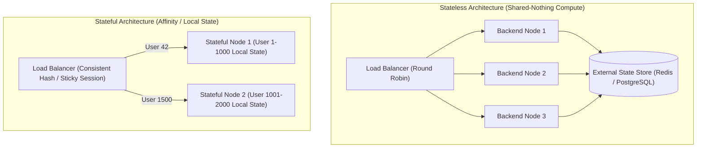
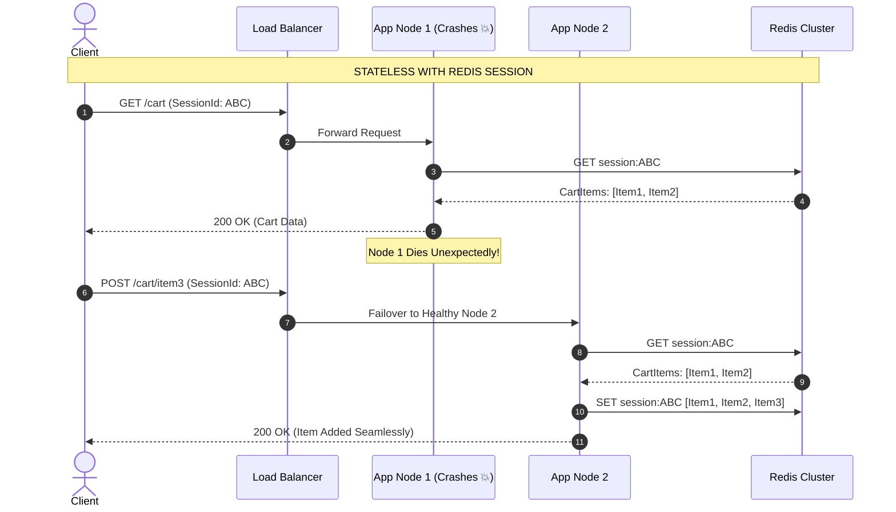

# Stateless vs Stateful Services

Deep dive into the architectural trade-offs, scalability dynamics, and state-management patterns in production backend services.

---

## 1. What Is It?
- **Stateless Service**: A backend service that retains no persistent client state across distinct requests in its local heap or disk. Any request from any client can be handled by any healthy instance of the service.
- **Stateful Service**: A backend service that maintains client session context, local in-memory caches, open TCP socket bindings (e.g., WebSocket connections, game loop sessions), or local database files directly on the host node.

---

## 2. Why Does It Exist?
- **Statelessness** decouples compute from storage, allowing auto-scalers to add or destroy nodes instantly based on CPU/traffic metrics without risking data loss or session drops.
- **Statefulness** provides ultra-low latency ($\mu\text{s}$) by keeping mutable working data in local RAM, avoiding network hops to remote databases or distributed caches.

---

## 3. Mental Model



---

## 4. How Does It Work?
1. **Stateless Request Flow**: Client sends request with authorization token (e.g., JWT). The node decodes the token, fetches any required state from Redis/PostgreSQL, mutates the state externally, and responds. The node can be terminated immediately with zero side effects.
2. **Stateful Request Flow**: Client establishes a persistent connection. The load balancer uses sticky sessions (cookie-based routing) or consistent hashing to guarantee subsequent requests hit the exact same server instance.

---

## 5. Internal Working: Session Storage Comparison



---

## 6. Example & Production Java 21 Code

Handling stateless sessions using signed, cryptographically validated JWTs versus externalizing state to a Redis repository:

```java
package com.backend.fundamentals.state;

import java.time.Instant;
import java.util.List;
import java.util.Optional;
import java.util.concurrent.ConcurrentHashMap;

// 1. Immutable User Session Record
public record UserSession(
    String userId,
    String email,
    List<String> roles,
    Instant expiresAt
) {
    public boolean isExpired() {
        return Instant.now().isAfter(expiresAt);
    }
}

// 2. Stateless Session Extractor (Decoupled from Node Memory)
public interface SessionRepository {
    Optional<UserSession> findSession(String token);
    void saveSession(String token, UserSession session, long ttlSeconds);
    void invalidateSession(String token);
}

// 3. Thread-Safe Production Implementation (Redis-backed abstraction)
public class StatelessSecurityContext {
    private final SessionRepository sessionRepository;

    public StatelessSecurityContext(SessionRepository sessionRepository) {
        this.sessionRepository = sessionRepository;
    }

    public boolean authenticateAndAuthorize(String bearerToken, String requiredRole) {
        if (bearerToken == null || bearerToken.isBlank()) {
            return false;
        }

        return sessionRepository.findSession(bearerToken)
            .filter(session -> !session.isExpired())
            .map(session -> session.roles().contains(requiredRole))
            .orElse(false);
    }
}
```

---

## 7. Performance Characteristics
- **Stateless**: Incurs an extra network hop to external storage ($\sim 0.5 - 2	ext{ms}$ for Redis, $\sim 5 - 15	ext{ms}$ for PostgreSQL), but delivers unbounded horizontal scalability.
- **Stateful**: Ultra-low latency ($\sim 10 - 50	ext{ns}$ for RAM lookups), but complex rebalancing, connection draining, and failover overhead.

---

## 8. Failure Scenarios & Edge Cases
- **The "Sticky Session Trap"**: When a stateful node crashes, all active sessions pinned to that node are dropped. Users experience sudden logouts and lost carts.
- **Hot-Spotting / Traffic Skew**: If a celebrity or viral event is pinned to a specific stateful node, that node's CPU/RAM saturates while peer nodes remain idle.

---

## 9. Observability (Logs, Metrics, Traces)
```text
# Prometheus Metrics for Node State & Sessions
jvm_sessions_active_count{instance="node-1"} 4210
http_sticky_session_miss_total{reason="target_node_down"} 14
external_cache_latency_seconds_bucket{le="0.002", op="get_session"} 14890
```

---

## 10. Debugging & Troubleshooting
1. **Check for Unintended In-Memory State in Java Applications**:
   - Inspect heap dumps for static collections (`static Map<String, Object> sessionMap`) using Eclipse MAT or VisualVM.
2. **Verify Load Balancer Cookie Hashing**:
   - Inspect `Set-Cookie: AWSALB=...` headers to detect uneven sticky routing.

---

## 11. Scaling Considerations
- **Stateless Services**: Scale from 2 to 200 nodes in minutes using Kubernetes Horizontal Pod Autoscaler (HPA) targeting 70% CPU utilization.
- **Stateful Services**: Require stateful sets, persistent volume claims (PVC), and partition rebalancing algorithms (e.g., Consistent Hashing Rings).

---

## 12. Architectural Trade-offs
| Attribute | Stateless Service | Stateful Service |
|---|---|---|
| **Horizontal Scalability** | Trivial (Round-robin routing) | Complex (Partitioning/Rebalancing) |
| **Failover Resilience** | Instantaneous (Zero session loss) | Requires state recovery/replication |
| **Local Memory Latency** | Higher (Remote cache hop) | Lowest ($\mathcal{O}(1)$ local RAM) |
| **Deployment Complexity**| Low (Rolling restart anytime) | High (Requires connection draining) |

---

## 13. When to Use
- **Use Stateless**: REST APIs, API Gateways, Payment Processing, User Management, Order Management.
- **Use Stateful**: Real-time Gaming Loops, In-Memory Caches (Redis), Message Brokers (Kafka), Collaborative Document Editing (OT/CRDT servers).

---

## 14. When NOT to Use
- Do not build stateful REST APIs where clients expect seamless failover and multi-zone redundancy.

---

## 15. SDE2 / Senior Interview Questions & Answers
### Q1: How do you migrate a legacy stateful session-based monolith to a horizontally scalable stateless architecture?
<details>
<summary>Reveal Answer</summary>

**Answer**:
1. **Step 1: Externalize Session State**: Replace in-memory `HttpSession` with a distributed cache such as Redis using Spring Session (`@EnableRedisHttpSession`).
2. **Step 2: Stateless Token Migration**: Migrate authentication to cryptographically signed tokens (JWTs) containing essential claims (user ID, roles, expiry), reducing cache lookups for auth validation.
3. **Step 3: Remove Sticky Routing**: Configure the Layer 7 Load Balancer to use standard Round-Robin or Least-Connections routing instead of sticky cookies.
4. **Step 4: Enable Autoscaling**: Set up Kubernetes HPA or AWS Auto Scaling Groups based on CPU and request concurrency.
</details>

---

## 16. Practical Exercise
1. Implement a Spring Boot controller that stores user items in an in-memory `HashMap`.
2. Run two instances on ports 8081 and 8082 behind an NGINX round-robin load balancer.
3. Observe state inconsistency when consecutive requests hit alternating instances.
4. Refactor the implementation to use Redis, verifying seamless state sharing across both instances.

---

## 17. Quick Revision Summary
- Statelessness enables **elastic scaling** and **zero-downtime rolling deployments**.
- Stateful systems require **sticky routing, consistent hashing, and complex failover protocols**.
- Externalizing state to distributed storage (Redis/PostgreSQL) is the standard modern backend pattern.
