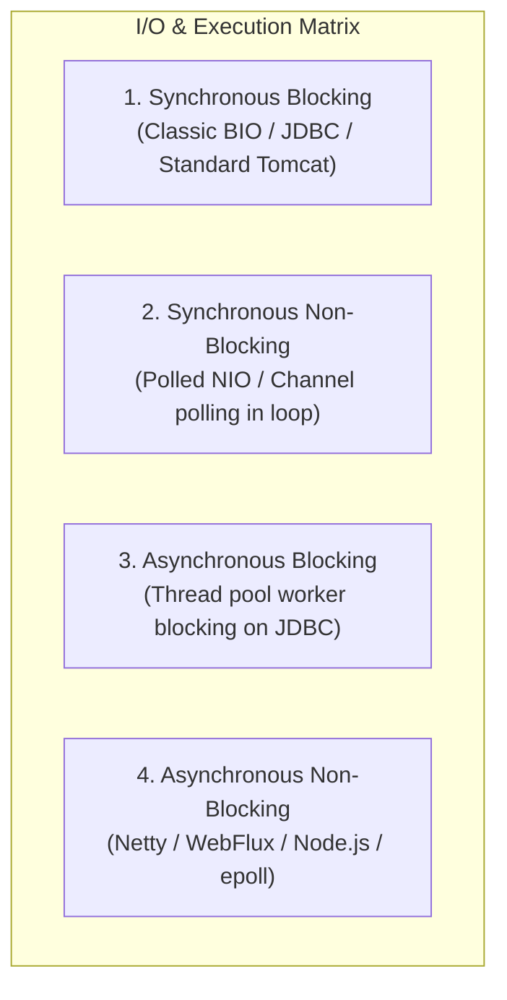
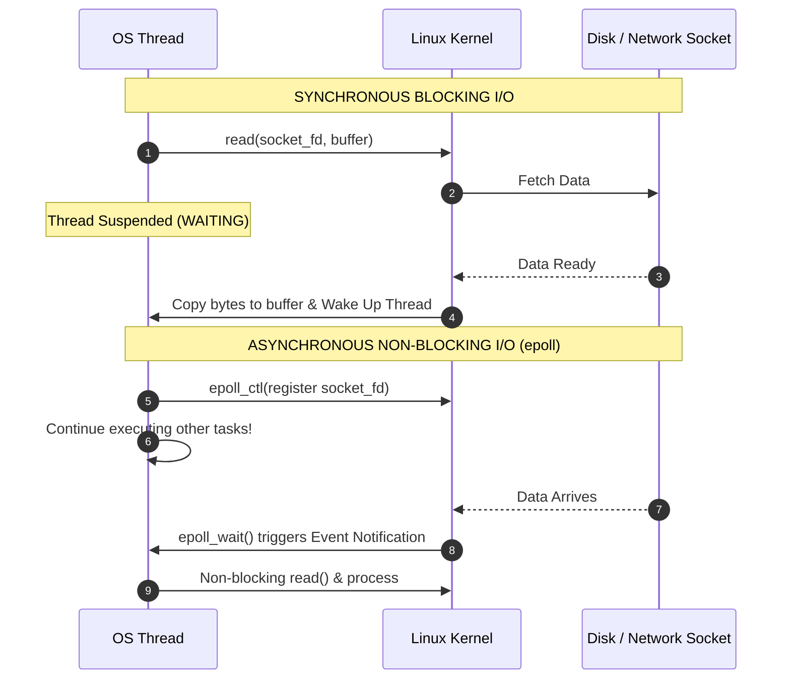

# Synchronous vs Asynchronous & Blocking vs Non-Blocking

Master the fundamental concurrency and I/O execution models powering modern high-throughput backend services.

---

## 1. What Is It?
- **Synchronous**: The caller initiates an operation and halts execution, waiting for the operation to return before proceeding.
- **Asynchronous**: The caller initiates an operation, receives immediate control back (or a handle/Future), and is notified upon completion via a callback, event, or polling.
- **Blocking**: The calling thread yields its CPU time slice and is put into a waiting state by the OS kernel until the requested I/O resource is ready.
- **Non-Blocking**: The call returns immediately; if data is not ready, it returns an indicator (e.g., `EWOULDBLOCK` or `0` bytes read) without suspending the calling thread.

---

## 2. Why Does It Exist?
Traditional **Thread-Per-Request (Blocking I/O)** consumes $\sim 1	ext{MB}$ of OS stack memory per thread. 10,000 concurrent waiting connections would require $10	ext{GB}$ of RAM just for thread stacks, causing OS context-switching thrashing (The C10K Problem).

**Non-blocking and Asynchronous** execution models decouple open network connections from active OS threads, allowing a few threads to handle hundreds of thousands of concurrent I/O streams.

---

## 3. Mental Model: The 2x2 Matrix



---

## 4. How Does It Work?



---

## 5. Internal Working: Java Thread-Per-Request vs Netty EventLoop vs Java 21 Virtual Threads

1. **Classic Tomcat (Thread-per-request)**: 1 HTTP connection = 1 OS Platform Thread. Thread blocks during database/HTTP calls.
2. **Netty / Spring WebFlux (Event Loop)**: 1 OS Thread per CPU core. I/O events multiplexed via `epoll_wait()`. Never block the EventLoop thread!
3. **Java 21 Virtual Threads (JEP 444)**: 1 HTTP connection = 1 Lightweight Virtual Thread. When a virtual thread blocks on socket I/O, the JVM unmounts it from the underlying Carrier Thread (`ForkJoinPool`), mounting another virtual thread.

---

## 6. Example & Production Java 21 Code

Demonstrating Synchronous Blocking, Reactive CompletableFuture, and Java 21 Virtual Threads:

```java
package com.backend.fundamentals.concurrency;

import java.net.URI;
import java.net.http.HttpClient;
import java.net.http.HttpRequest;
import java.net.http.HttpResponse;
import java.time.Duration;
import java.util.concurrent.CompletableFuture;
import java.util.concurrent.Executors;

public class ExecutionModelsDemo {

    private final HttpClient httpClient = HttpClient.newBuilder()
        .connectTimeout(Duration.ofSeconds(2))
        .build();

    // 1. Synchronous Blocking Call
    public String fetchOrderSync(String orderId) throws Exception {
        HttpRequest request = HttpRequest.newBuilder()
            .uri(URI.create("https://api.internal/orders/" + orderId))
            .GET()
            .build();

        // Calling thread blocks here until response arrives
        HttpResponse<String> response = httpClient.send(request, HttpResponse.BodyHandlers.ofString());
        return response.body();
    }

    // 2. Asynchronous Non-Blocking using CompletableFuture
    public CompletableFuture<String> fetchOrderAsync(String orderId) {
        HttpRequest request = HttpRequest.newBuilder()
            .uri(URI.create("https://api.internal/orders/" + orderId))
            .GET()
            .build();

        // Non-blocking invocation; returns immediately with Future
        return httpClient.sendAsync(request, HttpResponse.BodyHandlers.ofString())
            .thenApply(HttpResponse::body)
            .exceptionally(ex -> "Fallback: Order Unavailable");
    }

    // 3. Java 21 Virtual Threads: Synchronous Code Style with Asynchronous Efficiency
    public void runWithVirtualThreads() {
        try (var executor = Executors.newVirtualThreadPerTaskExecutor()) {
            for (int i = 0; i < 10_000; i++) {
                final String orderId = "ORD-" + i;
                executor.submit(() -> {
                    // Looks blocking, but JVM unmounts virtual thread upon I/O wait!
                    try {
                        String orderData = fetchOrderSync(orderId);
                        System.out.println("Processed: " + orderId);
                    } catch (Exception e) {
                        Thread.currentThread().interrupt();
                    }
                });
            }
        } // Auto-closes and awaits all 10,000 tasks without crashing the OS thread scheduler
    }
}
```

---

## 7. Performance Characteristics
- **Context Switch Penalty**: Switching between OS platform threads takes $\sim 1 - 2\,\mu	ext{s}$ and invalidates CPU L1/L2 caches. Virtual thread context switches occur in user-space in $\sim 50 - 100\,	ext{ns}$.
- **Throughput Under High Latency I/O**: As downstream I/O latency increases from $10	ext{ms}$ to $500	ext{ms}$, platform thread pools exhaust instantly, whereas non-blocking and virtual thread systems sustain maximum throughput.

---

## 8. Failure Scenarios & Edge Cases
- **Blocking the Event Loop**: In reactive frameworks (WebFlux / Netty), executing a blocking database call (`Thread.sleep()` or JDBC query) on an EventLoop thread halts I/O processing for thousands of other concurrent connections.
- **Pinning Virtual Threads**: In Java 21, executing blocking I/O inside a `synchronized` block or native JNI method pins the virtual thread to its underlying OS carrier thread, defeating the non-blocking advantage. Use `ReentrantLock` instead.

---

## 9. Observability (Logs, Metrics, Traces)
```text
# JVM Thread Metrics
jvm_threads_live_threads 124
jvm_threads_virtual_active_count 8540
jvm_threads_virtual_pinned_total 0
tomcat_threads_busy_threads 198
```

---

## 10. Debugging & Troubleshooting
1. **Detect Virtual Thread Pinning in Java 21**:
   Run JVM with `-Djdk.tracePinnedThreads=full`.
2. **Profile Thread States**:
   ```bash
   jstack <pid> | grep -E "java.lang.Thread.State: (BLOCKED|WAITING|TIMED_WAITING)" | sort | uniq -c
   ```

---

## 11. Scaling Considerations
- For I/O-heavy microservices (calling databases, Kafka, and third-party APIs), migrate from traditional 200-thread platform pools to **Java 21 Virtual Threads** or **Spring WebFlux Reactive Pipelines**.

---

## 12. Architectural Trade-offs
| Architecture | Code Readability | Concurrency Capacity | Memory per Request |
|---|---|---|---|
| **Platform Thread-Per-Request** | Simple, linear | Low ($< 1,000$ concurrent) | High ($\sim 1	ext{MB}$) |
| **Reactive / Non-Blocking (Netty)**| Complex (Callback hell/monads)| Very High ($> 100,000$) | Lowest ($\sim 1	ext{KB}$) |
| **Java 21 Virtual Threads** | Simple, linear | Very High ($> 100,000$) | Very Low ($\sim 2-4	ext{KB}$) |

---

## 13. When to Use
- **Use Virtual Threads / Reactive**: High-concurrency I/O-bound microservices, API Gateways, notification dispatchers, fan-out aggregators.
- **Use Platform Thread Pools**: Heavy CPU-bound computation (cryptography, video encoding, machine learning inference).

---

## 14. When NOT to Use
- Do not use reactive programming when simple linear virtual threads achieve the same performance without destroying stack-trace debuggability.

---

## 15. SDE2 / Senior Interview Questions & Answers
### Q1: Why does Spring WebFlux outperform standard Spring MVC on Tomcat under high concurrency with slow downstream dependencies?
<details>
<summary>Reveal Answer</summary>

**Answer**:
Under standard Spring MVC (Tomcat platform thread-per-request), each request occupies an entire OS thread for the duration of the downstream call. If the downstream takes 2 seconds and Tomcat has a max pool of 200 threads, the service will exhaust all threads at just 100 requests/sec ($200 / 2	ext{s}$), rejecting subsequent requests with HTTP 503 / connection timeouts.

In contrast, Spring WebFlux uses non-blocking I/O (Netty event loops). When a downstream request is dispatched, the Netty thread registers the socket with `epoll` and immediately handles other requests. A small pool of 8-16 threads can maintain tens of thousands of concurrent open requests.
</details>

---

## 16. Practical Exercise
1. Spin up a mock slow HTTP dependency that delays responses by 2 seconds.
2. Load test a standard Tomcat endpoint (max 50 threads) vs a Virtual Thread endpoint using `k6` or `wrk` with 500 concurrent connections.
3. Compare throughput, error rates, and JVM memory footprints.

---

## 17. Quick Revision Summary
- **Synchronous vs Asynchronous** is about **control flow and completion notification**.
- **Blocking vs Non-Blocking** is about whether the **calling thread yields its CPU time slice**.
- **Java 21 Virtual Threads** allow writing clean synchronous code with the scalability of non-blocking I/O.
