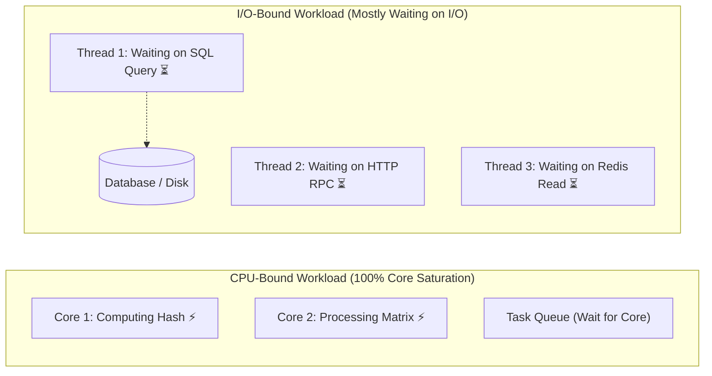
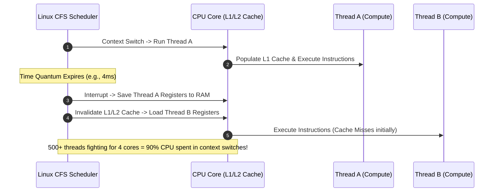

# CPU-Bound vs I/O-Bound Workloads

Master workload classification, thread pool sizing mathematics, and hardware utilization optimization for backend services.

---

## 1. What Is It?
- **CPU-Bound Workload**: An operation whose completion time is primarily constrained by the processing speed and core count of the Central Processing Unit (e.g., cryptographic hashing, image compression, JSON parsing, sorting large datasets).
- **I/O-Bound Workload**: An operation whose completion time is primarily constrained by waiting for input/output devices (e.g., network socket reads, database disk queries, file storage, remote RPC calls).

---

## 2. Why Does It Exist?
Applying the wrong thread pool size or execution model to a workload causes severe performance collapse:
- Allocating hundreds of threads to a **CPU-bound** task causes massive OS context-switching overhead, thrashing CPU caches and reducing throughput.
- Allocating too few threads to an **I/O-bound** task leaves CPU cores sitting idle while requests wait in queues.

---

## 3. Mental Model



---

## 4. How Does It Work: Thread Pool Sizing Mathematics

According to Brian Goetz in *Java Concurrency in Practice*, the optimal thread pool size is calculated as:

$$N_{\text{threads}} = N_{\text{CPU}} \times U_{\text{CPU}} \times \left(1 + \frac{W}{C}\right)$$

Where:
- $N_{\text{CPU}}$ = Number of available CPU cores (`Runtime.getRuntime().availableProcessors()`)
- $U_{\text{CPU}}$ = Target CPU utilization ($0.0 \le U_{\text{CPU}} \le 1.0$, typically $0.8 - 0.9$)
- $W$ = Wait time (time spent waiting for I/O, database, network)
- $C$ = Compute time (time spent executing CPU instructions)

### Sizing Rules of Thumb:
1. **Strictly CPU-Bound ($W/C \approx 0$)**:
   $$N_{\text{threads}} = N_{\text{CPU}} \quad \text{or} \quad N_{\text{CPU}} + 1$$
   (The $+1$ handles occasional minor page faults).
2. **I/O-Bound ($W/C \gg 1$, e.g., 90% waiting, 10% compute $\to W/C = 9$)**:
   $$N_{\text{threads}} = N_{\text{CPU}} \times (1 + 9) = 10 \times N_{\text{CPU}}$$
   On an 8-core machine: $8 \times 10 = 80\text{ threads}$.

---

## 5. Internal Working: OS Scheduler Runqueue & Context Switching



---

## 6. Example & Production Java 21 Code

Configuring dedicated, isolated thread pools for CPU-bound vs I/O-bound tasks in a production Spring Boot service:

```java
package com.backend.fundamentals.workloads;

import java.util.concurrent.*;

public final class WorkloadPoolFactory {

    private WorkloadPoolFactory() {}

    // 1. Dedicated Pool for CPU-Bound Tasks (Argon2 Hashing, Compression)
    public static ThreadPoolExecutor createCpuBoundPool() {
        int cores = Runtime.getRuntime().availableProcessors();
        return new ThreadPoolExecutor(
            cores,                                    // Core pool size
            cores + 1,                                // Max pool size
            60L, TimeUnit.SECONDS,
            new ArrayBlockingQueue<>(500),            // Bounded queue to prevent OOM
            new CustomThreadFactory("cpu-worker"),
            new ThreadPoolExecutor.CallerRunsPolicy() // Backpressure rejection
        );
    }

    // 2. Dedicated Pool for Platform-Thread I/O-Bound Tasks (Legacy JDBC / File IO)
    public static ThreadPoolExecutor createIoBoundPool() {
        int cores = Runtime.getRuntime().availableProcessors();
        int ioThreads = cores * 10; // Assuming 90% wait time
        return new ThreadPoolExecutor(
            cores,
            ioThreads,
            60L, TimeUnit.SECONDS,
            new LinkedBlockingQueue<>(2000),
            new CustomThreadFactory("io-worker"),
            new ThreadPoolExecutor.AbortPolicy()
        );
    }

    // 3. Java 21 Virtual Thread Executor for Modern I/O
    public static ExecutorService createVirtualThreadIoPool() {
        return Executors.newVirtualThreadPerTaskExecutor();
    }

    private static class CustomThreadFactory implements ThreadFactory {
        private final String prefix;
        private int count = 0;

        public CustomThreadFactory(String prefix) {
            this.prefix = prefix;
        }

        @Override
        public synchronized Thread newThread(Runnable r) {
            Thread t = new Thread(r, prefix + "-" + (++count));
            t.setDaemon(false);
            return t;
        }
    }
}
```

---

## 7. Performance Characteristics
- **Context Switch Saturation**: When `cs` (context switches per second) exceeds $\sim 50,000 / 	ext{core}$, CPU time moves from user execution (`%usr`) to system kernel overhead (`%sys`).
- **Cache Locality**: CPU-bound tasks benefit drastically from cache-friendly data structures (primitive arrays vs pointer-chasing linked nodes).

---

## 8. Failure Scenarios & Edge Cases
- **The "Shared Thread Pool Disaster"**: Mixing a slow I/O task (e.g., calling an external payment gateway taking 10s) in the same thread pool used for CPU encryption causes all threads to block on I/O, completely starving fast CPU tasks.
- **Unbounded Queues (`LinkedBlockingQueue()`)**: Under high load, task queues grow infinitely in heap memory, triggering an `OutOfMemoryError` (OOM).

---

## 9. Observability (Logs, Metrics, Traces)
```text
# OS-Level Command: vmstat 1
procs -----------memory---------- ---swap-- -----io---- -system-- ------cpu-----
 r  b   swpd   free   buff  cache   si   so    bi    bo   in    cs us sy id wa st
16  2      0 421092 102400 120489    0    0     0    40 1200 85400 35 55 10  0  0
# Notice: cs = 85,400 (very high), sy = 55% (Kernel thrashing due to too many threads)
```

---

## 10. Debugging & Troubleshooting
1. **Identify Thread Saturation**:
   ```bash
   top -H -p <pid> # Show top CPU-consuming OS threads
   ```
2. **Convert Thread LWP to Hex**:
   ```bash
   printf "0x%x
" <thread_id>
   ```
3. **Inspect Thread Stack in Java**:
   ```bash
   jstack <pid> | grep -A 20 "<hex_id>"
   ```

---

## 11. Scaling Considerations
- **Scale CPU-bound services** by upgrading to compute-optimized instance types (e.g., AWS `c6i.xlarge` / `c7g.xlarge`).
- **Scale I/O-bound services** horizontally on general-purpose instances (e.g., AWS `m6i.large`) utilizing Virtual Threads or reactive runtimes.

---

## 12. Architectural Trade-offs
| Dimension | CPU-Bound Workload | I/O-Bound Workload |
|---|---|---|
| **Primary Bottleneck** | Core clock speed & ALU cycles | Network bandwidth, disk IOPS |
| **Optimal Thread Pool** | $pprox N_{\text{CPU}}$ | $\gg N_{\text{CPU}}$ or Virtual Threads |
| **Scaling Strategy** | Scale CPU cores / Vectorize | Asynchronous non-blocking I/O |

---

## 13. When to Use
- **Separate Thread Pools**: Always isolate CPU-bound tasks (cryptography, PDF generation, image resizing) from I/O request-handling threads.

---

## 14. When NOT to Use
- Never use massive thread pools (e.g., 500 threads) for CPU-heavy tasks.

---

## 15. SDE2 / Senior Interview Questions & Answers
### Q1: You have a Spring Boot application running on a 4-core machine. It handles requests that spend 10ms on CPU and 90ms waiting on database I/O. What is the mathematically optimal thread pool size?
<details>
<summary>Reveal Answer</summary>

**Answer**:
Using Brian Goetz's thread pool sizing formula:
- $N_{	ext{CPU}} = 4$
- Target utilization $U_{	ext{CPU}} = 0.9$ ($90\%$)
- Wait time $W = 90	ext{ms}$
- Compute time $C = 10	ext{ms} \implies rac{W}{C} = 9$

$$N_{	ext{threads}} = 4 	imes 0.9 	imes (1 + 9) = 3.6 	imes 10 = 36	ext{ threads}$$

A thread pool of **36 to 40 threads** will keep all 4 CPU cores at optimal 90% utilization without incurring excessive context-switching degradation.
</details>

---

## 16. Practical Exercise
1. Write a benchmark in Java that hashes passwords using BCrypt across 1, 4, 16, and 64 threads on your local machine.
2. Measure throughput (hashes/sec) and observe where throughput peaks and begins degrading due to context switches.

---

## 17. Quick Revision Summary
- **CPU-bound** tasks need small pools ($N_{	ext{CPU}}$); **I/O-bound** tasks need large pools or virtual threads.
- Never mix CPU-bound and I/O-bound tasks in the same thread pool.
- High `%sys` CPU in `vmstat` indicates excessive OS context switches.
