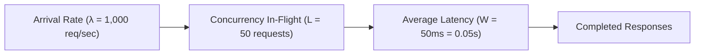
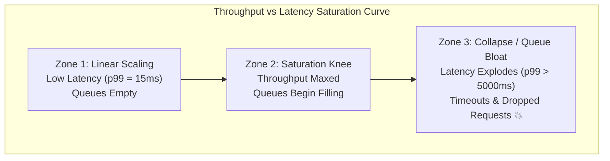

# Latency, Throughput, and Concurrency

Master the mathematical laws, percentile distributions, and saturation curves governing backend performance engineering.

---

## 1. What Is It?
- **Latency ($W$)**: The time taken to process a single request from the moment it is dispatched until the complete response is received (measured in milliseconds or microseconds).
- **Throughput ($\lambda$)**: The rate at which the system successfully processes requests per unit of time (measured in Requests Per Second - RPS or QPS).
- **Concurrency ($L$)**: The number of requests being processed concurrently inside the system at any given instant.

---

## 2. Why Does It Exist?
Engineers frequently confuse throughput with latency or rely on misleading average latency metrics. Understanding the mathematical relationship between Latency, Throughput, and Concurrency allows backend engineers to:
1. Accurately capacity-plan server fleets.
2. Prevent queue saturation and buffer bloat.
3. Diagnose tail latency spikes ($p99$, $p99.9$).

---

## 3. Mental Model: Little's Law

In any stable queuing system, the average number of concurrent requests ($L$) equals the average arrival throughput ($\lambda$) multiplied by the average request latency ($W$):

$$L = \lambda \times W$$



$$\text{If } \lambda = 1,000\text{ req/s} \text{ and } W = 50\text{ms } (0.05\text{s}), \text{ then } L = 1,000 \times 0.05 = 50\text{ concurrent requests in flight.}$$

---

## 4. How Does It Work: The Saturation Hockey Stick Curve

As throughput increases toward the system's maximum processing capacity ($C_{\max}$), queues begin to form. Once queues form, latency degrades exponentially:



---

## 5. Internal Working: Percentiles vs The Tyranny of the Average

Never use **average (mean) latency** in backend engineering!

Consider 100 requests:
- 99 requests take $10\text{ms}$.
- 1 request stalls for $10,000\text{ms}$ (10 seconds due to a Full GC pause or DB lock).
- **Average Latency**: $\frac{99 \times 10 + 10,000}{100} = 109.9\text{ms}$.
- The average completely hides that 1% of users experienced a catastrophic 10-second freeze, while 99% experienced 10ms.

### Standard Percentile Definitions:
- **$p50$ (Median)**: 50% of requests are faster than this threshold.
- **$p95$**: 95% of requests are faster than this threshold.
- **$p99$ (Tail Latency)**: 1 in 100 requests is slower than this threshold.
- **$p99.9$**: 1 in 1,000 requests is slower than this threshold.

---

## 6. Example & Production Java 21 Code

A production-grade Micrometer and HDRHistogram implementation capturing high-dynamic-range percentile distributions without coordinated omission:

```java
package com.backend.fundamentals.metrics;

import io.micrometer.core.instrument.MeterRegistry;
import io.micrometer.core.instrument.Timer;
import org.HdrHistogram.Histogram;

import java.time.Duration;
import java.util.concurrent.TimeUnit;

public class PerformanceTracker {

    private final Timer requestTimer;
    // High Dynamic Range Histogram: 1 microsecond to 1 hour range with 3 significant digits
    private final Histogram hdrHistogram = new Histogram(TimeUnit.HOURS.toMicros(1), 3);

    public PerformanceTracker(MeterRegistry registry) {
        this.requestTimer = Timer.builder("http.server.requests")
            .description("HTTP Server Request Latency")
            .publishPercentiles(0.50, 0.90, 0.95, 0.99, 0.999)
            .publishPercentileHistogram()
            .minimumExpectedValue(Duration.ofMillis(1))
            .maximumExpectedValue(Duration.ofSeconds(10))
            .register(registry);
    }

    public void recordExecution(long startNanoTime) {
        long durationNano = System.nanoTime() - startNanoTime;
        long durationMicro = TimeUnit.NANOSECONDS.toMicros(durationNano);

        // Record in Micrometer timer
        requestTimer.record(durationNano, TimeUnit.NANOSECONDS);

        // Record in lock-free HDR histogram for precision analysis
        synchronized (hdrHistogram) {
            hdrHistogram.recordValue(durationMicro);
        }
    }

    public PercentileSnapshot getSnapshot() {
        synchronized (hdrHistogram) {
            return new PercentileSnapshot(
                hdrHistogram.getValueAtPercentile(50.0) / 1000.0,
                hdrHistogram.getValueAtPercentile(95.0) / 1000.0,
                hdrHistogram.getValueAtPercentile(99.0) / 1000.0,
                hdrHistogram.getValueAtPercentile(99.9) / 1000.0,
                hdrHistogram.getMaxValue() / 1000.0
            );
        }
    }

    public record PercentileSnapshot(
        double p50Ms,
        double p95Ms,
        double p99Ms,
        double p999Ms,
        double maxMs
    ) {}
}
```

---

## 7. Performance Characteristics
- **Coordinated Omission**: If a load tester sends requests at fixed rates but blocks during server stalls, it fails to record the requests that *would have been delayed* during the stall window, reporting falsely optimistic p99 numbers. Always use closed-loop or coordinated-omission-corrected load generators (e.g., `wrk2`).

---

## 8. Failure Scenarios & Edge Cases
- **The Fan-Out Tail Latency Multiplier**: In a microservice architecture where 1 user request fans out to 100 backend services in parallel:
  $$\text{Prob}(\text{User sees } p99) = 1 - (1 - 0.01)^{100} = 1 - 0.366 = 63.4\%$$
  Even if every single service has a great $p99$ of $100\text{ms}$, **over 63% of your users will experience $100\text{ms}+$ latency!**

---

## 9. Observability (Logs, Metrics, Traces)
```text
# Prometheus Histogram Latency Metrics
http_server_requests_seconds{quantile="0.5"} 0.012
http_server_requests_seconds{quantile="0.95"} 0.045
http_server_requests_seconds{quantile="0.99"} 0.180
http_server_requests_seconds{quantile="0.999"} 1.450
```

---

## 10. Debugging & Troubleshooting
1. **Detecting Saturation via Queue Lengths**:
   If $p99$ latency spikes while $p50$ remains flat, the cause is **queue wait time**, not execution time.
2. **Check Database Connection Pool Queuing**:
   ```text
   hikaricp_pending_threads > 0  <-- System is saturated!
   ```

---

## 11. Scaling Considerations
- Apply **Load Shedding** and **Bounded Queues**: When concurrency $L$ exceeds the capacity threshold, immediately reject excess requests with HTTP 429 / 503 rather than queuing them and causing latency collapse for all users.

---

## 12. Architectural Trade-offs
| Metric Focus | Benefit | Downside |
|---|---|---|
| **Optimizing Throughput** | Maximizes batch utilization | Sacrifices individual request latency (Batching delay) |
| **Optimizing Latency** | Instantaneous responsiveness | Lower hardware resource utilization |

---

## 13. When to Use
- Always design SLOs and alerts around **$p99$ and $p95$ percentiles**, never averages.

---

## 14. When NOT to Use
- Never use uncorrected load generation tools that suffer from coordinated omission when benchmarking latency.

---

## 15. SDE2 / Senior Interview Questions & Answers
### Q1: Your service handles 5,000 RPS with an average latency of 20ms. If a downstream database degrades and latency increases to 200ms while traffic remains at 5,000 RPS, what happens to concurrency, and how will your service fail?
<details>
<summary>Reveal Answer</summary>

**Answer**:
Using Little's Law ($L = \lambda 	imes W$):
- **Normal State**: $L = 5,000 	imes 0.020 = 100	ext{ concurrent requests}$.
- **Degraded State**: $L = 5,000 	imes 0.200 = 1,000	ext{ concurrent requests}$.

**Impact**:
The in-flight concurrency requirement immediately increases by **$10	imes$** (from 100 to 1,000 active requests).
1. If the service runs standard Tomcat with a max thread pool of 200, all threads will exhaust in under 50 milliseconds.
2. Incoming requests will back up into the Tomcat accept queue.
3. Once the accept queue fills, the OS TCP backlog drops packets, resulting in `Connection Refused` or 504 Gateway Timeouts at the API Gateway.
4. **Fix**: Implement Circuit Breakers (Resilience4j) and Concurrency Limits to shed load immediately.
</details>

---

## 16. Practical Exercise
1. Simulate Little's Law using a Java executor with a fixed pool size of 20.
2. Introduce a simulated $100	ext{ms}$ delay and pump 500 RPS.
3. Calculate theoretical queue buildup vs measured latency spikes.

---

## 17. Quick Revision Summary
- **Little's Law**: $L = \lambda 	imes W$ (Concurrency = Throughput $	imes$ Latency).
- **Averages hide outages**: Always measure and alert on $p99$ and $p99.9$ percentiles.
- In parallel fan-out architectures, $p99$ latency compounds exponentially across microservices.
