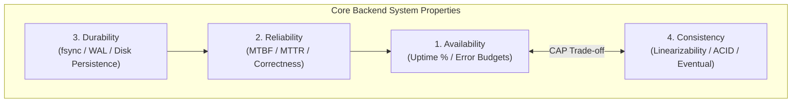
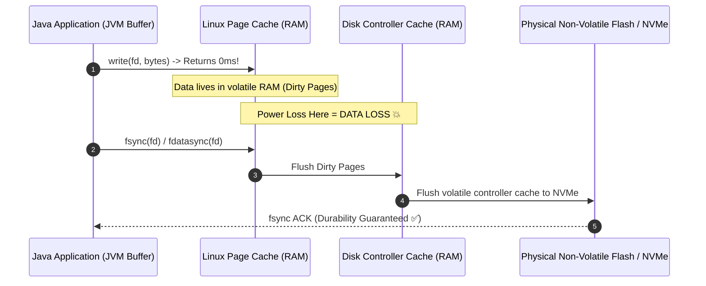

# Availability, Reliability, Durability & Consistency

Master the fundamental system properties, mathematical SLA formulas, and durability mechanics of enterprise backend engineering.

---

## 1. What Is It?
- **Availability**: The percentage of time a system is operational and capable of correctly responding to requests ($99.9\%$, $99.99\%$).
- **Reliability**: The probability that a system performs its required functions without failure over a specified time interval (measured via MTBF and MTTR).
- **Durability**: The guarantee that once data is committed and acknowledged to the client, it will never be lost, corrupted, or reverted, even during power outages or hardware crashes.
- **Consistency**: The guarantee that all clients observe a uniform, valid state of data according to defined rules (ACID, Linearizability, Eventual Consistency).

---

## 2. Why Does It Exist?
A system can be:
- **Available but Unreliable**: Returns 200 OK instantly, but returns corrupted or incorrect data.
- **Available and Durable but Inconsistent**: Data is saved to disk and never lost, but different replica nodes return conflicting versions to concurrent readers.
- **Consistent and Durable but Unavailable**: Refuses to accept writes during a network partition (CAP CP system).

Understanding these distinct dimensions is required to architect proper SLAs, disaster recovery plans, and storage engines.

---

## 3. Mental Model



---

## 4. How Does It Work: The Math of Uptime and The "Nines"

$$\text{Availability} = \frac{\text{Uptime}}{\text{Total Time}} = \frac{\text{MTBF}}{\text{MTBF} + \text{MTTR}}$$

Where:
- **MTBF (Mean Time Between Failures)**: Average operating hours between incidents.
- **MTTR (Mean Time to Recovery)**: Average time required to detect, mitigate, and restore service.

| "Nines" | Availability % | Allowed Downtime per Year | Allowed Downtime per Month | Typical Target |
|---|---|---|---|---|
| **Two Nines** | $99.0\%$ | $3.65	ext{ days}$ | $7.30	ext{ hours}$ | Internal tools / Dev environments |
| **Three Nines** | $99.9\%$ | $8.77	ext{ hours}$ | $43.8	ext{ minutes}$ | Standard SaaS APIs |
| **Four Nines** | $99.99\%$ | $52.6	ext{ minutes}$ | $4.38	ext{ minutes}$ | Tier-1 Payment / Auth Services |
| **Five Nines** | $99.999\%$ | $5.26	ext{ minutes}$ | $26.3	ext{ seconds}$ | Telecom / Core Financial Ledgers |

---

## 5. Internal Working: Durability and the `fsync` Boundary

When an application writes to a file in Java (`FileOutputStream.write()`), the data is NOT written to physical disk. It passes through multiple volatile OS cache layers:



In databases (PostgreSQL, MySQL), **Write-Ahead Logging (WAL)** ensures durability by calling `fsync()` on the sequential log file before acknowledging a transaction commit.

---

## 6. Example & Production Java 21 Code

Demonstrating strict durability guarantees using NIO `FileChannel.force(true)` (`fsync`) and transactional consistency invariant verification:

```java
package com.backend.fundamentals.properties;

import java.io.IOException;
import java.nio.ByteBuffer;
import java.nio.channels.FileChannel;
import java.nio.charset.StandardCharsets;
import java.nio.file.Path;
import java.nio.file.StandardOpenOption;
import java.time.Instant;

public class DurableWriteAheadLog {

    private final Path logFilePath;

    public DurableWriteAheadLog(Path logFilePath) {
        this.logFilePath = logFilePath;
    }

    public synchronized void appendDurableRecord(String transactionId, String payload) throws IOException {
        String logEntry = String.format("%s|%s|%s
", Instant.now(), transactionId, payload);
        byte[] bytes = logEntry.getBytes(StandardCharsets.UTF_8);
        ByteBuffer buffer = ByteBuffer.wrap(bytes);

        try (FileChannel channel = FileChannel.open(
            logFilePath,
            StandardOpenOption.CREATE,
            StandardOpenOption.WRITE,
            StandardOpenOption.APPEND
        )) {
            // Step 1: Write to OS Page Cache
            channel.write(buffer);

            // Step 2: Issue fsync (force: true flushes data AND metadata like file size)
            // This guarantees durability across hardware power-loss!
            channel.force(true);
        }
    }
}
```

---

## 7. Performance Characteristics
- **`fsync()` Overhead**: Writing to the OS page cache takes $\sim 1 - 5\,\mu	ext{s}$. Issuing an `fsync()` to an enterprise NVMe SSD takes $\sim 0.5 - 2\,	ext{ms}$ ($\sim 1000	imes$ slower).
- **Group Commit Optimization**: High-performance databases (PostgreSQL / Kafka) batch multiple concurrent transaction commits into a single `fsync()` call to achieve high throughput.

---

## 8. Failure Scenarios & Edge Cases
- **Silent Data Corruption (Bit Rot)**: Storage hardware flips bits silently. Enterprise storage systems protect against this using checksum algorithms (CRC32, ZFS block checksums).
- **Split-Brain Inconsistency**: During a network partition, two isolated nodes both believe they are the active leader, accepting conflicting writes. Quorum consensus ($Q = \lfloor N/2
floor + 1$) is required to prevent this.

---

## 9. Observability (Logs, Metrics, Traces)
```text
# Error Budget & SLO Metrics
slo_error_budget_remaining_ratio{service="orders", slo="99.9"} 0.78
storage_fsync_duration_seconds_bucket{le="0.005"} 19820
system_availability_ratio{window="30d"} 0.9994
```

---

## 10. Debugging & Troubleshooting
1. **Track File System Sync Latency via `bcc-tools`**:
   ```bash
   sudo xfsslower 10 # Report XFS operations slower than 10ms
   ```
2. **Inspect Dirty Page Buildup**:
   ```bash
   cat /proc/meminfo | grep -E "Dirty|Writeback"
   ```

---

## 11. Scaling Considerations
- To achieve **$99.99\%$ availability**, deploy services across a minimum of **3 Availability Zones (Multi-AZ)** with automated health-check failover and zero-downtime rolling releases.

---

## 12. Architectural Trade-offs
| Guarantee Level | Performance | Cost | Failure Resilience |
|---|---|---|---|
| **Asynchronous Write (No fsync)** | Highest ($> 100	ext{k ops/s}$) | Lowest | Low (Data lost on crash) |
| **Synchronous fsync per Write** | Moderate ($\sim 1-5	ext{k ops/s}$) | Moderate | High (Durable on single node) |
| **Multi-Node Quorum + fsync** | Lowest ($\sim 500-2	ext{k ops/s}$) | Highest | Maximum (Survives AZ loss) |

---

## 13. When to Use
- **Synchronous `fsync` & Strong Consistency**: Financial transactions, inventory allocation, user authorization credentials.
- **Eventual Consistency & Asynchronous Persistence**: Analytics telemetry, logging, social media feeds, view counts.

---

## 14. When NOT to Use
- Never use synchronous single-record `fsync` on high-throughput analytics pipelines.

---

## 15. SDE2 / Senior Interview Questions & Answers
### Q1: How does an Error Budget work, and how does it drive engineering decisions between product velocity and system reliability?
<details>
<summary>Reveal Answer</summary>

**Answer**:
An **Error Budget** is the allowable unreliability defined by a Service Level Objective (SLO):
$$	ext{Error Budget} = 100\% - 	ext{SLO}$$

For a service with a **$99.9\%$ availability SLO** over a rolling 30-day window:
- Allowed downtime / errors = $0.1\%$ ($43.8	ext{ minutes}$ of outage or $0.1\%$ failed requests).

**Engineering Policy**:
1. **Budget Remaining (> 0%)**: Product teams deploy new features, schema changes, and high-velocity updates.
2. **Budget Depleted (0% or Negative)**: All feature deployments are frozen. 100% of engineering bandwidth shifts to reliability engineering, bug fixes, automated rollbacks, and resilience testing until the error budget recovers.
</details>

---

## 16. Practical Exercise
1. Write a Java program that writes 10,000 records to disk without `channel.force()`, measuring elapsed time.
2. Modify the program to call `channel.force(true)` after every single record.
3. Implement a **Group Commit** batcher that flushes every 50 records or 10ms, observing the throughput recovery.

---

## 17. Quick Revision Summary
- **Availability** is uptime percentage; **Reliability** is MTBF/MTTR correctness.
- **Durability** requires traversing the `fsync` boundary from volatile RAM to physical storage.
- **Error Budgets** provide objective data to balance feature velocity against reliability investments.
