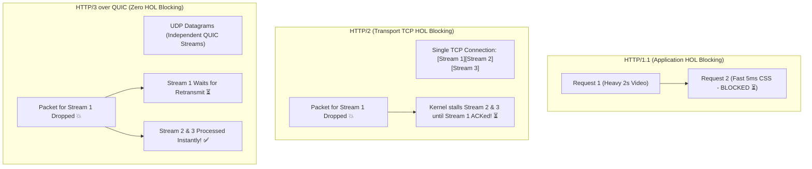
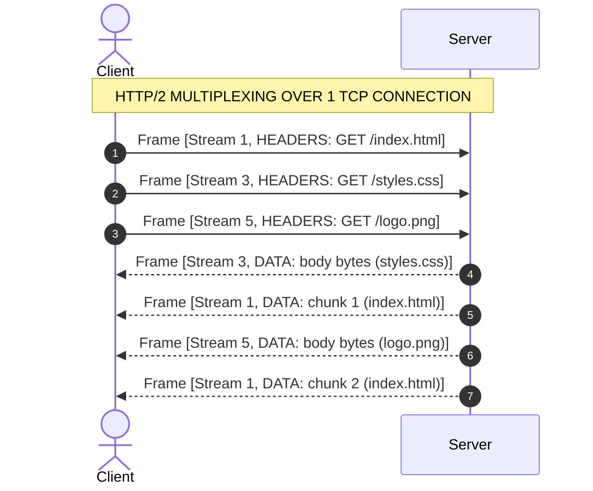

# HTTP Evolution: HTTP/1.1 vs HTTP/2 vs HTTP/3 (QUIC)

Master the transport mechanics, binary framing, multiplexing, and Head-of-Line (HOL) blocking resolution across HTTP protocol generations.

---

## 1. What Is It?
- **HTTP/1.1 (RFC 7230)**: Plaintext, ASCII protocol operating over a single TCP stream. Supports persistent connections (`Keep-Alive`) and pipelining, but suffers from Application-Layer Head-of-Line (HOL) blocking.
- **HTTP/2 (RFC 7540)**: Binary framing protocol operating over a single TCP connection. Introduces multiplexed streams, stream prioritization, HPACK header compression, and server push, but suffers from Transport-Layer (TCP) HOL blocking.
- **HTTP/3 (RFC 9114)**: Binary protocol operating over **QUIC (Quick UDP Internet Connections)** on UDP. Resolves transport-layer HOL blocking, integrates TLS 1.3 encryption into the handshake, and supports connection migration across IP changes.

---

## 2. Why Does It Exist?
- In **HTTP/1.1**, browsers had to open 6 parallel TCP connections per domain to fetch web assets concurrently. Pipelining failed in the wild because slow upstream responses blocked all subsequent responses on the same TCP socket.
- In **HTTP/2**, multiplexing combined multiple streams onto 1 TCP socket. However, if a single TCP packet was dropped on the network, the entire TCP window stalled for all streams until retransmitted (TCP HOL blocking).
- In **HTTP/3**, QUIC provides independent streams over UDP; a lost packet on Stream A only delays Stream A, while Streams B, C, and D continue receiving data with zero latency penalty.

---

## 3. Mental Model: Head-of-Line (HOL) Blocking Across Protocols



---

## 4. How Does It Work: Protocol Comparison Matrix

| Feature | HTTP/1.1 | HTTP/2 | HTTP/3 |
|---|---|---|---|
| **Transport Layer** | TCP | TCP | UDP (QUIC) |
| **Data Format** | Plaintext / ASCII | Binary Framing | Binary Frames |
| **Multiplexing** | No (6 parallel TCP conns) | Yes (1 TCP connection) | Yes (1 UDP connection) |
| **HOL Blocking** | Application Layer | Transport Layer (TCP) | **None (Independent Streams)** |
| **Header Compression** | None (Redundant headers) | HPACK (Static/Dynamic table) | QPACK (Out-of-order safe) |
| **Handshake Latency** | 2-3 RTTs (TCP + TLS) | 2-3 RTTs (TCP + TLS) | **1 RTT (0-RTT for resumed)** |
| **Connection Migration** | Breaks on IP change | Breaks on IP change | **Preserved via 64-bit CID** |

---

## 5. Internal Working: HTTP/2 Binary Framing & Multiplexing



---

## 6. Example & Production Java 21 Code

Configuring an HTTP/2 and HTTP/3 client in Java 21 using `java.net.http.HttpClient`:

```java
package com.backend.http.protocols;

import java.net.URI;
import java.net.http.HttpClient;
import java.net.http.HttpRequest;
import java.net.http.HttpResponse;
import java.time.Duration;
import java.util.concurrent.CompletableFuture;

public class HttpProtocolClient {

    // 1. Configure Java 21 HttpClient with HTTP/2 Support & Fallback
    private final HttpClient client = HttpClient.newBuilder()
        .version(HttpClient.Version.HTTP_2) // Negotiates HTTP/2 via ALPN TLS extension
        .connectTimeout(Duration.ofSeconds(5))
        .followRedirects(HttpClient.Redirect.NORMAL)
        .build();

    public CompletableFuture<Void> fetchMultiplexedAssets() {
        HttpRequest req1 = HttpRequest.newBuilder(URI.create("https://cdn.internal/api/v1/config")).GET().build();
        HttpRequest req2 = HttpRequest.newBuilder(URI.create("https://cdn.internal/api/v1/user")).GET().build();

        // Dispatches multiple requests concurrently over the SAME multiplexed TCP connection
        CompletableFuture<HttpResponse<String>> f1 = client.sendAsync(req1, HttpResponse.BodyHandlers.ofString());
        CompletableFuture<HttpResponse<String>> f2 = client.sendAsync(req2, HttpResponse.BodyHandlers.ofString());

        return CompletableFuture.allOf(f1, f2).thenAccept(v -> {
            System.out.println("HTTP Version Used (Req 1): " + f1.join().version());
            System.out.println("HTTP Version Used (Req 2): " + f2.join().version());
        });
    }
}
```

---

## 7. Performance Characteristics
- **Handshake Acceleration**: HTTP/3 establishes encrypted connections in 1 RTT (or 0-RTT on resumption) compared to 2-3 RTTs in HTTP/1.1 ($1\text{ RTT TCP} + 1-2\text{ RTT TLS 1.3}$).
- **Mobile Handover**: When a mobile device switches from Wi-Fi to 5G Cellular, the IP address changes. HTTP/1.1 and HTTP/2 connections terminate immediately. HTTP/3 continues seamlessly because QUIC identifies connections by a 64-bit **Connection ID (CID)**, not the 4-tuple IP/port.

---

## 8. Failure Scenarios & Edge Cases
- **UDP Blocking in Corporate Firewalls**: Many enterprise networks block UDP traffic on port 443. All HTTP/3 implementations must support automatic fallback to HTTP/2 over TCP via the `Alt-Svc` response header.
- **HPACK Compression Bomb**: Malicious clients craft deeply recursive or huge dynamic HPACK tables to exhaust server memory (CVE-2019-9515).

---

## 9. Observability (Logs, Metrics, Traces)
```text
# Envoy / API Gateway Protocol Distribution
http_downstream_protocol_total{protocol="HTTP/1.1"} 1420
http_downstream_protocol_total{protocol="HTTP/2"} 89400
http_downstream_protocol_total{protocol="HTTP/3"} 45100
quic_connection_migration_success_total 312
```

---

## 10. Debugging & Troubleshooting
1. **Inspect ALPN Negotiation via cURL**:
   ```bash
   curl -Iv --http2 https://api.internal/v1/health
   curl -Iv --http3 https://api.internal/v1/health
   ```
2. **Check `Alt-Svc` Header for HTTP/3 Advertisement**:
   ```http
   Alt-Svc: h3=":443"; ma=86400
   ```

---

## 11. Scaling Considerations
- Terminate HTTP/2 and HTTP/3 at the **Edge / Application Load Balancer** (AWS ALB or Cloudflare) and use HTTP/2 or HTTP/1.1 persistent keep-alive pools for intra-datacenter service-to-service communication.

---

## 12. Architectural Trade-offs
| Dimension | HTTP/1.1 | HTTP/2 | HTTP/3 |
|---|---|---|---|
| **Complexity** | Lowest | High (Binary parser) | Highest (Custom UDP stack) |
| **High Packet Loss Resilience** | Poor | Very Poor (Stalls all streams)| Excellent (Zero HOL) |
| **CPU Utilization** | Low | Moderate (HPACK) | Higher (UDP crypto in user space)|

---

## 13. When to Use
- **HTTP/3**: Edge ingress, mobile applications on lossy cellular networks, global CDNs.
- **HTTP/2**: Web browsers, gRPC inter-service RPC communication.
- **HTTP/1.1**: Simple internal microservices, legacy webhook dispatchers.

---

## 14. When NOT to Use
- Do not use HTTP/3 inside internal high-speed datacenter LANs where packet loss is negligible and CPU overhead outweighs the benefits.

---

## 15. SDE2 / Senior Interview Questions & Answers
### Q1: Why does HTTP/2 perform worse than HTTP/1.1 on lossy wireless networks (e.g., 2% packet drop rate)?
<details>
<summary>Reveal Answer</summary>

**Answer**:
In HTTP/1.1, a client opens 6 distinct TCP connections. If a packet drops on connection 1, only the single resource on connection 1 is delayed. The other 5 connections continue downloading without interruption.

In HTTP/2, all streams are multiplexed onto a **single TCP connection**. The TCP protocol enforces strict in-order delivery of bytes. If one packet is dropped, the OS kernel TCP stack refuses to pass subsequent bytes to the JVM application until the lost segment is retransmitted and acknowledged. Consequently, a single dropped packet freezes all 50+ multiplexed HTTP/2 streams simultaneously.
</details>

---

## 16. Practical Exercise
1. Run cURL against Google or Cloudflare endpoints testing HTTP/1.1, HTTP/2, and HTTP/3.
2. Use Wireshark or `tcpdump` to capture and inspect the binary framing of HTTP/2 (`HEADERS`, `DATA`, `SETTINGS` frames) versus plaintext HTTP/1.1.

---

## 17. Quick Revision Summary
- HTTP/1.1 has **application HOL blocking**; HTTP/2 has **TCP transport HOL blocking**; HTTP/3 (QUIC) **eliminates HOL blocking**.
- HTTP/2 uses **HPACK**; HTTP/3 uses **QPACK**.
- HTTP/3 enables **0-RTT connection resumption** and **IP connection migration**.
