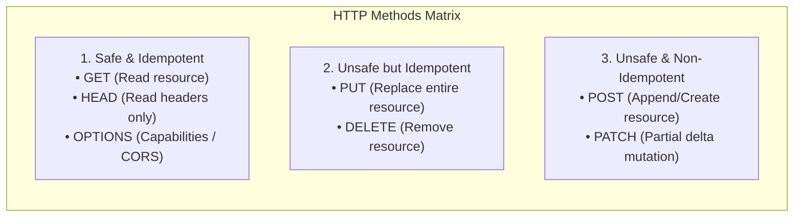

# HTTP Methods, Idempotency & Status Codes

Master HTTP semantics, the Safe vs Idempotent matrix, enterprise error modeling with RFC 9457 Problem Details, and precise status code selection.

---

## 1. What Is It?
- **Safe Method**: An HTTP method that does not modify server-side state (read-only operations: `GET`, `HEAD`, `OPTIONS`).
- **Idempotent Method**: An HTTP method where making $N$ identical requests produces the exact same server-side state as making $1$ request ($f(f(x)) = f(x)$): `GET`, `PUT`, `DELETE`, `HEAD`, `OPTIONS`.
- **Non-Idempotent Method**: An HTTP method where each repeated execution produces additional side effects or state mutations: `POST`, `PATCH` (in most general implementations).

---

## 2. Why Does It Exist?
Network failures occur unpredictably. When a client sends a request and times out without a response:
- If the method is **Idempotent**, the client can safely retry the request automatically without risking duplicate charges or corrupting data.
- If the method is **Non-Idempotent**, retrying naively causes duplicate records (e.g., charging a credit card twice).

---

## 3. Mental Model: Safe vs Idempotent Matrix



---

## 4. How Does It Work: Production HTTP Status Code Reference

| Status Code | Name | Semantic Meaning & Exact Production Use Case |
|---|---|---|
| **200 OK** | OK | Standard successful response for `GET`, `PUT`, or `PATCH`. |
| **201 Created** | Created | Resource successfully created via `POST`. Returns `Location` header. |
| **202 Accepted** | Accepted | Request accepted for asynchronous background processing (e.g., job queue). |
| **204 No Content** | No Content | Successful operation with an intentionally empty body (e.g., `DELETE`). |
| **301 Moved Permanently**| Redirect | Resource has a new permanent URI. Clients and search engines cache this. |
| **304 Not Modified** | Cached | Conditional request (`If-None-Match`) matched `ETag`. Zero body returned. |
| **400 Bad Request** | Bad Request | Syntactic validation error (malformed JSON, invalid query parameter). |
| **401 Unauthorized** | Unauthenticated | Missing or invalid authentication token (`Authorization: Bearer ...`). |
| **403 Forbidden** | Unauthorized | Authenticated user lacks permission/role (RBAC failure). Do not retry. |
| **404 Not Found** | Not Found | Resource ID does not exist in the database. |
| **409 Conflict** | Conflict | Optimistic locking collision (`@Version`), duplicate unique index key. |
| **422 Unprocessable Entity**| Semantic Error | Valid JSON syntax, but violates business domain rules. |
| **429 Too Many Requests**| Rate Limited | Client exceeded rate limit. Include `Retry-After` header. |
| **500 Internal Server Error**| Server Crash | Unhandled runtime exception / bug in application code. |
| **502 Bad Gateway** | Upstream Error | Reverse proxy (NGINX/ALB) received invalid/empty response from backend. |
| **503 Service Unavailable**| Overloaded | Service shutting down, health check failing, or thread pool exhausted. |
| **504 Gateway Timeout** | Timeout | Reverse proxy timed out waiting for backend (backend hung on slow SQL). |

---

## 5. Internal Working: RFC 9457 / RFC 7807 Problem Details

Never return unstructured error strings (`{"error": "Something went wrong"}`). Modern APIs adhere to **RFC 9457 (Problem Details for HTTP APIs)**:

```json
{
  "type": "https://api.internal/errors/insufficient-funds",
  "title": "Insufficient Account Balance",
  "status": 422,
  "detail": "Account 98402 has a balance of $12.50, which is insufficient for transaction amount $50.00.",
  "instance": "/v1/accounts/98402/transfers/tx_99812",
  "invalid_params": [
    {
      "name": "amount",
      "reason": "Must be less than or equal to current balance"
    }
  ]
}
```

---

## 6. Example & Production Java 21 Code

Implementing a global Spring Boot 3 `@RestControllerAdvice` emitting RFC 9457 `ProblemDetail` structures:

```java
package com.backend.http.errors;

import org.springframework.http.HttpStatus;
import org.springframework.http.ProblemDetail;
import org.springframework.web.bind.MethodArgumentNotValidException;
import org.springframework.web.bind.annotation.ExceptionHandler;
import org.springframework.web.bind.annotation.RestControllerAdvice;

import java.net.URI;
import java.time.Instant;
import java.util.List;

@RestControllerAdvice
public class GlobalExceptionHandler {

    // 1. Handle Domain Validation Errors (RFC 9457)
    @ExceptionHandler(MethodArgumentNotValidException.class)
    public ProblemDetail handleValidationException(MethodArgumentNotValidException ex) {
        ProblemDetail problem = ProblemDetail.forStatusAndDetail(
            HttpStatus.BAD_REQUEST,
            "Request validation failed on one or more fields"
        );
        problem.setType(URI.create("https://api.internal/errors/validation-error"));
        problem.setTitle("Invalid Request Content");
        problem.setProperty("timestamp", Instant.now());

        List<FieldErrorDetail> errors = ex.getBindingResult().getFieldErrors().stream()
            .map(err -> new FieldErrorDetail(err.getField(), err.getDefaultMessage()))
            .toList();

        problem.setProperty("invalid_params", errors);
        return problem;
    }

    // 2. Handle Resource Conflicts (409 Conflict)
    @ExceptionHandler(ResourceConflictException.class)
    public ProblemDetail handleConflict(ResourceConflictException ex) {
        ProblemDetail problem = ProblemDetail.forStatusAndDetail(HttpStatus.CONFLICT, ex.getMessage());
        problem.setType(URI.create("https://api.internal/errors/resource-conflict"));
        problem.setTitle("Resource State Conflict");
        problem.setProperty("timestamp", Instant.now());
        return problem;
    }

    public record FieldErrorDetail(String field, String reason) {}
    public static class ResourceConflictException extends RuntimeException {
        public ResourceConflictException(String msg) { super(msg); }
    }
}
```

---

## 7. Performance Characteristics
- **`HEAD` Method Optimization**: Allows clients to verify cache freshness (`ETag`, `Last-Modified`) or file size (`Content-Length`) without wasting bandwidth downloading the response body.
- **`204 No Content` Bandwidth Savings**: Eliminates serialization and parsing overhead on state mutations where the client already has context.

---

## 8. Failure Scenarios & Edge Cases
- **Non-Idempotent `PATCH` Trap**: A `PATCH` containing `{"increment": 5}` is NOT idempotent (calling it 3 times adds 15). A JSON Merge Patch containing `{"score": 25}` IS idempotent.
- **The Masked 500 Bug**: Catching runtime exceptions and returning `200 OK` with `{"success": false}` breaks HTTP monitoring, CDN caching, and automated circuit breakers. Always return appropriate 4xx/5xx codes.

---

## 9. Observability (Logs, Metrics, Traces)
```text
# Prometheus HTTP Server Request Status Distribution
http_server_requests_seconds_count{status="200"} 849000
http_server_requests_seconds_count{status="400"} 1200
http_server_requests_seconds_count{status="409"} 45
http_server_requests_seconds_count{status="500"} 2
http_server_requests_seconds_count{status="503"} 0
```

---

## 10. Debugging & Troubleshooting
1. **Identify High 5xx Rates via LogQL**:
   ```text
   {app="order-service"} |= "status=500" | json
   ```
2. **Inspect Upstream Timeouts (504)**:
   Check if database slow query logs align with spikes in gateway 504 responses.

---

## 11. Scaling Considerations
- For high-volume mutation endpoints (e.g., payment submission), require an **`Idempotency-Key` HTTP Header**. Store the key and result in Redis with an atomic `SET NX PX` lock to deduplicate client retries.

---

## 12. Architectural Trade-offs
| Method / Code | Pros | Cons |
|---|---|---|
| **PUT vs PATCH** | `PUT` is strictly idempotent; easier to reason | Transmits entire entity; higher payload size |
| **200 vs 202 Accepted**| `200` guarantees immediate consistency | `202` decouples I/O; requires polling or webhooks |

---

## 13. When to Use
- Use **`201 Created`** on successful resource creation; include the `Location: /api/v1/orders/123` header.
- Use **`409 Conflict`** on concurrent update collisions or unique index violations.

---

## 14. When NOT to Use
- Never return `200 OK` for error states.
- Never use `GET` to mutate state.

---

## 15. SDE2 / Senior Interview Questions & Answers
### Q1: What is the difference between PUT and PATCH, and under what circumstances is PATCH idempotent?
<details>
<summary>Reveal Answer</summary>

**Answer**:
- **PUT**: Replaces the **entire resource**. The client sends the complete representation. If fields are omitted, they are reset or cleared. `PUT` is mathematically idempotent because replacing the state with representation $X$ multiple times leaves the resource identical to $X$.
- **PATCH**: Applies a **partial delta** to the resource.
  - **Idempotent PATCH**: JSON Merge Patch (RFC 7396) setting absolute field values (e.g., `{"email": "new@domain.com"}`) is idempotent.
  - **Non-Idempotent PATCH**: JSON Patch (RFC 6902) applying delta operations (e.g., `{"op": "add", "path": "/tags/0", "value": "vip"}` or appending to an array) is NOT idempotent.
</details>

---

## 16. Practical Exercise
1. Build a Spring Boot controller with a `POST /transfers` endpoint that accepts an `Idempotency-Key` header.
2. Store processed transaction keys in Redis with a 24-hour TTL.
3. Fire 5 concurrent identical requests from `curl` and verify only 1 mutation executes, while all 5 receive identical responses.

---

## 17. Quick Revision Summary
- **Safe** = Read-only; **Idempotent** = Retrying produces identical server state.
- Use **RFC 9457 Problem Details** for standardized error JSON.
- Never mask backend failures with `200 OK`.
