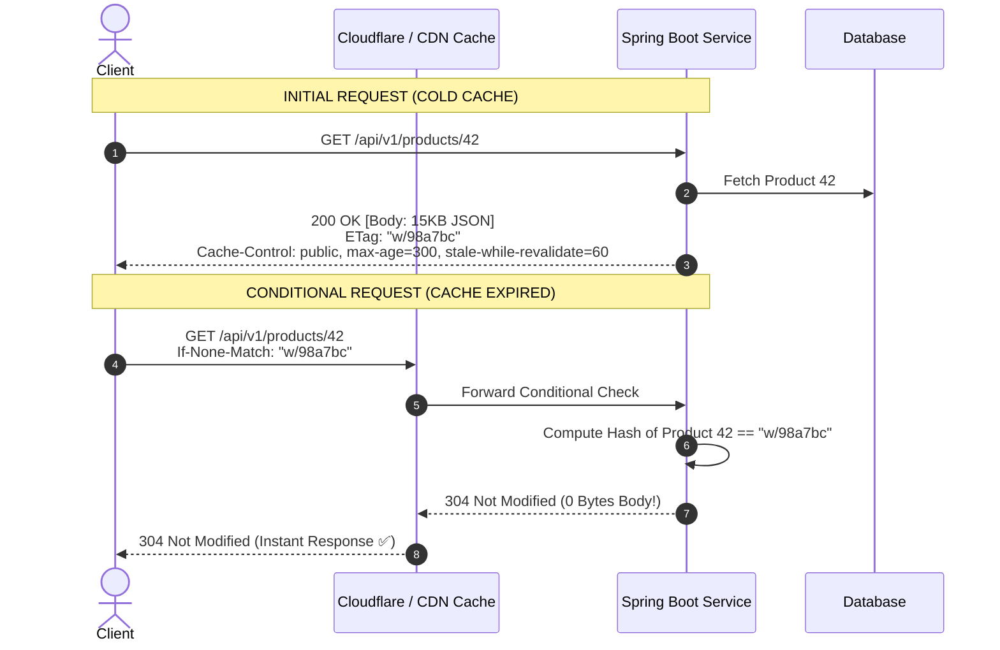

# Headers, Content Negotiation & HTTP Caching

Master conditional requests, ETags, cache invalidation directives, and content negotiation algorithms in high-scale backend systems.

---

## 1. What Is It?
- **HTTP Headers**: Key-value metadata transmitted alongside HTTP requests and responses governing authentication, caching, content formatting, and compression.
- **Content Negotiation**: The mechanism allowing a client and server to agree on the payload format (`Accept: application/json`, `application/xml`), language (`Accept-Language`), or encoding (`Accept-Encoding: gzip, br`).
- **HTTP Caching**: Reusing previously fetched responses to eliminate network round-trips and backend compute using validators (`ETag`, `Last-Modified`) and freshness directives (`Cache-Control`).

---

## 2. Why Does It Exist?
Without HTTP caching, identical queries for static or slow-changing resources (product catalogs, static configs, user profiles) constantly hit backend databases, wasting bandwidth and causing database CPU saturation.

Conditional requests (`ETag` + `If-None-Match`) allow the backend to respond with **`304 Not Modified` (zero body payload)**, saving $> 90\%$ bandwidth and latency.

---

## 3. Mental Model: Conditional Request Flow



---

## 4. How Does It Work: `Cache-Control` Directives

| Directive | Target | Semantic Behavior |
|---|---|---|
| **`max-age=N`** | Browser & CDN | Response is fresh for $N$ seconds. |
| **`s-maxage=N`** | Shared Cache (CDN) | Overrides `max-age` specifically for shared intermediary caches/CDNs. |
| **`no-cache`** | Browser & CDN | Cache CAN store the response, but **MUST revalidate** with backend before serving. |
| **`no-store`** | Browser & CDN | **NEVER store** in any cache (used for sensitive financial/auth data). |
| **`public`** | Browser & CDN | Any intermediary (CDN/proxy) can cache the response. |
| **`private`** | Browser ONLY | Only the end-user browser may cache (not shared CDNs). |
| **`stale-while-revalidate=N`** | Browser & CDN | Serve stale cached data immediately while refreshing in background for $N$ sec. |
| **`immutable`** | Browser | Content will NEVER change (used for hashed static bundles: `app.a8f7c.js`). |

---

## 5. Internal Working: Strong vs Weak ETags

- **Strong ETag (`"686897696a7c76"`)**: Byte-for-byte identical content. Guarantees that every single byte in the body is unchanged. Required for HTTP range requests (`Range: bytes=0-1023`).
- **Weak ETag (`W/"686897696a7c76"`)**: Semantically equivalent content. The JSON fields are identical, but byte layout or whitespace might differ.

---

## 6. Example & Production Java 21 Code

Implementing automated ETag generation, conditional caching, and `ShallowEtagHeaderFilter` in Spring Boot 3:

```java
package com.backend.http.caching;

import org.springframework.boot.web.servlet.FilterRegistrationBean;
import org.springframework.context.annotation.Bean;
import org.springframework.context.annotation.Configuration;
import org.springframework.http.CacheControl;
import org.springframework.http.ResponseEntity;
import org.springframework.web.bind.annotation.*;
import org.springframework.web.filter.ShallowEtagHeaderFilter;

import java.time.Duration;
import java.util.concurrent.TimeUnit;

@RestController
@RequestMapping("/api/v1/catalogs")
public class CatalogController {

    // 1. Programmatic Cache-Control & Weak ETag Endpoint
    @GetMapping("/{id}")
    public ResponseEntity<CatalogItemDto> getCatalogItem(
        @PathVariable String id,
        @RequestHeader(value = "If-None-Match", required = false) String ifNoneMatch
    ) {
        CatalogItemDto item = fetchCatalogFromDb(id);
        String currentEtag = "W/\"" + item.hashCode() + "\"";

        // Validate conditional header
        if (currentEtag.equals(ifNoneMatch)) {
            return ResponseEntity.status(304).build(); // 304 Not Modified
        }

        return ResponseEntity.ok()
            .cacheControl(CacheControl.maxAge(60, TimeUnit.SECONDS)
                .cachePublic()
                .staleWhileRevalidate(Duration.ofSeconds(30)))
            .eTag(currentEtag)
            .body(item);
    }

    private CatalogItemDto fetchCatalogFromDb(String id) {
        return new CatalogItemDto(id, "Mechanical Keyboard", 14999, 42);
    }

    public record CatalogItemDto(String id, String name, long priceCents, int stockCount) {}
}

@Configuration
class ETagFilterConfig {
    // 2. Global Shallow ETag Filter (Auto-hashes response body using MD5)
    @Bean
    public FilterRegistrationBean<ShallowEtagHeaderFilter> shallowEtagHeaderFilter() {
        FilterRegistrationBean<ShallowEtagHeaderFilter> registration = new FilterRegistrationBean<>();
        registration.setFilter(new ShallowEtagHeaderFilter());
        registration.addUrlPatterns("/api/v1/static/*");
        return registration;
    }
}
```

---

## 7. Performance Characteristics
- **Network Bandwidth Reduction**: A $500\text{KB}$ catalog payload returning `304 Not Modified` consumes only $\sim 300\text{ bytes}$ of HTTP header data ($> 99.9\%$ bandwidth savings).
- **`ShallowEtagHeaderFilter` Trade-off**: Saves client download bandwidth, but the backend server still executes the full database query and renders the response in memory before calculating the MD5 hash. For true CPU/database offloading, compute ETags from entity `@Version` timestamps.

---

## 8. Failure Scenarios & Edge Cases
- **The Accidental Public Cache of Private PII**: Setting `Cache-Control: public, max-age=3600` on an authenticated endpoint (`/api/v1/me`) causes CDNs to cache User A's profile and serve it to User B.
- **Cache Stampede on Invalidation**: When a hot cache key expires across millions of concurrent users, all requests bypass the cache simultaneously, crashing the database.

---

## 9. Observability (Logs, Metrics, Traces)
```text
# CDN Cache Hit / Miss Ratio Metrics
cdn_requests_total{status="HIT"} 945000
cdn_requests_total{status="MISS"} 42000
cdn_requests_total{status="REVALIDATED"} 13000
```

---

## 10. Debugging & Troubleshooting
1. **Inspect Cache Headers via cURL**:
   ```bash
   curl -I -H "If-None-Match: W/"12345"" https://api.internal/api/v1/catalogs/42
   ```
2. **Verify CDN Hit Status**:
   Inspect headers like `CF-Cache-Status: HIT` or `X-Cache: HIT`.

---

## 11. Scaling Considerations
- Push cache boundaries as close to the user as possible using **Edge CDNs** (Cloudflare Workers, AWS CloudFront) configured with `stale-while-revalidate` to deliver $< 10\text{ms}$ global read latency.

---

## 12. Architectural Trade-offs
| Caching Strategy | Latency | Consistency Risk | Backend Load |
|---|---|---|---|
| **No Cache (`no-store`)** | High (Every hop hits DB) | Zero (Always latest) | Maximum |
| **TTL Caching (`max-age=60`)**| Lowest (Served from edge)| Stale data for up to 60s | Lowest |
| **Revalidation (`no-cache`)**| Fast (304 Not Modified) | Zero (Always verified) | Low (Lightweight validation) |

---

## 13. When to Use
- Use `Cache-Control: private, no-cache` for sensitive user data that requires conditional validation.
- Use `Cache-Control: public, max-age=31536000, immutable` for versioned static assets.

---

## 14. When NOT to Use
- Never set `Cache-Control: public` on responses containing cookies, JWTs, or private user details.

---

## 15. SDE2 / Senior Interview Questions & Answers
### Q1: What is the difference between `Cache-Control: no-cache` and `Cache-Control: no-store`?
<details>
<summary>Reveal Answer</summary>

**Answer**:
- **`no-store`**: Directs the browser, proxies, and CDNs to **never store any part of the request or response** in non-volatile storage or memory cache. Every request must perform a full round-trip to the origin server.
- **`no-cache`**: Directs caches that they **CAN store** the response, but **MUST NOT serve it without revalidating** it with the origin server first (via `If-None-Match` or `If-Modified-Since`). If the content has not changed, the server returns `304 Not Modified` with zero body.
</details>

---

## 16. Practical Exercise
1. Implement a Spring Boot controller with `@Version` on an JPA entity.
2. Expose an endpoint that uses the version number as the `ETag`.
3. Verify that sending `If-None-Match` returns HTTP 304 without executing full serialization.

---

## 17. Quick Revision Summary
- `ETag` + `If-None-Match` enable **conditional requests and HTTP 304 Not Modified**.
- `no-cache` means **revalidate before use**; `no-store` means **never persist**.
- `stale-while-revalidate` provides instant responses while refreshing data asynchronously.
