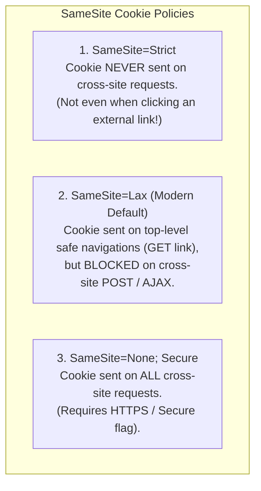
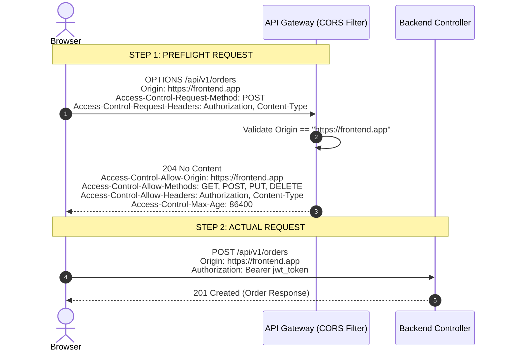

# Cookies, Sessions & Browser Security Headers

Master cookie security attributes, session lifecycle, Cross-Origin Resource Sharing (CORS) preflights, and browser defense-in-depth headers.

---

## 1. What Is It?
- **HTTP Cookie**: A small stateful key-value pair sent by a server via the `Set-Cookie` header and stored in the user's browser, automatically attached to subsequent matching requests via the `Cookie` header.
- **CORS (Cross-Origin Resource Sharing)**: A browser security mechanism that restricts web applications running on one domain from making HTTP requests to a different domain unless the target server explicitly permits it.
- **Security Headers**: HTTP response headers (`HSTS`, `CSP`, `X-Content-Type-Options`) instructing browsers to enforce strict defensive security policies.

---

## 2. Why Does It Exist?
- Without **`HttpOnly`**, malicious Cross-Site Scripting (XSS) JavaScript can read `document.cookie` and steal session tokens.
- Without **`SameSite=Strict/Lax`**, attackers can perform Cross-Site Request Forgery (CSRF) attacks by tricking victims into clicking malicious links that automatically submit authenticated requests.
- Without **CORS**, any website could execute AJAX calls to your internal banking API using the user's ambient session credentials.

---

## 3. Mental Model: SameSite Cookie Policies



---

## 4. How Does It Work: CORS Preflight Flow

When a browser executes a "non-simple" cross-origin request (e.g., sending `Content-Type: application/json` or custom headers like `Authorization`):



---

## 5. Internal Working: Production Defense-in-Depth Headers

| Security Header | Recommended Production Value | Defense Purpose |
|---|---|---|
| **`Strict-Transport-Security`** | `max-age=31536000; includeSubDomains; preload` | Forces all browser traffic over HTTPS (prevents SSL stripping). |
| **`Content-Security-Policy`** | `default-src 'self'; script-src 'self'` | Mitigates XSS by restricting allowed script/media origins. |
| **`X-Content-Type-Options`** | `nosniff` | Prevents MIME-type sniffing (e.g., executing an image upload as JavaScript). |
| **`X-Frame-Options`** | `DENY` | Prevents Clickjacking by disallowing rendering inside `<iframe>`. |
| **`Referrer-Policy`** | `strict-origin-when-cross-origin` | Prevents leaking sensitive URL parameters to external sites. |

---

## 6. Example & Production Java 21 Code

Configuring hardened security cookies and CORS policies in Spring Security 6 / Spring Boot 3:

```java
package com.backend.http.security;

import org.springframework.context.annotation.Bean;
import org.springframework.context.annotation.Configuration;
import org.springframework.http.ResponseCookie;
import org.springframework.security.config.Customizer;
import org.springframework.security.config.annotation.web.builders.HttpSecurity;
import org.springframework.security.config.annotation.web.configuration.EnableWebSecurity;
import org.springframework.security.web.SecurityFilterChain;
import org.springframework.security.web.header.writers.ReferrerPolicyHeaderWriter;
import org.springframework.web.cors.CorsConfiguration;
import org.springframework.web.cors.CorsConfigurationSource;
import org.springframework.web.cors.UrlBasedCorsConfigurationSource;

import java.time.Duration;
import java.util.List;

@Configuration
@EnableWebSecurity
public class WebSecurityConfig {

    // 1. Enterprise Security Filter Chain
    @Bean
    public SecurityFilterChain filterChain(HttpSecurity http) throws Exception {
        http
            .cors(cors -> cors.configurationSource(corsConfigurationSource()))
            .csrf(csrf -> csrf.disable()) // Disabled only for stateless token APIs
            .headers(headers -> headers
                .httpStrictTransportSecurity(hsts -> hsts
                    .includeSubDomains(true)
                    .maxAgeInSeconds(31536000))
                .contentTypeOptions(Customizer.withDefaults()) // nosniff
                .frameOptions(frame -> frame.deny())
                .referrerPolicy(ref -> ref.policy(ReferrerPolicyHeaderWriter.ReferrerPolicy.STRICT_ORIGIN_WHEN_CROSS_ORIGIN))
            );
        return http.build();
    }

    // 2. Strict CORS Configuration Source
    @Bean
    public CorsConfigurationSource corsConfigurationSource() {
        CorsConfiguration config = new CorsConfiguration();
        config.setAllowedOrigins(List.of("https://app.production.com"));
        config.setAllowedMethods(List.of("GET", "POST", "PUT", "DELETE", "OPTIONS"));
        config.setAllowedHeaders(List.of("Authorization", "Content-Type", "Idempotency-Key"));
        config.setAllowCredentials(true);
        config.setMaxAge(Duration.ofHours(24)); // Cache preflight for 24h

        UrlBasedCorsConfigurationSource source = new UrlBasedCorsConfigurationSource();
        source.registerCorsConfiguration("/api/**", config);
        return source;
    }

    // 3. Factory for Secure Session Cookies
    public static ResponseCookie createSecureSessionCookie(String sessionToken, long maxAgeSeconds) {
        return ResponseCookie.from("SESSION_ID", sessionToken)
            .httpOnly(true)                      // Blocks JavaScript XSS access
            .secure(true)                        // Only transmitted over HTTPS
            .sameSite("Lax")                     // Prevents CSRF on state-changing requests
            .path("/")
            .maxAge(maxAgeSeconds)
            .build();
    }
}
```

---

## 7. Performance Characteristics
- **CORS Preflight Caching (`Access-Control-Max-Age`)**: Browsers issue an `OPTIONS` request before every mutation. Setting `Access-Control-Max-Age: 86400` allows the browser to cache preflight approvals for 24 hours, eliminating 50% of incoming network requests.

---

## 8. Failure Scenarios & Edge Cases
- **The `Access-Control-Allow-Origin: *` with Credentials Trap**: If a server responds with wildcard origin `*` while `Access-Control-Allow-Credentials: true` is set, browsers reject the response with a JavaScript CORS error. Wildcard origins cannot be used with ambient credentials.

---

## 9. Observability (Logs, Metrics, Traces)
```text
# Security Incident Logs (CORS Rejection)
{
  "timestamp": "2026-09-01T18:30:00Z",
  "level": "WARN",
  "event": "CORS_ORIGIN_DENIED",
  "origin": "https://malicious-site.com",
  "requested_path": "/api/v1/transfers",
  "client_ip": "198.51.100.22"
}
```

---

## 10. Debugging & Troubleshooting
1. **Test CORS Preflight via cURL**:
   ```bash
   curl -I -X OPTIONS https://api.internal/api/v1/orders      -H "Origin: https://app.production.com"      -H "Access-Control-Request-Method: POST"
   ```

---

## 11. Scaling Considerations
- Handle CORS termination and security headers directly at the **API Gateway / CDN layer** (e.g., AWS CloudFront / Cloudflare) to prevent unauthenticated `OPTIONS` preflights from reaching backend application containers.

---

## 12. Architectural Trade-offs
| Storage Option | Security Level | Scalability | XSS Vulnerability |
|---|---|---|---|
| **Local Storage (`localStorage.setItem`)**| Lowest | High | High (Accessible to JS) |
| **HttpOnly Secure Cookie** | Highest | Moderate (Requires CORS config)| Zero (Inaccessible to JS) |

---

## 13. When to Use
- Always use **`HttpOnly; Secure; SameSite=Lax`** cookies for authentication tokens in web browser environments.

---

## 14. When NOT to Use
- Do not store sensitive authentication tokens in browser `localStorage` or `sessionStorage`.

---

## 15. SDE2 / Senior Interview Questions & Answers
### Q1: Explain how Cross-Site Request Forgery (CSRF) works, and why `SameSite=Lax` cookies mitigate it without CSRF tokens.
<details>
<summary>Reveal Answer</summary>

**Answer**:
**CSRF Attack Mechanism**:
A victim logs into `bank.com`, receiving an ambient session cookie. The victim visits `evil.com`. `evil.com` executes a hidden `<form action="https://bank.com/transfer" method="POST">`. The browser automatically attaches the `bank.com` cookie, executing the unauthorized transfer.

**Mitigation with `SameSite=Lax`**:
Under `SameSite=Lax`, the browser strictly isolates cookie transmission based on the top-level origin.
1. The cookie is **only attached** to same-site requests and top-level safe `GET` navigations (e.g., clicking a link).
2. The cookie is **completely omitted** from cross-site `POST`, `PUT`, `DELETE`, or AJAX requests initiated by `evil.com`.
3. Consequently, the cross-site POST arrives at `bank.com` without credentials and is rejected with HTTP 401 Unauthorized.
</details>

---

## 16. Practical Exercise
1. Spin up a backend service on port 8080 and a static frontend on port 3000.
2. Attempt to fetch data using `fetch()` without CORS headers and observe the browser console error.
3. Configure the Spring CORS filter and verify successful cross-origin preflight and request execution.

---

## 17. Quick Revision Summary
- **`HttpOnly`** prevents XSS token theft; **`SameSite`** prevents CSRF.
- **CORS** is enforced by the **browser**, not the server; use `Access-Control-Max-Age` to cache preflights.
- Modern APIs enforce **HSTS, CSP, and nosniff** security headers.
