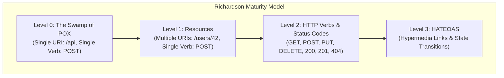

# REST & The Richardson Maturity Model

Master Representational State Transfer (REST) constraints, URI resource modeling, and the Richardson Maturity Model (Levels 0 through 3 HATEOAS).

---

## 1. What Is It?
**REST (Representational State Transfer)** is an architectural style defined by Roy Fielding governing distributed hypermedia systems.

The **Richardson Maturity Model (RMM)** grades API architectures into 4 progressive levels of REST compliance:
- **Level 0 (The Swamp of POX)**: Single URI, single HTTP method (`POST`) used for all remote procedure calls (e.g., SOAP or XML-RPC).
- **Level 1 (Resources)**: Multiple discrete URIs for distinct resources, but still using a single HTTP method (`POST`).
- **Level 2 (HTTP Verbs & Status Codes)**: Multiple URIs utilizing standard HTTP verbs (`GET`, `POST`, `PUT`, `DELETE`) and standard HTTP status codes.
- **Level 3 (Hypermedia Controls / HATEOAS)**: Hypermedia as the Engine of Application State. Responses contain discoverable hypermedia links guiding the client on available state transitions.

---

## 2. Why Does It Exist?
- **Resource Naming Uniformity**: Eliminates ad-hoc RPC verb endpoints like `/getUser`, `/deleteUser`, `/saveUser`.
- **Decoupled Evolution (HATEOAS)**: Level 3 allows servers to dynamically alter business workflows and URI structures without breaking client applications.

---

## 3. Mental Model: Richardson Maturity Levels



---

## 4. How Does It Work: Pragmatic REST Resource Design Rules

1. **Use Nouns, Not Verbs**:
   - ❌ Bad: `/api/v1/createOrder`, `/api/v1/getAllUsers`
   - ✅ Good: `POST /api/v1/orders`, `GET /api/v1/users`
2. **Use Plural Nouns for Collections**:
   - `GET /api/v1/customers` (Collection)
   - `GET /api/v1/customers/{id}` (Single Resource)
3. **Model Hierarchical Sub-Resources**:
   - `GET /api/v1/customers/{id}/orders` (Orders belonging to customer)
   - `GET /api/v1/customers/{id}/orders/{orderId}` (Specific order)
4. **Limit Nesting to Max 2 Levels**:
   - ❌ Bad: `/authors/1/books/5/chapters/2/paragraphs/8`
   - ✅ Good: `GET /paragraphs/8` or `/chapters/2/paragraphs`

---

## 5. Internal Working: Level 3 HATEOAS Payload

```json
{
  "orderId": "ord_9842",
  "status": "AWAITING_PAYMENT",
  "amountCents": 4999,
  "_links": {
    "self": { "href": "https://api.internal/v1/orders/ord_9842" },
    "payment": { "href": "https://api.internal/v1/orders/ord_9842/payments", "method": "POST" },
    "cancel": { "href": "https://api.internal/v1/orders/ord_9842/cancel", "method": "PUT" },
    "customer": { "href": "https://api.internal/v1/customers/cust_101" }
  }
}
```
*If the order status changes to `SHIPPED`, the server dynamically removes the `payment` and `cancel` links and adds a `tracking` link.*

---

## 6. Example & Production Java 21 Code

Implementing Level 3 HATEOAS using Spring HATEOAS in Spring Boot 3:

```java
package com.backend.http.rest;

import org.springframework.hateoas.EntityModel;
import org.springframework.hateoas.server.mvc.WebMvcLinkBuilder;
import org.springframework.http.ResponseEntity;
import org.springframework.web.bind.annotation.*;

import java.util.UUID;

import static org.springframework.hateoas.server.mvc.WebMvcLinkBuilder.*;

@RestController
@RequestMapping("/api/v1/orders")
public class OrderHateoasController {

    @GetMapping("/{id}")
    public ResponseEntity<EntityModel<OrderDto>> getOrder(@PathVariable UUID id) {
        OrderDto order = new OrderDto(id, "AWAITING_PAYMENT", 15000L);

        // Build Level 3 HATEOAS EntityModel with contextual links
        EntityModel<OrderDto> resource = EntityModel.of(order);

        // Self link
        resource.add(linkTo(methodOn(OrderHateoasController.class).getOrder(id)).withSelfRel());

        // Conditional State Transitions
        if ("AWAITING_PAYMENT".equals(order.status())) {
            resource.add(linkTo(methodOn(OrderHateoasController.class).processPayment(id)).withRel("payment"));
            resource.add(linkTo(methodOn(OrderHateoasController.class).cancelOrder(id)).withRel("cancel"));
        }

        return ResponseEntity.ok(resource);
    }

    @PostMapping("/{id}/payments")
    public ResponseEntity<Void> processPayment(@PathVariable UUID id) {
        return ResponseEntity.ok().build();
    }

    @PutMapping("/{id}/cancel")
    public ResponseEntity<Void> cancelOrder(@PathVariable UUID id) {
        return ResponseEntity.noContent().build();
    }

    public record OrderDto(UUID orderId, String status, long amountCents) {}
}
```

---

## 7. Performance Characteristics
- **HATEOAS Payload Overhead**: Hypermedia link structures increase JSON response size by $\sim 15 - 30\%$. For high-throughput internal microservices, teams often adopt Level 2 REST or Protobuf/gRPC to eliminate link serialization overhead.

---

## 8. Failure Scenarios & Edge Cases
- **The "State Explosion" in HATEOAS**: Hand-coding state machine transitions in controller layers becomes unmaintainable across hundreds of endpoints. Use formal State Machine frameworks (Spring State Machine) if Level 3 HATEOAS is mandated.

---

## 9. Observability (Logs, Metrics, Traces)
```text
# REST Method Ingress Metrics
http_requests_by_method_total{method="GET"} 654000
http_requests_by_method_total{method="POST"} 121000
http_requests_by_method_total{method="PUT"} 34000
http_requests_by_method_total{method="DELETE"} 8900
```

---

## 10. Debugging & Troubleshooting
1. **Validate API Design with Spectral Linting**:
   Use Spectral OpenAPI linter in CI/CD pipelines to enforce plural nouns and status code standards automatically.

---

## 11. Scaling Considerations
- Most high-scale enterprises (Stripe, GitHub, AWS) standardize on **Level 2 REST** with pragmatic hypermedia extensions rather than strict pure HATEOAS.

---

## 12. Architectural Trade-offs
| Architectural Level | Discoverability | Implementation Simplicity | Payload Efficiency |
|---|---|---|---|
| **Level 2 (Pragmatic REST)** | Moderate (via OpenAPI/Swagger) | High | High |
| **Level 3 (HATEOAS)** | Highest (Self-describing) | Low (Complex link builders) | Lower (Link overhead) |

---

## 13. When to Use
- **Level 2 REST**: The gold standard for modern public APIs and internal service-to-service communication.
- **Level 3 HATEOAS**: Highly dynamic multi-step workflows (e.g., checkout flows with varying payment methods).

---

## 14. When NOT to Use
- Do not force HATEOAS on high-throughput microservices where payload size is critical.

---

## 15. SDE2 / Senior Interview Questions & Answers
### Q1: What are the 4 levels of the Richardson Maturity Model, and why do most companies stop at Level 2?
<details>
<summary>Reveal Answer</summary>

**Answer**:
1. **Level 0**: Single URI, single HTTP verb (`POST /endpoint`).
2. **Level 1**: Multiple Resource URIs (`/orders`, `/users`), single verb.
3. **Level 2**: Multiple URIs using standard HTTP Verbs (`GET`, `POST`, `PUT`, `DELETE`) and proper Status Codes (`200`, `201`, `404`).
4. **Level 3**: HATEOAS (Hypermedia links guiding state transitions).

**Why Companies Stop at Level 2**:
- **Tooling Support**: Modern frontend SDKs and code generators (OpenAPI, TypeScript codegen) work seamlessly with static Level 2 schemas.
- **Bandwidth & CPU Overhead**: Serializing hypermedia links adds memory and network payload overhead.
- **Client Coupling Reality**: In practice, client applications are hardcoded to specific business screens rather than dynamically rendering UI from HATEOAS links.
</details>

---

## 16. Practical Exercise
1. Model an API for a Library Management system (Books, Authors, Loans).
2. Refactor all non-RESTful verb endpoints (`/borrowBook`, `/returnBook`) into idiomatic Level 2 REST resources (`POST /loans`, `PUT /loans/{id}/return`).

---

## 17. Quick Revision Summary
- Use **nouns for resources, HTTP verbs for actions**.
- Keep URI hierarchies shallow ($\le 2$ levels).
- Richardson Maturity Model defines **Level 0 (POX) $\to$ Level 1 (URIs) $\to$ Level 2 (Verbs/Status) $\to$ Level 3 (HATEOAS)**.
