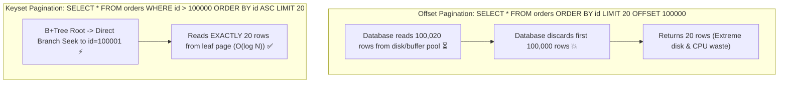

# API Pagination, Filtering & Sorting

Master pagination algorithms, B+Tree index seek vs page scan mechanics, the Deep Pagination Trap, and flexible querying design.

---

## 1. What Is It?
- **Pagination**: Partitioning a massive database dataset into discrete, manageable pages returned across multiple HTTP requests.
- **Offset Pagination**: Requesting a page by specifying a page number/offset and page size (`LIMIT 20 OFFSET 100000`).
- **Keyset / Cursor Pagination**: Requesting the next page by passing the unique sort key or opaque base64 cursor of the last seen item (`WHERE id > 45000 ORDER BY id ASC LIMIT 20`).

---

## 2. Why Does It Exist?
Fetching 1,000,000 records in a single API call causes JVM OutOfMemory errors, massive network serialization latency, and database query timeouts.

However, naive **Offset Pagination (`OFFSET 100000`)** forces the database engine to perform a full B+Tree index scan, reading and discarding 100,000 disk rows before returning 20 rows. **Keyset Pagination** executes an $\mathcal{O}(\log N)$ index seek directly to the target record.

---

## 3. Mental Model: Offset vs Keyset Database Execution



---

## 4. How Does It Work: Offset vs Keyset Comparison

| Feature | Offset Pagination | Keyset / Cursor Pagination |
|---|---|---|
| **Query Syntax** | `?page=5&size=20` | `?cursor=eyJpZCI6NDV9&limit=20` |
| **SQL Mechanism** | `LIMIT 20 OFFSET 80` | `WHERE (created_at, id) < (:last_date, :last_id) LIMIT 20` |
| **B+Tree Complexity** | $\mathcal{O}(N)$ (Scans and discards) | $\mathcal{O}(\log N)$ (Direct index seek) |
| **Performance on Deep Pages** | Degrades linearly to seconds 💥 | Constant time ($\sim 1\text{ms}$) regardless of depth ✅ |
| **Data Drift / Phantom Rows** | Suffers from duplicates on inserts | Immune to insertion drift |
| **Random Page Jump** | Yes (`Jump to Page 42`) | No (Sequential next/previous only) |

---

## 5. Internal Working: The Data Drift Anomaly in Offset Pagination

1. Client requests `page=1&size=5` (Receives rows 1, 2, 3, 4, 5).
2. A new row is inserted at the top of the table.
3. Client requests `page=2&size=5` (`OFFSET 5 LIMIT 5`).
4. The database shifts all rows down by 1: Row 5 is returned **a second time** as the first element of Page 2!

Keyset pagination (`WHERE id > 5`) is completely immune to this data drift.

---

## 6. Example & Production Java 21 Code

Implementing high-performance Keyset (Cursor) Pagination in Spring Data JPA:

```java
package com.backend.http.pagination;

import org.springframework.data.jpa.repository.JpaRepository;
import org.springframework.data.jpa.repository.Query;
import org.springframework.data.repository.query.Param;
import org.springframework.stereotype.Repository;

import java.nio.charset.StandardCharsets;
import java.time.Instant;
import java.util.Base64;
import java.util.List;
import java.util.UUID;

public class CursorPaginationService {

    private final TransactionRepository repository;

    public CursorPaginationService(TransactionRepository repository) {
        this.repository = repository;
    }

    public PageResult<TransactionDto> getTransactions(String cursor, int limit) {
        int fetchSize = limit + 1; // Fetch 1 extra to determine if next page exists
        List<TransactionEntity> records;

        if (cursor == null || cursor.isBlank()) {
            records = repository.findInitialPage(fetchSize);
        } else {
            DecodedCursor decoded = decodeCursor(cursor);
            records = repository.findNextPage(decoded.timestamp(), decoded.id(), fetchSize);
        }

        boolean hasNext = records.size() > limit;
        List<TransactionEntity> pageContent = hasNext ? records.subList(0, limit) : records;

        String nextCursor = null;
        if (hasNext && !pageContent.isEmpty()) {
            TransactionEntity lastItem = pageContent.getLast();
            nextCursor = encodeCursor(lastItem.getCreatedAt(), lastItem.getId());
        }

        List<TransactionDto> dtos = pageContent.stream()
            .map(t -> new TransactionDto(t.getId(), t.getAmount(), t.getCreatedAt()))
            .toList();

        return new PageResult<>(dtos, nextCursor, hasNext);
    }

    private String encodeCursor(Instant timestamp, UUID id) {
        String raw = timestamp.toEpochMilli() + ":" + id;
        return Base64.getUrlEncoder().withoutPadding().encodeToString(raw.getBytes(StandardCharsets.UTF_8));
    }

    private DecodedCursor decodeCursor(String cursor) {
        String raw = new String(Base64.getUrlDecoder().decode(cursor), StandardCharsets.UTF_8);
        String[] parts = raw.split(":");
        return new DecodedCursor(Instant.ofEpochMilli(Long.parseLong(parts[0])), UUID.fromString(parts[1]));
    }

    public record DecodedCursor(Instant timestamp, UUID id) {}
    public record TransactionDto(UUID id, long amount, Instant createdAt) {}
    public record PageResult<T>(List<T> data, String nextCursor, boolean hasNext) {}
}

@Repository
interface TransactionRepository extends JpaRepository<TransactionEntity, UUID> {

    @Query("SELECT t FROM TransactionEntity t ORDER BY t.createdAt DESC, t.id DESC LIMIT :limit")
    List<TransactionEntity> findInitialPage(@Param("limit") int limit);

    // Keyset seek using composite index (created_at, id)
    @Query("SELECT t FROM TransactionEntity t WHERE (t.createdAt < :lastTimestamp) OR (t.createdAt = :lastTimestamp AND t.id < :lastId) ORDER BY t.createdAt DESC, t.id DESC LIMIT :limit")
    List<TransactionEntity> findNextPage(
        @Param("lastTimestamp") Instant lastTimestamp,
        @Param("lastId") UUID lastId,
        @Param("limit") int limit
    );
}

class TransactionEntity {
    private UUID id;
    private long amount;
    private Instant createdAt;
    public UUID getId() { return id; }
    public long getAmount() { return amount; }
    public Instant getCreatedAt() { return createdAt; }
}
```

---

## 7. Performance Characteristics
- **B+Tree Page Scan Benchmarks**:
  - `OFFSET 10`: $\sim 0.2\text{ms}$.
  - `OFFSET 1,000,000`: $\sim 1,450\text{ms}$ (Database CPU spike).
  - Keyset Seek on 10,000,000 rows: $\sim 0.4\text{ms}$ constant time.

---

## 8. Failure Scenarios & Edge Cases
- **Missing Composite Index on Keyset Seek**: If the query filters on `(created_at, id)` but only an index on `created_at` exists, the database falls back to sorting in memory (`Using filesort`), causing severe degradation. Always back keyset pagination with a composite index: `CREATE INDEX idx_tx_page ON transactions(created_at DESC, id DESC)`.

---

## 9. Observability (Logs, Metrics, Traces)
```text
# Database Query Execution Time by Pagination Strategy
sql_query_duration_seconds{query="offset_pagination", page="deep"} 1.840
sql_query_duration_seconds{query="keyset_pagination", page="deep"} 0.002
```

---

## 10. Debugging & Troubleshooting
1. **Explain Analyze Deep Pagination Query**:
   ```sql
   EXPLAIN ANALYZE SELECT * FROM transactions ORDER BY created_at DESC LIMIT 20 OFFSET 500000;
   -- Look for: "Rows Removed by Filter: 500000"
   ```

---

## 11. Scaling Considerations
- Enforce a **hard maximum page size** (`Math.min(requestedSize, 100)`) in your API controllers to prevent malicious clients from requesting `?size=1000000`.

---

## 12. Architectural Trade-offs
| Strategy | Implementation Effort | Deep Page Speed | Infinite Scroll Fit |
|---|---|---|---|
| **Offset Pagination** | Trivial (`Pageable` in Spring) | Poor ($\mathcal{O}(N)$) | Poor |
| **Keyset / Cursor** | Moderate (Cursor encoding/decoding) | Constant ($\mathcal{O}(\log N)$) | Perfect |

---

## 13. When to Use
- **Keyset / Cursor Pagination**: Mobile social feeds, endless scroll, real-time activity logs, high-scale public APIs (Stripe, Twitter).
- **Offset Pagination**: Small datasets ($< 1,000$ rows), internal admin dashboards requiring "Jump to page 10".

---

## 14. When NOT to Use
- Never use Offset Pagination on tables with millions of rapidly inserted rows.

---

## 15. SDE2 / Senior Interview Questions & Answers
### Q1: Why does `SELECT * FROM orders ORDER BY created_at DESC LIMIT 20 OFFSET 100000` perform poorly, and how does Keyset pagination solve it?
<details>
<summary>Reveal Answer</summary>

**Answer**:
**Why Offset Fails**:
The database engine must traverse the index to find all $100,020$ matching records. For each record, it reads the row data from the table buffer pool, counts off $100,000$ rows in memory, discards them, and returns the remaining $20$. This results in $100,000$ unnecessary row reads and high disk I/O.

**How Keyset Solves It**:
Keyset pagination replaces the offset with a predicate filter on the composite index:
`WHERE (created_at < :last_created_at) OR (created_at = :last_created_at AND id < :last_id) LIMIT 20`
The B+Tree uses the predicate to seek directly to the exact leaf node containing `:last_id` in $\mathcal{O}(\log N)$ time, reading strictly the requested $20$ rows and zero discarded rows.
</details>

---

## 16. Practical Exercise
1. Seed a PostgreSQL table with 1,000,000 records.
2. Run `EXPLAIN ANALYZE` on `OFFSET 500000 LIMIT 20` vs Keyset seek.
3. Observe the difference in execution time and buffer reads.

---

## 17. Quick Revision Summary
- **Offset pagination** degrades linearly with page depth ($\mathcal{O}(N)$) and suffers from data drift.
- **Keyset (Cursor) pagination** provides constant time $\mathcal{O}(\log N)$ performance by leveraging B+Tree index seeks.
- Always encode cursors as opaque Base64 strings.
