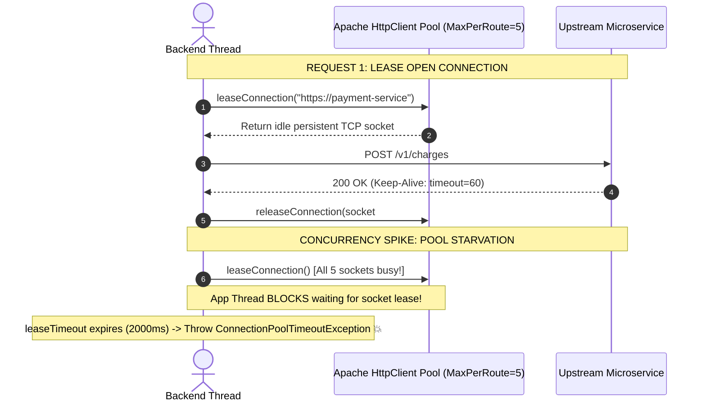

# HTTP Client Connection Pools & Tuning

Master outbound HTTP client connection pool mechanics, lease timeouts, keep-alive reuse, and prevention of pool starvation.

---

## 1. What Is It?
An **HTTP Client Connection Pool** is an in-memory manager maintaining a pool of open, persistent TCP connections to upstream HTTP servers, allowing worker threads to lease an existing socket, execute an HTTP request, and return the socket to the pool for reuse without renegotiating the TCP 3-way handshake or TLS encryption.

---

## 2. Why Does It Exist?
Creating a new TCP + TLS 1.3 connection for every outbound HTTP request adds:
- **Latency**: $\sim 2 - 3\text{ RTTs}$ ($\sim 20 - 100\text{ms}$) per outbound request.
- **Socket Exhaustion (`TIME_WAIT`)**: Operating systems place closed TCP sockets in `TIME_WAIT` state for 60 seconds (2MSL). At high request rates, the host exhausts all available ephemeral ports ($65,535$), throwing `java.net.BindException: Address already in use`.

---

## 3. Mental Model: Connection Pool Lifecycle



---

## 4. How Does It Work: Key Configuration Parameters

| Parameter | Recommended Default | Production Purpose |
|---|---|---|
| **`maxTotal`** | $200 - 500$ | Total number of pooled connections across all upstream routes. |
| **`defaultMaxPerRoute`** | $50 - 100$ | Max concurrent connections to a single target host (Default in Apache is **2** ⚠️). |
| **`connectionRequestTimeout`**| $1,000 - 2,000\text{ms}$ | Max time a thread will block waiting to lease a connection from the pool. |
| **`connectTimeout`** | $2,000 - 3,000\text{ms}$ | Max time to establish TCP/TLS handshake with upstream. |
| **`socketTimeout` (Read)** | $3,000 - 5,000\text{ms}$ | Max time waiting for data packets between chunks after connection is established. |
| **`evictIdleConnections`** | $30\text{s}$ | Background thread reaping stale/closed connections to prevent half-closed socket errors. |

---

## 5. Internal Working: The `defaultMaxPerRoute = 2` Production Disaster

In standard Apache HttpClient, the default `defaultMaxPerRoute` is set to **`2`**!

If your Spring Boot service handles 200 concurrent requests and makes an outbound call to `https://inventory-service`:
1. 2 threads lease the 2 available sockets.
2. The remaining **198 threads block** waiting for a connection to be returned.
3. Downstream throughput collapses to $\approx 20\text{ RPS}$, regardless of how many CPU cores the server possesses.

---

## 6. Example & Production Java 21 Code

Configuring a hardened, production-ready Apache HttpClient 5 and Spring Boot 3 `RestClient`:

```java
package com.backend.http.client;

import org.apache.hc.client5.http.config.ConnectionConfig;
import org.apache.hc.client5.http.config.RequestConfig;
import org.apache.hc.client5.http.impl.classic.CloseableHttpClient;
import org.apache.hc.client5.http.impl.classic.HttpClients;
import org.apache.hc.client5.http.impl.io.PoolingHttpClientConnectionManager;
import org.apache.hc.client5.http.impl.io.PoolingHttpClientConnectionManagerBuilder;
import org.apache.hc.core5.http.io.SocketConfig;
import org.apache.hc.core5.util.TimeValue;
import org.apache.hc.core5.util.Timeout;
import org.springframework.context.annotation.Bean;
import org.springframework.context.annotation.Configuration;
import org.springframework.http.client.HttpComponentsClientHttpRequestFactory;
import org.springframework.web.client.RestClient;

@Configuration
public class HttpClientConfig {

    @Bean
    public CloseableHttpClient customPoolingHttpClient() {
        // 1. Configure Socket Buffer Timeouts
        SocketConfig socketConfig = SocketConfig.custom()
            .setSoTimeout(Timeout.ofSeconds(5)) // Read Timeout
            .setTcpNoDelay(true)                // Disable Nagle's algorithm for low latency
            .build();

        // 2. Configure Connection Level Timeouts
        ConnectionConfig connectionConfig = ConnectionConfig.custom()
            .setConnectTimeout(Timeout.ofSeconds(3))
            .setSocketTimeout(Timeout.ofSeconds(5))
            .setTimeToLive(TimeValue.ofMinutes(5)) // Recycle connections every 5 min
            .build();

        // 3. Configure High-Throughput Pooling Manager
        PoolingHttpClientConnectionManager connectionManager = PoolingHttpClientConnectionManagerBuilder.create()
            .setDefaultSocketConfig(socketConfig)
            .setDefaultConnectionConfig(connectionConfig)
            .setMaxConnTotal(400)               // Total connections across all routes
            .setMaxConnPerRoute(100)            // Max connections per upstream host (CRITICAL!)
            .build();

        // 4. Configure Request Execution Settings
        RequestConfig requestConfig = RequestConfig.custom()
            .setConnectionRequestTimeout(Timeout.ofMilliseconds(1500)) // Pool lease timeout
            .build();

        return HttpClients.custom()
            .setConnectionManager(connectionManager)
            .setDefaultRequestConfig(requestConfig)
            .evictExpiredConnections()
            .evictIdleConnections(TimeValue.ofSeconds(30)) // Clean dead sockets
            .build();
    }

    @Bean
    public RestClient customRestClient(CloseableHttpClient httpClient) {
        HttpComponentsClientHttpRequestFactory factory = new HttpComponentsClientHttpRequestFactory(httpClient);
        return RestClient.builder()
            .requestFactory(factory)
            .build();
    }
}
```

---

## 7. Performance Characteristics
- **TCP Handshake Elimination**: Reusing open sockets eliminates $15 - 50\text{ms}$ of latency per outbound call.
- **Connection Leaks**: If an application fails to consume the response body stream (`response.getBody().close()`), the socket remains checked out and is never returned to the pool, eventually causing permanent pool exhaustion.

---

## 8. Failure Scenarios & Edge Cases
- **Upstream Silent RST / Firewall Timeout**: Intermediate firewalls close idle TCP connections after 60 seconds without notifying the client. When the client attempts to reuse the socket, the write fails with `Connection reset by peer`. Always enable an active background connection evictor (`evictIdleConnections(30s)`).

---

## 9. Observability (Logs, Metrics, Traces)
```text
# Micrometer / Apache HttpClient Pool Metrics
httpclient_pool_total_connections{state="leased"} 98
httpclient_pool_total_connections{state="available"} 302
httpclient_pool_total_connections{state="pending"} 0   <-- Must be 0; >0 means pool starvation!
```

---

## 10. Debugging & Troubleshooting
1. **Detect Connection Pool Starvation via Thread Dumps**:
   ```text
   "http-nio-8080-exec-12" java.lang.Thread.State: TIMED_WAITING
     at org.apache.hc.client5.http.impl.io.PoolingHttpClientConnectionManager.lease(...)
   ```
2. **Inspect Open Sockets to Upstream**:
   ```bash
   ss -tan '( dport = :443 )' | grep ESTAB | wc -l
   ```

---

## 11. Scaling Considerations
- Size `maxConnPerRoute` based on Little's Law:
  $$\text{MaxConnPerRoute} = \text{Target RPS to Upstream} \times \text{Upstream Average Latency}$$
  If a service calls an upstream at $1,000\text{ RPS}$ with $50\text{ms}$ latency ($0.05\text{s}$):
  $$\text{MaxConnPerRoute} = 1,000 \times 0.05 = 50\text{ connections}.$$

---

## 12. Architectural Trade-offs
| Pool Sizing Strategy | Throughput Capacity | Memory Overhead | Risk |
|---|---|---|---|
| **Small Pool (10 per route)** | Low | Lowest | Thread starvation under spikes |
| **Tuned Pool (100 per route)**| Optimal | Moderate | Healthy headroom |
| **Massive Pool (5000 per route)**| High | High (Socket descriptors)| Upstream server socket exhaustion |

---

## 13. When to Use
- Always configure an explicit, tuned pooling manager when using Spring `RestClient`, `WebClient`, or `RestTemplate`.

---

## 14. When NOT to Use
- Never use default single-connection or untuned default clients (`defaultMaxPerRoute = 2`) in high-concurrency production environments.

---

## 15. SDE2 / Senior Interview Questions & Answers
### Q1: Your backend service experiences intermittent `ConnectionPoolTimeoutException: Timeout waiting for connection from pool` during traffic spikes. What are the 3 most common root causes and how do you fix them?
<details>
<summary>Reveal Answer</summary>

**Answer**:
1. **Root Cause 1: Untuned `maxConnPerRoute`**:
   - The default value in Apache HttpClient is only 2. Under concurrent traffic, threads immediately queue up waiting for one of the two connections.
   - **Fix**: Increase `maxConnPerRoute` to 50–100 based on Little's Law.
2. **Root Cause 2: Connection Leak (Unclosed Streams)**:
   - Application code reads from the response stream but does not close it (e.g., missing try-with-resources or uncaught exception before stream close). The socket never returns to the pool.
   - **Fix**: Use Spring `RestClient` with automatic response body management or ensure strict try-with-resources wrapping.
3. **Root Cause 3: Downstream Latency Degradation**:
   - The upstream service slows down from 20ms to 2000ms. Sockets remain checked out for 100x longer, rapidly saturating the pool.
   - **Fix**: Enforce strict socket read timeouts (`socketTimeout = 2s`) and wrap the outbound call in a **Resilience4j Circuit Breaker**.
</details>

---

## 16. Practical Exercise
1. Configure a Spring `RestClient` with a connection pool where `maxConnPerRoute = 2`.
2. Fire 20 concurrent requests to a mock upstream service delayed by 500ms.
3. Observe `ConnectionPoolTimeoutException`.
4. Increase `maxConnPerRoute = 25` and verify all 20 requests execute concurrently.

---

## 17. Quick Revision Summary
- Default Apache HttpClient allows only **2 connections per route**; always configure `maxConnPerRoute`.
- Unclosed HTTP response bodies leak connections, causing permanent pool starvation.
- Use `evictIdleConnections` to purge half-closed sockets killed by upstream firewalls.
