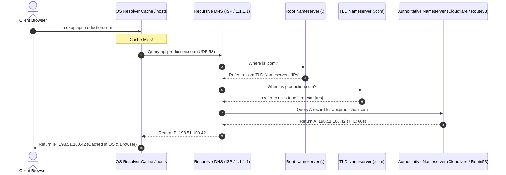

# Step 1: DNS Resolution & Edge Routing

Master the multi-tier Domain Name System (DNS) lookup hierarchy, recursive resolution algorithms, Anycast BGP routing, and GeoDNS edge steering.

---

## 1. What Is It?
**DNS (Domain Name System)** is the globally distributed, hierarchical naming system that translates human-readable hostnames (e.g., `api.production.com`) into machine-routable IP addresses (`198.51.100.42` for IPv4 or `2606:4700:4700::1111` for IPv6).

---

## 2. Why Does It Exist?
Network routing hardware (routers and switches) operates exclusively on fixed-length IP addresses. Humans, however, require memorable alphanumeric domain names.

Additionally, modern edge networks leverage DNS as an **intelligent load-balancing and routing layer**, returning different IP addresses based on client geographic proximity, network health, and Anycast BGP topologies.

---

## 3. Mental Model: The 5-Layer DNS Resolution Hierarchy



---

## 4. How Does It Work: DNS Record Types & Production Usage

| Record Type | Target Value | Production Backend Use Case |
|---|---|---|
| **`A`** | 32-bit IPv4 Address (`198.51.100.42`) | Direct server or Layer 4 Load Balancer mapping. |
| **`AAAA`** | 128-bit IPv6 Address | Modern IPv6 dual-stack ingress. |
| **`CNAME`** | Canonical Domain Name (`ingress.aws.com`) | Aliasing subdomains to CDN or AWS ALB hostnames. |
| **`ALIAS / ANAME`** | Virtual alias at Apex/Root (`production.com`)| Root domain mapping to CDN without breaking RFC CNAME rules. |
| **`TXT`** | Arbitrary Text String | SPF, DKIM email validation, and TLS domain verification. |
| **`SRV`** | Host, Port, Priority, Weight | Microservice discovery (Consul, Kubernetes DNS). |

---

## 5. Internal Working: Anycast BGP & GeoDNS

Modern CDNs (Cloudflare, AWS CloudFront) do not route users to a single physical data center. Instead, they utilize **Anycast BGP (Border Gateway Protocol)**:
1. The identical IP address (`198.51.100.42`) is announced from 300+ edge data centers worldwide via BGP routers.
2. The client's ISP router automatically forwards packets to the topologically closest edge point-of-presence (PoP) using shortest AS-Path routing.
3. This achieves $< 10\text{ms}$ DNS and TLS handshake latency globally.

---

## 6. Example & Production Java 21 Code

Custom DNS resolution with caching, retry logic, and fallback in Java 21:

```java
package com.backend.lifecycle.dns;

import java.net.InetAddress;
import java.net.UnknownHostException;
import java.time.Duration;
import java.time.Instant;
import java.util.Arrays;
import java.util.List;
import java.util.concurrent.ConcurrentHashMap;

public class ResilientDnsResolver {

    private record CachedDnsEntry(List<InetAddress> addresses, Instant expiresAt) {
        boolean isExpired() { return Instant.now().isAfter(expiresAt); }
    }

    private final ConcurrentHashMap<String, CachedDnsEntry> localCache = new ConcurrentHashMap<>();
    private final Duration ttl = Duration.ofSeconds(30);

    public List<InetAddress> resolve(String hostname) throws UnknownHostException {
        CachedDnsEntry cached = localCache.get(hostname);
        if (cached != null && !cached.isExpired()) {
            return cached.addresses();
        }

        try {
            // Leverage OS resolver via JVM InetAddress
            InetAddress[] resolved = InetAddress.getAllByName(hostname);
            List<InetAddress> addressList = Arrays.asList(resolved);
            localCache.put(hostname, new CachedDnsEntry(addressList, Instant.now().plus(ttl)));
            return addressList;
        } catch (UnknownHostException e) {
            // Serve stale cache if available during DNS outages (Stale-While-Revalidate pattern)
            if (cached != null) {
                return cached.addresses();
            }
            throw e;
        }
    }
}
```

---

## 7. Performance Characteristics
- **DNS Cold Lookup**: $\sim 50 - 250\text{ms}$ (traversing Root, TLD, and Authoritative nameservers across UDP).
- **DNS Cached Lookup**: $< 1\text{ms}$ in browser memory or OS `systemd-resolved` cache.
- **JVM DNS TTL Caching**: By default, the JVM caches DNS lookups forever (`networkaddress.cache.ttl=-1`) if a SecurityManager is present, or for 30s. In containers, set `-Dnetworkaddress.cache.ttl=10` to avoid pinning stale IP addresses during blue/green deployments.

---

## 8. Failure Scenarios & Edge Cases
- **DNS Pinning / Blackhole after Failover**: If an infrastructure team flips DNS during an active outage, clients honoring high TTLs ($86400\text{s}$) continue sending traffic to dead servers for 24 hours. Always set TTL to $60\text{s}$ prior to migrations.
- **DNS Amplification Attack**: Attackers send spoofed UDP queries to open recursive resolvers with small requests that generate massive responses directed at the victim.

---

## 9. Observability (Logs, Metrics, Traces)
```text
# DNS Resolution Duration in Microseconds
dns_lookup_duration_seconds{host="api.production.com", status="SUCCESS"} 0.012
dns_cache_hit_ratio 0.984
```

---

## 10. Debugging & Troubleshooting
1. **Trace Full Recursive DNS Resolution via `dig`**:
   ```bash
   dig +trace +nodnssec api.production.com
   ```
2. **Inspect Direct Authoritative Server Query**:
   ```bash
   dig @ns1.cloudflare.com api.production.com A
   ```

---

## 11. Scaling Considerations
- Enable **EDNS Client Subnet (ECS)** so authoritative nameservers receive the client's subnet rather than the recursive resolver's IP, ensuring accurate geographic load balancing.

---

## 12. Architectural Trade-offs
| Routing Strategy | Latency Optimization | Failover Speed | Cost |
|---|---|---|---|
| **Static DNS A-Record** | Lowest | Worst (Subject to TTL) | Free |
| **GeoDNS with Low TTL (60s)**| Moderate | Fast (60s window) | Low |
| **Anycast BGP Routing** | Best ($< 10\text{ms}$) | Instant (Sub-second BGP flip)| High |

---

## 13. When to Use
- Use **Anycast BGP DNS** for public API edge ingress.
- Use **CoreDNS / Consul SRV records** for internal Kubernetes microservice discovery.

---

## 14. When NOT to Use
- Never hardcode IP addresses in microservice client configurations.

---

## 15. SDE2 / Senior Interview Questions & Answers
### Q1: When a user types `https://api.company.com` in their browser, what is the exact sequence of DNS caching and resolution steps before the first TCP SYN packet is sent?
<details>
<summary>Reveal Answer</summary>

**Answer**:
1. **Browser Cache**: Browser checks internal DNS cache (Chrome: `chrome://net-internals/#dns`).
2. **OS Resolver & Hosts File**: OS checks local `/etc/hosts` and local DNS daemon cache (`systemd-resolved` / macOS `mDNSResponder`).
3. **Recursive DNS Resolver**: Query dispatched over UDP port 53 to configured recursive resolver (ISP or `8.8.8.8`).
4. **Root Nameserver (`.`)**: If uncached, recursive resolver queries Root nameserver, receiving NS referral for `.com`.
5. **TLD Nameserver (`.com`)**: Recursive resolver queries `.com` TLD server, receiving NS referral for `company.com` authoritative nameservers.
6. **Authoritative Nameserver**: Recursive resolver queries authoritative server (`ns1.awsdns.com`), receiving the `A` record containing the target IP.
7. **Return & Cache**: Recursive resolver caches the record according to TTL and returns IP to OS $\to$ Browser.
</details>

---

## 16. Practical Exercise
1. Run `dig +trace google.com` in your terminal.
2. Identify the exact Root, TLD, and Authoritative nameserver IP addresses returned in each hop.

---

## 17. Quick Revision Summary
- DNS traverses **Browser $\to$ OS $\to$ Recursive $\to$ Root $\to$ TLD $\to$ Authoritative**.
- **Anycast BGP** routes packets to the topologically closest edge data center.
- Always tune **JVM DNS TTL (`networkaddress.cache.ttl=10`)** in containerized environments.
