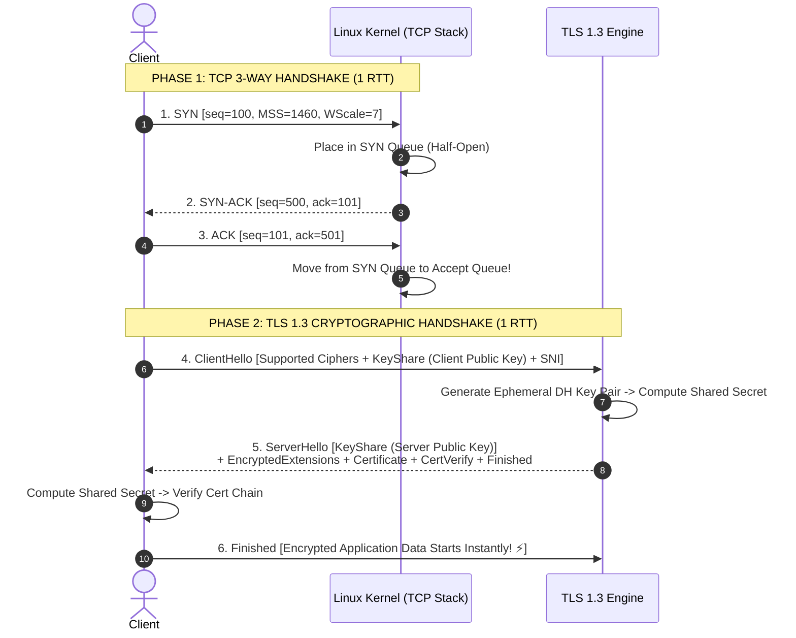
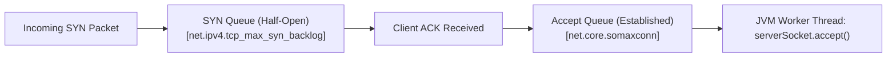

# Step 2 & 3: TCP & TLS 1.3 Handshake Internals

Master kernel socket connection establishment, SYN queues, TCP sequence tracking, TLS 1.2 vs 1.3 cryptographic handshakes, and 0-RTT resumption.

---

## 1. What Is It?
- **TCP 3-Way Handshake**: The Layer 4 transport protocol mechanism that synchronizes sequence numbers, negotiates MSS (Maximum Segment Size), and allocates kernel buffer memory between client and server.
- **TLS 1.3 Handshake**: The Layer 6/7 cryptographic protocol that authenticates server identity, negotiates symmetric session keys via Diffie-Hellman Ephemeral (DHE), and establishes an encrypted channel in **1 RTT**.

---

## 2. Why Does It Exist?
- **TCP**: Raw IP packets are unreliable, unordered, and subject to packet loss. TCP guarantees ordered, lossless stream delivery via sequence numbers and ACK tracking.
- **TLS**: Raw TCP transmits plaintext bytes vulnerable to eavesdropping and man-in-the-middle (MITM) attacks. TLS provides **Confidentiality, Integrity, and Authentication**.

---

## 3. Mental Model: TCP & TLS 1.3 Handshake Flow



---

## 4. How Does It Work: TLS 1.2 vs TLS 1.3 Handshake Latency

| Feature | TLS 1.2 | TLS 1.3 | Performance Gain |
|---|---|---|---|
| **Handshake Round Trips**| **2 RTTs** | **1 RTT** | **50% Latency Reduction** |
| **Resumed Handshake** | 1 RTT | **0-RTT (Early Data)** | **Instant Handshake** |
| **Cipher Suites** | 30+ (Includes weak RSA/CBC)| 5 Modern AEAD Ciphers | Immune to legacy vulnerabilities |
| **Server Certificate** | Transmitted in plaintext | **Fully Encrypted** | Privacy protection (blocks SNI sniffing) |

---

## 5. Internal Working: Linux SYN Queue vs Accept Queue

Inside the Linux kernel network subsystem:
1. **SYN Queue (Incomplete Connection Queue)**: Holds sockets that have received `SYN` and sent `SYN-ACK`, awaiting final `ACK`. Size governed by `net.ipv4.tcp_max_syn_backlog`.
2. **Accept Queue (Completed Connection Queue)**: Holds fully established connections waiting for the application thread to call `accept()`. Size governed by `net.core.somaxconn` and the backlog parameter in `ServerSocket.bind()`.



---

## 6. Example & Production Java 21 Code

Hardening TLS 1.3 and TCP socket options in an embedded server:

```java
package com.backend.lifecycle.transport;

import javax.net.ssl.*;
import java.io.InputStream;
import java.net.InetSocketAddress;
import java.net.ServerSocket;
import java.net.Socket;
import java.security.KeyStore;
import java.security.SecureRandom;

public class HardenedTlsServer {

    public static SSLServerSocket createSecureServer(int port, KeyStore keyStore, char[] password) throws Exception {
        // 1. Initialize KeyManagerFactory with Private Key
        KeyManagerFactory kmf = KeyManagerFactory.getInstance(KeyManagerFactory.getDefaultAlgorithm());
        kmf.init(keyStore, password);

        // 2. Enforce TLS 1.3 Context
        SSLContext sslContext = SSLContext.getInstance("TLSv1.3");
        sslContext.init(kmf.getKeyManagers(), null, new SecureRandom());

        SSLServerSocketFactory ssf = sslContext.getServerSocketFactory();
        SSLServerSocket serverSocket = (SSLServerSocket) ssf.createServerSocket();

        // 3. Configure OS Socket Backlog & Buffer Options
        serverSocket.setReuseAddress(true); // SO_REUSEADDR
        serverSocket.bind(new InetSocketAddress("0.0.0.0", port), 1024); // Backlog = 1024

        // 4. Restrict to TLS 1.3 Only & Secure AEAD Ciphers
        serverSocket.setEnabledProtocols(new String[]{"TLSv1.3"});
        serverSocket.setEnabledCipherSuites(new String[]{
            "TLS_AES_256_GCM_SHA384",
            "TLS_AES_128_GCM_SHA256",
            "TLS_CHACHA20_POLY1305_SHA256"
        });

        return serverSocket;
    }
}
```

---

## 7. Performance Characteristics
- **TLS 1.3 Connection Time**: $1\text{ RTT TCP} + 1\text{ RTT TLS} = 2\text{ RTTs}$ total ($\sim 20 - 60\text{ms}$ on typical mobile networks).
- **TCP Fast Open (TFO)**: Allows data to be sent inside the `SYN` packet itself on subsequent connections, shaving an additional 1 RTT.

---

## 8. Failure Scenarios & Edge Cases
- **SYN Flood Attack**: Malicious botnets send millions of `SYN` packets without returning `ACKs`, filling the SYN Queue and causing the kernel to drop legitimate connections.
  - **Mitigation**: Enable **SYN Cookies** (`net.ipv4.tcp_syncookies = 1`), encoding connection state directly into the `SYN-ACK` sequence number without allocating kernel memory.
- **Accept Queue Overflow**: When backend JVM threads are blocked (e.g., long GC pause or thread pool exhaustion), the Accept Queue fills up. The kernel drops incoming ACKs (`TCPBacklogDrop`).

---

## 9. Observability (Logs, Metrics, Traces)
```text
# Kernel TCP Metrics
node_netstat_Tcp_ActiveOpens 120400
node_netstat_TcpExt_SyncookiesSent 0
node_netstat_TcpExt_ListenOverflows 0   <-- Must be 0! Spikes indicate JVM thread stalling!
```

---

## 10. Debugging & Troubleshooting
1. **Inspect TCP Queue Sizes**:
   ```bash
   ss -lnt '( sport = :8080 )'
   # Look at: Send-Q (Max Backlog) and Recv-Q (Current un-accepted connections)
   ```
2. **Verify TLS Handshake via OpenSSL**:
   ```bash
   openssl s_client -connect api.production.com:443 -tls1_3
   ```

---

## 11. Scaling Considerations
- Tune Linux kernel parameters in `/etc/sysctl.conf`:
  ```ini
  net.core.somaxconn = 4096
  net.ipv4.tcp_max_syn_backlog = 8192
  net.ipv4.tcp_tw_reuse = 1
  ```

---

## 12. Architectural Trade-offs
| Handshake Mode | Security Level | Handshake Latency | Replay Attack Vulnerability |
|---|---|---|---|
| **TLS 1.2 Full** | High | 2 RTTs | None |
| **TLS 1.3 1-RTT** | Highest | 1 RTT | None |
| **TLS 1.3 0-RTT** | Highest | **0 RTT** | **Vulnerable on non-idempotent POST!**|

---

## 13. When to Use
- Always mandate **TLS 1.3** across all public API edge load balancers and inter-service mesh mTLS.

---

## 14. When NOT to Use
- Never enable **TLS 1.3 0-RTT Early Data** on state-mutating endpoints (`POST /charges`) without replay defense tokens.

---

## 15. SDE2 / Senior Interview Questions & Answers
### Q1: Why is TLS 1.3 0-RTT (Early Data) dangerous for financial transactions, and how do attackers exploit it?
<details>
<summary>Reveal Answer</summary>

**Answer**:
In TLS 1.3 0-RTT resumption, the client sends encrypted application data inside the very first packet along with the `ClientHello`, before the server returns the `ServerHello`.

Because this early data is encrypted using a previously stored Pre-Shared Key (PSK), an on-path network attacker can **capture the raw 0-RTT packet and retransmit it 100 times**. The server will successfully decrypt and execute all 100 duplicate requests (e.g., executing 100 identical balance transfers).

**Rule**: 0-RTT should only be enabled for strictly safe, idempotent requests (`GET /profile`) or paired with single-use anti-replay nonce tracking.
</details>

---

## 16. Practical Exercise
1. Run `openssl s_client` against an enterprise website and inspect the negotiated Cipher Suite, Protocol version, and Certificate Chain.
2. Check the kernel listen overflow counters on your local machine using `netstat -s | grep -i listen`.

---

## 17. Quick Revision Summary
- TCP Handshake = **SYN $\to$ SYN-ACK $\to$ ACK** (SYN Queue $\to$ Accept Queue).
- TLS 1.3 cuts handshake latency in half (**1 RTT vs 2 RTTs in TLS 1.2**).
- Enable **SYN Cookies** and tune **`somaxconn`** to withstand connection spikes.
