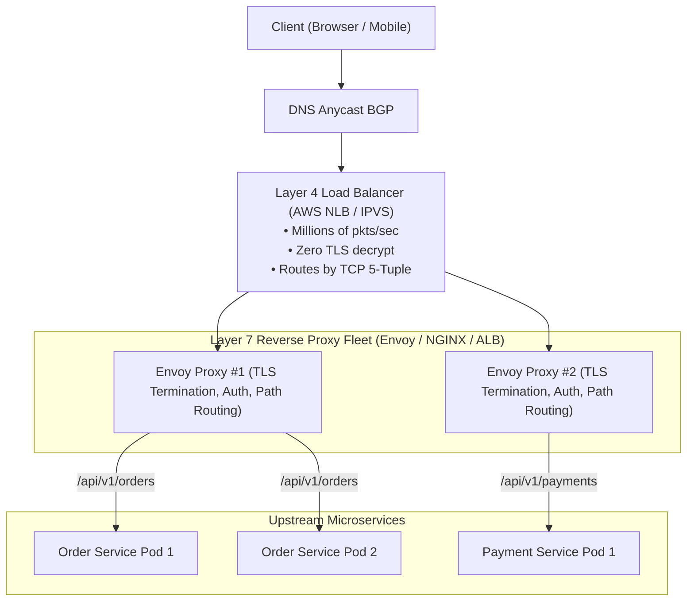

# Step 5: Load Balancing & Reverse Proxies (L4 vs L7)

Master Layer 4 transport load balancing, Layer 7 reverse proxy routing, TLS termination, health checking algorithms, and Maglev consistent hashing.

---

## 1. What Is It?
- **Layer 4 Load Balancer (L4)**: Operates at the transport layer (TCP/UDP). Routes raw packets based solely on IP addresses and TCP ports without inspecting or decrypting HTTP payloads (e.g., AWS NLB, Linux IPVS).
- **Layer 7 Reverse Proxy / Load Balancer (L7)**: Operates at the application layer (HTTP/2, gRPC). Terminates TLS, parses HTTP headers, inspects JSON payloads, and routes traffic based on URL paths or cookie affinity (e.g., Envoy, NGINX, AWS ALB).

---

## 2. Why Does It Exist?
A single backend instance cannot handle millions of concurrent connections or withstand hardware crashes. Load balancers distribute traffic across pools of healthy servers, eliminate single points of failure, and provide zero-downtime blue/green deployments.

---

## 3. Mental Model: L4 vs L7 Load Balancing Architecture



---

## 4. How Does It Work: Load Balancing Algorithms

| Algorithm | Mechanism | Best Use Case |
|---|---|---|
| **Round Robin** | Cycles sequentially through instances | Identical hardware with uniform request latency |
| **Weighted Round Robin** | Allocates proportionally based on node capacity | Heterogeneous server clusters |
| **Least Connections** | Routes to the instance with fewest active TCP sockets| Long-lived requests or highly variable workloads |
| **Peak EWMA** | Routes based on Exponentially Weighted Moving Average of latency | Microservices with fluctuating tail latency |
| **Consistent Hashing (Maglev)**| Hashes request key (User ID) to consistent ring | Stateful caches or sticky session affinities |

---

## 5. Internal Working: TLS Termination at the Edge

1. Client negotiates TLS with Envoy Reverse Proxy.
2. Envoy decrypts HTTPS, validates HTTP headers, and attaches `X-Forwarded-For` (Client IP) and `X-Forwarded-Proto: https`.
3. Envoy routes plain HTTP/2 or lightweight mTLS over private VPC network pipelines to internal backend pods, relieving application containers from CPU-heavy asymmetric cryptography.

---

## 6. Example & Production Java 21 Code

Implementing a Weighted Round-Robin and Active Health Check Load Balancer in Java 21:

```java
package com.backend.lifecycle.loadbalancer;

import java.net.URI;
import java.net.http.HttpClient;
import java.net.http.HttpRequest;
import java.net.http.HttpResponse;
import java.time.Duration;
import java.util.List;
import java.util.concurrent.CopyOnWriteArrayList;
import java.util.concurrent.atomic.AtomicInteger;

public class SmoothWeightedRoundRobinLb {

    public record BackendNode(String host, int weight, AtomicInteger currentWeight, boolean healthy) {
        public BackendNode(String host, int weight) {
            this(host, weight, new AtomicInteger(0), true);
        }
    }

    private final List<BackendNode> nodes = new CopyOnWriteArrayList<>();

    public void registerNode(String host, int weight) {
        nodes.add(new BackendNode(host, weight));
    }

    // NGINX Smooth Weighted Round-Robin Algorithm
    public synchronized BackendNode selectNode() {
        if (nodes.isEmpty()) return null;

        int totalWeight = 0;
        BackendNode best = null;

        for (BackendNode node : nodes) {
            if (!node.healthy()) continue;

            int current = node.currentWeight().addAndGet(node.weight());
            totalWeight += node.weight();

            if (best == null || current > best.currentWeight().get()) {
                best = node;
            }
        }

        if (best != null) {
            best.currentWeight().addAndGet(-totalWeight);
        }

        return best;
    }
}
```

---

## 7. Performance Characteristics
- **L4 Proxy Throughput**: Handles millions of requests per second with negligible CPU usage using Linux eBPF / XDP.
- **L7 Proxy Throughput**: Handles tens of thousands of requests per second per core due to HTTP framing and TLS decryption overhead.

---

## 8. Failure Scenarios & Edge Cases
- **The "Flapping Server" Black Hole**: An overloaded backend node passes a shallow health check (`/health` returns 200), receives a flood of traffic, crashes, fails the health check, restarts, and repeats.
  - **Mitigation**: Implement **Exponential Backoff on Health Checks** and require $N$ consecutive successes before returning a node to the active rotation.

---

## 9. Observability (Logs, Metrics, Traces)
```text
# Envoy Upstream Cluster Metrics
envoy_cluster_upstream_cx_active{cluster="order_service"} 420
envoy_cluster_upstream_rq_time_bucket{le="25.0"} 89000
envoy_cluster_health_check_failure{cluster="order_service"} 0
```

---

## 10. Debugging & Troubleshooting
1. **Verify Upstream Routing via Envoy Admin Interface**:
   ```bash
   curl http://localhost:15000/clusters | grep order_service
   ```

---

## 11. Scaling Considerations
- Place an **L4 Load Balancer (AWS NLB)** in front of an autoscaled fleet of **L7 Envoy Proxies**, which in turn route to application microservices.

---

## 12. Architectural Trade-offs
| Dimension | Layer 4 (L4) | Layer 7 (L7) |
|---|---|---|
| **Inspection Capability** | IP & Port only | Headers, Cookies, JSON Body |
| **Throughput & Speed** | Extremely High ($> 1M\text{ RPS}$) | Moderate ($50K - 100K\text{ RPS}$) |
| **Smart Routing (Path/Auth)**| None | Full support |

---

## 13. When to Use
- **L4**: Gaming servers, raw TCP streaming, high-throughput ingress for L7 proxy fleets.
- **L7**: REST APIs, microservice routing, gRPC services, TLS offloading.

---

## 14. When NOT to Use
- Do not terminate TLS at L4 if you require path-based HTTP routing.

---

## 15. SDE2 / Senior Interview Questions & Answers
### Q1: What is the difference between Layer 4 and Layer 7 load balancing, and why do large architectures combine both?
<details>
<summary>Reveal Answer</summary>

**Answer**:
- **Layer 4**: Operates at the TCP layer without decrypting TLS. It forwards raw IP packets based on the 5-tuple (source IP/port, dest IP/port, protocol). It is blazing fast and handles millions of packets per second.
- **Layer 7**: Terminates TLS and parses HTTP frames. It makes intelligent routing decisions based on URL paths (`/orders` vs `/payments`), HTTP headers, and cookies.

**Why Combine Both**:
Large platforms (Uber, Netflix, Stripe) place an L4 balancer (AWS NLB or Maglev) at the edge to ingest multi-gigabit traffic and distribute connections across a scalable fleet of L7 Envoy proxies, which perform TLS termination, authentication, rate limiting, and microservice routing.
</details>

---

## 16. Practical Exercise
1. Run an Envoy proxy container locally configured with a weighted cluster balancing across two mock backend servers.
2. Fire 100 requests and verify the distribution matches the configured weights.

---

## 17. Quick Revision Summary
- **L4 routes TCP packets; L7 routes HTTP requests**.
- **TLS Termination** at L7 offloads compute from backend application pods.
- Combine **L4 at ingress with L7 Envoy fleets** for maximum scale and routing intelligence.
