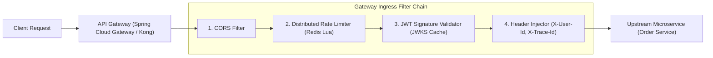

# Step 6: API Gateway, Auth & Distributed Rate Limiting

Master edge API Gateway filters, stateless JWT validation, distributed rate limiting algorithms (Token Bucket, Sliding Window Redis Lua), and CORS enforcement.

---

## 1. What Is It?
An **API Gateway** is the single entry point for all external client requests into a microservice ecosystem, responsible for:
1. **Authentication & Authorization**: Validating JWT signatures and extracting user claims.
2. **Distributed Rate Limiting**: Protecting backend systems from denial-of-service and abuse.
3. **Request Transformation & Enrichment**: Injecting internal headers (`X-User-Id`, `X-Tenant-Id`).
4. **CORS Enforcement & SSL Termination**.

---

## 2. Why Does It Exist?
Without an API Gateway, every individual microservice must reimplement JWT verification, rate limiting, IP whitelisting, and CORS headers.

Centralizing these cross-cutting concerns at the gateway creates a unified security perimeter and simplifies backend service logic.

---

## 3. Mental Model: API Gateway Filter Pipeline



---

## 4. How Does It Work: Rate Limiting Algorithms

| Algorithm | Mechanism | Memory Footprint | Burst Handling |
|---|---|---|---|
| **Token Bucket** | Tokens refill at fixed rate; requests consume tokens | 2 keys per user (tokens, timestamp) | **Excellent (Allows bursts up to capacity)** |
| **Leaky Bucket** | Requests queue and drain at a constant rate | Queue data structure | Smooths traffic; drops on full queue |
| **Fixed Window** | Counter reset every fixed minute window | 1 counter per window | **Suffers from 2x burst at window boundary! 💥** |
| **Sliding Window Counter**| Blends previous window count with current window | 2 counters | Accurate, memory-efficient, no 2x burst ✅ |

---

## 5. Internal Working: Atomic Sliding Window in Redis via Lua Script

To prevent race conditions across distributed gateway instances, rate limiting logic must execute as an atomic Lua script inside Redis:

```lua
-- KEYS[1]: User Rate Limit Key (e.g., "ratelimit:user_123")
-- ARGV[1]: Current Epoch Milliseconds
-- ARGV[2]: Window Size in Milliseconds (e.g., 60000)
-- ARGV[3]: Max Allowed Requests in Window (e.g., 100)

local key = KEYS[1]
local now = tonumber(ARGV[1])
local window = tonumber(ARGV[2])
local limit = tonumber(ARGV[3])
local clearBefore = now - window

-- 1. Remove timestamps older than the active sliding window
redis.call('ZREMRANGEBYSCORE', key, '-inf', clearBefore)

-- 2. Count current elements in active window
local currentRequests = redis.call('ZCARD', key)

if currentRequests < limit then
    -- 3. Add current timestamp with unique member ID
    redis.call('ZADD', key, now, now .. '-' .. redis.call('INCR', 'rl:seq'))
    redis.call('PEXPIRE', key, window)
    return 1 -- ALLOWED
else
    return 0 -- RATE LIMITED (429)
end
```

---

## 6. Example & Production Java 21 Code

Implementing a high-performance, non-blocking Gateway Rate Limiting Filter in Spring Cloud Gateway:

```java
package com.backend.lifecycle.gateway;

import org.springframework.core.io.buffer.DataBuffer;
import org.springframework.data.redis.core.ReactiveStringRedisTemplate;
import org.springframework.data.redis.core.script.DefaultRedisScript;
import org.springframework.http.HttpStatus;
import org.springframework.http.MediaType;
import org.springframework.stereotype.Component;
import org.springframework.web.server.ServerWebExchange;
import org.springframework.web.server.WebFilter;
import org.springframework.web.server.WebFilterChain;
import reactor.core.publisher.Mono;

import java.nio.charset.StandardCharsets;
import java.time.Instant;
import java.util.List;

@Component
public class DistributedRateLimitingFilter implements WebFilter {

    private final ReactiveStringRedisTemplate redisTemplate;
    private final DefaultRedisScript<Long> rateLimitScript;

    public DistributedRateLimitingFilter(ReactiveStringRedisTemplate redisTemplate, DefaultRedisScript<Long> rateLimitScript) {
        this.redisTemplate = redisTemplate;
        this.rateLimitScript = rateLimitScript;
    }

    @Override
    public Mono<Void> filter(ServerWebExchange exchange, WebFilterChain chain) {
        String apiKey = exchange.getRequest().getHeaders().getFirst("X-API-Key");
        if (apiKey == null || apiKey.isBlank()) {
            apiKey = exchange.getRequest().getRemoteAddress().getAddress().getHostAddress();
        }

        String redisKey = "ratelimit:" + apiKey;
        long now = Instant.now().toEpochMilli();
        long windowMs = 60_000L; // 1 minute
        long maxLimit = 100L;    // 100 requests / min

        return redisTemplate.execute(
            rateLimitScript,
            List.of(redisKey),
            List.of(String.valueOf(now), String.valueOf(windowMs), String.valueOf(maxLimit))
        ).next().flatMap(allowed -> {
            if (allowed == 1L) {
                return chain.filter(exchange);
            } else {
                exchange.getResponse().setStatusCode(HttpStatus.TOO_MANY_REQUESTS);
                exchange.getResponse().getHeaders().setContentType(MediaType.APPLICATION_JSON);
                exchange.getResponse().getHeaders().set("Retry-After", "60");

                byte[] bytes = "{"error": "RATE_LIMIT_EXCEEDED", "message": "Too many requests. Please retry in 60s."}".getBytes(StandardCharsets.UTF_8);
                DataBuffer buffer = exchange.getResponse().bufferFactory().wrap(bytes);
                return exchange.getResponse().writeWith(Mono.just(buffer));
            }
        });
    }
}
```

---

## 7. Performance Characteristics
- **JWT Verification Latency**: $\sim 50 - 150\text{ microseconds}$ using cached public keys from the identity provider's JWKS endpoint.
- **Redis Rate Limit Overhead**: $\sim 0.5 - 1.5\text{ms}$ network round-trip per request to Redis cluster.

---

## 8. Failure Scenarios & Edge Cases
- **Redis Outage Halts Gateway Traffic**: If Redis crashes, a strict rate limiter throws errors, blocking 100% of traffic.
  - **Mitigation**: Implement **Fail-Open Strategy** in circuit breaker: if Redis times out ($> 50\text{ms}$), log a warning and allow the request through.

---

## 9. Observability (Logs, Metrics, Traces)
```text
# Rate Limiting & Auth Rejection Metrics
gateway_requests_total{route="orders", status="200"} 940200
gateway_rate_limited_total{client="app_mobile"} 142
gateway_auth_failed_total{reason="EXPIRED_JWT"} 85
```

---

## 10. Debugging & Troubleshooting
1. **Inspect Rate Limit Key State in Redis**:
   ```bash
   redis-cli ZRANGE "ratelimit:user_123" 0 -1 WITHSCORES
   ```

---

## 11. Scaling Considerations
- Cache **JWKS Public Signing Keys** in local memory for 24 hours with background refresh to eliminate external HTTP calls to Auth0/Keycloak on every incoming request.

---

## 12. Architectural Trade-offs
| Auth Strategy | Gateway CPU Load | Token Revocation Speed | Inter-Service Coupling |
|---|---|---|---|
| **Stateless JWT** | Moderate (Crypto verify)| Slow (Until expiry/blacklist)| Zero |
| **Opaque Session Tokens**| Low | Instant (Delete in Redis) | High (DB lookup on every call)|

---

## 13. When to Use
- Use **Stateless JWTs verified at the API Gateway** with user context injected via downstream HTTP headers (`X-User-Id`).

---

## 14. When NOT to Use
- Do not let backend microservices directly communicate with public clients without traversing the Gateway trust boundary.

---

## 15. SDE2 / Senior Interview Questions & Answers
### Q1: How does a Sliding Window Log rate limiter prevent the "double limit burst" flaw of Fixed Window rate limiters?
<details>
<summary>Reveal Answer</summary>

**Answer**:
**Fixed Window Flaw**:
In a fixed window of 100 req/min from 12:00 to 12:01:
- A user sends 100 requests at 12:00:59.
- The window resets at 12:01:00.
- The user sends another 100 requests at 12:01:01.
- In a 2-second window (12:00:59 to 12:01:01), the user processed **200 requests (2x the allowed limit)**, crashing backend services.

**Sliding Window Fix**:
The Sliding Window logs exact timestamps in a Redis Sorted Set (`ZADD`). For any incoming request at time $T$, it counts only requests in the rolling interval $[T - 60\text{s}, T]$ using `ZREMRANGEBYSCORE` and `ZCARD`. Any burst spanning the boundary is accurately detected and rejected.
</details>

---

## 16. Practical Exercise
1. Run a Redis instance locally.
2. Execute the Redis Sliding Window Lua script using `redis-cli --eval` and observe timestamps entering the sorted set.

---

## 17. Quick Revision Summary
- API Gateways centralize **Auth, Rate Limiting, CORS, and Routing**.
- **Sliding Window Redis Lua scripts** provide atomic, accurate rate limiting without race conditions.
- Always configure **Fail-Open** fallbacks for rate limiters during Redis outages.
