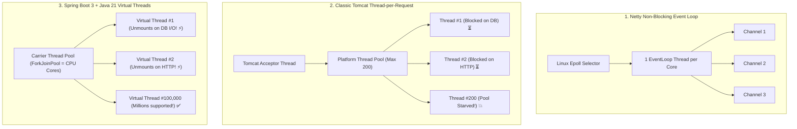
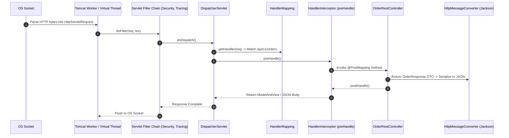

# Step 7 & 8: App Server Execution & Framework Dispatch

Master Linux epoll event loops, Netty vs Tomcat worker threads, Java 21 Virtual Threads, Spring `DispatcherServlet`, and filter/interceptor pipelines.

---

## 1. What Is It?
- **Application Server (Tomcat / Netty)**: The runtime container that reads HTTP bytes from the OS TCP socket buffer, parses them into Java request objects (`HttpServletRequest` or Netty `HttpRequest`), and assigns execution threads.
- **Framework Dispatcher (`DispatcherServlet`)**: The central entry point in Spring MVC that routes requests through **Filters $\to$ HandlerInterceptors $\to$ Controllers $\to$ MessageConverters**.

---

## 2. Why Does It Exist?
Application frameworks abstract low-level socket programming and byte stream parsing.

Understanding the internal thread model and dispatch pipeline is essential for diagnosing thread pool exhaustion, request contention, and memory leaks.

---

## 3. Mental Model: Netty Event Loop vs Tomcat Thread-per-Request vs Virtual Threads



---

## 4. How Does It Work: Spring MVC Dispatch Pipeline



---

## 5. Internal Working: Thread Unmounting in Java 21 Virtual Threads

When code running on a Virtual Thread executes a blocking operation (e.g., `socket.read()` or `HikariCP.getConnection()`):
1. The JVM intercepts the blocking system call inside `java.base`.
2. The Virtual Thread **unmounts** from its underlying OS Carrier Thread (`ForkJoinWorkerThread`).
3. The Virtual Thread stack frames are stored in the JVM heap.
4. The OS Carrier Thread immediately picks up another runnable Virtual Thread.
5. When the OS kernel signals that socket data is ready via epoll, the JVM re-mounts the Virtual Thread onto an available carrier thread.

---

## 6. Example & Production Java 21 Code

Enabling Virtual Threads in Spring Boot 3 and implementing custom tracing interceptors:

```java
package com.backend.lifecycle.dispatch;

import jakarta.servlet.http.HttpServletRequest;
import jakarta.servlet.http.HttpServletResponse;
import org.springframework.boot.autoconfigure.task.TaskExecutionAutoConfiguration;
import org.springframework.context.annotation.Bean;
import org.springframework.context.annotation.Configuration;
import org.springframework.core.task.AsyncTaskExecutor;
import org.springframework.core.task.support.TaskExecutorAdapter;
import org.springframework.web.servlet.HandlerInterceptor;
import org.springframework.web.servlet.config.annotation.InterceptorRegistry;
import org.springframework.web.servlet.config.annotation.WebMvcConfigurer;

import java.util.concurrent.Executors;

@Configuration
public class WebDispatchConfig implements WebMvcConfigurer {

    // 1. Configure Spring Boot to use Java 21 Virtual Threads for all Web Requests
    @Bean(TaskExecutionAutoConfiguration.APPLICATION_TASK_EXECUTOR_BEAN_NAME)
    public AsyncTaskExecutor asyncTaskExecutor() {
        return new TaskExecutorAdapter(Executors.newVirtualThreadPerTaskExecutor());
    }

    // 2. Register Request Audit & Tracing Interceptor
    @Override
    public void addInterceptors(InterceptorRegistry registry) {
        registry.addInterceptor(new RequestTimingInterceptor());
    }

    public static class RequestTimingInterceptor implements HandlerInterceptor {
        private static final String START_TIME = "startTime";

        @Override
        public boolean preHandle(HttpServletRequest request, HttpServletResponse response, Object handler) {
            request.setAttribute(START_TIME, System.nanoTime());
            return true; // Continue dispatch
        }

        @Override
        public void afterCompletion(HttpServletRequest request, HttpServletResponse response, Object handler, Exception ex) {
            Long startTime = (Long) request.getAttribute(START_TIME);
            if (startTime != null) {
                long durationMicros = (System.nanoTime() - startTime) / 1000;
                response.setHeader("X-Response-Time-Micros", String.valueOf(durationMicros));
            }
        }
    }
}
```

---

## 7. Performance Characteristics
- **Virtual Thread Concurrency**: A single Spring Boot server can sustain **100,000+ concurrent I/O-bound requests** on a 4-core, 4GB container with negligible memory footprint ($\sim 1	ext{KB}$ per virtual thread stack vs $1	ext{MB}$ for platform threads).
- **DispatcherServlet Lookup**: Route matching via `RequestMappingHandlerMapping` uses a compiled radix tree taking $< 5	ext{ microseconds}$.

---

## 8. Failure Scenarios & Edge Cases
- **Thread Pinning in Virtual Threads**: If code synchronizes on a monitor lock (`synchronized(lock)`) or executes native JNI calls while blocking, the Virtual Thread **pins** the underlying OS Carrier Thread, preventing it from executing other virtual threads.
  - **Mitigation**: Replace `synchronized` with `java.util.concurrent.locks.ReentrantLock`.

---

## 9. Observability (Logs, Metrics, Traces)
```text
# Tomcat & Virtual Thread Metrics
tomcat_threads_busy 42
jvm_threads_virtual_active 12450
jvm_threads_virtual_pinned_total 0   <-- Must be 0!
```

---

## 10. Debugging & Troubleshooting
1. **Detect Virtual Thread Pinning via JVM Flag**:
   ```bash
   java -Djdk.tracePinnedThreads=full -jar app.jar
   ```

---

## 11. Scaling Considerations
- In Spring Boot 3.x with Java 21, set `spring.threads.virtual.enabled=true` to eliminate thread pool sizing bottlenecks entirely.

---

## 12. Architectural Trade-offs
| Architecture | Throughput on I/O | Memory per Connection | Code Style |
|---|---|---|---|
| **Tomcat Platform Threads** | Limited by Max Threads (200)| High ($\sim 1	ext{MB}$) | Simple Synchronous |
| **Reactive Netty (WebFlux)**| High | Low | Complex Async (`Mono/Flux`) |
| **Tomcat + Virtual Threads** | **High** | **Lowest ($\sim 1	ext{KB}$)** | **Simple Synchronous ✅** |

---

## 13. When to Use
- Use **Spring Boot 3 + Virtual Threads** for all modern I/O-bound enterprise web services.

---

## 14. When NOT to Use
- Do not use Virtual Threads for pure CPU-bound mathematical processing (e.g., video transcoding or crypto hashing).

---

## 15. SDE2 / Senior Interview Questions & Answers
### Q1: What is the difference between a Servlet Filter and a Spring HandlerInterceptor?
<details>
<summary>Reveal Answer</summary>

**Answer**:
- **Servlet Filter**: Part of the standard Java Servlet specification (`jakarta.servlet.Filter`). It executes **before** the request reaches Spring's `DispatcherServlet`. It operates on raw `HttpServletRequest` and `HttpServletResponse` objects. Best for security headers, CORS, GZIP decompression, and low-level token extraction.
- **HandlerInterceptor**: Part of the Spring MVC framework (`HandlerInterceptor`). It executes **inside** `DispatcherServlet` after the handler mapping has resolved which controller method will handle the request. It has direct access to the target `Object handler` (Controller method metadata/annotations). Best for fine-grained authorization checks, controller timing metrics, and model post-processing.
</details>

---

## 16. Practical Exercise
1. Run a Spring Boot application with `-Djdk.tracePinnedThreads=short`.
2. Write a mock endpoint containing a `synchronized` block that performs a `Thread.sleep(500)`.
3. Call the endpoint and observe the pinned carrier thread warning printed in your console.

---

## 17. Quick Revision Summary
- `DispatcherServlet` coordinates **Filters $	o$ HandlerMapping $	o$ Interceptors $	o$ Controllers**.
- **Virtual Threads** unmount on blocking I/O, allowing millions of concurrent requests.
- Avoid **synchronized blocks** in Virtual Threads to prevent Carrier Thread Pinning.
