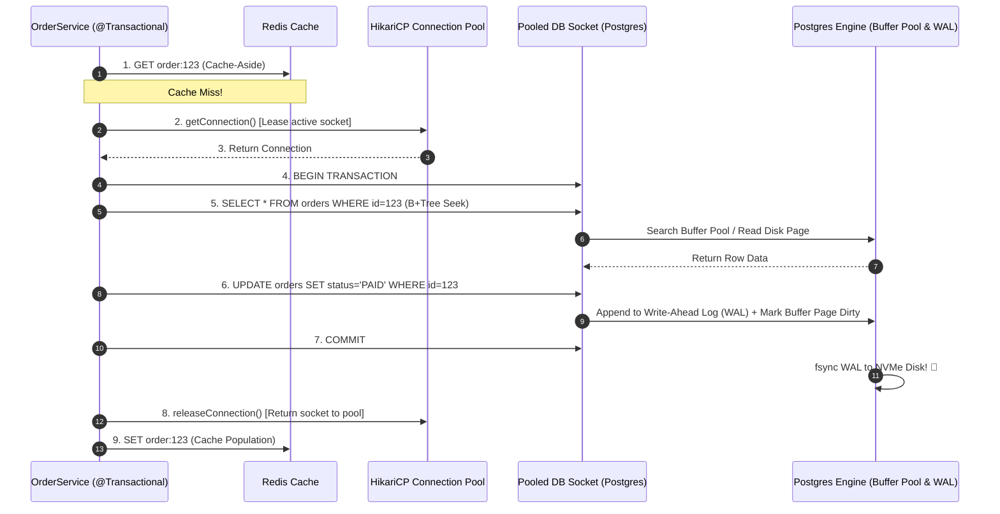

# Step 9 & 10: Domain Logic, Transactions & Database Persistence

Master business validation boundaries, HikariCP connection pool leasing, Spring `@Transactional` AOP proxies, database B+Tree page lookups, and Redis Cache-Aside.

---

## 1. What Is It?
- **Domain Layer**: The core business logic containing domain entities, invariants, and aggregate boundaries.
- **HikariCP Connection Pool**: High-performance JDBC connection pool that leases pre-authenticated TCP database sockets to worker threads.
- **Spring `@Transactional`**: Declarative transaction management wrapping method execution in `BEGIN ... COMMIT / ROLLBACK` using dynamic proxies.
- **Database B+Tree Seek & WAL**: Storing committed data durably in the database Write-Ahead Log (WAL) and memory Buffer Pool.

---

## 2. Why Does It Exist?
- Opening a fresh database TCP connection for every query takes $\sim 20 - 50	ext{ms}$. HikariCP reduces this to $\sim 0.1	ext{ms}$ via pooled sockets.
- Transactions guarantee **ACID properties**, ensuring that partial failures (e.g., deducting money without crediting the recipient) automatically roll back.

---

## 3. Mental Model: Data Layer Execution Pipeline



---

## 4. How Does It Work: HikariCP Sizing Formula

Never guess connection pool sizes! Size your HikariCP pool based on PostgreSQL's benchmark formula:
$$	ext{Pool Size} = (	ext{Core Count} 	imes 2) + 	ext{Effective Spindle Count}$$
On an 8-core database server with an NVMe SSD ($	ext{spindle} = 1$):
$$	ext{Pool Size} = (8 	imes 2) + 1 = 17	ext{ connections}.$$
*A small, saturated pool of 17 connections outperforms an oversized pool of 200 connections because it eliminates CPU context switching and disk queue thrashing.*

---

## 5. Internal Working: Spring `@Transactional` Proxy Traps

When `@Transactional` is placed on a method:
1. Spring generates a CGLIB dynamic proxy wrapping the target bean.
2. The proxy calls `TransactionInterceptor.invoke()`.
3. **The Self-Invocation Bug**: If method `A()` in `OrderService` calls method `B()` (annotated with `@Transactional`) in the **same class**, the call bypasses the proxy (`this.B()`), and **no transaction is started!**

---

## 6. Example & Production Java 21 Code

Hardened transactional domain service with Redis Cache-Aside and HikariCP tuning:

```java
package com.backend.lifecycle.persistence;

import org.springframework.data.jpa.repository.JpaRepository;
import org.springframework.data.redis.core.RedisTemplate;
import org.springframework.stereotype.Service;
import org.springframework.transaction.annotation.Isolation;
import org.springframework.transaction.annotation.Propagation;
import org.springframework.transaction.annotation.Transactional;

import java.time.Duration;
import java.time.Instant;
import java.util.Objects;
import java.util.UUID;

@Service
public class OrderDomainService {

    private final OrderJpaRepository repository;
    private final RedisTemplate<String, OrderDto> redisTemplate;

    public OrderDomainService(OrderJpaRepository repository, RedisTemplate<String, OrderDto> redisTemplate) {
        this.repository = repository;
        this.redisTemplate = redisTemplate;
    }

    // 1. Transactional Mutation Boundary
    @Transactional(propagation = Propagation.REQUIRED, isolation = Isolation.READ_COMMITTED, timeout = 5)
    public OrderDto confirmOrderPayment(UUID orderId, long paidAmountCents) {
        OrderEntity entity = repository.findById(orderId)
            .orElseThrow(() -> new IllegalArgumentException("Order not found: " + orderId));

        // Domain invariant validation
        if (entity.getAmountCents() != paidAmountCents) {
            throw new IllegalStateException("Paid amount does not match order total");
        }

        entity.setStatus("PAID");
        entity.setUpdatedAt(Instant.now());
        repository.save(entity); // Triggers Dirty Checking on Commit

        OrderDto dto = new OrderDto(entity.getId(), entity.getStatus(), entity.getAmountCents());

        // Invalidate or update cache post-commit
        redisTemplate.opsForValue().set("order:" + orderId, dto, Duration.ofMinutes(10));
        return dto;
    }

    public record OrderDto(UUID id, String status, long amountCents) {}
}

interface OrderJpaRepository extends JpaRepository<OrderEntity, UUID> {}

class OrderEntity {
    private UUID id;
    private String status;
    private long amountCents;
    private Instant updatedAt;
    public UUID getId() { return id; }
    public String getStatus() { return status; }
    public void setStatus(String s) { this.status = s; }
    public long getAmountCents() { return amountCents; }
    public void setUpdatedAt(Instant t) { this.updatedAt = t; }
}
```

---

## 7. Performance Characteristics
- **B+Tree Index Page Seek**: $\sim 0.2 - 0.5	ext{ms}$ when the 8KB leaf page resides in the database Buffer Pool (RAM).
- **WAL fsync Latency**: $\sim 0.5 - 2	ext{ms}$ on enterprise NVMe SSD storage.

---

## 8. Failure Scenarios & Edge Cases
- **HikariCP Connection Pool Deadlock**: If a single HTTP request leases Connection #1 inside `@Transactional`, and then invokes an async child task that attempts to lease Connection #2 from the same pool, the entire pool deadlocks under concurrent load.
  - **Mitigation**: Never nest connection leases across thread boundaries.

---

## 9. Observability (Logs, Metrics, Traces)
```text
# HikariCP Pool Metrics
hikaricp_connections_active 14
hikaricp_connections_idle 6
hikaricp_connections_pending 0   <-- Must be 0; >0 means connection pool starvation!
```

---

## 10. Debugging & Troubleshooting
1. **Detect Uncommitted Long-Running Transactions in PostgreSQL**:
   ```sql
   SELECT pid, now() - xact_start AS duration, query
   FROM pg_stat_activity
   WHERE state = 'idle in transaction' AND (now() - xact_start) > interval '5 seconds';
   ```

---

## 11. Scaling Considerations
- Place a **Read-Replica Pool** in HikariCP for heavy read queries (`@Transactional(readOnly = true)`), directing writes to the Primary database.

---

## 12. Architectural Trade-offs
| Caching Approach | Read Latency | Consistency Complexity | Data Drift Risk |
|---|---|---|---|
| **Direct Database Query** | Moderate ($5 - 15	ext{ms}$)| Simplest (ACID) | Zero |
| **Cache-Aside (Redis)** | Lowest ($0.5	ext{ms}$) | Moderate (Dual-write) | Low (with TTL) |

---

## 13. When to Use
- Always wrap state mutations in `@Transactional` with explicit timeout boundaries (`timeout = 5`).

---

## 14. When NOT to Use
- Never execute slow external HTTP/RPC calls inside an active `@Transactional` method (holds database connection open!).

---

## 15. SDE2 / Senior Interview Questions & Answers
### Q1: Why is it an anti-pattern to make external REST/gRPC calls inside a Spring `@Transactional` method?
<details>
<summary>Reveal Answer</summary>

**Answer**:
When entering a `@Transactional` method, Spring leases a physical database connection from HikariCP and begins a database transaction.

If the method makes an external HTTP call to a 3rd-party Payment Gateway:
1. The database connection remains **checked out and locked** in application memory for the entire duration of the HTTP call (e.g., 3,000ms).
2. The database maintains row locks and MVCC undo logs for 3 seconds.
3. Under high traffic, the HikariCP connection pool (e.g., 20 connections) becomes completely exhausted in milliseconds.
4. All incoming requests block, causing a total cascade outage across the entire backend.

**Fix**: Execute external HTTP calls **outside** the transaction boundary; open the transaction strictly around the database mutation.
</details>

---

## 16. Practical Exercise
1. Configure HikariCP with `maximumPoolSize = 5` and `connectionTimeout = 1000`.
2. Launch 10 concurrent threads each holding a connection for 2 seconds.
3. Verify `SQLTransientConnectionException: Connection is not available, request timed out after 1000ms`.

---

## 17. Quick Revision Summary
- Size HikariCP based on **`(Cores * 2) + Spindles`**, not arbitrary large numbers.
- Self-invocation bypasses Spring `@Transactional` AOP proxies.
- **Never hold database connections open during external HTTP calls**.
