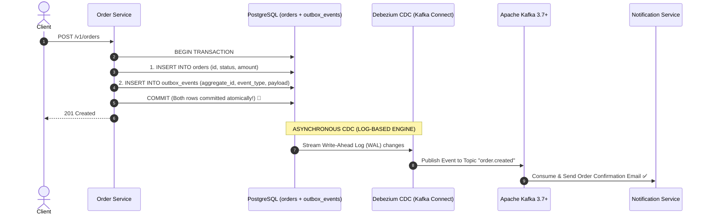
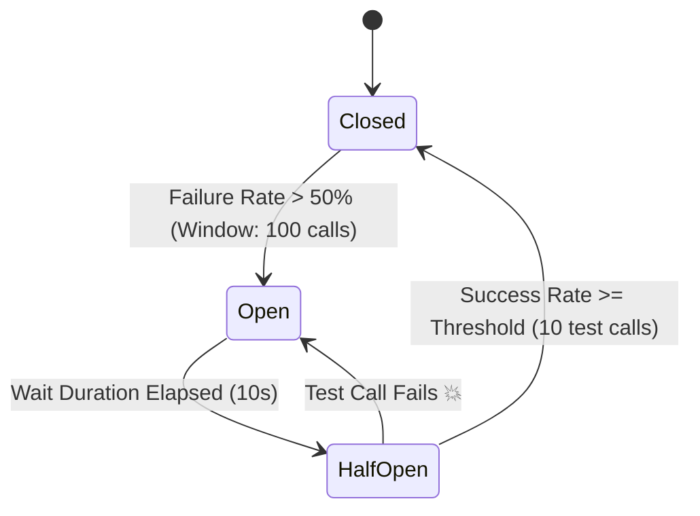

# Step 11 & 12: Outbound Integrations, Circuit Breakers & Outbox

Master third-party outbound RPCs, Resilience4j Circuit Breakers and Bulkheads, dual-write anomaly prevention, and the Transactional Outbox Pattern with Kafka CDC.

---

## 1. What Is It?
- **Circuit Breaker (Resilience4j)**: A fault-tolerance state machine (**CLOSED $\to$ OPEN $\to$ HALF-OPEN**) that intercepts outbound remote calls, detecting downstream service degradation and fast-failing requests to protect local threads.
- **Transactional Outbox Pattern**: An architectural pattern that guarantees **atomic dual-writes** (database mutation + domain event publishing) without distributed 2-Phase Commit (2PC) transactions.

---

## 2. Why Does It Exist?
- **Cascading Failures**: If an external payment provider slows down, your application threads freeze waiting for socket timeouts, exhausting your thread pool and crashing your entire system.
- **The Dual-Write Problem**: Updating a database and publishing an event to Kafka in the same method is NOT atomic. If Kafka is down or the network partitions after the database commit, the event is permanently lost, causing data inconsistency across microservices.

---

## 3. Mental Model: Transactional Outbox & Debezium CDC Pipeline



---

## 4. How Does It Work: Resilience4j Circuit Breaker State Machine



---

## 5. Internal Working: Outbox Table Schema

```sql
CREATE TABLE outbox_events (
    id UUID PRIMARY KEY,
    aggregate_type VARCHAR(255) NOT NULL,
    aggregate_id VARCHAR(255) NOT NULL,
    event_type VARCHAR(255) NOT NULL,
    payload JSONB NOT NULL,
    created_at TIMESTAMP WITH TIME ZONE DEFAULT CURRENT_TIMESTAMP
);
-- Indexed for polling or CDC WAL streaming
CREATE INDEX idx_outbox_created ON outbox_events (created_at ASC);
```

---

## 6. Example & Production Java 21 Code

Implementing a resilient outbound client with Resilience4j Circuit Breaker and Transactional Outbox:

```java
package com.backend.lifecycle.outbound;

import io.github.resilience4j.circuitbreaker.annotation.CircuitBreaker;
import io.github.resilience4j.retry.annotation.Retry;
import org.springframework.stereotype.Component;
import org.springframework.web.client.RestClient;

import java.time.Instant;
import java.util.UUID;

@Component
public class PaymentGatewayClient {

    private final RestClient restClient;

    public PaymentGatewayClient(RestClient restClient) {
        this.restClient = restClient;
    }

    // 1. Circuit Breaker & Retry Protection
    @CircuitBreaker(name = "paymentService", fallbackMethod = "paymentFallback")
    @Retry(name = "paymentService")
    public PaymentResponse processPayment(PaymentRequest request) {
        return restClient.post()
            .uri("https://payments.internal/v1/charges")
            .body(request)
            .retrieve()
            .body(PaymentResponse.class);
    }

    // 2. Fast Fallback Execution when Circuit is OPEN
    public PaymentResponse paymentFallback(PaymentRequest request, Throwable ex) {
        // Fallback: Queue for asynchronous retry or return graceful degradation DTO
        return new PaymentResponse(UUID.randomUUID(), "QUEUED_FOR_RETRY", Instant.now());
    }

    public record PaymentRequest(UUID orderId, long amountCents, String token) {}
    public record PaymentResponse(UUID transactionId, String status, Instant timestamp) {}
}
```

---

## 7. Performance Characteristics
- **Circuit Breaker Open State**: Requests fail in $< 0.1	ext{ms}$ (instant rejection without touching the network socket), saving thousands of worker threads from blocking.
- **Debezium CDC Latency**: Captures database commits from the WAL and writes to Kafka in $< 100	ext{ms}$ without polling overhead.

---

## 8. Failure Scenarios & Edge Cases
- **Dual-Write Failure (The Naive Trap)**:
  ```java
  orderRepo.save(order);       // 1. Database committed!
  kafkaTemplate.send(event);   // 2. Kafka timeout -> RuntimeException thrown!
  ```
  The order exists in the DB, but the downstream microservices never receive the event. Always use the **Transactional Outbox Pattern**.

---

## 9. Observability (Logs, Metrics, Traces)
```text
# Resilience4j Circuit Breaker Metrics
resilience4j_circuitbreaker_state{name="paymentService", state="closed"} 1
resilience4j_circuitbreaker_failure_rate{name="paymentService"} 2.4
resilience4j_circuitbreaker_buffered_calls{name="paymentService"} 100
```

---

## 10. Debugging & Troubleshooting
1. **Check Kafka Lag for Outbox Consumer**:
   ```bash
   kafka-consumer-groups --bootstrap-server localhost:9092 --describe --group order-processors
   ```

---

## 11. Scaling Considerations
- For extreme scale ($> 50,000	ext{ events/sec}$), use **Debezium WAL CDC** rather than application-level database polling (`SELECT ... FOR UPDATE SKIP LOCKED`).

---

## 12. Architectural Trade-offs
| Pattern | Reliability | Latency | Infrastructure Cost |
|---|---|---|---|
| **Direct Kafka Send** | Low (Dual-write risk) | Lowest ($2	ext{ms}$) | Minimal |
| **Transactional Outbox (CDC)**| Highest (Guaranteed At-Least-Once)| Low ($\sim 50	ext{ms}$) | Requires Kafka Connect |

---

## 13. When to Use
- Always use the **Transactional Outbox Pattern** when an event must reliably accompany a database state mutation.

---

## 14. When NOT to Use
- Do not use 2-Phase Commit (XA Transactions) across microservices due to coordinator locking bottlenecks.

---

## 15. SDE2 / Senior Interview Questions & Answers
### Q1: What is the Dual-Write Problem in Microservices, and how does the Transactional Outbox Pattern solve it?
<details>
<summary>Reveal Answer</summary>

**Answer**:
**The Problem**:
When a business operation requires updating a local database AND sending a message to Kafka, no single distributed transaction can atomically span both systems reliably. If the database write succeeds but Kafka fails (network timeout), data is permanently inconsistent.

**The Outbox Solution**:
1. Create an `outbox_events` table in the **same database** as the business entities.
2. When creating an order, insert the `Order` record AND the `OutboxEvent` record inside the **same local ACID database transaction**.
3. A Change Data Capture (CDC) engine (Debezium) tails the database transaction log (WAL) and publishes events to Kafka asynchronously.
4. If Kafka is temporarily down, events remain safely persisted in the database until Kafka recovers, guaranteeing **At-Least-Once Delivery**.
</details>

---

## 16. Practical Exercise
1. Create an `outbox_events` table in PostgreSQL.
2. Write a Spring Boot test that executes an order insertion and outbox event write in a single `@Transactional` method.
3. Simulate a failure and verify that both tables roll back completely.

---

## 17. Quick Revision Summary
- **Circuit Breakers** fast-fail degraded external dependencies to protect local thread pools.
- **Transactional Outbox** guarantees atomic dual-writes using local ACID transactions + CDC.
- Never use direct un-transactional message publishing alongside database commits.
