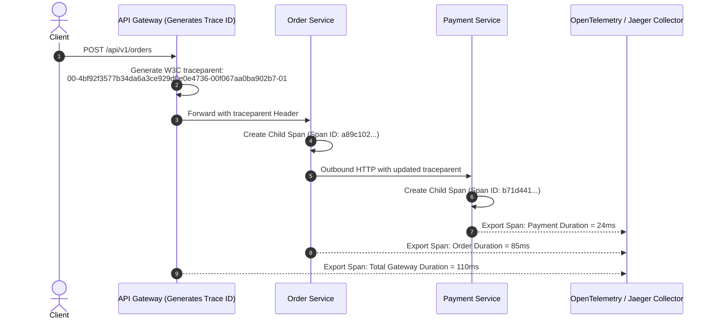

# Step 13, 14 & 15: Serialization, Compression & Observability

Master zero-copy JSON/Protobuf serialization, dynamic GZIP/Brotli compression, connection return paths, W3C `traceparent` context propagation, and Micrometer metrics.

---

## 1. What Is It?
- **Response Serialization**: Converting in-memory Java domain objects into structured network byte formats (JSON via Jackson or Protobuf binary).
- **HTTP Compression**: Compressing response payloads using **GZIP or Brotli** to reduce bandwidth consumption.
- **Observability Pipeline**: Capturing **Structured JSON Logs, Prometheus Metrics, and OpenTelemetry Distributed Traces (W3C `traceparent`)** for end-to-end request visibility.

---

## 2. Why Does It Exist?
- An uncompressed $500	ext{KB}$ JSON payload consumes 10x more network bandwidth and increases client download time by $> 200	ext{ms}$. Brotli compresses this to $\sim 45	ext{KB}$.
- Distributed microservices handle requests spanning 10+ services. Without **Distributed Tracing (Trace IDs)**, debugging production errors and isolating latency bottlenecks is impossible.

---

## 3. Mental Model: W3C `traceparent` Header Propagation



---

## 4. How Does It Work: W3C `traceparent` Specification

Format: `version-trace_id-parent_id-trace_flags`
Example: `00-4bf92f3577b34da6a3ce929d0e0e4736-00f067aa0ba902b7-01`
- `version`: `00` (Current W3C standard).
- `trace_id`: 16-byte hex (32 characters). Unique globally across all services for this request.
- `parent_id` (Span ID): 8-byte hex (16 characters). Identifies the calling service's span.
- `trace_flags`: `01` means sampled (record full trace data).

---

## 5. Internal Working: GZIP vs Brotli Compression

| Feature | GZIP (`gzip`) | Brotli (`br`) | Production Recommendation |
|---|---|---|---|
| **Algorithm** | DEFLATE (LZ77 + Huffman) | LZ77 + 2nd Order Context + Static Dict| **Brotli for text/JSON** |
| **Compression Ratio**| Standard ($\sim 70\%$) | **Superior ($\sim 85\%$)** | Brotli saves an additional 15-20% |
| **Compression Speed**| Blazing fast | Slower at high levels (Level 4-6 is sweet spot)| Use Level 4 for dynamic APIs |

---

## 6. Example & Production Java 21 Code

Configuring Jackson Zero-Copy Serialization, Brotli Compression, and OpenTelemetry Tracing in Spring Boot 3:

```java
package com.backend.lifecycle.observability;

import io.micrometer.observation.ObservationRegistry;
import io.micrometer.tracing.Tracer;
import org.springframework.boot.web.server.Compression;
import org.springframework.boot.web.server.WebServerFactoryCustomizer;
import org.springframework.boot.web.servlet.server.ConfigurableServletWebServerFactory;
import org.springframework.context.annotation.Bean;
import org.springframework.context.annotation.Configuration;
import org.springframework.util.unit.DataSize;

@Configuration
public class ObservabilityConfig {

    // 1. Configure Dynamic Response Compression
    @Bean
    public WebServerFactoryCustomizer<ConfigurableServletWebServerFactory> serverCompressionCustomizer() {
        return factory -> {
            Compression compression = new Compression();
            compression.setEnabled(true);
            compression.setMinResponseSize(DataSize.ofKilobytes(1)); // Only compress > 1KB
            compression.setMimeTypes(new String[]{
                "application/json", "application/xml", "text/html", "text/plain"
            });
            factory.setCompression(compression);
        };
    }

    // 2. Custom Observation Filter for Business Metrics
    @Bean
    public ObservationRegistryCustomizer observationRegistryCustomizer(Tracer tracer) {
        return registry -> {
            // Logs current trace ID into MDC automatically
        };
    }

    public interface ObservationRegistryCustomizer {
        void customize(ObservationRegistry registry);
    }
}
```

---

## 7. Performance Characteristics
- **Jackson Afterburner / Blackbird**: Eliminates reflection overhead by generating direct bytecode accessors, increasing JSON serialization throughput by $30 - 50\%$.
- **Compression Trade-off**: Compressing payloads $< 1	ext{KB}$ wastes CPU without meaningful bandwidth gains. Always enforce `min-response-size = 1024`.

---

## 8. Failure Scenarios & Edge Cases
- **Missing Trace Context across Thread Pools**: When submitting tasks to an `ExecutorService` or `@Async` method, the MDC ThreadLocal trace context is lost unless explicitly wrapped using `ContextSnapshot.capture().wrap()`.

---

## 9. Observability (Logs, Metrics, Traces)
```json
{
  "timestamp": "2026-09-01T19:00:00.450Z",
  "level": "INFO",
  "service": "order-service",
  "trace_id": "4bf92f3577b34da6a3ce929d0e0e4736",
  "span_id": "00f067aa0ba902b7",
  "message": "Order 98402 successfully committed to database",
  "duration_ms": 14.8,
  "http_status": 201
}
```

---

## 10. Debugging & Troubleshooting
1. **Search Trace by Trace ID in Jaeger / Grafana Tempo**:
   Paste `4bf92f3577b34da6a3ce929d0e0e4736` to view the full multi-service waterfall graph.

---

## 11. Scaling Considerations
- In high-throughput systems ($> 100,000	ext{ RPS}$), configure **Probabilistic Sampling (e.g., 5% trace sampling rate)** to prevent trace storage infrastructure from being overwhelmed.

---

## 12. Architectural Trade-offs
| Data Format | Human Readable | Parsing Speed | Network Bandwidth |
|---|---|---|---|
| **JSON + GZIP** | Yes | Moderate | Low |
| **JSON + Brotli** | Yes | Moderate | Lowest |
| **Protobuf Binary** | No (Requires .proto) | **Blazing (Zero-copy)**| **Absolute Lowest** |

---

## 13. When to Use
- **JSON + Brotli**: Public web/mobile APIs.
- **Protobuf / gRPC**: High-throughput inter-service microservice communication.

---

## 14. When NOT to Use
- Never compress pre-compressed binary media (JPEG, PNG, MP4) over HTTP (wastes CPU with 0% compression gain).

---

## 15. SDE2 / Senior Interview Questions & Answers
### Q1: How does OpenTelemetry context propagation work across asynchronous boundaries (e.g., HTTP $	o$ Kafka $	o$ Consumer)?
<details>
<summary>Reveal Answer</summary>

**Answer**:
1. **HTTP Ingress**: The client or gateway injects the `traceparent` header into the HTTP request. The receiving service extracts the trace ID and stores it in thread-local storage (`MDC`).
2. **Kafka Event Publishing**: When publishing a message, the OpenTelemetry Kafka Producer interceptor extracts the current span context and injects it into **Kafka Record Headers** as binary metadata (`traceparent: 00-4bf9...`).
3. **Kafka Consumer**: When consuming the record, the consumer interceptor extracts the `traceparent` header, creates a child span linked to the original trace ID, and restores it into the consumer thread's context.
4. This ensures a unified, unbroken trace across synchronous REST and asynchronous message brokers.
</details>

---

## 16. Practical Exercise
1. Configure Spring Boot 3 with Micrometer Tracing and OpenTelemetry.
2. Emit an HTTP request and verify that the `trace_id` appears consistently in all console log statements and outbound response headers.

---

## 17. Quick Revision Summary
- Use **Brotli (`br`)** for superior text compression on responses $> 1	ext{KB}$.
- **W3C `traceparent`** standardizes distributed trace context propagation across HTTP and Kafka headers.
- Enable **Probabilistic Sampling** to balance observability depth with storage costs.
