# Step-by-Step Master Request Lifecycle: The Complete 15-Hop End-to-End Walkthrough

The definitive reference architecture tracing a single HTTP POST request across all 15 layers from the user's mobile screen to physical NVMe disk sectors and back.

---

## 1. The 15-Hop Master Architectural Map

```mermaid
flowchart TD
    subgraph Edge["1. Client & DNS Resolution"]
        H1["1. User Action & DNS Lookup (Browser -> Recursive -> Anycast BGP)"]
        H2["2. TCP 3-Way Handshake (SYN -> SYN-ACK -> ACK)"]
        H3["3. TLS 1.3 Handshake (ClientHello -> KeyShare -> 1-RTT Encrypted)"]
        H4["4. HTTP Protocol Dispatch (HTTP/2 Binary Framing / HTTP/3 QUIC)"]
    end

    subgraph Ingress["2. Edge Ingress & Gateway Tier"]
        H5["5. L4/L7 Load Balancing (AWS NLB -> Envoy Proxy TLS Offload)"]
        H6["6. API Gateway (Stateless JWT Verification & Redis Sliding Window Rate Limit)"]
    end

    subgraph AppServer["3. Application Runtime & Framework Tier"]
        H7["7. Web Server & Thread Execution (Tomcat / Virtual Threads Unmounting)"]
        H8["8. Spring DispatcherServlet (Filters -> HandlerInterceptors -> Controller)"]
    end

    subgraph CoreDomain["4. Domain Logic & Persistence Tier"]
        H9["9. Domain Validation & Service Invariants"]
        H10["10. HikariCP Pool Lease & PostgreSQL Transaction (B+Tree Seek & WAL fsync)"]
        H11["11. Outbound Third-Party RPC (Resilience4j Circuit Breaker)"]
        H12["12. Transactional Outbox Event Publishing (Debezium CDC -> Kafka 3.7+)"]
    end

    subgraph ReturnWire["5. Serialization & Return Path"]
        H13["13. Response Construction (Jackson Zero-Copy & Brotli Compression)"]
        H14["14. Return Traversal & Socket Buffer Flush (SO_SNDBUF)"]
        H15["15. Post-Processing & Observability (OpenTelemetry Spans & Prometheus Metrics)"]
    end

    H1 --> H2 --> H3 --> H4 --> H5 --> H6 --> H7 --> H8 --> H9 --> H10 --> H11 --> H12 --> H13 --> H14 --> H15
```



---

## 2. Complete 15-Step Master Trace Table

| Hop # | Subsystem / Layer | Latency (Approx) | Critical Mechanics & Production Guarantee |
|:---:|---|:---:|---|
| **01** | **DNS Resolution** | $1 - 50	ext{ms}$ | Anycast BGP steers query to nearest edge PoP; resolves A/AAAA record with 60s TTL. |
| **02** | **TCP Handshake** | $10 - 30	ext{ms}$ | 3-Way SYN/ACK establishes sequence numbers; kernel allocates SYN Queue and Accept Queue. |
| **03** | **TLS 1.3 Handshake** | $10 - 30	ext{ms}$ | 1 RTT Diffie-Hellman Ephemeral key exchange; validates server certificate chain. |
| **04** | **HTTP Framing** | $< 0.1	ext{ms}$ | Payload serialized into HTTP/2 binary HEADERS and DATA frames over multiplexed stream. |
| **05** | **L4/L7 Load Balancer** | $0.5 - 2	ext{ms}$ | NLB routes TCP packets to Envoy fleet; Envoy terminates TLS and attaches `X-Forwarded-For`. |
| **06** | **API Gateway** | $1 - 3	ext{ms}$ | Validates JWT signature; executes atomic Redis Lua sliding window rate limit (100 req/min). |
| **07** | **Application Server** | $0.2	ext{ms}$ | Netty epoll reads socket bytes; spawns or assigns Java 21 Virtual Thread. |
| **08** | **Spring Dispatch** | $0.5	ext{ms}$ | `DispatcherServlet` matches route; executes Security Filters and `HandlerInterceptor`. |
| **09** | **Domain Execution** | $0.5 - 1	ext{ms}$ | Validates DTO records; enforces business rules using Pattern Matching. |
| **10** | **Database Persistence**| $2 - 10	ext{ms}$ | Leases HikariCP socket; executes SQL B+Tree index seek; appends and fsyncs to WAL disk log. |
| **11** | **Outbound RPC** | $15 - 50	ext{ms}$ | Calls external payment service protected by Resilience4j Circuit Breaker & Bulkhead. |
| **12** | **Async Outbox / Kafka**| $1 - 2	ext{ms}$ | Atomic insert into `outbox_events` table; Debezium CDC streams WAL event to Kafka topic. |
| **13** | **Response Construction**| $0.5	ext{ms}$ | Jackson serializes response DTO to JSON; Brotli dynamically compresses payload $> 1	ext{KB}$. |
| **14** | **Socket Return Path**| $10 - 30	ext{ms}$ | Sockets flushed to kernel `SO_SNDBUF`; TCP ACKs stream across internet back to client. |
| **15** | **Observability Pipeline**| $< 0.1	ext{ms}$ (Async) | W3C `traceparent` OpenTelemetry span exported; Prometheus latency histograms incremented. |

---

## 3. Production Java 21 Master Blueprint

The unified end-to-end production controller orchestrating the entire lifecycle:

```java
package com.backend.lifecycle.master;

import io.micrometer.observation.annotation.Observed;
import org.springframework.http.HttpStatus;
import org.springframework.http.ResponseEntity;
import org.springframework.transaction.annotation.Transactional;
import org.springframework.web.bind.annotation.*;

import java.net.URI;
import java.time.Instant;
import java.util.Objects;
import java.util.UUID;

@RestController
@RequestMapping("/api/v1/orders")
public class MasterOrderLifecycleController {

    private final OrderApplicationService service;

    public MasterOrderLifecycleController(OrderApplicationService service) {
        this.service = service;
    }

    @PostMapping
    @Observed(name = "order.creation", contextualName = "create-order")
    public ResponseEntity<CreateOrderResponse> createOrder(
        @RequestBody CreateOrderRequest request,
        @RequestHeader("X-User-Id") String userId,
        @RequestHeader(value = "Idempotency-Key", required = false) String idempotencyKey
    ) {
        // Step 8 & 9: Controller Dispatch & Domain Execution
        CreateOrderResponse response = service.createOrder(request, userId, idempotencyKey);

        // Step 13: 201 Created with Location Header
        return ResponseEntity
            .created(URI.create("/api/v1/orders/" + response.orderId()))
            .body(response);
    }

    public record CreateOrderRequest(String itemId, int quantity, long priceCents) {
        public CreateOrderRequest {
            Objects.requireNonNull(itemId, "itemId required");
            if (quantity <= 0) throw new IllegalArgumentException("quantity must be positive");
        }
    }

    public record CreateOrderResponse(UUID orderId, String status, Instant timestamp) {}
}

@org.springframework.stereotype.Service
class OrderApplicationService {

    @Transactional(timeout = 5)
    public MasterOrderLifecycleController.CreateOrderResponse createOrder(
        MasterOrderLifecycleController.CreateOrderRequest request,
        String userId,
        String idempotencyKey
    ) {
        UUID orderId = UUID.randomUUID();
        // 1. Mutate local domain entity inside DB transaction
        // 2. Insert into outbox_events table for Debezium CDC Kafka publishing
        return new MasterOrderLifecycleController.CreateOrderResponse(orderId, "CONFIRMED", Instant.now());
    }
}
```

---

## 4. Architectural Summary & Interview Cheatsheet
- **Edge to Ingress**: DNS (Anycast) $	o$ TCP (3-Way) $	o$ TLS 1.3 (1 RTT) $	o$ HTTP/2 (Multiplexed) $	o$ L4 NLB $	o$ L7 Envoy (TLS Offload).
- **Security & Dispatch**: API Gateway (JWT + Redis Rate Limiter) $	o$ Linux Epoll $	o$ Java 21 Virtual Thread $	o$ Spring DispatcherServlet $	o$ Filters $	o$ Interceptors $	o$ Controllers.
- **Persistence & Resilience**: HikariCP Connection Lease $	o$ PostgreSQL ACID Transaction (B+Tree + WAL) $	o$ Resilience4j Circuit Breaker $	o$ Transactional Outbox (Debezium + Kafka).
- **Return & Observability**: Jackson Zero-Copy Serialization $	o$ Brotli Compression $	o$ Kernel `SO_SNDBUF` $	o$ W3C `traceparent` OpenTelemetry Traces $	o$ Prometheus Metrics.
