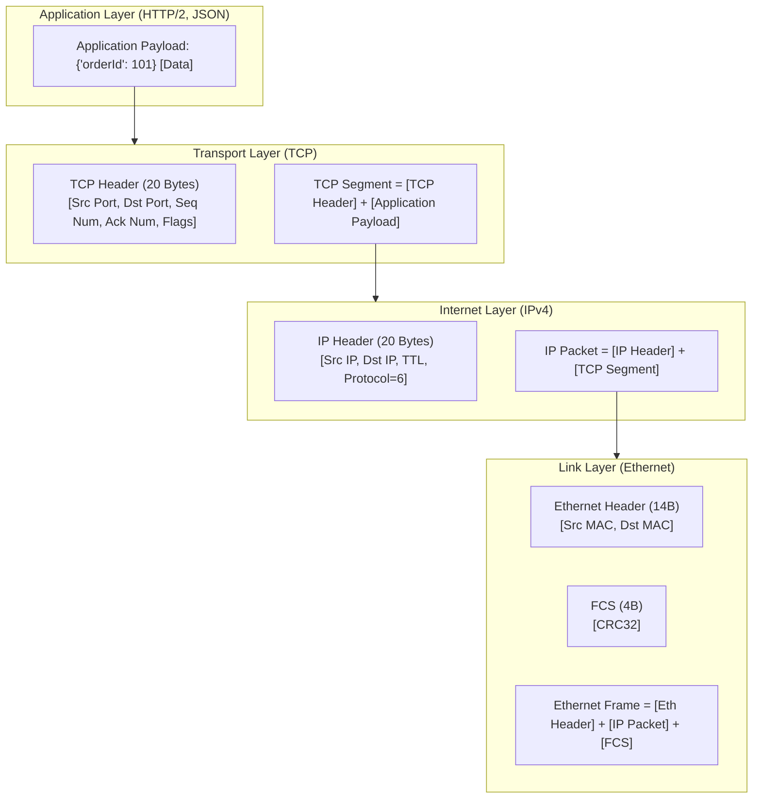

# Lesson 01: OSI Model & Packet Encapsulation

Master the OSI 7-layer and TCP/IP 4-layer architectures, byte-level packet encapsulation, MTU limits, IP fragmentation, and Maximum Segment Size (MSS).

---

## 1. What Is It?
- **OSI 7-Layer Model**: A conceptual framework defining how data flows across physical media to application software (Physical $\to$ Data Link $\to$ Network $\to$ Transport $\to$ Session $\to$ Presentation $\to$ Application).
- **TCP/IP 4-Layer Model**: The practical architecture powering the Internet (Link $\to$ Internet $\to$ Transport $\to$ Application).
- **Packet Encapsulation**: The process where each layer prepends a protocol header containing routing, sequencing, and control metadata to the payload before transmitting it down the stack.

---

## 2. Why Does It Exist?
Layering creates clean modularity: application software developers write code over standard socket APIs (`java.net.Socket`) without needing to understand whether physical packets traverse fiber optics, copper Ethernet, or satellite wireless links.

---

## 3. Mental Model: Byte-Level Packet Encapsulation



---

## 4. How Does It Work: MTU and MSS Calculations

- **MTU (Maximum Transmission Unit)**: The maximum size of an Ethernet frame payload without headers, standardly **1500 bytes**.
- **IP Header**: Typically **20 bytes** (IPv4).
- **TCP Header**: Typically **20 bytes** (without options).
- **MSS (Maximum Segment Size)**: The maximum amount of pure application data a single TCP segment can contain:
$$\text{MSS} = \text{MTU} - (\text{IP Header} + \text{TCP Header}) = 1500 - (20 + 20) = 1460\text{ bytes}$$

---

## 5. Internal Working: IP Fragmentation & Path MTU Discovery (PMTUD)

If an application sends a $3000\text{-byte}$ UDP packet over an interface with $\text{MTU}=1500$:
1. The kernel IP layer fragments the datagram into two separate IP packets.
2. If any router on the path drops either fragment, the entire $3000\text{-byte}$ datagram is lost (UDP has no per-fragment retransmission).
3. **PMTUD**: In TCP, the kernel sets the `DF` (Don't Fragment) bit in the IP header. If a router cannot forward the packet due to a smaller MTU (e.g., VPN tunnel with MTU 1400), it returns an **ICMP Type 3 Code 4 (Fragmentation Needed)** message, prompting the sender to reduce MSS.

---

## 6. Example & Production Java 21 Code

Configuring low-level TCP socket buffers and options in Java 21:

```java
package com.backend.networking.encapsulation;

import java.io.IOException;
import java.net.InetSocketAddress;
import java.net.StandardSocketOptions;
import java.nio.channels.SocketChannel;

public class LowLevelSocketConfigurator {

    public static SocketChannel openOptimizedSocket(String host, int port) throws IOException {
        SocketChannel socketChannel = SocketChannel.open();
        socketChannel.configureBlocking(false);

        // 1. Disable Nagle's Algorithm (TCP_NODELAY) for low-latency RPC
        socketChannel.setOption(StandardSocketOptions.TCP_NODELAY, true);

        // 2. Set OS Send and Receive Socket Buffers (SO_SNDBUF, SO_RCVBUF)
        socketChannel.setOption(StandardSocketOptions.SO_SNDBUF, 256 * 1024); // 256 KB
        socketChannel.setOption(StandardSocketOptions.SO_RCVBUF, 256 * 1024); // 256 KB

        // 3. Enable SO_KEEPALIVE to detect dead remote peers
        socketChannel.setOption(StandardSocketOptions.SO_KEEPALIVE, true);

        // 4. Connect asynchronously
        socketChannel.connect(new InetSocketAddress(host, port));
        return socketChannel;
    }
}
```

---

## 7. Performance Characteristics
- **Header Overhead**: A typical 40-byte TCP/IP header on a 1460-byte payload represents only $\sim 2.7\%$ network overhead.
- **Jumbo Frames**: In private cloud data centers (AWS EC2 VPC), enabling **Jumbo Frames (MTU 9001 bytes)** increases MSS to $8960\text{ bytes}$, reducing CPU interrupt processing by up to $80\%$ for high-volume database replication.

---

## 8. Failure Scenarios & Edge Cases
- **MTU Black Hole**: When an intermediate firewall blocks all ICMP messages, PMTUD breaks. The client sends a 1500-byte packet with `DF=1`, the router silently drops it, and the connection hangs forever during TLS handshakes.
  - **Mitigation**: Configure TCP MSS Clamping on the border router (`iptables -t mangle -A POSTROUTING -p tcp --tcp-flags SYN,RST SYN -j TCPMSS --clamp-mss-to-pmtu`).

---

## 9. Observability (Logs, Metrics, Traces)
```text
# Kernel IP Fragmentation Metrics
node_netstat_Ip_FragCreates 0
node_netstat_Ip_FragFails 0
```

---

## 10. Debugging & Troubleshooting
1. **Find Path MTU using `ping`**:
   ```bash
   # macOS: -D (Don't Fragment), -s (Packet Size)
   ping -D -s 1472 api.production.com
   ```

---

## 11. Scaling Considerations
- Enable **Jumbo Frames (MTU 9000)** on internal Kafka, database, and Redis replication subnets.

---

## 12. Architectural Trade-offs
| Frame Size | Throughput Efficiency | Compatibility | Latency for Small Packets |
|---|---|---|---|
| **Standard (MTU 1500)**| Standard | $100\%$ Global Internet | Low |
| **Jumbo (MTU 9000)** | **Highest (80% less CPU interrupts)**| Private VPC Subnets Only | Slight queuing delay |

---

## 13. When to Use
- Standard MTU 1500 for all public egress/ingress internet traffic.

---

## 14. When NOT to Use
- Never enable Jumbo Frames on public-facing internet gateways.

---

## 15. SDE2 / Senior Interview Questions & Answers
### Q1: What is the relationship between MTU and MSS, and what happens if an IP packet exceeds the path MTU with the DF bit set?
<details>
<summary>Reveal Answer</summary>

**Answer**:
- **MTU**: The maximum link-layer payload size (typically 1500 bytes).
- **MSS**: The maximum TCP segment data size, equal to $\text{MTU} - (\text{IP Header} + \text{TCP Header}) = 1460\text{ bytes}$.
- If a packet exceeds the MTU of any downstream link and has the `DF=1` (Don't Fragment) bit set:
  1. The router drops the packet.
  2. The router transmits an **ICMP Destination Unreachable (Fragmentation Needed, Type 3, Code 4)** packet back to the sender containing the next-hop MTU.
  3. The sender's kernel automatically adjusts its MSS downward for that connection (Path MTU Discovery).
</details>

---

## 16. Practical Exercise
1. Run `ping -D -s 1472 google.com` and observe successful ping responses.
2. Increment to `-s 1473` and observe `Message too long` or dropped packets due to MTU boundaries.

---

## 17. Quick Revision Summary
- **MSS = MTU - 40 bytes** ($1460\text{ bytes}$ for standard IPv4/TCP).
- Encapsulation builds: **Data $\to$ TCP Segment $\to$ IP Packet $\to$ Ethernet Frame**.
- **PMTUD** uses ICMP to dynamically discover the lowest MTU on the transmission path.
