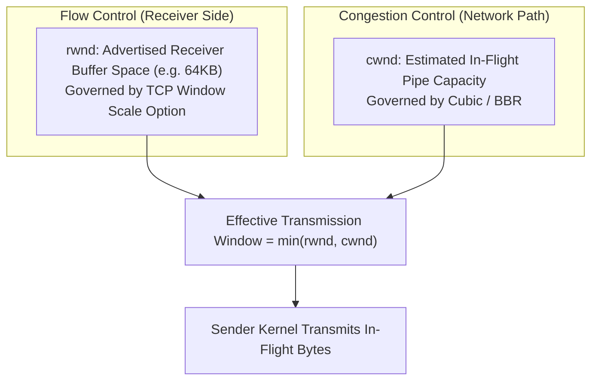
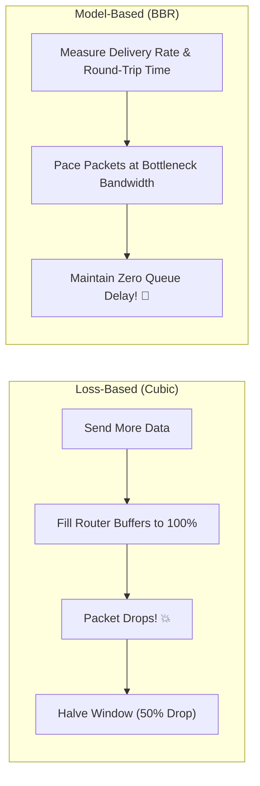

# Lesson 02: TCP Mechanics & Congestion Control

Master the TCP sliding window, flow control vs congestion control, loss-based (Reno/Cubic) vs delay/bandwidth-based (BBR) algorithms, Nagle's algorithm, and delayed ACKs.

---

## 1. What Is It?
- **Flow Control (Receive Window `rwnd`)**: Prevents a fast sender from overwhelming a slow receiver's kernel buffer.
- **Congestion Control (Congestion Window `cwnd`)**: Prevents senders from overwhelming intermediate network routers and switches.
- **Congestion Control Algorithms**: Algorithms (Cubic, BBR) that dynamically estimate network capacity to maximize throughput without causing packet loss.

---

## 2. Why Does It Exist?
Without flow and congestion control, senders would transmit at full line speed ($10\text{Gbps}$), flooding network queues, causing massive packet drops, retransmission storms, and **congestion collapse**.

---

## 3. Mental Model: Flow Control vs Congestion Control

$$\text{Effective Send Window} = \min(\text{rwnd}, \text{cwnd})$$



---

## 4. How Does It Work: TCP Congestion Control Algorithms

| Algorithm | Model | Trigger for Backoff | Bufferbloat Resistance |
|---|---|---|---|
| **TCP Reno** | Loss-based (AIMD) | Packet Drop | Poor |
| **TCP Cubic (Default Linux)**| Loss-based (Cubic polynomial growth)| Packet Drop | Poor (Fills deep router buffers) |
| **Google BBR (v1/v2/v3)** | **Model-based (Tracks max BtlBw & min RTprop)**| **Increases in RTT / Latency**| **Superior (Drains queue buffers! ⚡)**|



---

## 5. Internal Working: Nagle's Algorithm vs Delayed ACKs

The classic $200\text{ms}$ latency penalty occurs when **Nagle's Algorithm** clashes with **Delayed ACKs**:
1. **Nagle's Algorithm (`TCP_NODELAY = false`)**: Buffers small outbound chunks until a full MSS ($1460\text{B}$) is collected OR an ACK for prior data is received.
2. **Delayed ACKs (Receiver)**: Waits up to $200\text{ms}$ before sending an ACK in hopes of piggybacking it on a reverse data packet.
3. **The Deadlock**: Sender is waiting for ACK before sending remaining bytes; Receiver is waiting for more bytes before sending ACK $\to$ **$200\text{ms}$ stall on every request!**
4. **The Fix**: Always set `socket.setOption(StandardSocketOptions.TCP_NODELAY, true)` on backend RPC connections.

---

## 6. Example & Production Java 21 Code

Demonstrating the impact of `TCP_NODELAY` and Socket Buffer Sizing in Java 21:

```java
package com.backend.networking.congestion;

import java.io.OutputStream;
import java.net.InetSocketAddress;
import java.net.Socket;
import java.nio.charset.StandardCharsets;

public class TcpNoDelayBenchmark {

    public static void executeFastRpc(String host, int port) throws Exception {
        try (Socket socket = new Socket()) {
            // 1. CRITICAL: Disable Nagle's algorithm to eliminate 200ms Delayed ACK stall
            socket.setTcpNoDelay(true);

            // 2. Set OS Send and Receive Buffers
            socket.setSendBufferSize(128 * 1024);
            socket.setReceiveBufferSize(128 * 1024);

            socket.connect(new InetSocketAddress(host, port), 2000);

            OutputStream out = socket.getOutputStream();
            // Send small RPC payload
            byte[] header = "POST /rpc HTTP/1.1\r\nHost: api\r\n\r\n".getBytes(StandardCharsets.UTF_8);
            byte[] body = "{"ping": true}".getBytes(StandardCharsets.UTF_8);

            long start = System.nanoTime();
            out.write(header);
            out.write(body); // Transmitted immediately without Nagle buffering!
            out.flush();
            long elapsedMicros = (System.nanoTime() - start) / 1000;
            System.out.println("Payload sent in " + elapsedMicros + " micros");
        }
    }
}
```

---

## 7. Performance Characteristics
- **BBR vs Cubic on Lossy Links**: On networks with $2\%$ packet loss (e.g., transcontinental or mobile), **BBR achieves 10x to 100x higher throughput** than Cubic because it does not assume random packet loss equals congestion.

---

## 8. Failure Scenarios & Edge Cases
- **Bufferbloat**: Deep buffers in intermediate Wi-Fi/ISP routers absorb thousands of packets during Cubic window growth, creating massive latency spikes ($> 1500\text{ms}$) without triggering drops.
  - **Mitigation**: Switch kernel congestion control to BBR (`net.ipv4.tcp_congestion_control = bbr`).

---

## 9. Observability (Logs, Metrics, Traces)
```text
# Kernel TCP Congestion Metrics
node_netstat_Tcp_RetransSegs 124
node_netstat_TcpExt_TCPTimeouts 4
```

---

## 10. Debugging & Troubleshooting
1. **Inspect Active Congestion Control in Linux**:
   ```bash
   sysctl net.ipv4.tcp_congestion_control
   # Enable BBR:
   sudo sysctl -w net.ipv4.tcp_congestion_control=bbr
   ```
2. **Inspect Real-Time Socket RTT & CWND via `ss`**:
   ```bash
   ss -ti '( sport = :443 )'
   # Displays: rtt:12.4/0.2 cwnd:45 ssthresh:30 bbr:(bw:120Mbps,mrtt:11.2)
   ```

---

## 11. Scaling Considerations
- Enable BBR across all edge reverse proxies (Envoy/NGINX) handling external user traffic.

---

## 12. Architectural Trade-offs
| Algorithm | High Latency / Mobile Links | High Bandwidth LAN | Bufferbloat Resistance |
|---|---|---|---|
| **Cubic** | Moderate | Excellent | Poor |
| **BBR v2/v3** | **Superior** | **Excellent** | **Superior** |

---

## 13. When to Use
- Always enable **`TCP_NODELAY`** on latency-sensitive backend microservice connections (gRPC, REST, Redis, Kafka).

---

## 14. When NOT to Use
- Do not disable Nagle's algorithm if transmitting millions of 1-byte raw telnet keystrokes over low-bandwidth dial-up links.

---

## 15. SDE2 / Senior Interview Questions & Answers
### Q1: Why do Nagle's Algorithm and Delayed ACKs cause a 200ms latency spike when combined, and how do backend engineers fix it?
<details>
<summary>Reveal Answer</summary>

**Answer**:
- **Nagle's Algorithm**: Prevents sending small packets if there is unacknowledged data in-flight. It buffers subsequent small writes until a full packet (MSS) is accumulated OR an ACK for previous bytes arrives.
- **Delayed ACK**: The receiver delays sending an ACK for up to $200\text{ms}$ in hopes of bundling it with a reverse data response.
- **The Problem**: When a client sends an HTTP header in write #1 and an HTTP body in write #2:
  1. Write #1 is transmitted.
  2. Write #2 is held by Nagle because write #1 is unacknowledged.
  3. The server receives write #1, sees no data to return yet, and waits for write #2 while holding back the ACK (Delayed ACK timer).
  4. Both sides freeze until the $200\text{ms}$ Delayed ACK timer expires.
- **The Fix**: Set `TCP_NODELAY = true` (disabling Nagle's algorithm) on all backend sockets.
</details>

---

## 16. Practical Exercise
1. Run `ss -ti` on your machine and inspect the `cwnd` (Congestion Window) and `rtt` metrics on an active download.
2. Verify that `TCP_NODELAY` is enabled on your JVM database connection pools.

---

## 17. Quick Revision Summary
- Flow Control = **`rwnd`** (Receiver buffer limit).
- Congestion Control = **`cwnd`** (Network path capacity).
- **Google BBR** outperforms Cubic by pacing packets based on bandwidth and round-trip time instead of packet drops.
- **`TCP_NODELAY`** eliminates the lethal $200\text{ms}$ Nagle + Delayed ACK deadlock.
