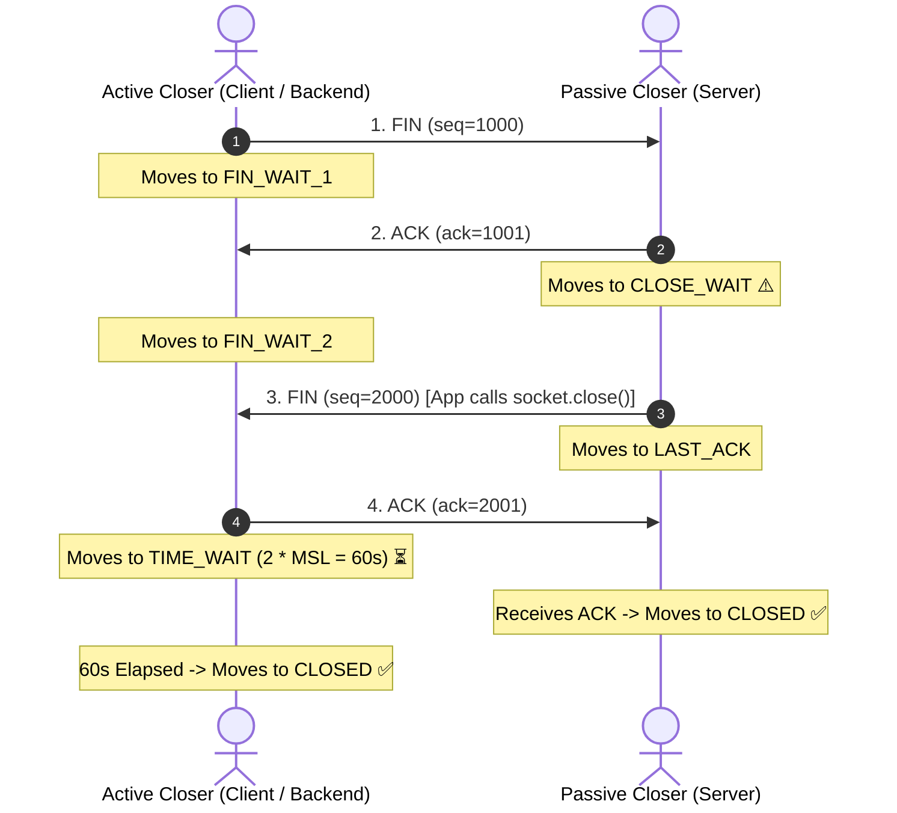

# Lesson 03: TCP Connection States & Kernel Tuning

Master the 11 TCP finite state machine transitions, the purpose of `TIME_WAIT`, diagnosing `CLOSE_WAIT` socket leaks, and Linux kernel socket buffer tuning.

---

## 1. What Is It?
Every TCP connection progresses through an 11-state finite state machine managed by the OS kernel, from `CLOSED` to `ESTABLISHED` and teardown states (`FIN_WAIT_1`, `FIN_WAIT_2`, `TIME_WAIT`, `CLOSE_WAIT`).

---

## 2. Why Does It Exist?
TCP is a stateful, connection-oriented protocol. Explicit connection states ensure that both endpoints agree when connections open, gracefully flush in-flight packets, and clean up kernel data structures without corrupting subsequent connections.

---

## 3. Mental Model: The TCP Teardown State Transitions



---

## 4. How Does It Work: The 11 TCP States

| TCP State | Description | Side |
|---|---|---|
| `LISTEN` | Waiting for incoming connection requests on a port. | Server |
| `SYN_SENT` | Sent `SYN`, waiting for matching `SYN-ACK`. | Client |
| `SYN_RECEIVED`| Received `SYN`, sent `SYN-ACK`, waiting for `ACK`. | Server |
| `ESTABLISHED` | Open, active connection ready for data transfer. | Both |
| `FIN_WAIT_1` | Sent `FIN`, waiting for `ACK` or `FIN`. | Active Closer |
| `FIN_WAIT_2` | Received `ACK` for `FIN`, waiting for remote `FIN`. | Active Closer |
| `CLOSE_WAIT` | **Received `FIN`, waiting for local application to call `close()`**. | Passive Closer |
| `CLOSING` | Simultaneous close (both sent `FIN` concurrently). | Both |
| `LAST_ACK` | Sent `FIN`, waiting for final `ACK`. | Passive Closer |
| **`TIME_WAIT`** | **Waiting $2 \times \text{MSL}$ (60s) to ensure remote received final ACK**. | **Active Closer** |
| `CLOSED` | Sockets fully terminated; resources reclaimed by kernel. | Both |

---

## 5. Internal Working: Why `TIME_WAIT` Exists & Why `CLOSE_WAIT` Is a Bug

### Why `TIME_WAIT` Exists ($2 \times \text{MSL} = 60\text{s}$)
1. **Ensure Remote Peer Receives Final ACK**: If the final ACK is lost in the network, the remote peer will retransmit its `FIN`. The active closer must stay alive in `TIME_WAIT` to resend the ACK; otherwise, it would respond with `RST` (Connection Reset).
2. **Drain Old Duplicate Packets**: Prevents delayed packets from an old connection from being accepted by a new connection using the same IP:Port 5-tuple.

### Why `CLOSE_WAIT` Accumulation Is an Application Code Bug
If a server has 10,000 sockets in `CLOSE_WAIT`, **it is 100% an application code bug**. The remote client closed the connection (`FIN` received), the OS responded with `ACK`, but the application code forgot to call `socket.close()` (e.g., unclosed HTTP response stream or leaked connection pool lease).

---

## 6. Example & Production Java 21 Code

Properly managing socket lifecycles with `AutoCloseable` and configuring socket reuse in Java 21:

```java
package com.backend.networking.states;

import java.io.BufferedReader;
import java.io.InputStreamReader;
import java.net.InetSocketAddress;
import java.net.ServerSocket;
import java.net.Socket;

public class SafeSocketServer {

    public static void startServer(int port) throws Exception {
        try (ServerSocket serverSocket = new ServerSocket()) {
            // Allow immediate port rebinding without TIME_WAIT port conflict
            serverSocket.setReuseAddress(true);
            serverSocket.bind(new InetSocketAddress("0.0.0.0", port));

            while (!Thread.currentThread().isInterrupted()) {
                Socket clientSocket = serverSocket.accept();

                // Process in Virtual Thread and ALWAYS close socket to prevent CLOSE_WAIT leaks
                Thread.ofVirtual().start(() -> {
                    try (clientSocket;
                         BufferedReader reader = new BufferedReader(new InputStreamReader(clientSocket.getInputStream()))) {

                        String line = reader.readLine();
                        // Process request...
                    } catch (Exception e) {
                        // Logging error
                    }
                    // clientSocket automatically closed here! Guaranteed no CLOSE_WAIT leaks!
                });
            }
        }
    }
}
```

---

## 7. Performance Characteristics
- **Port Exhaustion**: With $\sim 65,000$ ephemeral ports, an active closer initiating 2,000 short-lived connections per second will exhaust all available local ports in 30 seconds due to `TIME_WAIT` accumulation.
- **Kernel Memory**: Each `TIME_WAIT` socket consumes only $\sim 128\text{ bytes}$ of kernel memory.

---

## 8. Failure Scenarios & Edge Cases
- **Ephemeral Port Starvation**: Backend services calling microservices without HTTP connection pooling open a new TCP socket per request, filling all ephemeral ports in `TIME_WAIT` and throwing `java.net.BindException: Cannot assign requested address`.
  - **Mitigation**: Enable connection pooling (Apache HttpClient / `RestClient`) and set `net.ipv4.tcp_tw_reuse = 1`.

---

## 9. Observability (Logs, Metrics, Traces)
```text
# Kernel Socket State Metrics
node_sockstat_TCP_tw 4200
node_sockstat_TCP_close_wait 0   <-- Must be near 0! Spikes indicate application resource leak!
node_sockstat_TCP_alloc 4350
```

---

## 10. Debugging & Troubleshooting
1. **Count Sockets by State**:
   ```bash
   ss -ant | awk '{print $1}' | sort | uniq -c
   ```
2. **Find Process Leaking `CLOSE_WAIT` Sockets**:
   ```bash
   lsof -i :8080 | grep CLOSE_WAIT
   ```

---

## 11. Scaling Considerations
- Kernel tuning in `/etc/sysctl.conf`:
  ```ini
  net.ipv4.tcp_tw_reuse = 1
  net.ipv4.tcp_fin_timeout = 15
  net.ipv4.ip_local_port_range = 1024 65535
  ```

---

## 12. Architectural Trade-offs
| State Issue | Root Cause | Solution |
|---|---|---|
| **High `TIME_WAIT`** | Normal behavior on active closer | Connection Pooling + `tcp_tw_reuse=1` |
| **High `CLOSE_WAIT`** | **Application bug (unclosed sockets)**| Fix code (`try-with-resources`) |

---

## 13. When to Use
- Always enable **`SO_REUSEADDR`** on all server listen sockets.

---

## 14. When NOT to Use
- Never enable `net.ipv4.tcp_tw_recycle` (deprecated and dangerous behind NAT firewalls).

---

## 15. SDE2 / Senior Interview Questions & Answers
### Q1: If your production backend server has 20,000 connections stuck in `CLOSE_WAIT`, what is the root cause, and how do you resolve it?
<details>
<summary>Reveal Answer</summary>

**Answer**:
- **Root Cause**: `CLOSE_WAIT` indicates that the **remote peer initiated connection teardown** by sending a `FIN`, the local kernel acknowledged with an `ACK`, but the **local application process has NOT called `socket.close()`**. It is 100% an application-level resource leak bug (e.g., an unclosed `InputStream`, missing `try-with-resources`, or an HTTP client failing to release connections back to a pool upon receiving an exception).
- **Resolution**:
  1. Identify the culprit process: `lsof -p <PID> | grep CLOSE_WAIT`.
  2. Inspect the application code handling socket/HTTP client I/O.
  3. Ensure all socket reads and HTTP response bodies are wrapped in `try-with-resources` to guarantee `.close()` is called on every code path.
</details>

---

## 16. Practical Exercise
1. Run `ss -ant | awk '{print $1}' | sort | uniq -c` in your terminal to inspect all active TCP socket states.
2. Identify how many sockets are currently in `ESTABLISHED`, `TIME_WAIT`, and `LISTEN`.

---

## 17. Quick Revision Summary
- **`TIME_WAIT`** is held by the **active closer** for $2\times \text{MSL}$ ($60\text{s}$) to guarantee final ACK delivery and drain duplicate packets.
- **`CLOSE_WAIT`** accumulation is **always an application bug** where `close()` was never called.
- Reuse connection pools and enable **`tcp_tw_reuse = 1`** to eliminate ephemeral port exhaustion.
