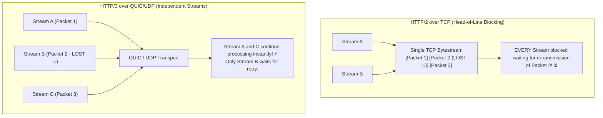

# Lesson 04: UDP, QUIC & HTTP/3 Architecture

Master UDP datagram mechanics, TCP Head-of-Line blocking, QUIC transport over UDP, connection migration, and HTTP/3 multiplexing.

---

## 1. What Is It?
- **UDP (User Datagram Protocol)**: A minimalist, connectionless Layer 4 transport protocol that provides port multiplexing and error checking (checksums) without delivery guarantees, ordering, or flow control.
- **QUIC (Quick UDP Internet Connections)**: A modern, encrypted transport protocol built on top of UDP that embeds TLS 1.3 cryptographic handshakes, independent stream multiplexing, and connection migration.
- **HTTP/3**: The newest HTTP standard that operates over QUIC/UDP rather than TCP/TLS.

---

## 2. Why Does It Exist?
In HTTP/2 over TCP, if a single TCP packet is dropped in the network, the **entire TCP connection stalls** (Head-of-Line blocking) while the kernel waits for retransmission, blocking all 100 multiplexed HTTP streams.

HTTP/3 over QUIC solves this by making streams **completely independent** at the transport layer: a dropped packet only pauses the specific stream it belongs to.

---

## 3. Mental Model: HTTP/2 (TCP) vs HTTP/3 (QUIC/UDP)



---

## 4. How Does It Work: QUIC Key Innovations

| Feature | HTTP/2 over TCP | HTTP/3 over QUIC | Benefit |
|---|---|---|---|
| **Underlying Protocol** | TCP | **UDP** | Bypasses OS kernel TCP update cycle |
| **Handshake Latency** | 2-3 RTTs (TCP + TLS) | **1 RTT (Combined Transport + TLS 1.3)**| **Faster connection setup** |
| **Head-of-Line Blocking**| Yes (At TCP layer) | **No (Independent streams)** | **Superior on lossy mobile networks** |
| **Connection Migration**| Broken on IP change | **Preserved via 64-bit Connection ID** | Seamless Wi-Fi to 5G transitions |

---

## 5. Internal Working: QUIC Connection Migration

In TCP, a connection is identified by the 4-tuple `(Src IP, Src Port, Dst IP, Dst Port)`. When a user walks out of their house and switches from Wi-Fi to 5G Cellular, their IP address changes, immediately breaking all active TCP sockets.

In QUIC, connections are identified by a random **64-bit Connection ID (CID)**. When the client's IP changes, it simply transmits the next UDP packet with the same Connection ID from its new 5G IP address. The server validates the cryptographic token and continues the session without reconnection!

---

## 6. Example & Production Java 21 Code

High-performance UDP Datagram server with Java 21 `DatagramChannel`:

```java
package com.backend.networking.quic;

import java.net.InetSocketAddress;
import java.net.SocketAddress;
import java.nio.ByteBuffer;
import java.nio.channels.DatagramChannel;

public class HighThroughputUdpServer {

    public static void runServer(int port) throws Exception {
        try (DatagramChannel channel = DatagramChannel.open()) {
            channel.bind(new InetSocketAddress(port));
            channel.configureBlocking(true);

            ByteBuffer buffer = ByteBuffer.allocateDirect(2048);
            System.out.println("UDP Ingress listening on port " + port);

            while (!Thread.currentThread().isInterrupted()) {
                buffer.clear();
                // Receive raw UDP datagram with zero TCP handshake overhead
                SocketAddress clientAddress = channel.receive(buffer);
                buffer.flip();

                // Process datagram asynchronously in Virtual Thread
                ByteBuffer copy = ByteBuffer.allocate(buffer.remaining());
                copy.put(buffer);
                copy.flip();

                Thread.ofVirtual().start(() -> {
                    processPacket(clientAddress, copy);
                });
            }
        }
    }

    private static void processPacket(SocketAddress client, ByteBuffer data) {
        // Fast processing of telemetry / DNS / QUIC frames
    }
}
```

---

## 7. Performance Characteristics
- **Handshake Speed**: QUIC establishes both transport and cryptographic session keys in **1 RTT** ($0\text{ RTT}$ on resumption).
- **Packet Loss Resilience**: Under $5\%$ packet loss, HTTP/3 page load times are up to $40\%$ faster than HTTP/2.

---

## 8. Failure Scenarios & Edge Cases
- **UDP Throttling & Firewall Blocking**: Many enterprise firewalls and ISPs block or heavily throttle UDP on port 443, assuming it is torrenting or DDoS traffic.
  - **Mitigation**: Deploy HTTP/3 with **HTTP/2 Fallback** via the `Alt-Svc` header (`Alt-Svc: h3=":443"; ma=86400`).

---

## 9. Observability (Logs, Metrics, Traces)
```text
# Envoy HTTP/3 & QUIC Metrics
envoy_http3_downstream_cx_active 8900
envoy_http3_downstream_rx_bytes_total 489201948
```

---

## 10. Debugging & Troubleshooting
1. **Inspect QUIC Packets via `tshark`**:
   ```bash
   tshark -i any -f "udp port 443" -Y quic
   ```

---

## 11. Scaling Considerations
- Enable **eBPF SO_REUSEPORT Dispatch** in Linux to distribute UDP datagrams with identical QUIC Connection IDs to the same worker thread.

---

## 12. Architectural Trade-offs
| Protocol | Connection Setup | Head-of-Line Blocking | Firewall Compatibility |
|---|---|---|---|
| **HTTP/2 (TCP)** | 2-3 RTTs | Yes | $100\%$ |
| **HTTP/3 (QUIC)**| **1 RTT** | **None** | $95\%$ (Requires Fallback) |

---

## 13. When to Use
- **HTTP/3**: Public mobile and web application traffic where users experience varying network quality and cell tower handoffs.
- **Raw UDP**: Real-time gaming, DNS, live video streaming (WebRTC), and metrics collection (StatsD).

---

## 14. When NOT to Use
- Do not use raw UDP if your application requires guaranteed ordered delivery without implementing application-level ACK tracking.

---

## 15. SDE2 / Senior Interview Questions & Answers
### Q1: How does HTTP/3 eliminate Head-of-Line (HoL) blocking, and why couldn't HTTP/2 do it?
<details>
<summary>Reveal Answer</summary>

**Answer**:
- **In HTTP/2**: Multiple logical request/response streams are multiplexed inside a **single TCP connection**. Because TCP guarantees a strictly ordered byte stream, if packet #2 is lost, the receiver's kernel stops delivering bytes to the application until packet #2 is retransmitted, even if packets #3, #4, and #5 belong to completely unrelated HTTP streams. This is **TCP Transport-Level Head-of-Line Blocking**.
- **In HTTP/3 (QUIC)**: QUIC runs over UDP. QUIC natively understands independent streams at the transport layer. If a packet carrying data for Stream B is lost, the receiver delivers packets for Stream A and Stream C to the application without delay. Only Stream B waits for its lost packet.
</details>

---

## 16. Practical Exercise
1. Inspect an edge website supporting HTTP/3 using `curl --http3 https://cloudflare.com -v`.
2. Observe the `Alt-Svc: h3=":443"` header returned by modern edge servers.

---

## 17. Quick Revision Summary
- HTTP/3 runs on **QUIC over UDP**.
- Eliminates **Head-of-Line Blocking** across concurrent multiplexed streams.
- **64-bit Connection IDs** enable seamless connection migration when switching from Wi-Fi to 5G.
