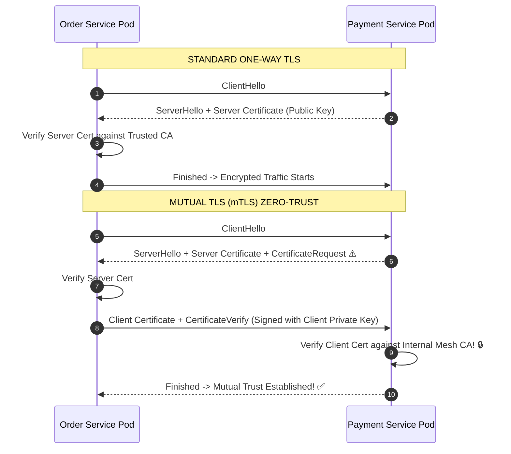

# Lesson 05: TLS 1.3 & Mutual TLS (mTLS)

Master symmetric vs asymmetric cryptography, Elliptic Curve Diffie-Hellman (ECDHE), Certificate Authority (CA) validation chains, and Mutual TLS (mTLS) for zero-trust service meshes.

---

## 1. What Is It?
- **Standard TLS (One-Way TLS)**: The client authenticates the server's identity using a public Certificate Authority (CA) chain and establishes an encrypted session.
- **Mutual TLS (mTLS)**: **Both the client and the server** present and cryptographically verify each other's X.509 digital certificates before establishing a connection.

---

## 2. Why Does It Exist?
In modern microservice architectures and Zero-Trust networks, network perimeter firewalls are insufficient.

mTLS guarantees that **every internal RPC** between microservices is encrypted and cryptographically authenticated, preventing unauthorized services from making calls even if an attacker gains access to the internal network.

---

## 3. Mental Model: Standard TLS vs Mutual TLS (mTLS)



---

## 4. How Does It Work: Cryptographic Primitives

| Primitive | Mechanism | Purpose in TLS 1.3 |
|---|---|---|
| **Asymmetric Cryptography (ECDSA/RSA)**| Public/Private Key pairs | Identity Authentication & Certificate Signing |
| **Key Exchange (ECDHE)** | Ephemeral Elliptic Curve Diffie-Hellman | Generating shared symmetric session keys |
| **Symmetric Encryption (AES-GCM/ChaCha20)**| Single shared secret key | High-speed, low-overhead bulk payload encryption |
| **HMAC / AEAD** | Authenticated Encryption with Associated Data | Verifying payload integrity and preventing tampering |

---

## 5. Internal Working: Perfect Forward Secrecy (PFS)

TLS 1.3 mandates **Perfect Forward Secrecy (PFS)** by eliminating static RSA key exchange:
1. For every connection, both client and server generate **ephemeral** (single-use) private/public key pairs.
2. If an attacker records all encrypted traffic today and steals the server's private master certificate key 5 years from now, **they still cannot decrypt past recorded sessions** because the ephemeral Diffie-Hellman keys were wiped from RAM immediately after the handshake.

---

## 6. Example & Production Java 21 Code

Configuring Mutual TLS (mTLS) with custom KeyStore and TrustStore in Java 21 `HttpClient`:

```java
package com.backend.networking.mtls;

import javax.net.ssl.KeyManagerFactory;
import javax.net.ssl.SSLContext;
import javax.net.ssl.TrustManagerFactory;
import java.io.InputStream;
import java.net.URI;
import java.net.http.HttpClient;
import java.net.http.HttpRequest;
import java.net.http.HttpResponse;
import java.security.KeyStore;

public class MtlsSecureClient {

    public static HttpClient createMtlsHttpClient(
        InputStream clientKeyStoreStream, char[] keyStorePassword,
        InputStream trustStoreStream, char[] trustStorePassword
    ) throws Exception {
        // 1. Load Client Certificate & Private Key (For Client Authentication)
        KeyStore keyStore = KeyStore.getInstance("PKCS12");
        keyStore.load(clientKeyStoreStream, keyStorePassword);
        KeyManagerFactory kmf = KeyManagerFactory.getInstance(KeyManagerFactory.getDefaultAlgorithm());
        kmf.init(keyStore, keyStorePassword);

        // 2. Load Internal CA TrustStore (To Verify Server Identity)
        KeyStore trustStore = KeyStore.getInstance("PKCS12");
        trustStore.load(trustStoreStream, trustStorePassword);
        TrustManagerFactory tmf = TrustManagerFactory.getInstance(TrustManagerFactory.getDefaultAlgorithm());
        tmf.init(trustStore);

        // 3. Initialize TLS 1.3 Context with Mutual Authentication
        SSLContext sslContext = SSLContext.getInstance("TLSv1.3");
        sslContext.init(kmf.getKeyManagers(), tmf.getTrustManagers(), null);

        return HttpClient.newBuilder()
            .sslContext(sslContext)
            .version(HttpClient.Version.HTTP_2)
            .build();
    }
}
```

---

## 7. Performance Characteristics
- **AES-NI Hardware Acceleration**: Modern Intel/AMD CPUs feature dedicated AES instructions, encrypting and decrypting data at line rate ($> 50\text{ Gbps}$ per core) with negligible CPU overhead ($< 1\%$).

---

## 8. Failure Scenarios & Edge Cases
- **Certificate Expiration Outage**: The #1 cause of major cloud outages (Microsoft Azure, Spotify). When an internal mTLS root or leaf certificate expires, all inter-service communication fails instantly.
  - **Mitigation**: Deploy automated certificate rotation engines (HashiCorp Vault or cert-manager in Kubernetes) with alerts triggered 30 days before expiration.

---

## 9. Observability (Logs, Metrics, Traces)
```text
# mTLS Certificate Expiration Metrics
certificate_days_until_expiry{domain="payment-service.internal"} 28
mtls_handshake_failures_total{reason="UNTRUSTED_CLIENT_CERT"} 0
```

---

## 10. Debugging & Troubleshooting
1. **Inspect Remote Certificate Chain via OpenSSL**:
   ```bash
   openssl s_client -connect internal.service:8443 -showcerts
   ```
2. **Test mTLS Connection with Client Certificates**:
   ```bash
   curl -v --cert client.crt --key client.key --cacert ca.crt https://internal.service:8443/health
   ```

---

## 11. Scaling Considerations
- Offload mTLS encryption to sidecar proxies (**Envoy / Istio / Linkerd**) so application containers do not need to manage certificate rotation or TLS handshakes.

---

## 12. Architectural Trade-offs
| Security Architecture | Authentication | Encryption | Operational Complexity |
|---|---|---|---|
| **Plain HTTP (Internal VPC)**| Network perimeter only| None | Zero |
| **One-Way TLS** | Server only | Full | Low |
| **Mutual TLS (mTLS)** | **Both Server & Client**| **Full** | **High (Requires CA & Rotation engine)**|

---

## 13. When to Use
- Mandate **mTLS** for all inter-service communication in Zero-Trust and PCI-DSS compliant production microservice environments.

---

## 14. When NOT to Use
- Do not require mTLS on public-facing internet endpoints (public end-users do not have client certificates installed on their phones).

---

## 15. SDE2 / Senior Interview Questions & Answers
### Q1: What is Perfect Forward Secrecy (PFS), and how does TLS 1.3 guarantee it?
<details>
<summary>Reveal Answer</summary>

**Answer**:
- **Perfect Forward Secrecy (PFS)** guarantees that even if an attacker compromises the server's long-term private master key in the future, they cannot decrypt previously recorded encrypted traffic.
- **How TLS 1.3 Guarantees It**:
  - In legacy TLS 1.2, static RSA key exchange allowed the client to encrypt the pre-master secret directly with the server's public key. If the server's private key was ever leaked, all past sessions could be retroactively decrypted.
  - **TLS 1.3 completely removed static RSA key exchange**. It strictly mandates **Ephemeral Diffie-Hellman (ECDHE)**. For every single session, ephemeral keys are generated in RAM, used to compute a temporary symmetric secret, and discarded immediately.
</details>

---

## 16. Practical Exercise
1. Generate a self-signed Root CA, Server Certificate, and Client Certificate using `openssl`.
2. Connect using `curl --cert` and observe successful mTLS verification.

---

## 17. Quick Revision Summary
- **mTLS authenticates both client and server** using digital certificates.
- **Perfect Forward Secrecy (PFS)** protects past sessions from future key compromise.
- Use **sidecar proxies (Envoy / Istio)** to automate mTLS certificate rotation.
