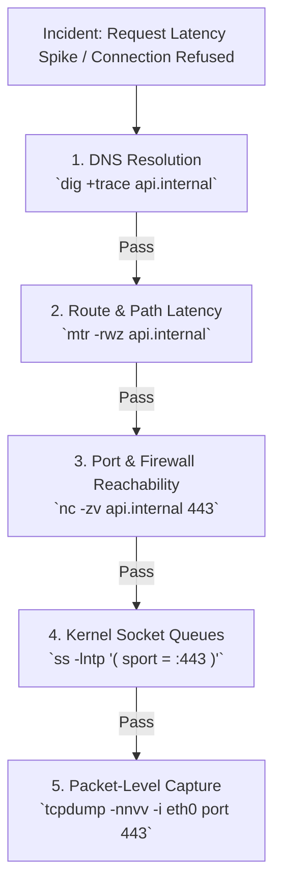

# Lesson 06: Network Diagnostics & Troubleshooting

Master production network debugging tools: `tcpdump` packet captures, `ss` socket diagnostics, Wireshark analysis, MTU black hole detection, and packet drop root-cause analysis.

---

## 1. What Is It?
The systematic methodology and tooling used to isolate, analyze, and resolve network anomalies, connection drops, latency spikes, and packet corruption in production Linux backend environments.

---

## 2. Why Does It Exist?
When an incident occurs ("Service A cannot reach Service B"), developers often waste hours blaming application code. Mastery of network diagnostic tools allows engineers to definitively prove whether an issue is caused by DNS failures, firewall drops, MTU mismatches, or TCP queue overflows in minutes.

---

## 3. Mental Model: The Production Network Triage Funnel



---

## 4. How Does It Work: The Senior Engineer's Network Toolkit

| Tool | Primary Use Case | Critical Production Command |
|---|---|---|
| **`ss`** | Inspect kernel socket queues and states | `ss -s` and `ss -ti` |
| **`tcpdump`**| Live packet capture and inspection | `tcpdump -nn -c 100 -i any port 8080` |
| **`mtr`** | Combined traceroute + ping loss analysis | `mtr --report --report-cycles 10 api.internal` |
| **`nc` (netcat)**| Port reachability and TCP testing | `nc -zvw3 api.internal 443` |
| **`dig`** | Authoritative and recursive DNS tracing | `dig +trace +nodnssec api.internal` |
| **`lsof`** | Map open sockets to process IDs | `lsof -i :8080 -nP` |

---

## 5. Internal Working: Capturing Packets with `tcpdump`

`tcpdump` leverages the Linux kernel's **BPF (Berkeley Packet Filter)** engine to copy matching raw packets from the network driver before they reach the TCP stack:

```bash
# Capture TCP SYN packets (Connection Attempts) on port 8080
sudo tcpdump -nn -i any "tcp[tcpflags] & (tcp-syn) != 0 and port 8080" -w syn_traffic.pcap
```

---

## 6. Example & Production Java 21 Code

Programmatic network diagnostic probe in Java 21 testing DNS, TCP, and TLS reachability:

```java
package com.backend.networking.diagnostics;

import javax.net.ssl.SSLSocket;
import javax.net.ssl.SSLSocketFactory;
import java.net.InetAddress;
import java.net.InetSocketAddress;
import java.net.Socket;
import java.time.Duration;
import java.time.Instant;

public class NetworkHealthProbe {

    public record DiagnosticResult(
        String host, int port,
        long dnsDurationMs, long tcpDurationMs, long tlsDurationMs,
        boolean success, String error
    ) {}

    public static DiagnosticResult probe(String host, int port, int timeoutMs) {
        long dnsMs = 0, tcpMs = 0, tlsMs = 0;
        try {
            // 1. DNS Resolution Probe
            Instant start = Instant.now();
            InetAddress address = InetAddress.getByName(host);
            dnsMs = Duration.between(start, Instant.now()).toMillis();

            // 2. TCP Handshake Probe
            start = Instant.now();
            try (Socket socket = new Socket()) {
                socket.connect(new InetSocketAddress(address, port), timeoutMs);
                tcpMs = Duration.between(start, Instant.now()).toMillis();

                // 3. TLS Handshake Probe (if port 443)
                if (port == 443) {
                    start = Instant.now();
                    SSLSocketFactory ssf = (SSLSocketFactory) SSLSocketFactory.getDefault();
                    try (SSLSocket sslSocket = (SSLSocket) ssf.createSocket(socket, host, port, true)) {
                        sslSocket.startHandshake();
                        tlsMs = Duration.between(start, Instant.now()).toMillis();
                    }
                }
            }

            return new DiagnosticResult(host, port, dnsMs, tcpMs, tlsMs, true, null);
        } catch (Exception e) {
            return new DiagnosticResult(host, port, dnsMs, tcpMs, tlsMs, false, e.getMessage());
        }
    }
}
```

---

## 7. Performance Characteristics
- **`tcpdump` Overhead**: Filtering with precise BPF filters consumes $< 2\%$ CPU. However, capturing full packet payloads without `-s 128` (snaplen) on a 10Gbps interface can saturate disk I/O and drop packets.

---

## 8. Failure Scenarios & Edge Cases
- **Silent Drops via State Table Overflow**: A Stateful Firewall / NAT Gateway runs out of connection tracking table entries (`nf_conntrack: table full, dropping packet`), silently dropping new connections without returning `RST` or `ICMP`.
  - **Mitigation**: Monitor `net.netfilter.nf_conntrack_count` against `nf_conntrack_max`.

---

## 9. Observability (Logs, Metrics, Traces)
```text
# Linux Kernel Packet Drop Counters
node_netstat_IpExt_InDiscards 0
node_netstat_TcpExt_TCPBacklogDrop 0
node_netstat_TcpExt_ListenOverflows 0
```

---

## 10. Debugging & Troubleshooting
1. **Analyze Packet Drop Root Causes via `nstat`**:
   ```bash
   nstat -az | grep -E "Drop|Reject|Overflow"
   ```
2. **Check NAT Connection Tracking Table**:
   ```bash
   cat /proc/sys/net/netfilter/nf_conntrack_count
   ```

---

## 11. Scaling Considerations
- In high-throughput clusters, increase `nf_conntrack_max` to `1048576` to prevent firewall packet drops during traffic surges.

---

## 12. Architectural Trade-offs
| Diagnostic Level | Information Depth | Production Overhead | Tool |
|---|---|---|---|
| **Socket Stats** | High-level (States, Queues)| Negligible | `ss`, `netstat` |
| **Packet Capture** | **Exact (Byte-level headers)**| Low-Moderate | `tcpdump`, Wireshark |

---

## 13. When to Use
- Use `ss` first to check socket states; escalate to `tcpdump` when investigating mysterious connection resets or TLS negotiation failures.

---

## 14. When NOT to Use
- Never run unconstrained `tcpdump -w full.pcap` on high-traffic production nodes without size limits (`-C 100 -W 5`).

---

## 15. SDE2 / Senior Interview Questions & Answers
### Q1: How do you differentiate between a network firewall drop vs an application crash when a client receives `Connection Refused` vs `Connection Timed Out`?
<details>
<summary>Reveal Answer</summary>

**Answer**:
- **`Connection Refused` (`ECONNREFUSED` / TCP RST)**:
  - The network packet successfully reached the destination server.
  - The OS kernel received the `SYN` packet, checked its list of listening ports, found that **no application was listening on that port** (application crashed or was restarting), and sent back an immediate `RST` packet.
- **`Connection Timed Out` (`ETIMEDOUT`)**:
  - The client sent a `SYN` packet and waited, but received **zero response**.
  - This indicates that a **network firewall, security group, or routing rule** silently dropped the packet (or the target machine is powered off / partitioned).
</details>

---

## 16. Practical Exercise
1. Run `ss -s` on your terminal to view real-time socket memory allocations.
2. Run `nc -zvw2 1.1.1.1 443` to verify TCP connectivity and measure handshake latency.

---

## 17. Quick Revision Summary
- `Connection Refused` = **Host reached, but no process listening on port (RST returned)**.
- `Connection Timed Out` = **Firewall / Routing silent drop (No response)**.
- Use **`ss -ti`** for TCP metrics and **`tcpdump`** for byte-level packet tracing.
