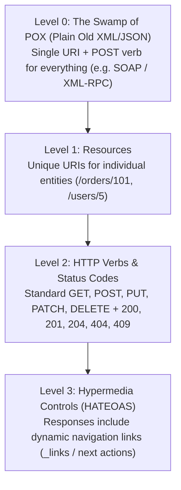

# Lesson 01: REST Principles & Richardson Maturity Model

Master the 6 architectural constraints of REST, the 4 levels of the Richardson Maturity Model, resource URI design rules, and HTTP status code selection.

---

## 1. What Is It?
- **REST (Representational State Transfer)**: An architectural style defined by Roy Fielding that relies on a stateless, client-server, cacheable communications protocol (typically HTTP).
- **Richardson Maturity Model (RMM)**: A heuristic framework (Levels 0 through 3) that grades an API's adherence to RESTful principles.

---

## 2. Why Does It Exist?
Without strict API design conventions, backend endpoints degrade into chaotic RPC endpoints (`/submitOrder`, `/update_user_name_v2`, `/deleteItem?id=5`) with inconsistent HTTP verbs, uncacheable responses, and unpredictable error formats.

---

## 3. Mental Model: Richardson Maturity Model



---

## 4. How Does It Work: HTTP Verbs & Idempotency Rules

| HTTP Verb | Purpose | Safe (Read-Only) | Idempotent | Success Code |
|---|---|:---:|:---:|:---:|
| **`GET`** | Retrieve resource | **Yes** | **Yes** | `200 OK` |
| **`POST`**| Create resource / Action | No | **No** | `201 Created` |
| **`PUT`** | Full replacement of resource | No | **Yes** | `200 OK` / `204 No Content` |
| **`PATCH`**| Partial update of resource | No | **No** (by RFC) / Yes (in practice)| `200 OK` |
| **`DELETE`**| Remove resource | No | **Yes** | `204 No Content` |

---

## 5. Internal Working: URI Design Conventions

1. **Use Plural Nouns for Collections**:
   - `GET /v1/orders` (List orders)
   - `POST /v1/orders` (Create order)
   - `GET /v1/orders/{orderId}` (Get single order)
2. **Represent Hierarchical Sub-Resources**:
   - `GET /v1/orders/{orderId}/items` (Get items inside an order)
3. **Handle Non-CRUD Actions with State Sub-Resources**:
   - Bad: `POST /cancelOrder?id=123`
   - Good: `POST /v1/orders/{orderId}/cancellations` or `POST /v1/orders/{orderId}/cancel`

---

## 6. Example & Production Java 21 Code

Level 3 REST Controller with Spring Boot 3 / Java 21 implementing HATEOAS:

```java
package com.backend.apidesign.rest;

import org.springframework.hateoas.EntityModel;
import org.springframework.hateoas.server.mvc.WebMvcLinkBuilder;
import org.springframework.http.ResponseEntity;
import org.springframework.web.bind.annotation.*;

import java.math.BigDecimal;
import java.net.URI;
import java.util.UUID;

import static org.springframework.hateoas.server.mvc.WebMvcLinkBuilder.linkTo;
import static org.springframework.hateoas.server.mvc.WebMvcLinkBuilder.methodOn;

@RestController
@RequestMapping("/v1/orders")
public class OrderRestController {

    public record OrderDto(String orderId, String customerId, BigDecimal totalAmount, String status) {}

    @GetMapping("/{orderId}")
    public ResponseEntity<EntityModel<OrderDto>> getOrder(@PathVariable String orderId) {
        OrderDto order = new OrderDto(orderId, "cust-890", new BigDecimal("149.99"), "PENDING_PAYMENT");

        // Level 3 HATEOAS: Attach hypermedia links for self, payment, and cancellation
        EntityModel<OrderDto> resource = EntityModel.of(order);
        resource.add(linkTo(methodOn(OrderRestController.class).getOrder(orderId)).withSelfRel());
        resource.add(linkTo(methodOn(OrderRestController.class).cancelOrder(orderId)).withRel("cancel"));

        return ResponseEntity.ok(resource);
    }

    @PostMapping("/{orderId}/cancel")
    public ResponseEntity<Void> cancelOrder(@PathVariable String orderId) {
        // Business logic to cancel order...
        return ResponseEntity.noContent().build();
    }
}
```

---

## 7. Performance Characteristics
- **HTTP Cacheability**: Level 2 `GET` requests with `ETag` and `Cache-Control` headers enable CDN and browser caching, eliminating up to $90\%$ of origin database read traffic.

---

## 8. Failure Scenarios & Edge Cases
- **Using 200 OK for Business Failures**: Returning `HTTP 200 OK` with payload `{"status": "error", "message": "Insufficient funds"}` breaks API gateways, monitoring alerts, and HTTP caching proxies.
  - **Rule**: Always return appropriate `4xx`/`5xx` status codes (`402 Payment Required` or `422 Unprocessable Content`).

---

## 9. Observability (Logs, Metrics, Traces)
```text
# HTTP Status Code Distribution Metrics
http_server_requests_seconds_count{uri="/v1/orders/{orderId}",status="200"} 45020
http_server_requests_seconds_count{uri="/v1/orders/{orderId}",status="404"} 12
http_server_requests_seconds_count{uri="/v1/orders/{orderId}",status="500"} 0
```

---

## 10. Debugging & Troubleshooting
1. **Validate REST Headers & Status Codes**:
   ```bash
   curl -i -X GET https://api.production.com/v1/orders/101
   ```

---

## 11. Scaling Considerations
- Enforce strict query pagination on all collection endpoints (`/v1/orders?limit=20`) to prevent out-of-memory crashes on large tables.

---

## 12. Architectural Trade-offs
| API Style | Strengths | Weaknesses | Best Use Case |
|---|---|---|---|
| **REST (Level 2/3)** | Ubiquitous, standard HTTP caching, toolchain support | Over-fetching / Under-fetching | Public APIs, Partner APIs |
| **GraphQL** | Client controls payload shape | Difficult HTTP caching, complex query security | Mobile App Backends (BFF) |
| **gRPC (Protobuf)** | Ultra-fast binary serialization, bidirectional streaming | Requires HTTP/2, poor browser support | Internal Microservice-to-Microservice |

---

## 13. When to Use
- Use REST Level 2 for standard public and partner-facing backend APIs.

---

## 14. When NOT to Use
- Do not force HATEOAS (Level 3) if your API consumers are internal microservices that only care about raw payload performance.

---

## 15. SDE2 / Senior Interview Questions & Answers
### Q1: What is the difference between `PUT` and `PATCH`, and why is `PUT` idempotent while `PATCH` is not strictly guaranteed to be idempotent?
<details>
<summary>Reveal Answer</summary>

**Answer**:
- **`PUT` (Full Resource Replacement)**:
  - The client provides the complete representation of the resource.
  - If a client calls `PUT /users/1` with `{"name": "Alice", "age": 30}` ten times consecutively, the final state of the server is identical after the 1st and the 10th call. Thus, `PUT` is strictly **idempotent**.
- **`PATCH` (Partial Update / Mutation Delta)**:
  - The client provides a partial set of instructions or fields to modify.
  - While simple JSON field updates (`{"age": 31}`) appear idempotent in practice, RFC 5789 defines PATCH as a general set of delta instructions. For example, a JSON Patch operation like `{"op": "increment", "path": "/loginCount", "value": 1}` will increment the counter by 1 every time it is called. Calling it 10 times results in `loginCount = 10`. Thus, `PATCH` is **not inherently idempotent**.
</details>

---

## 16. Practical Exercise
1. Test your endpoints using `curl -i` and verify that `POST` returns `201 Created` with a `Location: /v1/orders/{id}` header.
2. Verify that deleting a non-existent resource returns `204 No Content` or `404 Not Found`.

---

## 17. Quick Revision Summary
- **Level 0**: Single URI + POST (RPC).
- **Level 1**: Plural Noun Resources (`/v1/orders`).
- **Level 2**: Standard HTTP Verbs & Status Codes (`GET`, `POST`, `PUT`, `DELETE`).
- **Level 3**: Hypermedia controls (**HATEOAS**).
