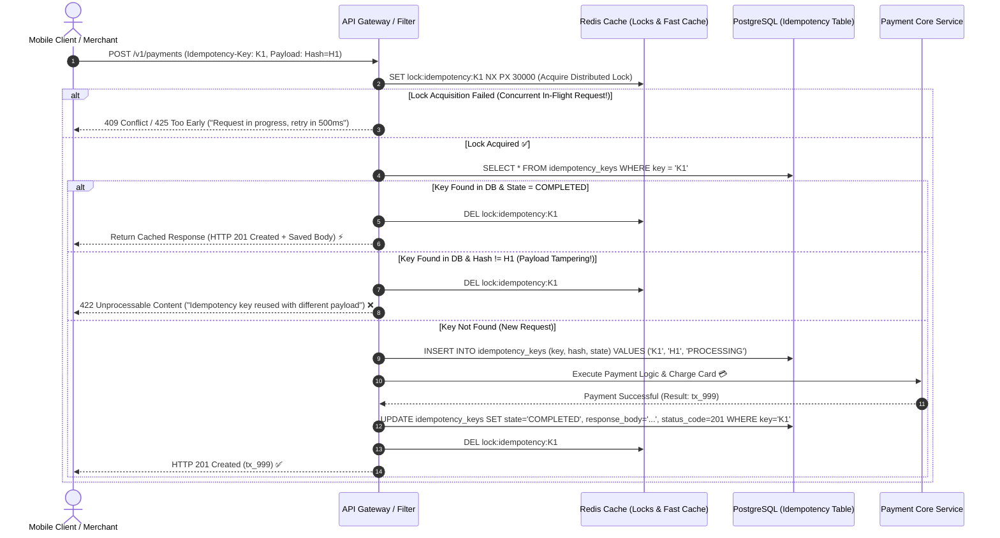

# Lesson 02: Idempotency Keys & Distributed Locking

Master Stripe-style `Idempotency-Key` headers, concurrent duplicate request defense, SHA-256 payload fingerprinting, and atomic Redis + Database persistence.

---

## 1. What Is It?
- **Idempotent API**: An API where making the same request multiple times produces the exact same side-effects and response as making it a single time.
- **Idempotency Key**: A unique client-generated UUID sent in the HTTP request header (`Idempotency-Key: 9b1deb4d-3b7d-4bad-9bdd-2b0d7b3dcb6d`) that identifies a specific transactional operation.

---

## 2. Why Does It Exist?
Network timeouts are ambiguous (the "Two Generals' Problem"): when a client sends a `POST /v1/payments` request and the connection times out after 10 seconds, the client does not know if:
1. The packet was lost before reaching the server (payment was not processed), OR
2. The server processed the payment, but the response packet was lost on the return path.

If the client retries without idempotency guarantees, **the customer will be charged twice**.

---

## 3. Mental Model: The Production Idempotency State Machine



---

## 4. How Does It Work: Database Schema for Idempotency

Production PostgreSQL schema:

```sql
CREATE TABLE idempotency_keys (
    key VARCHAR(128) PRIMARY KEY,
    user_id VARCHAR(64) NOT NULL,
    request_hash VARCHAR(64) NOT NULL,       -- SHA-256 of HTTP Method + URI + Body
    status VARCHAR(32) NOT NULL,             -- 'PROCESSING', 'COMPLETED', 'FAILED'
    response_code INT,
    response_headers JSONB,
    response_body TEXT,
    created_at TIMESTAMP WITH TIME ZONE DEFAULT NOW(),
    expires_at TIMESTAMP WITH TIME ZONE NOT NULL
);

CREATE INDEX idx_idempotency_expiry ON idempotency_keys (expires_at);
```

---

## 5. Internal Working: Payload Fingerprinting (SHA-256)

To prevent security bugs where an attacker reuses someone else's idempotency key with a malicious payload:
$$\text{Request Hash} = \text{SHA-256}(\text{HTTP Method} + \text{URI} + \text{Sorted JSON Payload} + \text{UserID})$$

If the key exists but the `request_hash` differs, the server immediately rejects the request with **`422 Unprocessable Content`**.

---

## 6. Example & Production Java 21 Code

Production-grade Spring Boot 3 / Java 21 Idempotency Filter using Redisson and PostgreSQL:

```java
package com.backend.apidesign.idempotency;

import org.redisson.api.RLock;
import org.redisson.api.RedissonClient;
import org.springframework.http.HttpStatus;
import org.springframework.http.ResponseEntity;
import org.springframework.stereotype.Service;
import org.springframework.transaction.annotation.Transactional;

import java.nio.charset.StandardCharsets;
import java.security.MessageDigest;
import java.time.Instant;
import java.time.temporal.ChronoUnit;
import java.util.HexFormat;
import java.util.concurrent.TimeUnit;
import java.util.function.Supplier;

@Service
public class IdempotencyManager {

    private final RedissonClient redissonClient;
    private final IdempotencyRepository repository;

    public record ExecutionResult(int statusCode, String body) {}

    public IdempotencyManager(RedissonClient redissonClient, IdempotencyRepository repository) {
        this.redissonClient = redissonClient;
        this.repository = repository;
    }

    public ExecutionResult execute(String idempotencyKey, String payload, Supplier<ExecutionResult> businessLogic) throws Exception {
        String lockKey = "lock:idempotency:" + idempotencyKey;
        RLock lock = redissonClient.getLock(lockKey);

        // 1. Acquire Redis distributed lock with 5s wait time and 30s lease
        if (!lock.tryLock(5, 30, TimeUnit.SECONDS)) {
            throw new ConcurrentRequestException("Concurrent request in progress for key: " + idempotencyKey);
        }

        try {
            String payloadHash = calculateSha256(payload);

            // 2. Check Database Record
            var existingRecord = repository.findById(idempotencyKey);
            if (existingRecord.isPresent()) {
                var record = existingRecord.get();
                if (!record.requestHash().equals(payloadHash)) {
                    throw new PayloadMismatchException("Idempotency key reused with different request payload!");
                }
                if ("COMPLETED".equals(record.status())) {
                    // Return cached response instantly!
                    return new ExecutionResult(record.responseCode(), record.responseBody());
                }
            }

            // 3. Save initial PROCESSING state
            repository.saveProcessing(idempotencyKey, payloadHash, Instant.now().plus(24, ChronoUnit.HOURS));

            // 4. Execute the actual transactional business logic
            ExecutionResult result = businessLogic.get();

            // 5. Update state to COMPLETED with cached response
            repository.saveCompleted(idempotencyKey, result.statusCode(), result.body());
            return result;
        } finally {
            if (lock.isHeldByCurrentThread()) {
                lock.unlock();
            }
        }
    }

    private String calculateSha256(String data) throws Exception {
        MessageDigest digest = MessageDigest.getInstance("SHA-256");
        byte[] hash = digest.digest(data.getBytes(StandardCharsets.UTF_8));
        return HexFormat.of().formatHex(hash);
    }
}
```

---

## 7. Performance Characteristics
- **Cache Hit Latency**: Subsequent duplicate requests bypass all core business logic and downstream microservices, returning in $< 5\text{ms}$ from Redis/PostgreSQL.

---

## 8. Failure Scenarios & Edge Cases
- **Crash During Processing**: If the server crashes after charging the payment processor but before updating the idempotency table to `COMPLETED`:
  - **Mitigation**: Implement a recovery worker that reconciles `PROCESSING` records older than 2 minutes against the payment processor's query API.

---

## 9. Observability (Logs, Metrics, Traces)
```text
# Idempotency Metrics
idempotency_requests_total{result="cache_hit"} 320
idempotency_requests_total{result="first_execution"} 12450
idempotency_requests_total{result="payload_mismatch"} 2
idempotency_concurrent_conflicts_total 15
```

---

## 10. Debugging & Troubleshooting
1. **Test Concurrent Idempotency via `wrk` or `curl`**:
   ```bash
   # Send two identical POST requests concurrently with the same Idempotency-Key
   curl -H "Idempotency-Key: test-uuid-001" -d '{"amount": 100}' https://api.internal/v1/payments &
   curl -H "Idempotency-Key: test-uuid-001" -d '{"amount": 100}' https://api.internal/v1/payments &
   ```

---

## 11. Scaling Considerations
- Set a **24-hour to 7-day TTL** on idempotency records. Run a background cron job (`DELETE FROM idempotency_keys WHERE expires_at < NOW()`) to prevent unbounded table growth.

---

## 12. Architectural Trade-offs
| Storage Strategy | Read Latency | Durability | Crash Recovery |
|---|---|---|---|
| **Redis Only** | Ultra-Fast ($< 1\text{ms}$) | Volatile (Data lost on eviction/restart) | Hard |
| **PostgreSQL Only**| Moderate ($\sim 5\text{ms}$) | $100\%$ ACID Durable | Easy |
| **Hybrid (Redis Lock + PG DB)**| **Optimal (Fast lock, durable result)**| **$100\%$ Durable** | **Best** |

---

## 13. When to Use
- Mandate idempotency keys on **all non-idempotent financial and state-mutating endpoints** (`POST /v1/charges`, `POST /v1/transfers`, `POST /v1/orders`).

---

## 14. When NOT to Use
- Never require idempotency keys on read-only `GET` or `HEAD` endpoints.

---

## 15. SDE2 / Senior Interview Questions & Answers
### Q1: How do you design an idempotency mechanism that handles concurrent duplicate requests arriving within 10 milliseconds of each other?
<details>
<summary>Reveal Answer</summary>

**Answer**:
1. **Distributed Mutex Lock**: When the first request arrives with `Idempotency-Key: K1`, the server attempts an atomic Redis `SET lock:idempotency:K1 NX PX 10000` (acquire lock if not exists with 10s expiry).
2. **First Request**: Acquires the lock, verifies no completed record exists in PostgreSQL, inserts a row with `status='PROCESSING'`, and begins executing the transaction.
3. **Second Concurrent Request**: Arrives 5ms later and fails to acquire the Redis lock.
4. **Handling the Conflict**: The second request can either:
   - Wait/Poll with exponential backoff for up to 3 seconds for the lock to release and the response to be cached, OR
   - Return an immediate **`409 Conflict`** or **`425 Too Early`** with a `Retry-After: 1` header instructing the client to retry momentarily.
5. **Completion**: When the first request finishes, it updates the database to `status='COMPLETED'`, caches the serialized JSON response, and releases the Redis lock.
</details>

---

## 16. Practical Exercise
1. Implement an integration test with 10 concurrent threads submitting identical payment requests with the same `Idempotency-Key`.
2. Verify that the bank account is debited exactly once and all 10 threads receive identical successful response bodies.

---

## 17. Quick Revision Summary
- **Idempotency Keys** protect clients against ambiguous network timeouts.
- **SHA-256 Payload Hash** prevents key reuse with altered request bodies.
- Use **Redis distributed locks** to block concurrent duplicate in-flight requests.
