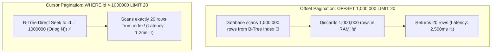

# Lesson 03: Pagination, Filtering & Sorting

Master Offset-based pagination vs Keyset/Cursor-based pagination, deep pagination database performance cliffs, dynamic filtering criteria, and compound index sorting.

---

## 1. What Is It?
- **Offset Pagination**: Paginating through records using `LIMIT page_size OFFSET (page - 1) * page_size`.
- **Keyset / Cursor Pagination**: Paginating through records by passing a token representing the last seen record's unique sort key (`WHERE (created_at, id) < (cursor_time, cursor_id) ORDER BY created_at DESC, id DESC LIMIT 20`).

---

## 2. Why Does It Exist?
Offset pagination fails catastrophically at scale:
1. **$O(N)$ Performance Cliff**: To execute `OFFSET 1000000 LIMIT 20`, the database engine must scan and discard $1,000,000$ index rows in memory before returning 20 records.
2. **Data Drift & Duplication**: If a new record is inserted on page 1 while a user is browsing page 2, all records shift down by 1, causing the user to see duplicate items on page 2.

---

## 3. Mental Model: Offset vs Cursor Pagination Execution



---

## 4. How Does It Work: Comparing Pagination Techniques

| Metric | Offset Pagination (`OFFSET N`) | Keyset / Cursor Pagination (`WHERE id > C`) |
|---|---|---|
| **SQL Syntax** | `LIMIT 20 OFFSET 50000` | `WHERE id > 50000 ORDER BY id ASC LIMIT 20` |
| **Time Complexity** | **$O(N)$ (Degrades linearly with page depth)**| **$O(1)$ / $O(\log N)$ (Constant speed on any page)**|
| **Data Drift Resilient** | No (Duplicates or skipped items on insert/delete) | **Yes (Rock-solid consistency)** |
| **Random Page Jump** | Yes (`Jump to Page 47`) | No (Only `Next` / `Previous`) |
| **Best For** | Admin dashboards with $< 500$ rows | Infinite scroll feeds, high-scale public APIs |

---

## 5. Internal Working: Encoding Opaque Cursors

In modern REST APIs, never expose raw database auto-increment IDs in cursors. Instead, serialize a base64-encoded token containing the composite sort keys:

```text
Cursor Data: {"createdAt": "2026-09-01T12:00:00Z", "id": "ord_99482"}
Base64 Token: eyJjcmVhdGVkQXQiOiIyMDI2LTA5LTAxVDEyOjAwOjAwWiIsImlkIjoib3JkXzk5NDgyIn0=
```

API URL:
`GET /v1/orders?limit=20&starting_after=eyJjcmVhdGVkQXQiOiIyMDI2LTA5...`

---

## 6. Example & Production Java 21 Code

Cursor pagination repository query with Spring Data JPA and Java 21:

```java
package com.backend.apidesign.pagination;

import com.fasterxml.jackson.databind.ObjectMapper;
import org.springframework.stereotype.Service;

import java.nio.charset.StandardCharsets;
import java.time.Instant;
import java.util.Base64;
import java.util.List;

@Service
public class OrderCursorPaginationService {

    private final ObjectMapper objectMapper = new ObjectMapper();
    private final OrderRepository orderRepository;

    public record CursorToken(Instant createdAt, String orderId) {}
    public record PaginatedResponse<T>(List<T> data, String nextCursor, boolean hasMore) {}

    public OrderCursorPaginationService(OrderRepository orderRepository) {
        this.orderRepository = orderRepository;
    }

    public PaginatedResponse<OrderEntity> getOrders(String cursorStr, int limit) throws Exception {
        Instant seekTime = Instant.now();
        String seekId = "zzzzzzzz"; // Default upper bound

        if (cursorStr != null && !cursorStr.isBlank()) {
            byte[] decoded = Base64.getUrlDecoder().decode(cursorStr);
            CursorToken token = objectMapper.readValue(decoded, CursorToken.class);
            seekTime = token.createdAt();
            seekId = token.orderId();
        }

        // Fetch limit + 1 to check if there are more records
        List<OrderEntity> orders = orderRepository.findOrdersByCursor(seekTime, seekId, limit + 1);

        boolean hasMore = orders.size() > limit;
        if (hasMore) {
            orders = orders.subList(0, limit);
        }

        String nextCursor = null;
        if (hasMore && !orders.isEmpty()) {
            OrderEntity last = orders.getLast(); // Java 21 Sequenced Collection
            CursorToken nextToken = new CursorToken(last.getCreatedAt(), last.getId());
            byte[] jsonBytes = objectMapper.writeValueAsBytes(nextToken);
            nextCursor = Base64.getUrlEncoder().encodeToString(jsonBytes);
        }

        return new PaginatedResponse<>(orders, nextCursor, hasMore);
    }
}
```

Corresponding SQL Query:
```sql
SELECT * FROM orders
WHERE (created_at < :seekTime) OR (created_at = :seekTime AND id < :seekId)
ORDER BY created_at DESC, id DESC
LIMIT :limitPlusOne;
```

---

## 7. Performance Characteristics
- **Query Latency Comparison ($10\text{ Million Rows}$)**:
  - `OFFSET 5000000 LIMIT 20`: **$4,800\text{ ms}$** (Full index scan + discard).
  - Keyset Cursor Seek: **$0.8\text{ ms}$** ($6000\times$ faster!).

---

## 8. Failure Scenarios & Edge Cases
- **Non-Unique Sort Column**: Paginating on a non-unique column (`ORDER BY status DESC`) causes pagination to skip rows with duplicate status values.
  - **Rule**: Always include the primary key (`id`) as a tiebreaker in compound cursor ordering (`ORDER BY status DESC, id DESC`).

---

## 9. Observability (Logs, Metrics, Traces)
```text
# Slow Pagination Query Metrics
database_slow_queries_total{query_type="offset_pagination"} 45
database_cursor_pagination_p99_latency_seconds 0.002
```

---

## 10. Debugging & Troubleshooting
1. **Inspect Query Execution Plan with `EXPLAIN ANALYZE`**:
   ```sql
   EXPLAIN ANALYZE SELECT * FROM orders WHERE (created_at, id) < ('2026-09-01', 'ord_100') ORDER BY created_at DESC, id DESC LIMIT 20;
   -- Must show "Index Scan using idx_orders_created_id" with Rows Removed by Filter = 0!
   ```

---

## 11. Scaling Considerations
- Always create a **composite B-Tree index** matching your exact cursor ordering:
  ```sql
  CREATE INDEX idx_orders_cursor ON orders (created_at DESC, id DESC);
  ```

---

## 12. Architectural Trade-offs
| Strategy | Implementation Complexity | Deep Page Latency | User UI Fit |
|---|---|---|---|
| **Offset Pagination** | Trivial | Terrible ($O(N)$) | Jump to page number UI |
| **Cursor Pagination** | Moderate | **Constant ($O(1)$)** | Infinite scroll feeds |

---

## 13. When to Use
- Mandate **Cursor Pagination** for high-volume datasets, public REST APIs, and mobile feeds.

---

## 14. When NOT to Use
- Do not use Cursor pagination for small tables ($< 1,000$ rows) where users require jumping to specific arbitrary page numbers.

---

## 15. SDE2 / Senior Interview Questions & Answers
### Q1: Why does `SELECT * FROM orders ORDER BY id LIMIT 20 OFFSET 1000000` run extremely slowly on PostgreSQL, and how does keyset pagination resolve it?
<details>
<summary>Reveal Answer</summary>

**Answer**:
- **Why it is slow**: The database engine does not magically skip the first $1,000,000$ rows. It must traverse the B-Tree index, fetch or evaluate $1,000,020$ index entries, count through the first million, discard them in memory, and return the final 20 rows. As the offset increases, disk I/O and CPU memory scanning grow linearly ($O(N)$).
- **How Keyset Pagination resolves it**: By using `WHERE id > 1000000 ORDER BY id LIMIT 20`, the database uses a **B-Tree binary search seek ($O(\log N)$)** to jump directly to the row where `id = 1000000` and reads exactly 20 consecutive rows from the leaf page. Latency remains constant at $\sim 1\text{ms}$ whether fetching page 1 or page 50,000.
</details>

---

## 16. Practical Exercise
1. Run `EXPLAIN ANALYZE` on an `OFFSET 100000` query vs a `WHERE id > 100000` query on a local PostgreSQL container.
2. Observe the dramatic reduction in `shared hit blocks` and execution time.

---

## 17. Quick Revision Summary
- **Offset Pagination** degrades at $O(N)$ and suffers from data drift.
- **Cursor Pagination** operates at $O(1)$ constant time using B-Tree index seeks.
- Always include a **unique tiebreaker column** (`id`) in composite cursor indexes.
