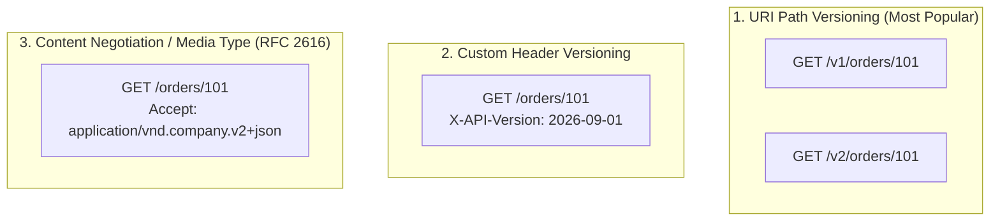

# Lesson 04: API Versioning Strategies & Evolution

Master URI path versioning vs Header versioning vs Media Type versioning, non-breaking schema evolution rules, and deprecation standards (`Sunset` RFC 8594).

---

## 1. What Is It?
- **API Versioning**: The practice of managing changes to an API's contract (endpoints, request payloads, response structures) over time without breaking existing client integrations.
- **Breaking Change**: Any change to an API schema that causes previously working client applications to fail or throw deserialization exceptions.

---

## 2. Why Does It Exist?
Mobile applications installed on end-user smartphones may not update for months or years. If backend engineers rename or remove a JSON field without a backwards-compatible versioning strategy, millions of client mobile apps will crash immediately.

---

## 3. Mental Model: The 3 Primary API Versioning Strategies



---

## 4. How Does It Work: Comparing Versioning Strategies

| Strategy | Example | Pros | Cons |
|---|---|---|---|
| **URI Path** | `/v1/orders` | Clear, easily testable in browsers, simple CDN caching | Violates pure REST URI permanence |
| **Custom Header** | `X-API-Version: 2` | Clean URIs | Harder to test in browsers, requires custom cache keys |
| **Media Type (Accept)**| `Accept: application/vnd.app.v2+json`| Pure REST compliance | Complex client configuration |

---

## 5. Internal Working: Breaking vs Non-Breaking Schema Changes

### Non-Breaking Changes (Safe to deploy without new version)
- Adding a **new optional request field**.
- Adding a **new field to a response payload** (clients must be configured with `DeserializationFeature.FAIL_ON_UNKNOWN_PROPERTIES = false`).
- Adding a **new endpoint** (`POST /v1/orders/{id}/refund`).

### Breaking Changes (Requires new API version)
- Renaming or deleting an existing field (`userId` $\to$ `customerGuid`).
- Changing field data types (`"amount": 100` $\to$ `"amount": "100.00"`).
- Adding a **new mandatory request parameter**.
- Changing HTTP status codes for success or error conditions.

---

## 6. Example & Production Java 21 Code

Implementing standard Deprecation and `Sunset` headers (RFC 8594) in Spring Boot 3 / Java 21:

```java
package com.backend.apidesign.versioning;

import org.springframework.http.ResponseEntity;
import org.springframework.web.bind.annotation.GetMapping;
import org.springframework.web.bind.annotation.RequestMapping;
import org.springframework.web.bind.annotation.RestController;

import java.time.ZonedDateTime;
import java.time.format.DateTimeFormatter;

@RestController
@RequestMapping("/v1/users")
public class LegacyUserRestController {

    @GetMapping
    public ResponseEntity<String> getLegacyUsers() {
        // RFC 8594 Standard Deprecation & Sunset Headers
        String sunsetDate = ZonedDateTime.now().plusMonths(6).format(DateTimeFormatter.RFC_1123_DATE_TIME);

        return ResponseEntity.ok()
            .header("Deprecation", "@1756700000") // Unix timestamp or 'true'
            .header("Sunset", sunsetDate)          // "Sun, 01 Mar 2027 00:00:00 GMT"
            .header("Link", "<https://docs.api.com/migrations/v2>; rel="deprecation"; type="text/html"")
            .body("{"message": "Please migrate to /v2/users"}");
    }
}
```

---

## 7. Performance Characteristics
- **CDN Caching with Header Versioning**: When using Header or Media Type versioning, CDNs must be configured with `Vary: X-API-Version, Accept` to avoid serving v1 cached responses to v2 clients.

---

## 8. Failure Scenarios & Edge Cases
- **Silent Mobile Deserialization Crashes**: An engineer adds a new field to an internal enum. Android apps built with strict enum mapping throw `IllegalArgumentException` on app startup and crash in production.
  - **Mitigation**: Clients should use unknown enum fallbacks (`@JsonEnumDefaultValue`).

---

## 9. Observability (Logs, Metrics, Traces)
```text
# API Version Usage Metrics
http_requests_by_version_total{version="v1"} 4100
http_requests_by_version_total{version="v2"} 89400
```

---

## 10. Debugging & Troubleshooting
1. **Inspect Sunset and Deprecation Headers**:
   ```bash
   curl -I https://api.production.com/v1/users
   # Look for: Sunset: Wed, 01 Sep 2027 00:00:00 GMT
   ```

---

## 11. Scaling Considerations
- Route version prefixes at the **API Gateway Layer** (e.g., Envoy routes `/v1/*` to Legacy Pods and `/v2/*` to Modern Pods) allowing independent horizontal scaling.

---

## 12. Architectural Trade-offs
| Evolution Pattern | Developer Ergonomics | Deployment Isolation | Maintenance Cost |
|---|---|---|---|
| **URI Path (`/v1`)** | High | High (Independent services) | Moderate (Dual maintenance) |
| **Additive Evolution (No version)**| High | Single Codebase | Lowest |

---

## 13. When to Use
- Use **URI Path Versioning (`/v1/`, `/v2/`)** for all public developer-facing APIs (Stripe, Twilio, GitHub standard).

---

## 14. When NOT to Use
- Do not create a `/v2` endpoint if a change can be made additively (e.g., adding an optional JSON field).

---

## 15. SDE2 / Senior Interview Questions & Answers
### Q1: How do you safely deprecate and decommission an old API version without breaking external enterprise consumers?
<details>
<summary>Reveal Answer</summary>

**Answer**:
1. **Publish RFC 8594 Headers**: Add `Deprecation: true`, `Sunset: <Date>`, and `Link: <docs>; rel="deprecation"` HTTP response headers to all responses on the old version.
2. **Telemetry & Client Attribution**: Tag API Gateway logs with consumer API Keys and track exact daily call volume per enterprise client on the deprecated endpoint.
3. **Automated Warning Outreach**: Trigger automated email notifications to enterprise client accounts still generating $>0$ calls on the deprecated version 90, 60, and 30 days before sunset.
4. **Brownouts (Chaos Deprecation)**: 2 weeks before sunset, initiate controlled "brownouts" (e.g., return `410 Gone` or `429` for 15 minutes during non-peak hours) to force dormant client engineering teams to notice the failure.
5. **Final Cutover**: On sunset date, permanently route the endpoint to return `HTTP 410 Gone`.
</details>

---

## 16. Practical Exercise
1. Add `Sunset` and `Deprecation` response headers to a local Spring Boot endpoint.
2. Verify headers using `curl -I http://localhost:8080/v1/legacy`.

---

## 17. Quick Revision Summary
- Prefer **URI Path Versioning (`/v1/`)** for clarity and CDN friendliness.
- Always prefer **additive, non-breaking schema evolution** over incrementing major versions.
- Communicate sunset schedules using **RFC 8594 `Sunset` headers**.
