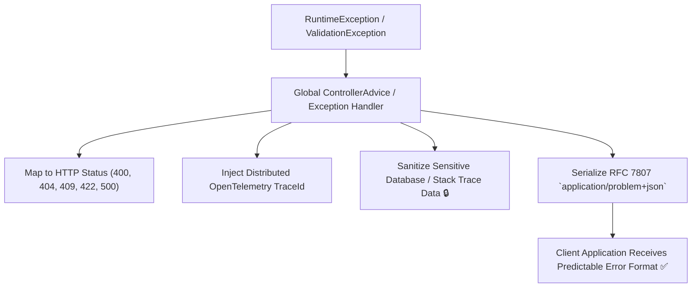

# Lesson 05: Error Handling & RFC 7807 Problem Details

Master standard error design using RFC 7807 (`application/problem+json`), Spring Boot 3 `ProblemDetail`, sanitizing internal stack traces, and injecting distributed Trace IDs.

---

## 1. What Is It?
- **RFC 7807 Problem Details**: An IETF standard defining a standardized JSON format (`application/problem+json`) for carrying machine-readable details of errors in HTTP response payloads.
- **`ProblemDetail`**: The native Java 21 / Spring Boot 3 implementation of RFC 7807.

---

## 2. Why Does It Exist?
Without a standardized error format, different services return conflicting error JSON formats (`{"err": "..."}`, `{"error_message": "..."}`, `{"status": 500, "errors": [...]}`).

Frontend clients and API aggregators must write dozens of custom error parsers, and unhandled runtime exceptions risk leaking database queries and internal stack traces to attackers.

---

## 3. Mental Model: RFC 7807 Standard Error Structure

```json
{
  "type": "https://api.company.com/errors/insufficient-funds",
  "title": "Insufficient Funds",
  "status": 422,
  "detail": "Your wallet balance of $42.50 is insufficient for order total $100.00",
  "instance": "/v1/wallets/w_901/transfers",
  "timestamp": "2026-09-01T12:00:00Z",
  "traceId": "4bf92f3577b34da6a3ce929d0e0e4736",
  "invalidParams": [
    { "field": "amount", "reason": "Amount exceeds current available balance" }
  ]
}
```



---

## 4. How Does It Work: Core RFC 7807 Standard Fields

| Field | Type | Description |
|---|---|---|
| **`type`** | URI String | A URI reference identifying the specific error type. |
| **`title`** | String | A short, human-readable summary of the problem type. |
| **`status`** | Integer | The HTTP status code generated by the origin server. |
| **`detail`** | String | A human-readable explanation specific to this occurrence. |
| **`instance`** | URI String | A URI reference identifying the specific endpoint instance. |
| **`traceId`** | String (Extension)| Distributed trace ID for production log correlation. |

---

## 5. Internal Working: Information Disclosure & Security Sanitization

**Never expose internal details in `detail`!**
- **Insecure / Leaked Detail**: `PSQLException: Table "users" column "password_hash" constraint violated in schema "prod_db"` (Exposes internal table schema and database vendor).
- **Secure Detail**: `The provided email address is already registered to an existing account.`

---

## 6. Example & Production Java 21 Code

Production `@RestControllerAdvice` implementing RFC 7807 `ProblemDetail` in Spring Boot 3:

```java
package com.backend.apidesign.errors;

import io.micrometer.tracing.Tracer;
import org.springframework.http.HttpStatus;
import org.springframework.http.ProblemDetail;
import org.springframework.http.ResponseEntity;
import org.springframework.web.bind.MethodArgumentNotValidException;
import org.springframework.web.bind.annotation.ExceptionHandler;
import org.springframework.web.bind.annotation.RestControllerAdvice;

import java.net.URI;
import java.time.Instant;
import java.util.List;

@RestControllerAdvice
public class GlobalErrorExceptionHandler {

    private final Tracer tracer;

    public GlobalErrorExceptionHandler(Tracer tracer) {
        this.tracer = tracer;
    }

    public record ValidationError(String field, String message) {}

    @ExceptionHandler(MethodArgumentNotValidException.class)
    public ResponseEntity<ProblemDetail> handleValidation(MethodArgumentNotValidException ex) {
        ProblemDetail problem = ProblemDetail.forStatusAndDetail(
            HttpStatus.BAD_REQUEST, "One or more request parameters failed validation constraints."
        );
        problem.setType(URI.create("https://api.production.com/errors/validation-failed"));
        problem.setTitle("Validation Failed");
        problem.setProperty("timestamp", Instant.now());

        // Inject current distributed trace ID
        var currentSpan = tracer.currentSpan();
        if (currentSpan != null) {
            problem.setProperty("traceId", currentSpan.context().traceId());
        }

        List<ValidationError> errors = ex.getBindingResult().getFieldErrors().stream()
            .map(err -> new ValidationError(err.getField(), err.getDefaultMessage()))
            .toList();
        problem.setProperty("invalidParams", errors);

        return ResponseEntity.status(HttpStatus.BAD_REQUEST).body(problem);
    }

    @ExceptionHandler(Exception.class)
    public ResponseEntity<ProblemDetail> handleGenericException(Exception ex) {
        // Fallback for unhandled exceptions (Sanitize stack trace!)
        ProblemDetail problem = ProblemDetail.forStatusAndDetail(
            HttpStatus.INTERNAL_SERVER_ERROR, "An internal unexpected server error occurred. Please reference the traceId."
        );
        problem.setType(URI.create("https://api.production.com/errors/internal-server-error"));
        problem.setTitle("Internal Server Error");
        problem.setProperty("timestamp", Instant.now());

        var currentSpan = tracer.currentSpan();
        if (currentSpan != null) {
            problem.setProperty("traceId", currentSpan.context().traceId());
        }

        return ResponseEntity.status(HttpStatus.INTERNAL_SERVER_ERROR).body(problem);
    }
}
```

---

## 7. Performance Characteristics
- Generating and serializing `ProblemDetail` JSON adds $< 0.1\text{ms}$ to error responses while radically simplifying frontend client error decoding.

---

## 8. Failure Scenarios & Edge Cases
- **CORS Headers Missing on 4xx/5xx**: If an error filter throws an unhandled exception before CORS headers are applied, web browser clients receive a generic `CORS error` instead of the actual `401 Unauthorized` or `422 Unprocessable` ProblemDetail payload.
  - **Mitigation**: Ensure CORS filter is the topmost filter in the security chain.

---

## 9. Observability (Logs, Metrics, Traces)
```text
# Error Logging with Trace Correlation
2026-09-01 12:00:00.123 ERROR [payment-svc,4bf92f3577b34da6,8a3ce929d0e0e473] c.b.a.e.GlobalErrorExceptionHandler : Validation Failed: amount must be greater than 0
```

---

## 10. Debugging & Troubleshooting
1. **Search Production Logs by Response `traceId`**:
   ```bash
   # In Grafana Loki / Datadog:
   traceId="4bf92f3577b34da6a3ce929d0e0e4736"
   ```

---

## 11. Scaling Considerations
- Standardized error codes allow centralized monitoring alerts to group errors by `type` URI rather than fragile regex string matching on log messages.

---

## 12. Architectural Trade-offs
| Error Style | Standardization | Toolchain Support | Security Risk |
|---|---|---|---|
| **Custom JSON Strings** | Poor | Poor | High (Uncontrolled exception leaks) |
| **RFC 7807 Problem Details**| **IETF Standard**| **Native Spring Boot 3**| **Lowest (Sanitized)** |

---

## 13. When to Use
- Mandate **RFC 7807 `application/problem+json`** across all RESTful microservices.

---

## 14. When NOT to Use
- Do not use for binary protocols like gRPC (which uses standard `google.rpc.Status` protobuf messages).

---

## 15. SDE2 / Senior Interview Questions & Answers
### Q1: Why is returning raw exception stack traces in production API responses considered a severe vulnerability, and how does RFC 7807 solve it?
<details>
<summary>Reveal Answer</summary>

**Answer**:
- **Security Vulnerability (Information Disclosure / CWE-209)**: Raw stack traces expose:
  1. Internal software versions and frameworks (enabling targeted CVE exploits).
  2. Database table names, column structures, and SQL query strings.
  3. Internal microservice hostnames, IP addresses, and file paths.
- **How RFC 7807 Solves It**: It provides a clean, standardized schema (`title`, `status`, `detail`, `type`) with sanitized, human-readable explanations. Internal stack traces are logged securely to centralized observability platforms and mapped to an opaque **`traceId`** returned in the RFC 7807 payload, allowing developers to debug the root cause without exposing secrets to attackers.
</details>

---

## 16. Practical Exercise
1. Trigger a validation error (`POST /v1/orders` with negative price).
2. Verify that the response content-type is `application/problem+json` and contains a valid `traceId`.

---

## 17. Quick Revision Summary
- Standardize all error responses with **RFC 7807 `application/problem+json`**.
- Spring Boot 3 provides native **`ProblemDetail`**.
- Always inject distributed **`traceId`** and sanitize raw database exceptions.
