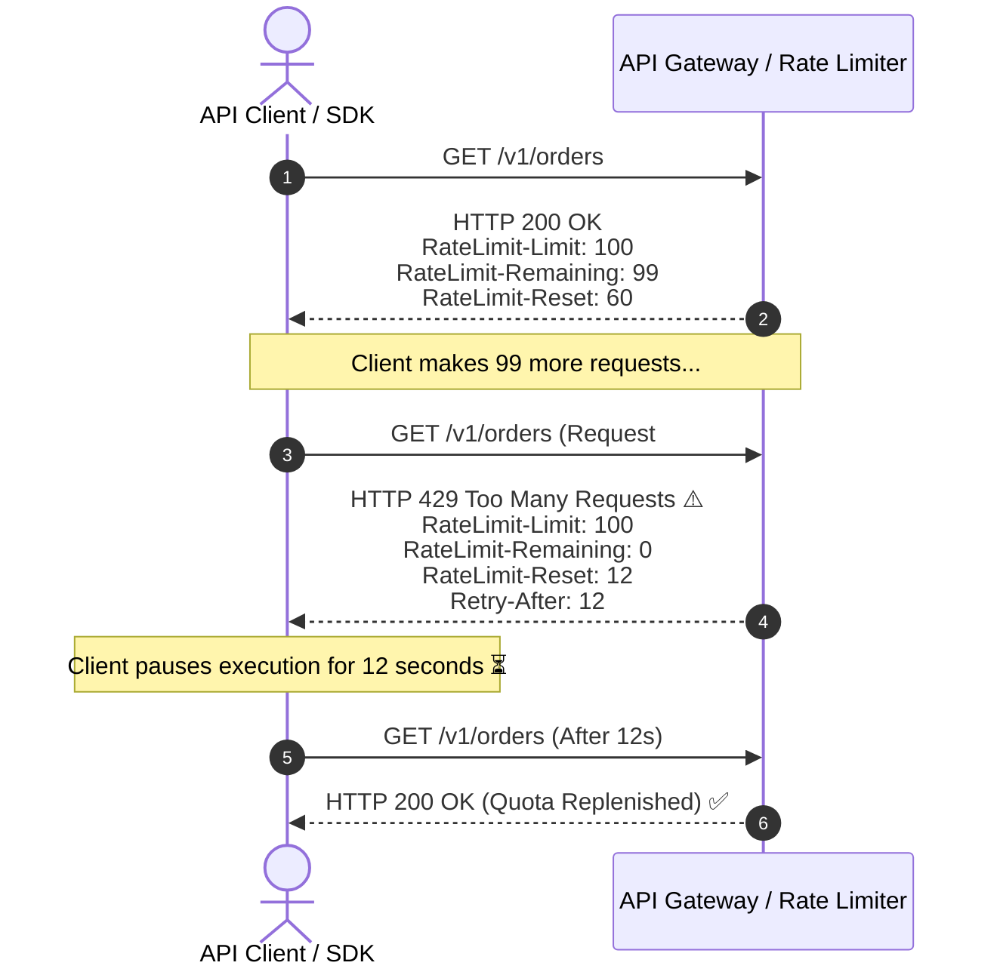

# Lesson 06: Rate Limiting Design & IETF Headers

Master standard IETF rate limiting HTTP headers (`RateLimit-Limit`, `RateLimit-Remaining`, `RateLimit-Reset`), handling `429 Too Many Requests`, and client IP extraction behind proxies.

---

## 1. What Is It?
- **Rate Limiting**: Controlling the rate of incoming requests sent by a client to protect downstream services from degradation and DDoS attacks.
- **IETF RateLimit Headers**: An open standard specifying how servers communicate quota limits, remaining calls, and reset timestamps to clients.

---

## 2. Why Does It Exist?
Without standardized response headers, clients being throttled (`HTTP 429`) have no idea how long to wait before retrying, resulting in clients aggressively retrying in tight loops and exacerbating the overload on the server.

---

## 3. Mental Model: Standard IETF RateLimit Headers



---

## 4. How Does It Work: Standard Rate Limiting Headers

| Header | Description | Example |
|---|---|---|
| **`RateLimit-Limit`** | Maximum allowed requests in the current quota window | `RateLimit-Limit: 1000` |
| **`RateLimit-Remaining`**| Remaining requests allowed in the current window | `RateLimit-Remaining: 42` |
| **`RateLimit-Reset`** | Seconds remaining until quota window resets | `RateLimit-Reset: 15` |
| **`Retry-After`** | Seconds to wait before retrying when throttled (`429`) | `Retry-After: 15` |

---

## 5. Internal Working: Client IP Extraction Behind Proxies

Throttling clients by IP address requires extracting the true client IP from the `X-Forwarded-For` header:
```text
X-Forwarded-For: <Client_IP>, <Proxy1_IP>, <Proxy2_IP>
```

**Security Vulnerability (IP Spoofing)**: If an attacker sends `X-Forwarded-For: 1.1.1.1`, and your server reads the leftmost IP, the attacker can bypass IP rate limits!
- **Rule**: Only trust the leftmost IP if your reverse proxy / Cloudflare **overwrites or validates** the header at the network edge.

---

## 6. Example & Production Java 21 Code

Spring Boot 3 / Java 21 Rate Limiting Interceptor adding IETF standard headers:

```java
package com.backend.apidesign.ratelimit;

import jakarta.servlet.http.HttpServletRequest;
import jakarta.servlet.http.HttpServletResponse;
import org.springframework.http.HttpStatus;
import org.springframework.stereotype.Component;
import org.springframework.web.servlet.HandlerInterceptor;

@Component
public class IetfRateLimitInterceptor implements HandlerInterceptor {

    private final DistributedRateLimiter rateLimiter;

    public IetfRateLimitInterceptor(DistributedRateLimiter rateLimiter) {
        this.rateLimiter = rateLimiter;
    }

    @Override
    public boolean preHandle(HttpServletRequest request, HttpServletResponse response, Object handler) throws Exception {
        String clientId = extractClientIdentifier(request);

        RateLimitQuota quota = rateLimiter.consume(clientId, 1);

        // Populate IETF Standard RateLimit Headers on EVERY response
        response.setHeader("RateLimit-Limit", String.valueOf(quota.maxLimit()));
        response.setHeader("RateLimit-Remaining", String.valueOf(quota.remaining()));
        response.setHeader("RateLimit-Reset", String.valueOf(quota.resetSeconds()));

        if (!quota.isAllowed()) {
            response.setStatus(HttpStatus.TOO_MANY_REQUESTS.value());
            response.setHeader("Retry-After", String.valueOf(quota.resetSeconds()));
            response.getWriter().write("{"type": "https://api.production.com/errors/rate-limit-exceeded", "title": "Too Many Requests", "status": 429, "detail": "Rate limit quota exceeded."}");
            return false; // Stop request processing pipeline
        }

        return true;
    }

    private String extractClientIdentifier(HttpServletRequest request) {
        String apiKey = request.getHeader("X-API-Key");
        if (apiKey != null && !apiKey.isBlank()) {
            return "key:" + apiKey;
        }
        return "ip:" + request.getRemoteAddr();
    }
}
```

---

## 7. Performance Characteristics
- Injecting response headers in an in-memory or Redis-backed rate limiter adds $< 0.5\text{ms}$ latency overhead.

---

## 8. Failure Scenarios & Edge Cases
- **Thundering Herd on Quota Window Reset**: With a fixed window algorithm, if all quotas reset at `:00`, thousands of paused clients wake up simultaneously and fire requests, spiking CPU to $100\%$.
  - **Mitigation**: Use Sliding Window Log / Token Bucket algorithms with randomized jitter.

---

## 9. Observability (Logs, Metrics, Traces)
```text
# Rate Limiting Metrics
rate_limit_exceeded_total{client_type="api_key"} 420
rate_limit_exceeded_total{client_type="ip_address"} 1890
```

---

## 10. Debugging & Troubleshooting
1. **Verify RateLimit Headers via `curl`**:
   ```bash
   curl -I https://api.production.com/v1/orders
   # Look for:
   # RateLimit-Limit: 100
   # RateLimit-Remaining: 99
   # RateLimit-Reset: 60
   ```

---

## 11. Scaling Considerations
- Rate limit at the **API Gateway / Edge Layer** (Envoy / Cloudflare) to drop abusive traffic before it reaches backend application pods.

---

## 12. Architectural Trade-offs
| Rate Limiting Tier | Identity Key | Quota Size | Storage |
|---|---|---|---|
| **Anonymous** | IP Address | Low (10 req/min) | Redis |
| **Authenticated User**| User ID | Medium (1,000 req/min)| Redis |
| **Enterprise Client** | API Key / Token | High (100,000 req/min)| Local Cache + Redis |

---

## 13. When to Use
- Always return standard **IETF RateLimit and `Retry-After` headers** on all public and partner-facing APIs.

---

## 14. When NOT to Use
- Do not apply public IP-based rate limiting to internal private VPC service-to-service calls.

---

## 15. SDE2 / Senior Interview Questions & Answers
### Q1: Why should backend APIs return the `Retry-After` header with a 429 response, and what happens to server load if it is omitted?
<details>
<summary>Reveal Answer</summary>

**Answer**:
- **Why `Retry-After` is critical**: It provides deterministic guidance to client SDKs telling them exactly how many seconds to pause before sending their next request.
- **What happens if omitted**: Well-behaved clients will resort to guessing with exponential backoff, while poorly written client scripts will immediately retry in tight `while(true)` loops. Thousands of blocked clients hammering the server with retries create a self-inflicted **Retry Storm (DDoS)**, exhausting gateway CPU and connection pools even though all requests are being rejected.
</details>

---

## 16. Practical Exercise
1. Execute 20 fast requests in a loop using `curl` against a rate-limited endpoint.
2. Verify the transition from `200 OK` to `429 Too Many Requests` and inspect the `Retry-After` header value.

---

## 17. Quick Revision Summary
- Return standard **`RateLimit-Limit`**, **`RateLimit-Remaining`**, and **`RateLimit-Reset`** headers.
- Return **`429 Too Many Requests`** with **`Retry-After`** when quotas are exceeded.
- Always extract client IDs securely behind reverse proxies.
