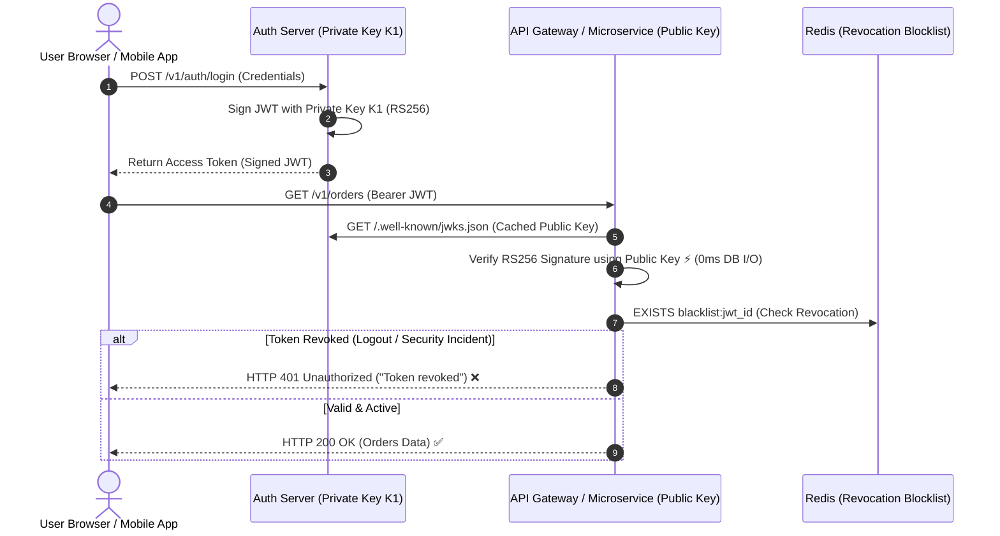

# Lesson 01: JWT Architecture & Cryptographic Signing

Master JWT structure, symmetric (HS256) vs asymmetric (RS256/ES256) cryptographic signatures, dynamic JWKS key rotation, and distributed token revocation strategies.

---

## 1. What Is It?
- **JSON Web Token (JWT - RFC 7519)**: A compact, URL-safe means of representing claims to be transferred between two parties, cryptographically signed to prevent tampering.
- **JWKS (JSON Web Key Set - RFC 7517)**: A standard endpoint (`/.well-known/jwks.json`) published by the Authorization Server containing public keys used by resource servers to verify RS256/ES256 signatures.

---

## 2. Why Does It Exist?
In large microservice architectures, querying a centralized session database (PostgreSQL/Redis) on every single HTTP request creates a single point of failure and bottleneck. JWTs allow backend microservices to cryptographically verify user identity locally without database I/O.

---

## 3. Mental Model: Asymmetric JWT Verification & JWKS Rotation



---

## 4. How Does It Work: Symmetric (HS256) vs Asymmetric (RS256/ES256)

| Feature | Symmetric (HS256) | Asymmetric (RS256 / ES256) |
|---|---|---|
| **Key Type** | Single Shared Secret Key | Private Key (Auth Server) + Public Key (Resource Servers) |
| **Security Boundary** | High Risk (Every microservice must know the secret) | **Optimal (Only Auth Server has private signing key)** |
| **Performance** | Extremely Fast ($< 0.05\text{ms}$) | Fast ($\sim 0.2\text{ms}$) |
| **Best For** | Monoliths / Single Service | Distributed Microservices & Public APIs |

---

## 5. Internal Working: Distributed Token Revocation Strategies

Because JWTs are stateless, they cannot be invalidated immediately by default. Production backends use two primary patterns:

1. **Redis Blocklist with Short TTLs**:
   - Access token expires in **15 minutes**.
   - On user logout, write `SET blacklist:jti:<JWT_ID> 1 EX 900` (expires in 15 mins).
   - Resource servers check Redis `EXISTS` on sensitive mutations.
2. **User Token Version / Epoch Counter**:
   - Store an integer `token_version` in the User DB / Redis.
   - Embed `"ver": 3` in the JWT claims.
   - When the user resets password, increment `token_version = 4`. Any token with `ver < 4` is immediately rejected.

---

## 6. Example & Production Java 21 Code

JWT Token Validation Filter using Nimbus JOSE + Java 21:

```java
package com.backend.auth.jwt;

import com.nimbusds.jose.JWSVerifier;
import com.nimbusds.jose.crypto.RSASSAVerifier;
import com.nimbusds.jwt.JWTClaimsSet;
import com.nimbusds.jwt.SignedJWT;
import org.springframework.stereotype.Component;

import java.security.interfaces.RSAPublicKey;
import java.util.Date;
import java.util.Optional;

@Component
public class JwtSecurityValidator {

    private final RSAPublicKey publicKey;
    private final TokenBlacklistService blacklistService;

    public record ValidatedUser(String userId, String email, String role) {}

    public JwtSecurityValidator(RSAPublicKey publicKey, TokenBlacklistService blacklistService) {
        this.publicKey = publicKey;
        this.blacklistService = blacklistService;
    }

    public Optional<ValidatedUser> validateToken(String rawToken) {
        try {
            SignedJWT signedJwt = SignedJWT.parse(rawToken);
            JWSVerifier verifier = new RSASSAVerifier(publicKey);

            // 1. Verify Cryptographic Signature
            if (!signedJwt.verify(verifier)) {
                return Optional.empty(); // Signature invalid or tampered!
            }

            JWTClaimsSet claims = signedJwt.getJWTClaimsSet();

            // 2. Check Expiration
            Date exp = claims.getExpirationTime();
            if (exp == null || exp.before(new Date())) {
                return Optional.empty(); // Expired token
            }

            // 3. Check Revocation Blocklist
            String jti = claims.getJWTID();
            if (jti != null && blacklistService.isRevoked(jti)) {
                return Optional.empty(); // Revoked token
            }

            return Optional.of(new ValidatedUser(
                claims.getSubject(),
                claims.getStringClaim("email"),
                claims.getStringClaim("role")
            ));
        } catch (Exception e) {
            return Optional.empty();
        }
    }
}
```

---

## 7. Performance Characteristics
- **Local RS256 Verification**: Verifying a 2048-bit RSA signature in memory takes $\sim 0.15\text{ms}$, allowing a single application pod to verify $> 6,500\text{ tokens/sec/core}$.

---

## 8. Failure Scenarios & Edge Cases
- **The "None" Algorithm Exploit (CVE-2015-9235)**: Attackers modify the JWT header to `{"alg": "none"}` and strip the signature. Vulnerable libraries accept the token as valid without verification!
  - **Mitigation**: Explicitly reject tokens where `alg` is not in an allowed whitelist (`RS256`, `ES256`).

---

## 9. Observability (Logs, Metrics, Traces)
```text
# JWT Authentication Metrics
jwt_auth_verifications_total{result="success"} 150000
jwt_auth_verifications_total{result="expired"} 420
jwt_auth_verifications_total{result="invalid_signature"} 3
jwt_auth_verifications_total{result="revoked"} 12
```

---

## 10. Debugging & Troubleshooting
1. **Decode JWT Claims Locally**:
   ```bash
   jwt decode <TOKEN>
   ```

---

## 11. Scaling Considerations
- Cache the JWKS public keys in memory for **24 hours** with background refreshing to prevent hammering the Authorization Server on every request.

---

## 12. Architectural Trade-offs
| Architecture | Verification Overhead | Revocation Speed | DB Bottleneck |
|---|---|---|---|
| **Stateful DB Sessions**| High (1 DB read per request) | Instant ($0\text{s}$) | High |
| **Stateless JWTs** | Minimal (Local crypto verify) | Eventual (Token TTL) | **Zero** |
| **JWT + Redis Blocklist**| **Ultra-Low ($< 1\text{ms}$)**| **Instant ($0\text{s}$)**| **Zero** |

---

## 13. When to Use
- Use **RS256/ES256 JWTs** for microservice API architectures and single sign-on (SSO).

---

## 14. When NOT to Use
- Do not use long-lived JWTs ($> 1\text{ hour}$) as access tokens without a refresh token strategy.

---

## 15. SDE2 / Senior Interview Questions & Answers
### Q1: How do you implement instant token revocation in a purely stateless JWT architecture when a user changes their password or reports a stolen phone?
<details>
<summary>Reveal Answer</summary>

**Answer**:
1. **Short-Lived Access Tokens**: Keep JWT access tokens short-lived (e.g., 5 to 15 minutes).
2. **User Token Epoch / Versioning**: Store a `token_version` column in the database and cache it in Redis (e.g., `user:101:token_version = 1`). Include `"ver": 1` in the JWT payload.
3. **Immediate Invalidation**: When the password is changed, atomically increment `user:101:token_version = 2` and revoke the long-lived refresh token in the database.
4. **Enforcement**: When evaluating requests, if the token's `"ver"` is less than the cached `token_version`, reject with `401 Unauthorized`.
5. **Emergency Blacklisting (JTI)**: For single-token logout, add the specific JWT unique ID (`jti`) to a Redis blacklist with a TTL equal to the remaining lifetime of that JWT.
</details>

---

## 16. Practical Exercise
1. Generate an RSA key pair (`private.pem` and `public.pem`).
2. Sign a JWT with the private key and verify it using the public key in Java 21.

---

## 17. Quick Revision Summary
- Use **RS256 / ES256** asymmetric keys for distributed microservices.
- Publish public keys via **`/.well-known/jwks.json`**.
- Keep access tokens short (15 mins) and use **Redis JTI blocklists** or **User Epochs** for immediate revocation.
