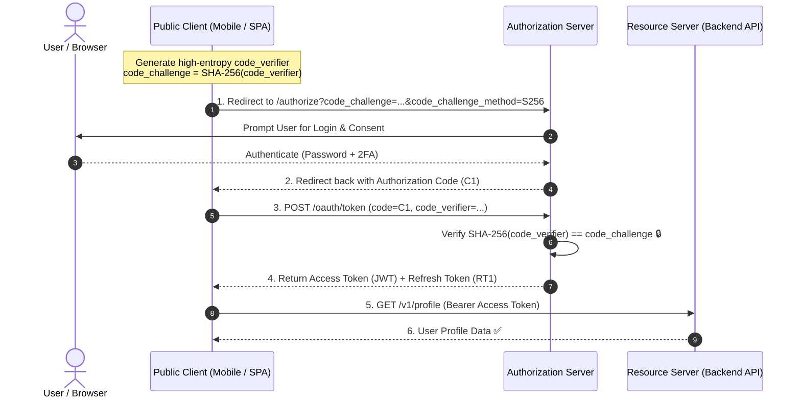
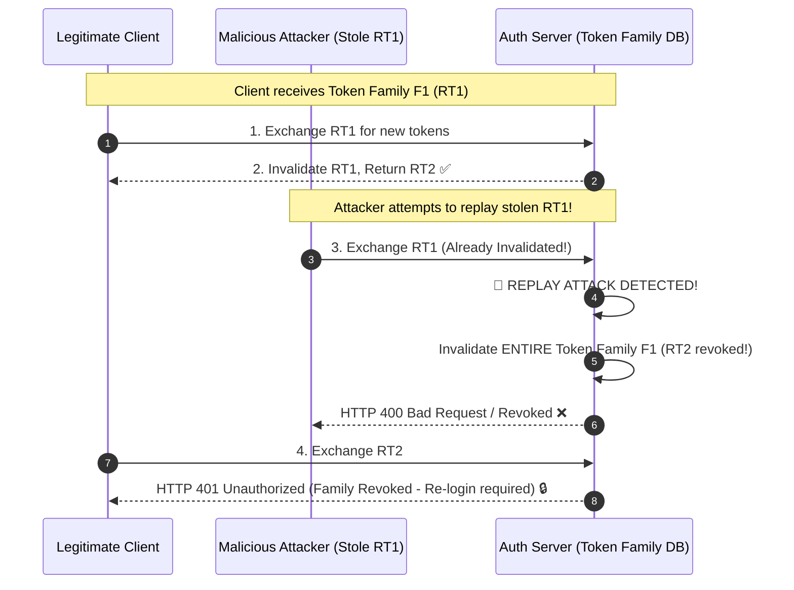

# Lesson 02: OAuth 2.1 & OIDC Flows

Master OAuth 2.1 Authorization Code Grant with PKCE, Client Credentials for machine-to-machine, OpenID Connect (OIDC), and Refresh Token Rotation with replay attack detection.

---

## 1. What Is It?
- **OAuth 2.1**: The consolidated security standard for delegated authorization (replacing OAuth 2.0 and deprecating the insecure Implicit Grant and Password Grant).
- **PKCE (Proof Key for Code Exchange - RFC 7636)**: A cryptographic protocol that prevents authorization code interception attacks on public clients (mobile and Single Page Applications).
- **OIDC (OpenID Connect)**: An identity layer built on top of OAuth 2.0 that provides an `id_token` for user authentication.

---

## 2. Why Does It Exist?
Mobile apps and JavaScript browser apps cannot securely store a `client_secret`. Without PKCE, a malicious app installed on a mobile device could register the same custom URI redirect scheme (`myapp://callback`) and steal the authorization code sent from the authorization server.

---

## 3. Mental Model: Authorization Code Flow with PKCE



---

## 4. How Does It Work: Comparing OAuth 2.1 Grants

| Grant Type | Actors | Client Type | Use Case |
|---|---|---|---|
| **Authorization Code + PKCE** | User + Browser + Backend | Public (Mobile/SPA) & Confidential | User login on web/mobile apps |
| **Client Credentials** | Backend $\leftrightarrow$ Backend | Confidential (Secure server) | Microservice-to-microservice calls |
| **Refresh Token Rotation** | Client + Auth Server | Public & Confidential | Issuing new access tokens |
| **~~Implicit Grant~~** | Deprecated in OAuth 2.1 | Insecure | Never use |
| **~~Password Grant (ROPC)~~** | Deprecated in OAuth 2.1 | Insecure | Never use |

---

## 5. Internal Working: Refresh Token Rotation with Replay Detection



---

## 6. Example & Production Java 21 Code

Refresh Token Rotation and Replay Attack Detector:

```java
package com.backend.auth.oauth;

import org.springframework.stereotype.Service;
import org.springframework.transaction.annotation.Transactional;

import java.time.Instant;
import java.util.Optional;
import java.util.UUID;

@Service
public class RefreshTokenService {

    private final RefreshTokenRepository repository;

    public record TokenPair(String accessToken, String refreshToken) {}

    public RefreshTokenService(RefreshTokenRepository repository) {
        this.repository = repository;
    }

    @Transactional
    public TokenPair rotateRefreshToken(String presentedToken) {
        RefreshTokenRecord record = repository.findByToken(presentedToken)
            .orElseThrow(() -> new InvalidTokenException("Invalid refresh token"));

        // Check if token was ALREADY consumed (Replay Attack!)
        if (record.isUsed()) {
            // Severe security breach: Revoke entire token family!
            repository.revokeEntireFamily(record.getFamilyId());
            throw new SecurityBreachException("Refresh token reuse detected! All sessions terminated.");
        }

        // Mark current token as used
        record.setUsed(true);
        repository.save(record);

        // Issue new token in same family
        String newRefreshToken = UUID.randomUUID().toString();
        String newAccessToken = JwtUtil.generateAccessToken(record.getUserId());

        RefreshTokenRecord newRecord = new RefreshTokenRecord(
            newRefreshToken,
            record.getUserId(),
            record.getFamilyId(),
            false,
            Instant.now().plusSeconds(30 * 86400)
        );
        repository.save(newRecord);

        return new TokenPair(newAccessToken, newRefreshToken);
    }
}
```

---

## 7. Performance Characteristics
- Storing Refresh Token families in Redis or PostgreSQL adds $< 3\text{ms}$ during token renewal (which occurs infrequently, every 15 minutes).

---

## 8. Failure Scenarios & Edge Cases
- **Concurrent Token Refresh by Multiple Tabs**: A user opens 3 browser tabs simultaneously; all 3 tabs attempt to refresh `RT1` at the exact same millisecond. The 2nd and 3rd tabs trigger false-positive replay detection and log the user out!
  - **Mitigation**: Allow a **10-second grace period** where a recently rotated refresh token can still return the active token pair.

---

## 9. Observability (Logs, Metrics, Traces)
```text
# OAuth Security Metrics
oauth_token_refreshes_total{result="success"} 94000
oauth_replay_attacks_detected_total 3
oauth_pkce_verification_failures_total 1
```

---

## 10. Debugging & Troubleshooting
1. **Verify PKCE SHA-256 Code Challenge**:
   ```bash
   echo -n "dBjftJeZ4CVP-mB92K27uhbUJU1p1r_wW1gFWFOEjXk" | openssl dgst -sha256 -binary | base64 | tr '+/' '-_' | tr -d '='
   ```

---

## 11. Scaling Considerations
- Clean up expired and consumed refresh token records using a nightly partitioning or TTL policy.

---

## 12. Architectural Trade-offs
| Flow | Security Strength | Implementation Complexity | Client Support |
|---|---|---|---|
| **Auth Code + PKCE** | **Maximum (Gold Standard)**| Moderate | All Modern Mobile/Web |
| **Client Credentials** | **Maximum (Machine-to-Machine)**| Low | Backend Services |
| **~~Resource Owner Password~~**| Terrible | Low | Deprecated |

---

## 13. When to Use
- Mandate **Authorization Code + PKCE** for all user-facing web and mobile applications.
- Use **Client Credentials** for service-to-service internal communication.

---

## 14. When NOT to Use
- Never use Client Credentials flow on public mobile or frontend browser apps.

---

## 15. SDE2 / Senior Interview Questions & Answers
### Q1: How does PKCE protect a public mobile application against authorization code interception attacks?
<details>
<summary>Reveal Answer</summary>

**Answer**:
1. **Setup**: The mobile app generates a high-entropy cryptographically random string (`code_verifier`) and computes its SHA-256 hash (`code_challenge`).
2. **Step 1 (Authorization Request)**: The app sends the `code_challenge` to `/authorize`. The authorization server saves the challenge and returns the authorization code to the app's redirect URI.
3. **The Attack**: If a malicious app intercepts the authorization code on the device's operating system, the attacker tries to exchange the code at `/oauth/token`.
4. **Step 2 (Token Exchange)**: The token endpoint requires the original plain-text `code_verifier`. The authorization server computes `SHA256(presented code_verifier)` and verifies it matches the saved `code_challenge`.
5. **Defense**: Because the attacker does not possess the memory space of the legitimate app and cannot guess the high-entropy `code_verifier`, the token exchange fails and access tokens are never issued to the attacker.
</details>

---

## 16. Practical Exercise
1. Configure Spring Security 6 OAuth2 Resource Server in a sample project.
2. Verify token authorization using a mock JWT issued with RSA key pairs.

---

## 17. Quick Revision Summary
- OAuth 2.1 requires **PKCE** for all Authorization Code flows.
- Never use deprecated **Implicit** or **Resource Owner Password** grants.
- Implement **Refresh Token Rotation** with automatic token family revocation on reuse.
