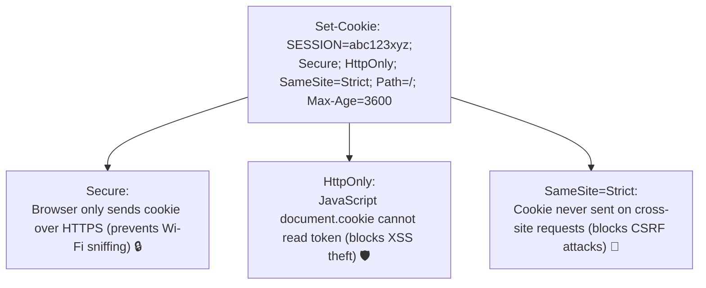

# Lesson 03: Session Management & Cookie Security

Master stateful session management in Redis, HTTP cookie security flags (`HttpOnly`, `Secure`, `SameSite=Strict`), Session Fixation defenses, and CSRF protection (Synchronizer Token Pattern).

---

## 1. What Is It?
- **HTTP Session**: Server-side state associated with a unique client, identified by an opaque cryptographically random session ID stored in a browser cookie (`JSESSIONID` or `SESSION`).
- **CSRF (Cross-Site Request Forgery)**: An attack that tricks an authenticated user's browser into submitting unauthorized requests to a trusted website.

---

## 2. Why Does It Exist?
Storing sensitive JWT access tokens in browser `localStorage` exposes them to theft via **XSS (Cross-Site Scripting)** attacks. Secure session cookies with `HttpOnly` and `SameSite=Strict` protect tokens from JavaScript access and cross-site forgery.

---

## 3. Mental Model: Cookie Security Directives



---

## 4. How Does It Work: Comparing CSRF Defense Strategies

| Strategy | Mechanism | Pros | Cons |
|---|---|---|---|
| **`SameSite=Strict` / `Lax`** | Modern browser cookie attribute | Zero server memory overhead | Requires modern browser compliance |
| **Synchronizer Token Pattern**| Server generates unique token per session/form; client submits in header | Standard, battle-tested | Requires state / header injection |
| **Double Submit Cookie** | Client reads un-HttpOnly cookie and copies into header | Stateless | Vulnerable if subdomains compromised |

---

## 5. Internal Working: Session Fixation & Session Migration on Login

**The Vulnerability**: An attacker grabs a valid session ID, forces a victim to use it via a shared link, and waits for the victim to log in.

**The Defense (Session Migration)**:
Always destroy the pre-authentication session and issue a brand-new cryptographically random session ID upon successful login:

```java
// Spring Security SessionFixationProtectionStrategy:
HttpServletRequest.changeSessionId();
```

---

## 6. Example & Production Java 21 Code

Spring Security 6 configuration with strict Cookie and CSRF protection:

```java
package com.backend.auth.session;

import org.springframework.context.annotation.Bean;
import org.springframework.context.annotation.Configuration;
import org.springframework.security.config.annotation.web.builders.HttpSecurity;
import org.springframework.security.config.http.SessionCreationPolicy;
import org.springframework.security.web.SecurityFilterChain;
import org.springframework.security.web.csrf.CookieCsrfTokenRepository;
import org.springframework.security.web.csrf.CsrfTokenRequestAttributeHandler;

@Configuration
public class SessionSecurityConfig {

    @Bean
    public SecurityFilterChain securityFilterChain(HttpSecurity http) throws Exception {
        CookieCsrfTokenRepository csrfRepository = CookieCsrfTokenRepository.withHttpOnlyFalse();
        csrfRepository.setCookieCustomizer(cookie -> cookie
            .secure(true)
            .sameSite("Strict")
            .path("/")
        );

        CsrfTokenRequestAttributeHandler requestHandler = new CsrfTokenRequestAttributeHandler();
        requestHandler.setCsrfRequestAttributeName(null); // Force loading from request

        http
            .csrf(csrf -> csrf
                .csrfTokenRepository(csrfRepository)
                .csrfTokenRequestHandler(requestHandler)
            )
            .sessionManagement(session -> session
                .sessionCreationPolicy(SessionCreationPolicy.IF_REQUIRED)
                .sessionFixation().migrateSession() // Rotate session ID on login!
                .maximumSessions(1) // Limit concurrent logins per user
                .maxSessionsPreventsLogin(false)
            )
            .authorizeHttpRequests(auth -> auth
                .requestMatchers("/api/public/**").permitAll()
                .anyRequest().authenticated()
            );

        return http.build();
    }
}
```

---

## 7. Performance Characteristics
- Backing Spring Sessions with Redis (`spring-session-data-redis`) adds $< 1.5\text{ms}$ per request with support for clustering and horizontal scaling.

---

## 8. Failure Scenarios & Edge Cases
- **Mobile Apps & CSRF**: Native mobile applications do not use browser cookie storage and are not vulnerable to CSRF. Requiring CSRF tokens on mobile API endpoints creates unnecessary complexity.
  - **Rule**: Disable CSRF on API routes that authenticate exclusively via `Authorization: Bearer <JWT>`.

---

## 9. Observability (Logs, Metrics, Traces)
```text
# Session Metrics
active_sessions_total 28400
session_fixation_migrations_total 1200
csrf_token_validation_failures_total 4
```

---

## 10. Debugging & Troubleshooting
1. **Inspect Cookie Attributes**:
   ```bash
   curl -i https://api.production.com/v1/auth/login
   # Look for: Set-Cookie: SESSION=...; Path=/; Secure; HttpOnly; SameSite=Strict
   ```

---

## 11. Scaling Considerations
- Store session state in **Redis clusters** with consistent hashing to prevent memory exhaustion on individual cache nodes.

---

## 12. Architectural Trade-offs
| Storage Strategy | Scalability | XSS Resistance | Immediate Invalidation |
|---|---|---|---|
| **LocalStorage (JWT)** | High | **Zero (High XSS Risk)**| Difficult |
| **HttpOnly Cookie (Session/JWT)**| **High** | **Maximum (Immune to XSS read)**| **Instant** |

---

## 13. When to Use
- Use **`HttpOnly` + `Secure` + `SameSite=Strict` cookies** for all web frontend Single Page Applications.

---

## 14. When NOT to Use
- Do not store session cookies in mobile native apps (use secure hardware keystores / Keychain instead).

---

## 15. SDE2 / Senior Interview Questions & Answers
### Q1: Why is storing JWT access tokens in browser `localStorage` considered a severe security anti-pattern, and what is the recommended architecture?
<details>
<summary>Reveal Answer</summary>

**Answer**:
- **Why `localStorage` is vulnerable**: Any JavaScript running on the page (including third-party analytics scripts, CDN dependencies, or injected XSS payloads) has unrestricted access to `window.localStorage`. An attacker who executes a single XSS vulnerability can read the JWT and exfiltrate it to an external server.
- **The Recommended Architecture (Backend-For-Frontend / BFF)**:
  1. The browser talks only to a lightweight **Backend-For-Frontend (BFF)** gateway.
  2. The BFF issues an opaque session cookie with **`HttpOnly`**, **`Secure`**, and **`SameSite=Strict`** flags.
  3. The `HttpOnly` flag makes the cookie completely invisible to browser JavaScript, neutralizing XSS token theft.
  4. The BFF maintains the real JWT access and refresh tokens in server-side memory/Redis and injects the `Authorization: Bearer <JWT>` header on downstream calls.
</details>

---

## 16. Practical Exercise
1. Test session fixation defense: Note the session ID before logging in, perform a login, and verify that the session ID has changed in the response `Set-Cookie` header.

---

## 17. Quick Revision Summary
- Always set **`HttpOnly`**, **`Secure`**, and **`SameSite=Strict`** on cookies.
- Protect against **Session Fixation** by migrating session IDs on login.
- Disable CSRF protection only on pure stateless Bearer-token API routes.
