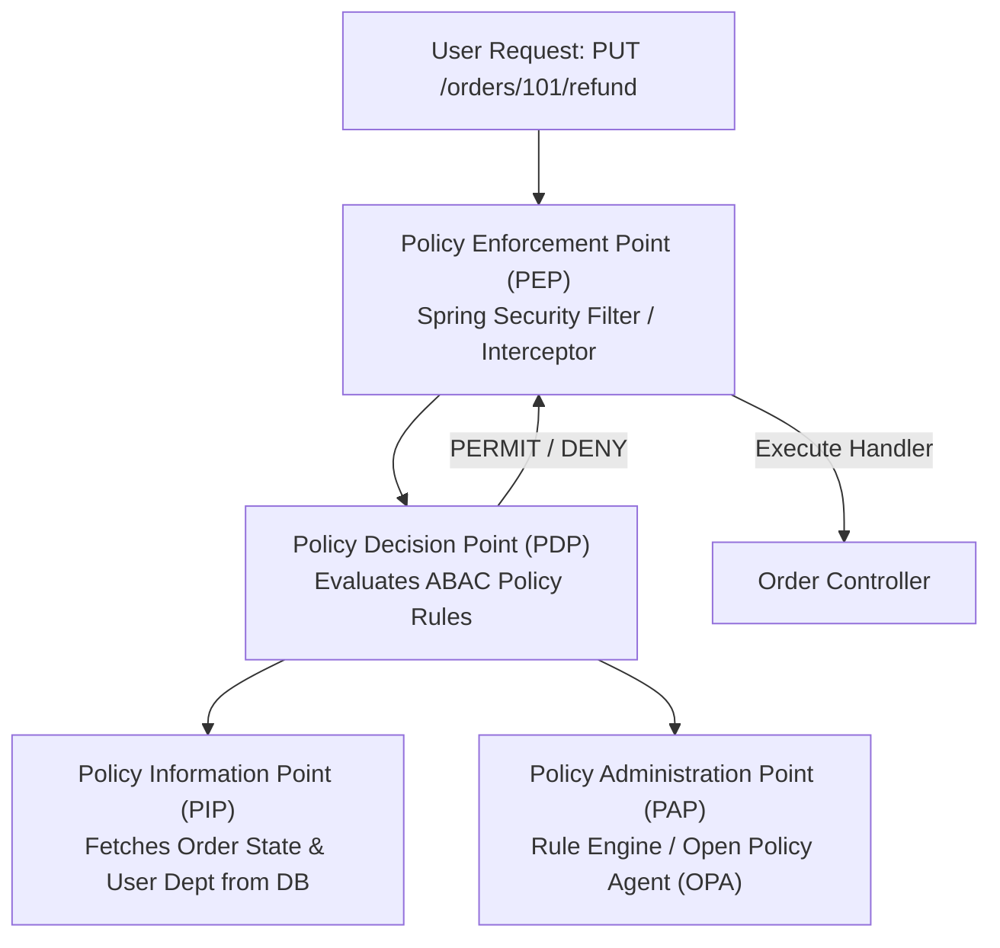

# Lesson 04: RBAC & ABAC Access Control

Master Role-Based Access Control (RBAC), Attribute-Based Access Control (ABAC), Relationship-Based Access Control (ReBAC), and Spring Security SpEL `@PreAuthorize` authorization.

---

## 1. What Is It?
- **RBAC (Role-Based Access Control)**: Authorization based on static roles assigned to users (`ADMIN`, `USER`, `MANAGER`).
- **ABAC (Attribute-Based Access Control)**: Dynamic authorization based on attributes of the user, resource, action, and environment (e.g., *"A manager can approve an expense report IF amount $< \$5,000$ AND department == user.department AND time is within business hours"*).

---

## 2. Why Does It Exist?
RBAC suffers from **"Role Explosion"** as systems grow. Creating separate roles like `BILLING_ADMIN_NORTH_AMERICA_TIER2` leads to thousands of unmanageable roles. ABAC allows fine-grained rules using boolean attribute expressions.

---

## 3. Mental Model: XACML Authorization Architecture (PEP / PDP)



---

## 4. How Does It Work: Comparing Access Control Models

| Model | Decision Factor | Complexity | Flexibility |
|---|---|---|---|
| **RBAC** | User's assigned roles (`hasRole('ADMIN')`) | Low | Low (Role explosion) |
| **ABAC** | Subject, Object, Action, Environment attributes | Moderate | **Maximum** |
| **ReBAC** | Graph relationships (Google Zanzibar / "User is editor of Doc A") | High | **Optimal for Social / Drive Apps** |

---

## 5. Internal Working: Spring Security SpEL Expression Evaluation

Spring Security evaluates authorization rules before method execution using `@PreAuthorize`:

```java
@PreAuthorize("hasRole('ADMIN') or @orderSecurity.isOrderOwner(principal, #orderId)")
@GetMapping("/orders/{orderId}")
public OrderDto getOrder(@PathVariable String orderId) { ... }
```

---

## 6. Example & Production Java 21 Code

Production ABAC Policy Evaluator with Spring Security:

```java
package com.backend.auth.accesscontrol;

import org.springframework.security.access.prepost.PreAuthorize;
import org.springframework.security.core.Authentication;
import org.springframework.stereotype.Component;
import org.springframework.stereotype.Service;

import java.math.BigDecimal;
import java.time.LocalTime;

@Component("orderSecurity")
public class OrderSecurityEvaluator {

    private final OrderRepository orderRepository;

    public OrderSecurityEvaluator(OrderRepository orderRepository) {
        this.orderRepository = orderRepository;
    }

    public boolean canRefund(Authentication auth, String orderId, BigDecimal refundAmount) {
        if (auth == null || !auth.isAuthenticated()) {
            return false;
        }

        // 1. Fetch resource attributes
        OrderRecord order = orderRepository.findById(orderId).orElse(null);
        if (order == null) {
            return false;
        }

        String userRole = auth.getAuthorities().iterator().next().getAuthority();
        String userDept = ((CustomUserDetails) auth.getPrincipal()).getDepartment();

        // 2. Evaluate Dynamic ABAC Rules
        boolean isSupportLead = "ROLE_SUPPORT_LEAD".equals(userRole);
        boolean isSameDept = userDept.equals(order.department());
        boolean isUnderLimit = refundAmount.compareTo(new BigDecimal("1000.00")) <= 0;
        boolean isBusinessHours = LocalTime.now().isAfter(LocalTime.of(8, 0)) && LocalTime.now().isBefore(LocalTime.of(18, 0));

        // Support leads can refund up to $1000 within business hours in their department
        if (isSupportLead && isSameDept && isUnderLimit && isBusinessHours) {
            return true;
        }

        // Admins can refund anything
        return "ROLE_ADMIN".equals(userRole);
    }
}

@Service
public class OrderService {

    @PreAuthorize("@orderSecurity.canRefund(authentication, #orderId, #amount)")
    public void processRefund(String orderId, BigDecimal amount) {
        // Business logic to execute refund...
    }
}
```

---

## 7. Performance Characteristics
- Evaluating SpEL expressions in Spring adds $< 0.05\text{ms}$. Database lookups inside PIP evaluators should be cached in Redis with a 30-second TTL.

---

## 8. Failure Scenarios & Edge Cases
- **Missing `@EnableMethodSecurity`**: If the configuration class forgets `@EnableMethodSecurity`, `@PreAuthorize` annotations are silently ignored, leaving endpoints completely unprotected!
  - **Mitigation**: Write automated integration tests asserting that unauthenticated requests receive `403 Forbidden`.

---

## 9. Observability (Logs, Metrics, Traces)
```text
# Access Control Metrics
access_decisions_total{decision="permit"} 820000
access_decisions_total{decision="deny"} 412
```

---

## 10. Debugging & Troubleshooting
1. **Enable Spring Security Debug Logging**:
   ```yaml
   logging.level.org.springframework.security: DEBUG
   ```

---

## 11. Scaling Considerations
- For enterprise organizations with thousands of microservices, decouple policy evaluation using **Open Policy Agent (OPA)** or **AWS Verified Permissions** via gRPC sidecars.

---

## 12. Architectural Trade-offs
| Strategy | Code Coupling | Centralized Audit | Performance |
|---|---|---|---|
| **In-Code SpEL (`@PreAuthorize`)**| Coupled to Java | Harder | Ultra-Fast ($< 0.1\text{ms}$) |
| **Open Policy Agent (OPA / Rego)**| Decoupled (Any language)| **Centralized** | Fast ($\sim 1\text{ms}$) |

---

## 13. When to Use
- Use **RBAC** for simple coarse-grained roles (`ADMIN`, `USER`).
- Use **ABAC** when business logic depends on ownership, amounts, departments, or environmental conditions.

---

## 14. When NOT to Use
- Do not build complex nested role hierarchies when a few ABAC rules can express the logic cleanly.

---

## 15. SDE2 / Senior Interview Questions & Answers
### Q1: What is "Role Explosion" in RBAC, and how does ABAC solve it?
<details>
<summary>Reveal Answer</summary>

**Answer**:
- **Role Explosion**: In pure RBAC, permissions are tied strictly to roles. When business requirements introduce dimensional access constraints (e.g., regional boundaries, monetary limits, department scopes), engineers are forced to create new roles for every combination:
  - `REGIONAL_MANAGER_EMEA_TIER1`, `REGIONAL_MANAGER_APAC_TIER1`, `REGIONAL_MANAGER_EMEA_TIER2`, etc.
  - The number of roles grows combinatorially ($O(N \times M \times K)$), making user management impossible.
- **How ABAC Solves It**: ABAC replaces static roles with dynamic boolean expressions on attributes:
  - Policy: `permit if user.role == 'MANAGER' and user.region == resource.region and request.amount <= user.spendingLimit`.
  - Only a single role (`MANAGER`) is needed; specific access decisions are computed dynamically based on the subject and resource attributes.
</details>

---

## 16. Practical Exercise
1. Write a custom Spring Security evaluator that permits `GET /v1/documents/{id}` only if `document.ownerId == principal.id` OR `principal.role == 'AUDITOR'`.

---

## 17. Quick Revision Summary
- **RBAC** maps users to static roles.
- **ABAC** evaluates subject, resource, action, and environment attributes.
- Use **`@PreAuthorize("@securityBean.canAccess(authentication, #id)")`** for expressive Spring authorization.
