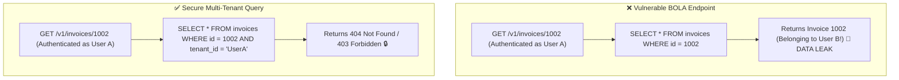

# Lesson 05: OWASP API Top 10 & Vulnerabilities

Master defenses against the OWASP API Security Top 10: Broken Object Level Authorization (BOLA/IDOR), Mass Assignment, Server-Side Request Forgery (SSRF), and Input Injection.

---

## 1. What Is It?
- **OWASP API Security Top 10**: The industry standard classification of the top security vulnerabilities affecting modern backend APIs.
- **BOLA / IDOR (Broken Object Level Authorization / Insecure Direct Object Reference)**: The #1 API vulnerability where an API endpoint exposes an object ID without verifying if the requesting user owns that object.

---

## 2. Why Does It Exist?
Microservices often rely on simple authentication filters to verify that a JWT is valid, but forget to verify authorization at the database record level.

An authenticated user changes `GET /v1/invoices/1001` to `GET /v1/invoices/1002` and reads another customer's private financial data.

---

## 3. Mental Model: BOLA / IDOR Attack vs Defense



---

## 4. How Does It Work: Top 5 OWASP API Vulnerabilities & Mitigations

| Vulnerability | Mechanism | Production Mitigation |
|---|---|---|
| **API1: BOLA (IDOR)** | User queries another user's ID | Always enforce `WHERE id = :id AND user_id = :userId` |
| **API3: Broken Object Property (Mass Assignment)**| Client sends `"isAdmin": true` in JSON | Use strict DTOs (never bind HTTP JSON directly to JPA Entities) |
| **API4: Unrestricted Resource Consumption** | Client sends 10,000 req/sec | Enforce strict IETF Rate Limiting & payload size limits |
| **API7: SSRF (Server-Side Request Forgery)**| Server fetches URL provided by client | Validate URLs against strict domain whitelist, block `169.254.169.254` |
| **API8: Security Misconfiguration** | Stack traces returned in error responses | Use RFC 7807 Problem Details with sanitized messages |

---

## 5. Internal Working: Mass Assignment Vulnerability Defense

**The Vulnerability**:
```java
// ❌ DANGEROUS: Direct JPA Entity Binding
@PostMapping("/users/{id}")
public void updateUser(@PathVariable Long id, @RequestBody UserEntity userUpdates) {
    // If attacker sends: {"email": "a@b.com", "role": "ROLE_SUPER_ADMIN"}
    // JPA updates the role column directly in the database!
    userRepository.save(userUpdates);
}
```

**The Fix (Strict Records / DTOs)**:
```java
// ✅ SECURE: Strict DTO Whitelisting
public record UpdateUserRequest(String email, String phoneNumber) {}

@PostMapping("/users/{id}")
public void updateUser(@PathVariable Long id, @RequestBody UpdateUserRequest req, @AuthenticationPrincipal UserPrincipal user) {
    UserEntity userEntity = userRepository.findByIdAndTenantId(id, user.getId())
        .orElseThrow(() -> new ResourceNotFoundException());
    userEntity.setEmail(req.email());
    userEntity.setPhoneNumber(req.phoneNumber());
    userRepository.save(userEntity);
}
```

---

## 6. Example & Production Java 21 Code

SSRF Defense with strict URL validation and Private IP Blocking:

```java
package com.backend.auth.security;

import org.springframework.stereotype.Service;

import java.net.InetAddress;
import java.net.URI;
import java.util.Set;

@Service
public class SafeWebhookDispatcher {

    private static final Set<String> ALLOWED_SCHEMES = Set.of("https");

    public void validateUrl(String destinationUrl) throws Exception {
        URI uri = URI.create(destinationUrl);

        // 1. Restrict Scheme to HTTPS
        if (!ALLOWED_SCHEMES.contains(uri.getScheme())) {
            throw new SecurityException("Invalid URL scheme! Only HTTPS allowed.");
        }

        String host = uri.getHost();
        InetAddress address = InetAddress.getByName(host);

        // 2. Block Loopback, Private VPC, and Cloud Metadata IPs (169.254.169.254)
        if (address.isLoopbackAddress() || address.isSiteLocalAddress() || address.isLinkLocalAddress()) {
            throw new SecurityException("SSRF Attack Blocked: Destination IP is in private/internal range: " + address);
        }

        // Specifically block AWS / GCP Instance Metadata Endpoint
        if ("169.254.169.254".equals(address.getHostAddress())) {
            throw new SecurityException("SSRF Blocked: Cloud metadata access forbidden!");
        }
    }
}
```

---

## 7. Performance Characteristics
- DNS resolution and IP subnet checking during SSRF validation takes $\sim 2\text{ms}$ and prevents catastrophic cloud credential theft.

---

## 8. Failure Scenarios & Edge Cases
- **DNS Rebinding Attacks (Time-of-Check to Time-of-Use)**: An attacker creates a custom domain `evil.com` whose DNS resolves to public IP `1.2.3.4` during validation, but returns `169.254.169.254` 10 milliseconds later when the HTTP client connects!
  - **Mitigation**: Perform DNS resolution once, validate the resolved IP, and connect directly to the resolved IP with the `Host: evil.com` header.

---

## 9. Observability (Logs, Metrics, Traces)
```text
# Security Incident Metrics
security_bola_attempts_total 12
security_ssrf_blocked_total 45
security_mass_assignment_prevented_total 3
```

---

## 10. Debugging & Troubleshooting
1. **Automate DAST Security Scans**:
   ```bash
   # Run OWASP ZAP API scan against OpenAPI specification
   zap-api-scan.py -t http://localhost:8080/v3/api-docs -f openapi
   ```

---

## 11. Scaling Considerations
- Enforce tenancy filters at the database repository layer or using Hibernate `@TenantId` filters to guarantee BOLA protection across all developers.

---

## 12. Architectural Trade-offs
| Defense Layer | Implementation Location | Reliability |
|---|---|---|
| **API Gateway Filtering** | Gateway / Edge | Coarse (Cannot verify DB record ownership) |
| **Repository Scoping (`tenant_id`)**| Data Access Layer | **$100\%$ Reliable against BOLA** |

---

## 13. When to Use
- Always use **strict DTOs** and **tenant-scoped repository queries** across all backend microservices.

---

## 14. When NOT to Use
- Never expose raw auto-increment primary keys in public URLs without authorization checks.

---

## 15. SDE2 / Senior Interview Questions & Answers
### Q1: What is BOLA (Broken Object Level Authorization), and why are standard API gateways unable to prevent it without backend assistance?
<details>
<summary>Reveal Answer</summary>

**Answer**:
- **What is BOLA**: An attacker authenticates with valid credentials, obtains a legitimate JWT, and calls `GET /v1/users/999/tax_documents`. The API returns user 999's private tax documents because the backend failed to verify that the logged-in user owns document 999.
- **Why API Gateways Cannot Prevent It**: The API Gateway only validates that the caller has a cryptographically valid JWT. The gateway does not know the database relationship between the caller's `user_id` and the requested resource `999`. Object-level authorization requires querying the database or policy engine (`WHERE id = 999 AND owner_id = principal.id`), which must be executed by the backend microservice.
</details>

---

## 16. Practical Exercise
1. Audit an existing controller: replace any `@RequestBody Entity` parameters with Java 21 `record` DTOs.
2. Add `@TenantId` or tenant filter checks to all database queries.

---

## 17. Quick Revision Summary
- **BOLA (IDOR)** is the #1 API risk: always scope queries by tenant ID.
- Prevent **Mass Assignment** by never exposing JPA entities directly in `@RequestBody`.
- Prevent **SSRF** by blocking private IPs and `169.254.169.254` metadata endpoints.
