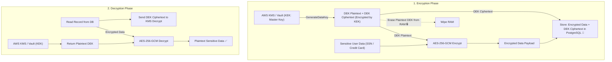

# Lesson 06: Data Encryption & Secrets Management

Master Envelope Encryption (DEK vs KEK), authenticated encryption with AES-256-GCM, zero-knowledge password hashing with Argon2id and BCrypt, and HashiCorp Vault secrets management.

---

## 1. What Is It?
- **Envelope Encryption**: A cryptographic architecture where plaintext data is encrypted with a unique Data Encryption Key (DEK), and the DEK itself is encrypted with a root Key Encryption Key (KEK) stored in a Hardware Security Module (HSM) or KMS.
- **AES-256-GCM**: An Authenticated Encryption with Associated Data (AEAD) cipher that provides both confidentiality and tamper-proof data integrity.

---

## 2. Why Does It Exist?
Encrypting gigabytes of database records directly with KMS root keys is slow, expensive, and risks hitting cloud KMS rate limits. Envelope encryption performs fast local AES encryption of records while securing the master keys in KMS.

---

## 3. Mental Model: Envelope Encryption (DEK / KEK) Workflow



---

## 4. How Does It Work: Password Hashing Comparison

| Algorithm | Type | Memory Hardness | Resistance to GPU/ASIC | Current Best Practice |
|---|---|---|---|---|
| **Argon2id** | Memory-hard hash | **Tunable (e.g. 64MB RAM)**| **Maximum (Industry Gold Standard)**| **Recommended** |
| **BCrypt** | CPU-intensive hash | Low | High | Standard / Legacy |
| **PBKDF2** | Iterative hash | Low | Vulnerable to ASIC mining | Legacy |
| **~~MD5 / SHA-256~~**| Fast cryptographic hash | None | Broken ($10\text{ Billion hashes/sec}$) | **Never Use for Passwords!** |

---

## 5. Internal Working: AES-256-GCM Authenticated Encryption

AES-GCM requires 3 components:
1. **Plaintext Data**: The payload to encrypt.
2. **12-Byte Nonce / IV (Initialization Vector)**: Must **never be reused** with the same key. A random 12-byte IV is generated per record.
3. **16-Byte Authentication Tag**: Appended to the ciphertext. If an attacker modifies even a single bit of the database ciphertext, decryption immediately throws an `AEADBadTagException`.

---

## 6. Example & Production Java 21 Code

Production AES-256-GCM Encryption Utility in Java 21:

```java
package com.backend.auth.crypto;

import javax.crypto.Cipher;
import javax.crypto.SecretKey;
import javax.crypto.spec.GCMParameterSpec;
import javax.crypto.spec.SecretKeySpec;
import java.nio.ByteBuffer;
import java.security.SecureRandom;
import java.util.Base64;

public class AesGcmCipher {

    private static final String ALGORITHM = "AES/GCM/NoPadding";
    private static final int TAG_LENGTH_BITS = 128;
    private static final int IV_LENGTH_BYTES = 12;

    private final SecureRandom secureRandom = new SecureRandom();

    public String encrypt(byte[] plaintext, byte[] rawKey256) throws Exception {
        byte[] iv = new byte[IV_LENGTH_BYTES];
        secureRandom.nextBytes(iv);

        SecretKey key = new SecretKeySpec(rawKey256, "AES");
        Cipher cipher = Cipher.getInstance(ALGORITHM);
        GCMParameterSpec parameterSpec = new GCMParameterSpec(TAG_LENGTH_BITS, iv);
        cipher.init(Cipher.ENCRYPT_MODE, key, parameterSpec);

        byte[] ciphertext = cipher.doFinal(plaintext);

        // Pack IV (12 bytes) + Ciphertext (with 16-byte tag) into a single payload
        ByteBuffer buffer = ByteBuffer.allocate(iv.length + ciphertext.length);
        buffer.put(iv);
        buffer.put(ciphertext);

        return Base64.getEncoder().encodeToString(buffer.array());
    }

    public byte[] decrypt(String base64Encrypted, byte[] rawKey256) throws Exception {
        byte[] decoded = Base64.getDecoder().decode(base64Encrypted);
        ByteBuffer buffer = ByteBuffer.wrap(decoded);

        byte[] iv = new byte[IV_LENGTH_BYTES];
        buffer.get(iv);

        byte[] ciphertext = new byte[buffer.remaining()];
        buffer.get(ciphertext);

        SecretKey key = new SecretKeySpec(rawKey256, "AES");
        Cipher cipher = Cipher.getInstance(ALGORITHM);
        GCMParameterSpec parameterSpec = new GCMParameterSpec(TAG_LENGTH_BITS, iv);
        cipher.init(Cipher.DECRYPT_MODE, key, parameterSpec);

        return cipher.doFinal(ciphertext);
    }
}
```

---

## 7. Performance Characteristics
- **AES-NI Hardware Acceleration**: Modern x86-64 and ARM64 CPUs execute AES-256-GCM at hardware speeds ($> 3.5\text{ GB/sec/core}$). Local encryption adds $< 0.01\text{ms}$ per database record.

---

## 8. Failure Scenarios & Edge Cases
- **Nonce / IV Reuse Disaster in AES-GCM**: If the exact same 12-byte IV is ever used twice with the same key, an attacker can XOR the ciphertexts, completely recover the plaintext, and forge the authentication tag!
  - **Rule**: Always generate a fresh `SecureRandom` 12-byte IV for every encryption call.

---

## 9. Observability (Logs, Metrics, Traces)
```text
# Crypto & Key Management Metrics
kms_dek_generations_total 4500
crypto_decryption_failures_total{reason="bad_tag"} 1
kms_api_p99_latency_seconds 0.018
```

---

## 10. Debugging & Troubleshooting
1. **Benchmark Password Hashing Speeds**:
   ```bash
   # Verify BCrypt work factor 12 takes ~250ms per hash on production CPU
   ```

---

## 11. Scaling Considerations
- Cache decrypted DEKs in a secure in-memory cache (Guava/Caffeine) with a **5-minute TTL** to reduce KMS API costs by $99\%$.

---

## 12. Architectural Trade-offs
| Storage Method | Encryption Speed | Key Compromise Blast Radius | Cost |
|---|---|---|---|
| **Single Static Database Key**| Fast | Catastrophic (All data leaked) | Free |
| **Direct Cloud KMS per Record**| Slow ($\sim 25\text{ms}$) | Isolated | High KMS API bills |
| **Envelope Encryption (DEK/KEK)**| **Ultra-Fast (Hardware AES)**| **Isolated to single record**| **Minimal KMS cost** |

---

## 13. When to Use
- Mandate **Envelope Encryption with AES-256-GCM** for all PII (Personally Identifiable Information), credit cards, and health records.
- Use **Argon2id or BCrypt** for user password storage.

---

## 14. When NOT to Use
- Never use fast hashing algorithms (MD5, SHA-256, SHA-512) for password hashing.

---

## 15. SDE2 / Senior Interview Questions & Answers
### Q1: What is Envelope Encryption, and why is it preferred over calling a cloud KMS directly for every database field?
<details>
<summary>Reveal Answer</summary>

**Answer**:
- **How Envelope Encryption Works**:
  1. To encrypt data, the service requests a **Data Encryption Key (DEK)** from KMS. KMS returns the plaintext DEK and an encrypted copy of the DEK (encrypted by the master KEK).
  2. The application encrypts the database record locally using the plaintext DEK via hardware-accelerated **AES-256-GCM**.
  3. The ciphertext and the encrypted DEK are stored together in the database. The plaintext DEK is immediately wiped from memory.
  4. To decrypt, the service sends the encrypted DEK to KMS to decrypt it, then decrypts the data locally.
- **Why it is preferred over Direct KMS**:
  1. **Performance**: Calling KMS over the network for every field adds $20\text{ms}$ network latency per query. Envelope encryption encrypts data locally in $< 0.01\text{ms}$.
  2. **Cost**: KMS charges per API call. Encrypting millions of rows directly costs thousands of dollars; envelope encryption can reuse a cached DEK across a batch.
  3. **Payload Limits**: KMS endpoints typically limit payload size to 4KB; Envelope Encryption can encrypt gigabyte files locally.
</details>

---

## 16. Practical Exercise
1. Encrypt and decrypt a JSON payload using `AesGcmCipher` with a random 12-byte IV.
2. Tamper with 1 byte of the ciphertext and verify that decryption throws `AEADBadTagException`.

---

## 17. Quick Revision Summary
- Use **Envelope Encryption** (DEK for data, KEK for keys) for high performance and isolation.
- Always use **AES-256-GCM** with a unique 12-byte IV per encryption.
- Store passwords exclusively using **Argon2id** or **BCrypt (cost $\ge 12$)**.
