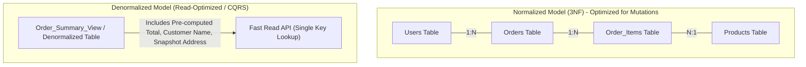
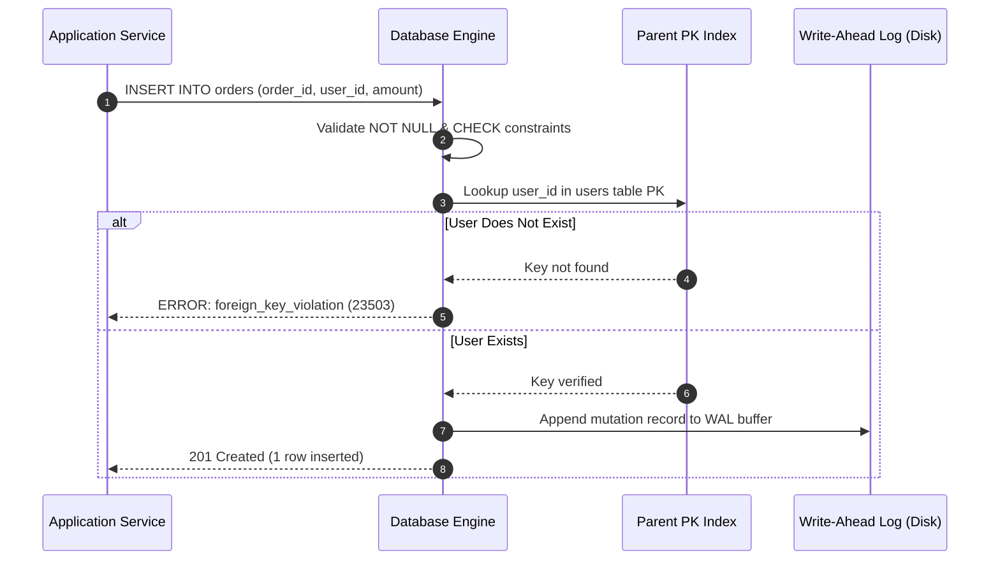

# Relational Data Modeling, Normalization, and Denormalization

---

## 1. What Is It?
**Relational Data Modeling** is the formal discipline of organizing structured business domain entities into mathematical relations (tables) composed of rows (tuples) and typed columns (attributes). It establishes integrity constraints (Primary Keys, Foreign Keys, Unique, Check, Not Null) that ensure data validity directly at the database storage engine level.

**Database Normalization** is a systematic progression of normal forms (1NF, 2NF, 3NF, BCNF) designed to eliminate data redundancy, prevent modification anomalies (Insertion, Update, Deletion anomalies), and enforce data dependencies.

**Denormalization** is the intentional, controlled re-introduction of redundancy or pre-computed aggregates into normalized relational structures to optimize critical read-path query latency and eliminate expensive distributed or multi-table SQL joins.

---

## 2. Why Does It Exist?
Without formal relational modeling and normalization, databases suffer from three catastrophic modification anomalies:

1. **Insertion Anomaly**: Inability to record certain facts without artificially fabricating other unrelated attributes (e.g., cannot create a department without assigning an employee to it).
2. **Update Anomaly**: If redundant customer data exists across 10,000 order rows, updating an address in 9,999 rows results in data inconsistency and corruption.
3. **Deletion Anomaly**: Deleting the last order of a customer inadvertently deletes the customer's entire profile and historical identity.

Conversely, over-normalized schemas in high-throughput OLTP systems introduce severe performance penalties due to multi-way relational joins ($O(N \times M)$ overhead), disk I/O amplification, and cache thrashing. Denormalization exists as an engineering compromise to serve high-volume reads with sub-millisecond latencies.

---

## 3. Mental Model



---

## 4. How Does It Work?

### The Normalization Progression

1. **First Normal Form (1NF)**:
   - Atomic values (no arrays, JSON blobs, or repeating groups in a single column).
   - Each row is uniquely identifiable via a Primary Key.
   - Column order does not convey semantic meaning.

2. **Second Normal Form (2NF)**:
   - Satisfies 1NF.
   - No **partial functional dependencies**: Every non-key attribute must depend on the *entire* candidate key, not a subset of a composite primary key.

3. **Third Normal Form (3NF)**:
   - Satisfies 2NF.
   - No **transitive functional dependencies**: Non-key attributes must depend *only* on the candidate key ($A \to B$ and $B \to C$, therefore $C$ must be moved to a separate table).
   - "All attributes depend on the key, the whole key, and nothing but the key, so help me Codd."

4. **Boyce-Codd Normal Form (BCNF)**:
   - Stricter version of 3NF.
   - For every non-trivial functional dependency $X \to Y$, $X$ must be a superkey.

---

## 5. Internal Working

### Constraints & Storage Engine Mechanics
- **Primary Key (PK)**: Enforces uniqueness and non-nullability. In storage engines like PostgreSQL and MySQL InnoDB, the PK automatically generates a backing **B-Tree index**. In InnoDB, it defines the **Clustered Index**, physically ordering data rows on disk pages by the PK key.
- **Foreign Key (FK)**: Enforces referential integrity. When a row is inserted into the child table, the database performs an internal index lookup on the parent table. During parent updates/deletions, the engine triggers configured action rules (`ON DELETE CASCADE`, `ON DELETE RESTRICT`, `ON DELETE SET NULL`).
- **Check Constraints**: Evaluated by the query executor during row validation before writing to the database write-ahead log (WAL).



---

## 6. Example

### Normalization Failure Case: The Unnormalized Schema
```sql
-- BAD: 1NF & 2NF Violation (Repeating groups, partial dependencies, update anomalies)
CREATE TABLE user_orders_bad (
    order_id BIGINT,
    user_id BIGINT,
    user_name VARCHAR(100),
    user_email VARCHAR(100),
    product_ids VARCHAR(255), -- Violates 1NF (non-atomic string list)
    product_names VARCHAR(500),
    total_amount NUMERIC(12, 2),
    PRIMARY KEY (order_id, user_id)
);
```

### Production 3NF Normalized Schema
```sql
-- 1. Entity: Users
CREATE TABLE users (
    id BIGINT GENERATED ALWAYS AS IDENTITY PRIMARY KEY,
    email VARCHAR(255) NOT NULL UNIQUE,
    full_name VARCHAR(100) NOT NULL,
    created_at TIMESTAMP WITH TIME ZONE DEFAULT CURRENT_TIMESTAMP NOT NULL
);

-- 2. Entity: Products
CREATE TABLE products (
    id BIGINT GENERATED ALWAYS AS IDENTITY PRIMARY KEY,
    sku VARCHAR(64) NOT NULL UNIQUE,
    title VARCHAR(255) NOT NULL,
    unit_price_cents INT NOT NULL CHECK (unit_price_cents >= 0),
    version BIGINT NOT NULL DEFAULT 0,
    created_at TIMESTAMP WITH TIME ZONE DEFAULT CURRENT_TIMESTAMP NOT NULL
);

-- 3. Entity: Orders
CREATE TABLE orders (
    id BIGINT GENERATED ALWAYS AS IDENTITY PRIMARY KEY,
    user_id BIGINT NOT NULL REFERENCES users(id) ON DELETE RESTRICT,
    status VARCHAR(32) NOT NULL DEFAULT 'PENDING',
    total_amount_cents INT NOT NULL CHECK (total_amount_cents >= 0),
    created_at TIMESTAMP WITH TIME ZONE DEFAULT CURRENT_TIMESTAMP NOT NULL
);
CREATE INDEX idx_orders_user_id ON orders(user_id);

-- 4. Entity: Order Items (Resolves Many-to-Many between Orders and Products)
CREATE TABLE order_items (
    id BIGINT GENERATED ALWAYS AS IDENTITY PRIMARY KEY,
    order_id BIGINT NOT NULL REFERENCES orders(id) ON DELETE CASCADE,
    product_id BIGINT NOT NULL REFERENCES products(id) ON DELETE RESTRICT,
    quantity INT NOT NULL CHECK (quantity > 0),
    historical_price_cents INT NOT NULL CHECK (historical_price_cents >= 0),
    CONSTRAINT uq_order_product UNIQUE (order_id, product_id)
);
CREATE INDEX idx_order_items_order_id ON order_items(order_id);
CREATE INDEX idx_order_items_product_id ON order_items(product_id);
```

---

## 7. Implementation

### Java 21 JPA Entity Model with Immutable Snapshotting
```java
package com.backend.engineering.databases.model;

import jakarta.persistence.*;
import java.time.Instant;
import java.util.ArrayList;
import java.util.List;

@Entity
@Table(name = "orders")
public class Order {

    @Id
    @GeneratedValue(strategy = GenerationType.IDENTITY)
    private Long id;

    @Column(name = "user_id", nullable = false)
    private Long userId;

    @Enumerated(EnumType.STRING)
    @Column(name = "status", nullable = false, length = 32)
    private OrderStatus status = OrderStatus.PENDING;

    @Column(name = "total_amount_cents", nullable = false)
    private Integer totalAmountCents;

    @OneToMany(mappedBy = "order", cascade = CascadeType.ALL, orphanRemoval = true, fetch = FetchType.LAZY)
    private List<OrderItem> items = new ArrayList<>();

    @Column(name = "created_at", nullable = false, updatable = false)
    private Instant createdAt = Instant.now();

    public enum OrderStatus {
        PENDING, CONFIRMED, SHIPPED, CANCELLED
    }

    // Domain methods enforcing business invariant
    public void addItem(Long productId, int quantity, int unitPriceCents) {
        OrderItem item = new OrderItem(this, productId, quantity, unitPriceCents);
        this.items.add(item);
        recalculateTotal();
    }

    private void recalculateTotal() {
        this.totalAmountCents = this.items.stream()
                .mapToInt(OrderItem::getSubtotalCents)
                .sum();
    }

    // Getters and protected constructors for JPA
    protected Order() {}

    public Order(Long userId) {
        this.userId = userId;
        this.totalAmountCents = 0;
    }

    public Long getId() { return id; }
    public Long getUserId() { return userId; }
    public OrderStatus getStatus() { return status; }
    public Integer getTotalAmountCents() { return totalAmountCents; }
    public List<OrderItem> getItems() { return List.copyOf(items); }
}
```

---

## 8. Performance

| Metric / Action | Normalized (3NF) | Denormalized (Read Optimized) |
|---|---|---|
| **Write Latency (INSERT/UPDATE)** | Fast (single row lock, minimal index updates) | Slower (updates must fan out to redundant stores) |
| **Read Latency (Order Detail View)** | Moderate (Requires 3-table SQL JOIN: $15\text{ms}$) | Ultra-fast (Single primary key lookup: $< 1\text{ms}$) |
| **Storage Consumption** | Minimal (Zero duplicated string data) | Higher ($1.5\times - 3\times$ storage footprint) |
| **Buffer Pool Efficiency** | High page density (compact rows) | Lower page density (wide rows consume more RAM) |

---

## 9. Failure Scenarios

1. **Unindexed Foreign Key Cascade Deadlocks**:
   - *Failure*: Deleting a parent row in `users` triggers `ON DELETE CASCADE` across millions of `orders`. Without an index on `orders.user_id`, the database takes a full table share lock, causing total database lock starvation.
   - *Mitigation*: **Always create an explicit B-Tree index on all Foreign Key columns**.

2. **Denormalization Drift & Inconsistency**:
   - *Failure*: Storing `user_name` directly in `orders` table. When the user updates their name, an asynchronous worker fails midway, causing historical invoices to display mismatched names.
   - *Mitigation*: Distinguish between **historical snapshot data** (immutable at time of transaction, e.g., purchase price) vs **current entity state** (must be queried live or synced via Transactional Outbox CDC).

---

## 10. Observability

- **Metrics**:
  - `postgresql_stat_user_tables_seq_scan`: Spike indicates missing indexes on joins/FKs.
  - `postgresql_stat_database_deadlocks`: Indicates concurrent lock escalations on parent/child tables.
- **Slow Query Log Inspection**:
  ```sql
  SELECT query, calls, total_exec_time, mean_exec_time, rows
  FROM pg_stat_statements
  ORDER BY mean_exec_time DESC
  LIMIT 10;
  ```

---

## 11. Debugging

### Step-by-Step Join Bottleneck Diagnosis
```sql
EXPLAIN (ANALYZE, BUFFERS, COSTS)
SELECT o.id, u.email, p.title, oi.quantity
FROM orders o
JOIN users u ON o.user_id = u.id
JOIN order_items oi ON oi.order_id = o.id
JOIN products p ON oi.product_id = p.id
WHERE o.created_at >= NOW() - INTERVAL '7 days';
```
- **Triage Checklist**:
  1. Check if `Seq Scan` appears on any relation with $> 10,000$ rows.
  2. Verify that `Shared Hit Blocks` are high and `Read Blocks` (disk I/O) are minimized.
  3. Ensure hash join bucket size does not spill over `work_mem` to temporary disk files.

---

## 12. Scaling

1. **Vertical Scaling Limits**: Normalized joins scale well up to the memory limit of the buffer pool. When the join working set exceeds RAM, random disk reads crash throughput.
2. **Horizontal Sharding Constraints**: Joins across sharded database instances are computationally prohibitive ($O(N)$ network hops).
3. **CQRS (Command Query Responsibility Segregation)**:
   - **Write DB**: Fully normalized 3NF PostgreSQL cluster handling ACID transactions.
   - **Read DB / Cache**: Denormalized document/view (Elasticsearch, DynamoDB, or Redis) populated via Debezium Change Data Capture (CDC).

---

## 13. Trade-offs

| Strategy | Advantages | Disadvantages | Best Used In |
|---|---|---|---|
| **Pure 3NF Normalization** | Zero redundancy, atomic writes, perfect data integrity | Expensive joins at scale, high query complexity | Financial ledgers, ERP, transactional core |
| **Controlled Denormalization** | Instant read lookups, zero joins, simple queries | Write amplification, complex dual-write sync logic | User feeds, dashboards, high-traffic catalogs |
| **Hybrid (Normalized + Snapshots)** | Balances integrity with historical immutability | Requires clear domain boundaries | E-commerce order checkout & billing |

---

## 14. When to Use
- When data consistency, strict invariants, and atomic updates are non-negotiable.
- When the query patterns are dynamic and unknown in advance (relational algebra allows arbitrary filtering and ad-hoc joins).
- When domain entities change frequently and write throughput exceeds read throughput.

---

## 15. When NOT to Use
- High-volume time-series or append-only analytics where relational integrity checks introduce unnecessary write locks.
- Highly polymorphic, unstructured, or rapidly evolving schemaless data (prefer JSONB or NoSQL document stores).
- Distributed systems requiring massive horizontal sharding where cross-node joins are impossible.

---

## 16. Interview Questions

### Q1: Why should Foreign Keys always be indexed in relational databases?
<details>
<summary>Reveal Answer</summary>

**Answer**: 
While relational databases automatically create a backing B-Tree index for **Primary Keys**, most databases (including PostgreSQL and MySQL) **do not** automatically index **Foreign Key** columns.
Failing to index Foreign Keys causes two major production issues:
1. **Join Latency**: Queries joining the parent and child table (`orders JOIN order_items ON orders.id = order_items.order_id`) will perform a catastrophic full sequential scan on the child table for every matching parent row.
2. **Table-Level Locking on Deletions**: When a row in the parent table is deleted or its PK updated, the database must verify that no child rows reference it. Without an index on the child table's FK column, the storage engine must acquire a full table-level lock on the child table to scan it, completely blocking concurrent inserts and updates.
</details>

### Q2: What is the difference between an update anomaly and a transitive dependency?
<details>
<summary>Reveal Answer</summary>

**Answer**:
A **transitive dependency** is a structural flaw in data modeling where non-key attribute $C$ depends on non-key attribute $B$, which in turn depends on candidate key $A$ ($A \to B$ and $B \to C$).
An **update anomaly** is the operational consequence of that transitive dependency: because attribute $C$ is stored redundantly across multiple records associated with $B$, updating the value of $C$ requires modifying multiple rows. If the application crashes or fails midway, the database is left in a corrupted state where different rows hold contradictory values for the same entity attribute.
</details>

---

## 17. Practical Exercise
1. Model an e-commerce schema with `users`, `merchants`, `products`, `orders`, `order_items`, and `payments`.
2. Ensure the schema satisfies 3NF while including immutable historical price and address snapshots.
3. Write DDL constraints preventing negative balances, duplicate cart items, and unindexed foreign keys.
4. Execute `EXPLAIN ANALYZE` on a 4-table join and compare query execution times before and after adding composite indexes.

---

## 18. Quick Revision
- **1NF**: Atomic values, primary key, no repeating groups.
- **2NF**: 1NF + no partial key dependencies.
- **3NF**: 2NF + no transitive dependencies ($A \to B \to C$).
- **Foreign Keys**: Enforce referential integrity but must always be explicitly indexed.
- **Denormalization**: Trade storage and write amplification for $O(1)$ sub-millisecond read latency.
- **Snapshots**: Capture immutable point-in-time facts (e.g., checkout price) rather than live relational references.
