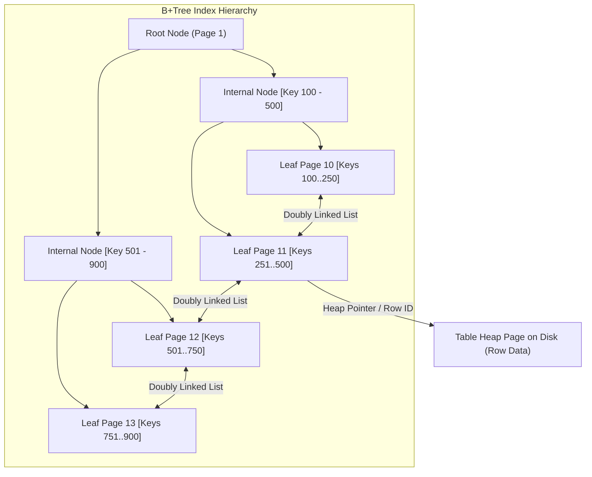
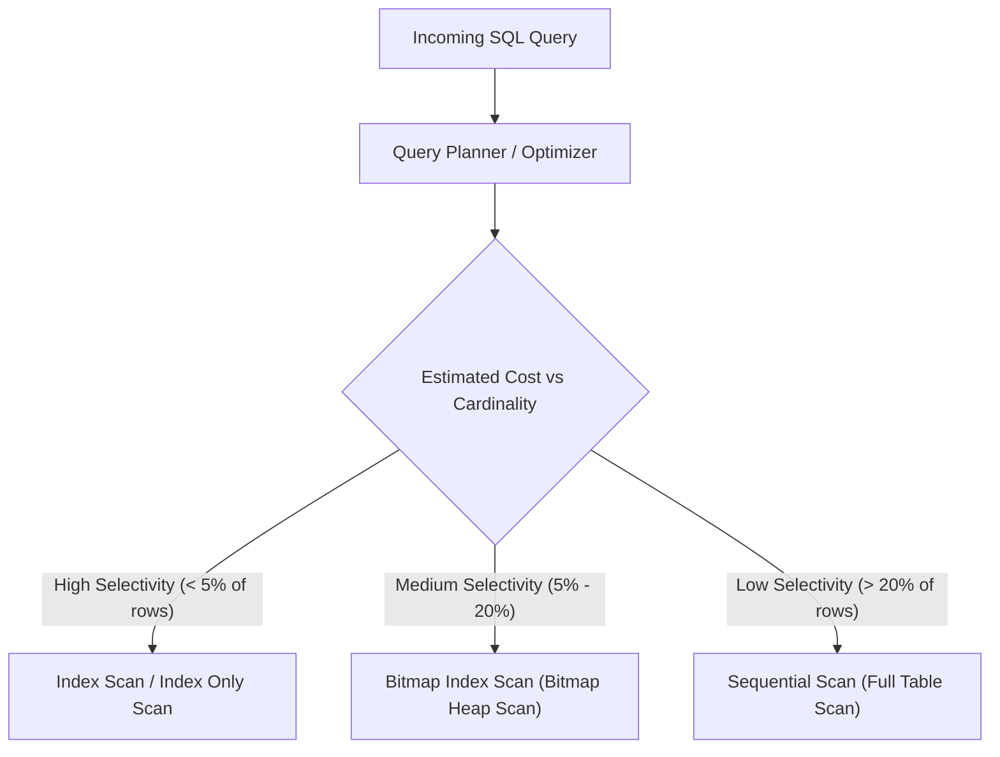

# Database Indexes, B+Trees, and Query Execution Mechanics

---

## 1. What Is It?
A **Database Index** is an auxiliary on-disk and in-memory search data structure (predominantly a **$\text{B}^+\text{Tree}$**) maintained by the database storage engine. It maps search keys (one or more table column values) directly to physical disk storage locations (Tuple Identifiers / Page Row Pointers), transforming $O(N)$ full table sequential disk scans into $O(\log N)$ logarithmic pointer lookups.

---

## 2. Why Does It Exist?
Data in database heap files is physically organized into fixed-size disk pages (typically $8\text{KB}$ in PostgreSQL, $16\text{KB}$ in MySQL InnoDB). Without an index, evaluating a query like:
```sql
SELECT * FROM users WHERE email = 'alice@example.com';
```
requires the storage engine to fetch every single disk page from storage into the buffer pool and inspect every row sequentially (**Sequential Scan** / Full Table Scan). For a table with 100,000,000 rows across 500,000 disk pages ($4\text{GB}$ on disk), a sequential scan consumes hundreds of milliseconds and massive I/O bandwidth.

An index reduces the disk page reads for the same lookup to just $3\text{ to }4$ page traversals ($< 1\text{ms}$).

---

## 3. Mental Model



---

## 4. How Does It Work?

### B-Tree vs B+Tree Architecture
Most modern relational databases (PostgreSQL, MySQL InnoDB, SQLite, Oracle) utilize **$\text{B}^+\text{Trees}$**:
- **Internal Nodes**: Contain only search keys and child page pointers. No table data or row payloads are stored here, maximizing fan-out (a single $8\text{KB}$ page can hold hundreds of keys).
- **Leaf Nodes**: Contain all search keys along with either the physical row pointer (`TID` in PostgreSQL) or the entire row data (Clustered Index in InnoDB).
- **Doubly-Linked Leaf Chain**: All leaf pages are linked sequentially in a bidirectional linked list, enabling extremely efficient range scans (`WHERE age BETWEEN 20 AND 30`) without re-traversing internal parent nodes.

### The Leftmost Prefix Rule for Composite Indexes
For a composite index on columns `(A, B, C)`:
- `WHERE A = 1` $\longrightarrow$ **Uses Index**
- `WHERE A = 1 AND B = 2` $\longrightarrow$ **Uses Index**
- `WHERE A = 1 AND B = 2 AND C = 3` $\longrightarrow$ **Uses Index**
- `WHERE B = 2 AND C = 3` $\longrightarrow$ **CANNOT use index** (violates leftmost prefix rule)
- `WHERE A = 1 AND C = 3` $\longrightarrow$ **Uses index only for column A**; column C is filtered in memory.

---

## 5. Internal Working

### Index Scan Execution Access Paths



1. **Index Scan**:
   - Traverses the B+Tree to find matching leaf nodes.
   - For each matching key, immediately reads the corresponding heap page to fetch the full row.
   - *Cost*: High random disk I/O if many rows match.
2. **Index Only Scan (Covering Index)**:
   - All requested columns in the `SELECT` and `WHERE` clauses exist directly inside the index itself (or via `INCLUDE` clause).
   - The engine **never reads the table heap pages**, resulting in ultra-fast execution.
3. **Bitmap Index Scan**:
   - Traverses the index and constructs a memory bitmap of matching physical page numbers.
   - Sorts the page numbers physically and performs sequential batch reads of the heap pages, converting random I/O into sequential I/O.
4. **Sequential Scan**:
   - Directly scans the heap file from start to finish. When matching $> 20\%$ of a table, sequential reads with kernel readahead are faster than random index lookups.

---

## 6. Example

### 1. Creating Composite and Covering Indexes
```sql
-- Standard Composite Index
CREATE INDEX idx_orders_user_status_created 
ON orders (user_id, status, created_at DESC);

-- Covering Index using PostgreSQL INCLUDE (Non-key payload attributes)
CREATE INDEX idx_users_email_covering 
ON users (email) INCLUDE (full_name, status);
```

### 2. Query Execution Analysis
```sql
-- Query 1: Fully satisfies Leftmost Prefix (Uses Index)
EXPLAIN ANALYZE
SELECT id, total_amount_cents
FROM orders
WHERE user_id = 42 AND status = 'CONFIRMED'
ORDER BY created_at DESC;

-- Query 2: Index-Only Scan (Zero Heap Page Access)
EXPLAIN ANALYZE
SELECT email, full_name, status
FROM users
WHERE email = 'alice@example.com';
```

---

## 7. Implementation

### Java 21 Spring Boot Entity Index Mapping & Execution
```java
package com.backend.engineering.databases.model;

import jakarta.persistence.*;
import java.time.Instant;

@Entity
@Table(
    name = "user_transactions",
    indexes = {
        @Index(name = "idx_tx_user_created", columnList = "user_id, created_at DESC"),
        @Index(name = "idx_tx_reference", columnList = "reference_id", unique = true)
    }
)
public class UserTransaction {

    @Id
    @GeneratedValue(strategy = GenerationType.IDENTITY)
    private Long id;

    @Column(name = "user_id", nullable = false)
    private Long userId;

    @Column(name = "reference_id", nullable = false, unique = true, length = 64)
    private String referenceId;

    @Column(name = "amount_cents", nullable = false)
    private Long amountCents;

    @Column(name = "created_at", nullable = false)
    private Instant createdAt;

    protected UserTransaction() {}

    public UserTransaction(Long userId, String referenceId, Long amountCents) {
        this.userId = userId;
        this.referenceId = referenceId;
        this.amountCents = amountCents;
        this.createdAt = Instant.now();
    }

    public Long getId() { return id; }
    public Long getUserId() { return userId; }
    public String getReferenceId() { return referenceId; }
    public Long getAmountCents() { return amountCents; }
    public Instant getCreatedAt() { return createdAt; }
}
```

---

## 8. Performance

| Query Type | Rows in Table | Execution Plan | Disk Blocks Fetched | Latency |
|---|---|---|---|---|
| Single Row Lookup (No Index) | $10,000,000$ | `Seq Scan` | $125,000\text{ blocks}$ | $\approx 450\text{ ms}$ |
| Single Row Lookup (B+Tree PK) | $10,000,000$ | `Index Scan` | $3\text{ index} + 1\text{ heap}$ | $< 0.4\text{ ms}$ |
| Point Lookup (Covering Index) | $10,000,000$ | `Index Only Scan` | $3\text{ index} + 0\text{ heap}$ | $< 0.1\text{ ms}$ |
| Low Selectivity Scan (Match 40%) | $10,000,000$ | `Seq Scan` (Planner chosen) | $125,000\text{ sequential}$ | $\approx 280\text{ ms}$ |

---

## 9. Failure Scenarios

1. **Index Bloat and Write Amplification**:
   - *Failure*: A table with 15 indexes experiences high `INSERT` and `UPDATE` throughput. Every single write must update 15 separate B+Trees on disk, degrading write throughput by $10\times$ and causing massive WAL log write stalls.
   - *Mitigation*: Prune unused indexes using `pg_stat_user_indexes`. Only index columns actively used in high-frequency filter, join, and sort criteria.

2. **Index Invalidation via Function Calls / Type Coercion**:
   - *Failure*: Writing `WHERE UPPER(email) = 'ALICE@EXAMPLE.COM'` or `WHERE user_id + 0 = 42` renders a standard B+Tree index completely useless, forcing an accidental full sequential scan.
   - *Mitigation*: Use **Functional Indexes** (`CREATE INDEX idx_users_upper_email ON users (UPPER(email))`) and enforce strict type matching in Java PreparedStatements.

---

## 10. Observability

### Unused and Redundant Index Detection (PostgreSQL)
```sql
SELECT 
    schemaname || '.' || relname AS table_name,
    indexrelname AS index_name,
    pg_size_pretty(pg_relation_size(indexrelid)) AS index_size,
    idx_scan AS number_of_scans
FROM pg_stat_user_indexes
JOIN pg_index USING (indexrelid)
WHERE indisunique IS FALSE
  AND idx_scan = 0
ORDER BY pg_relation_size(indexrelid) DESC;
```

---

## 11. Debugging

### Interpreting `EXPLAIN (ANALYZE, BUFFERS)`
```text
Index Scan using idx_orders_user_status on orders  (cost=0.43..8.45 rows=1 width=32) (actual time=0.042..0.044 rows=1 loops=1)
  Index Cond: ((user_id = 42) AND ((status)::text = 'CONFIRMED'::text))
  Buffers: shared hit=4
Planning Time: 0.125 ms
Execution Time: 0.065 ms
```
- `cost=0.43..8.45`: Estimated startup cost (B+Tree root-to-leaf descent) and total cost.
- `shared hit=4`: Fetched 3 B+Tree index pages + 1 table heap page directly from RAM buffer pool (0 disk reads).
- If `Buffers: read=X` is high, cold disk pages are being pulled into memory.

---

## 12. Scaling

1. **Partial Indexes**:
   - Instead of indexing millions of historical inactive records, index only hot active records:
   ```sql
   CREATE INDEX idx_orders_unprocessed 
   ON orders (created_at) 
   WHERE status IN ('PENDING', 'PROCESSING');
   ```
   - Reduces index size by $95\%$ and keeps the entire working tree in RAM cache.

2. **Zero-Downtime Index Creation**:
   - Standard `CREATE INDEX` acquires an exclusive `SHARE` lock on the table, blocking all concurrent `INSERT`/`UPDATE`/`DELETE` writes.
   - **Production Standard**: Always use `CREATE INDEX CONCURRENTLY` in PostgreSQL or `ALGORITHM=INPLACE, LOCK=NONE` in MySQL.

---

## 13. Trade-offs

| Indexing Choice | Throughput Impact | Storage & Memory | Ideal Query Pattern |
|---|---|---|---|
| **No Index** | High write throughput | Zero extra overhead | Append-only bulk ingest |
| **B+Tree Index** | Moderate write penalty ($5-15\%$) | $10-30\%$ table size in RAM | Equality (`=`), Range (`<, >`), Prefix `LIKE 'abc%'` |
| **Covering Index (`INCLUDE`)** | Slightly higher leaf page size | Higher memory consumption | Critical p99 read paths requiring zero heap fetches |
| **Hash Index** | Fast point lookups | Does not support range queries | Exact equality only (`=`) |

---

## 14. When to Use
- High-cardinality columns frequently queried in `WHERE`, `JOIN`, `ORDER BY`, and `GROUP BY` clauses.
- Foreign key columns to prevent table locks on parent row modifications.
- Unique constraints enforcing business invariants.

---

## 15. When NOT to Use
- Extremely low-cardinality columns on large tables (e.g., boolean `is_active` where $98\%$ of rows are `true`).
- Tables with massive write/ingestion rates that are rarely queried by ad-hoc filters.
- Very small lookup tables ($< 100$ rows) where a sequential scan in a single page is faster than an index traversal.

---

## 16. Interview Questions

### Q1: Why does a query with `WHERE A = 10 AND B > 50 AND C = 'X'` only use the index for columns `(A, B)` on composite index `(A, B, C)`?
<details>
<summary>Reveal Answer</summary>

**Answer**:
A composite B+Tree index is sorted lexicographically: first by `A`, then within identical values of `A` by `B`, and within identical values of `B` by `C`.
When the query executor reaches a **range condition** (`B > 50`), it can binary-search to the first entry where `A=10` and `B>50`, and scan leaf nodes forward. However, across those different values of `B` ($51, 52, 53\dots$), the values of `C` are **no longer sorted globally**; each distinct `B` has its own local sort of `C`. Therefore, the B+Tree cannot jump across index entries to evaluate `C = 'X'`; it must filter `C` sequentially in memory for every index tuple.
</details>

### Q2: What is the difference between an Index Scan and an Index Only Scan, and what role does the Visibility Map play in PostgreSQL?
<details>
<summary>Reveal Answer</summary>

**Answer**:
- In an **Index Scan**, the database navigates the B+Tree to locate matching entries and then fetches the corresponding heap page to read the complete tuple and check MVCC row visibility.
- In an **Index Only Scan**, all queried columns are stored in the index (via key columns or `INCLUDE`), allowing the query to return data without fetching the heap page.
- In PostgreSQL, because the B+Tree does not store transaction visibility information (`xmin`/`xmax`), an Index Only Scan must check the **Visibility Map** (VM). If the VM bit for that heap page is set (all tuples visible to all current transactions), the heap fetch is completely skipped. If not, the engine must still inspect the heap page to verify MVCC visibility.
</details>

---

## 17. Practical Exercise
1. Spin up a PostgreSQL 16 instance with 1,000,000 simulated user transactions.
2. Compare the execution plan and buffer hit metrics of a query filtering by `user_id` and `created_at` before and after adding a composite index.
3. Rewrite the query to leverage an Index Only Scan via the `INCLUDE` clause and observe the drop in buffer page reads.
4. Execute `CREATE INDEX CONCURRENTLY` during active concurrent simulated writes to verify zero write lock blocking.

---

## 18. Quick Revision
- **B+Tree**: Internal nodes hold keys/pointers; leaf nodes hold data/TIDs and are linked as a doubly linked list.
- **Leftmost Prefix**: Composite index `(A, B, C)` can only be used if leading columns are present in the query.
- **Range Predicates Stop Index Utilization**: Range filters (`<, >, BETWEEN`) prevent subsequent columns in a composite index from being used for B+Tree descent.
- **Covering Index**: Avoids table heap reads completely by storing all projected columns in the index.
- **Concurrent Indexing**: Always use `CREATE INDEX CONCURRENTLY` in production to prevent table lock outages.
