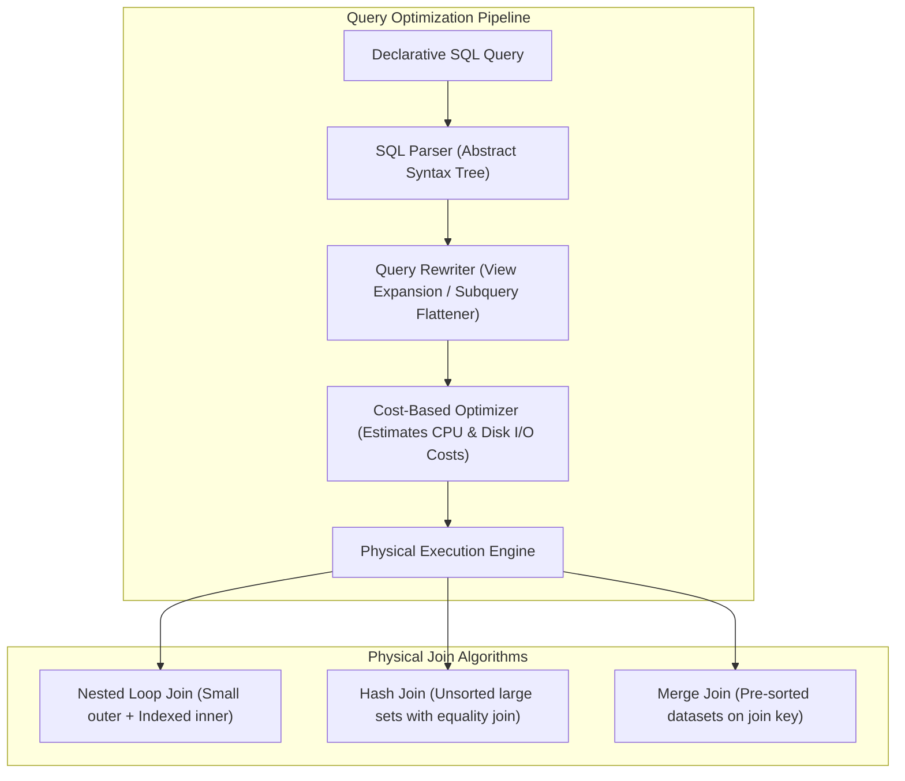
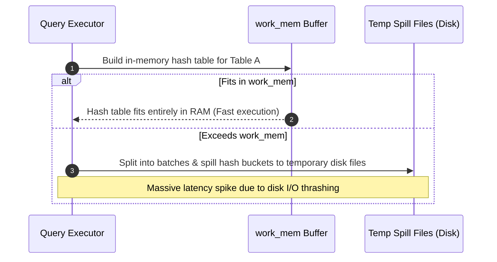

# Joins, Aggregations, Window Functions, and Query Optimization

---

## 1. What Is It?
Relational databases execute complex queries combining data from multiple tables using **Join Algorithms** (Nested Loop Join, Hash Join, Merge Join) and summarize high-volume rows using **Aggregations** (HashAggregate, GroupAggregate) and **Window Functions**. The relational **Query Optimizer** translates declarative SQL into an imperative physical execution tree based on cost estimations derived from table statistics.

---

## 2. Why Does It Exist?
Declarative SQL specifies *what* data to retrieve, not *how* to retrieve it. A join between two tables of 100,000 rows each could conceptually evaluate $100,000 \times 100,000 = 10,000,000,000$ comparisons ($10\text{ billion}$). The query optimizer evaluates mathematical join strategies and chooses an optimal physical algorithm that completes the join in linear $O(N + M)$ time instead of quadratic $O(N \times M)$ time.

---

## 3. Mental Model



---

## 4. How Does It Work?

### The 3 Core Relational Join Algorithms

1. **Nested Loop Join ($O(N \times \log M)$)**:
   - Iterates through each row in the outer table.
   - For each outer row, searches the inner table using a backing B+Tree index.
   - *Best for*: Small outer dataset ($\le 1,000$ rows) joined with an indexed inner table.

2. **Hash Join ($O(N + M)$)**:
   - **Phase 1 (Build)**: Scans the smaller table and constructs an in-memory hash table on the join key.
   - **Phase 2 (Probe)**: Scans the larger table and probes the in-memory hash table for matching join keys.
   - *Best for*: Large, unsorted tables joined with an equality condition (`=`).

3. **Merge Join ($O(N + M)$ after sort)**:
   - Requires both inputs to be sorted on the join key.
   - Simultaneously advances two pointers across both inputs in a single synchronized linear sweep.
   - *Best for*: Large datasets that are already pre-sorted (via index scan) or range/inequality join conditions.

---

## 5. Internal Working

### Memory Management: `work_mem` and Disk Spill
During Hash Joins, HashAggregates, and Sorting (`ORDER BY`), the database allocates a dedicated memory buffer per operation governed by the `work_mem` configuration parameter.



### Aggregations & Window Functions
- **HashAggregate**: Hashes `GROUP BY` keys in memory to accumulate counts, sums, and averages.
- **GroupAggregate**: Requires sorted input; aggregates rows sequentially as values change.
- **Window Functions**: Compute aggregations across partitions of rows without collapsing the result set into a single summary row (e.g., calculating running totals or row ranks).

---

## 6. Example

### 1. Complex Query with Window Functions
```sql
-- Calculate user's order rank, cumulative spending, and previous order date
SELECT 
    id AS order_id,
    user_id,
    total_amount_cents,
    created_at,
    -- Window 1: Rank user's orders by amount
    DENSE_RANK() OVER (PARTITION BY user_id ORDER BY total_amount_cents DESC) AS spend_rank,
    -- Window 2: Cumulative spend over time
    SUM(total_amount_cents) OVER (PARTITION BY user_id ORDER BY created_at ROWS BETWEEN UNBOUNDED PRECEDING AND CURRENT ROW) AS running_total_cents,
    -- Window 3: Previous order timestamp
    LAG(created_at, 1) OVER (PARTITION BY user_id ORDER BY created_at) AS previous_order_at
FROM orders
WHERE status = 'CONFIRMED';
```

---

## 7. Implementation

### Optimized Spring Data JPA Projection Query with DTO
```java
package com.backend.engineering.databases.repository;

import org.springframework.data.jpa.repository.JpaRepository;
import org.springframework.data.jpa.repository.Query;
import org.springframework.data.repository.query.Param;
import org.springframework.stereotype.Repository;

import java.time.Instant;
import java.util.List;

public interface OrderRepository extends JpaRepository<com.backend.engineering.databases.model.Order, Long> {

    // Native query mapping to high-performance DTO projection (Zero Hibernate Entity Overhead)
    @Query(value = """
        SELECT 
            o.id AS orderId,
            u.email AS userEmail,
            o.total_amount_cents AS totalAmountCents,
            COUNT(oi.id) AS totalItems,
            o.created_at AS createdAt
        FROM orders o
        JOIN users u ON o.user_id = u.id
        LEFT JOIN order_items oi ON oi.order_id = o.id
        WHERE o.created_at >= :since
        GROUP BY o.id, u.email, o.total_amount_cents, o.created_at
        ORDER BY o.total_amount_cents DESC
        LIMIT :limit
        """, nativeQuery = true)
    List<OrderSummaryProjection> findTopSpendingOrders(
            @Param("since") Instant since, 
            @Param("limit") int limit
    );

    // Spring Data Projection Interface
    interface OrderSummaryProjection {
        Long getOrderId();
        String getUserEmail();
        Integer getTotalAmountCents();
        Integer getTotalItems();
        Instant getCreatedAt();
    }
}
```

---

## 8. Performance

| Join Type | Outer Rows | Inner Rows | Algorithm | Memory Used | Latency |
|---|---|---|---|---|---|
| Single User Orders | $1\text{ (User)}$ | $15\text{ (Orders)}$ | Nested Loop (Index Scan) | $< 10\text{KB}$ | $< 0.3\text{ms}$ |
| Daily Active Report | $50,000$ | $200,000$ | Hash Join (`work_mem` RAM) | $16\text{MB}$ | $45\text{ms}$ |
| Daily Active Report | $50,000$ | $200,000$ | Hash Join (Spilled to disk) | Exceeded $4\text{MB}$ | $850\text{ms}$ |
| Pre-sorted Ledger | $1,000,000$ | $1,000,000$ | Merge Join | $< 1\text{MB}$ | $110\text{ms}$ |

---

## 9. Failure Scenarios

1. **Hash Join Spill to Disk (`work_mem` exhaustion)**:
   - *Failure*: When building an in-memory hash table for a large join, the data exceeds the allocated `work_mem`. The engine writes intermediate hash buckets to disk temporary files, resulting in severe I/O degradation.
   - *Mitigation*: Adjust `work_mem` at session level for heavy reporting queries (`SET work_mem = '64MB';`).

2. **Stale Table Statistics & Optimizer Misestimation**:
   - *Failure*: After a bulk insert of 10,000,000 rows, PostgreSQL's statistics engine (`pg_statistic`) still thinks the table has 50 rows. The optimizer chooses a catastrophic Nested Loop Join over a Hash Join, locking the CPU for hours.
   - *Mitigation*: Run `ANALYZE table_name;` immediately following large data loads or bulk batch updates.

---

## 10. Observability

### Identifying Slow Joins and Disk Spills
```sql
SELECT 
    query, 
    calls, 
    total_exec_time,
    temp_blks_written AS disk_blocks_spilled,
    shared_blks_hit,
    shared_blks_read
FROM pg_stat_statements
WHERE temp_blks_written > 0
ORDER BY temp_blks_written DESC
LIMIT 10;
```

---

## 11. Debugging

### Step-by-Step Join Plan Analysis
```sql
EXPLAIN (ANALYZE, BUFFERS, FORMAT TEXT)
SELECT u.email, COUNT(o.id)
FROM users u
JOIN orders o ON u.id = o.user_id
GROUP BY u.email;
```
- **Red Flags in Output**:
  - `Sort Method: external merge Disk: 15400kB` $\longrightarrow$ Sort spilled to disk. Increase `work_mem`.
  - `Rows Removed by Filter: 950,000` $\longrightarrow$ Sequential scan filtered out almost all rows; missing index.
  - `actual time=0.012..850.123 rows=10 loops=1000` $\longrightarrow$ Nested loop executed 1,000 times on an unindexed inner table.

---

## 12. Scaling

1. **Denormalized Pre-aggregations**:
   - Instead of running `SUM(amount)` over millions of historical transactions on every dashboard load, maintain an atomic aggregate table updated via transactional triggers or Kafka stream consumers.
2. **Materialized Views**:
   - Pre-compute heavy multi-table joins:
   ```sql
   CREATE MATERIALIZED VIEW mv_daily_sales AS
   SELECT DATE_TRUNC('day', created_at) AS day, SUM(total_amount_cents) AS revenue
   FROM orders
   GROUP BY 1;
   
   -- Refresh concurrently without read locks
   REFRESH MATERIALIZED VIEW CONCURRENTLY mv_daily_sales;
   ```

---

## 13. Trade-offs

| Optimization Technique | Benefit | Operational Cost |
|---|---|---|
| **Live Multi-table Join** | 100% real-time consistency | High CPU & I/O on query execution |
| **Materialized View** | Ultra-fast read access | Eventual consistency; refresh overhead |
| **Increased `work_mem`** | Eliminates disk spills | Multiplies memory usage per active query connection |

---

## 14. When to Use
- Nested Loop: OLTP point queries traversing indexed foreign key relationships.
- Hash Join: Large batch processing, reporting queries, and ad-hoc analytics.
- Window Functions: Financial running balances, pagination with total partition counts, and ranking/leaderboards.

---

## 15. When NOT to Use
- Running heavy multi-table aggregations on the primary OLTP master database during peak write traffic (offload to read replicas or analytics warehouses).
- Excessive subqueries inside `SELECT` projection clauses (e.g., `SELECT u.*, (SELECT COUNT(*) FROM orders...)`) which force subquery execution for every single row.

---

## 16. Interview Questions

### Q1: What is the difference between `RANK()`, `DENSE_RANK()`, and `ROW_NUMBER()` window functions?
<details>
<summary>Reveal Answer</summary>

**Answer**:
When ranking rows with tied values (e.g., scores: 100, 100, 90):
1. `ROW_NUMBER()` assigns a strictly unique, contiguous sequential integer to each row regardless of ties ($1, 2, 3$).
2. `RANK()` assigns identical ranks to tied rows and **skips subsequent ranks** by the number of duplicates ($1, 1, 3$).
3. `DENSE_RANK()` assigns identical ranks to tied rows and **does not skip subsequent ranks** ($1, 1, 2$).
</details>

### Q2: Why does the query optimizer sometimes choose a Sequential Scan over an Index Scan even when an index exists on the filter column?
<details>
<summary>Reveal Answer</summary>

**Answer**:
The query optimizer is **cost-based**. An Index Scan requires two distinct steps:
1. Navigating the B+Tree to locate matching entries (Index I/O).
2. Performing **random I/O** disk reads on the heap pages to fetch the actual row tuples.

If the selectivity of the filter predicate is low (e.g., the query matches $> 15-20\%$ of all rows in the table), performing hundreds of thousands of random page lookups is far more expensive than reading the entire table sequentially from start to finish with kernel disk readahead caching. Thus, the optimizer calculates that the total cost of a Sequential Scan is lower than an Index Scan.
</details>

---

## 17. Practical Exercise
1. Write a query using `ROW_NUMBER()` to deduplicate user activity logs, keeping only the latest event per `user_id`.
2. Generate an `EXPLAIN ANALYZE` execution plan that deliberately triggers an `external merge Disk` sort by setting `SET work_mem = '64kB';`.
3. Increase `work_mem` to eliminate the disk spill and compare execution times and disk block operations.

---

## 18. Quick Revision
- **Nested Loop Join**: Ideal for small outer sets + indexed inner lookups.
- **Hash Join**: Best for large equality joins; builds in-memory hash table on the smaller relation.
- **Merge Join**: Best for pre-sorted inputs on the join key.
- **`work_mem`**: Allocates per-operation memory for sorting and hash joins; undersized `work_mem` causes costly disk spills.
- **Window Functions**: Perform partition-level aggregations without collapsing row sets.
