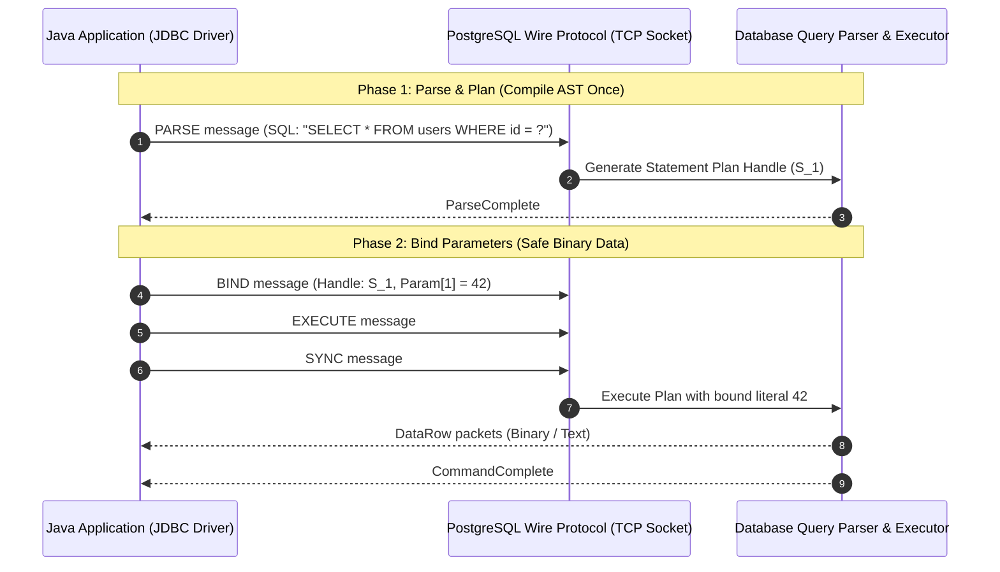

# JDBC Architecture, Prepared Statements, and Network Protocols

---

## 1. What Is It?
**Java Database Connectivity (JDBC)** is the foundational Java standard API (`java.sql`, `javax.sql`) for executing SQL statements and retrieving relational query results across heterogeneous database systems. A **PreparedStatement** is a pre-compiled SQL statement handle that separates the SQL command template from dynamic runtime literal parameters, enabling server-side execution plan caching and providing absolute immunity against SQL injection vulnerabilities.

---

## 2. Why Does It Exist?
In raw `Statement` execution, SQL strings are dynamically concatenated:
```java
// VULNERABLE TO SQL INJECTION & EXPENSIVE RE-PARSING
String sql = "SELECT * FROM users WHERE email = '" + userInput + "'";
stmt.executeQuery(sql);
```
This causes two catastrophic problems:
1. **SQL Injection**: An attacker supplying `admin' OR '1'='1` manipulates the query parser into altering the relational algebra Abstract Syntax Tree (AST), bypassing authentication or dropping tables.
2. **CPU Exhaustion via Re-Compilation**: Every unique query string forces the database server to repeatedly parse, lex, validate, rewrite, and plan the query execution tree from scratch.

`PreparedStatement` pre-compiles the query template with positional placeholders (`?`), compiling the AST once and safely transmitting parameters over the binary wire protocol as raw data literals.

---

## 3. Mental Model



---

## 4. How Does It Work?

### The JDBC Interface Hierarchy
- `DriverManager`: Manages list of database driver implementations (`org.postgresql.Driver`, `com.mysql.cj.jdbc.Driver`).
- `Connection`: Physical TCP connection socket session to the database server.
- `PreparedStatement`: Pre-compiled query representation.
- `ResultSet`: Forward-only tabular cursor over the retrieved database rows.

### PostgreSQL Frontend/Backend Protocol Mechanics
When using PostgreSQL JDBC driver:
1. **Simple Query Protocol**: Client sends a single `Q` packet containing raw text SQL. The server parses, analyzes, plans, and executes the query in one pass.
2. **Extended Query Protocol**: Client sends distinct protocol packets:
   - `Parse` (`P`): Prepares the statement and assigns a statement name.
   - `Bind` (`B`): Binds parameters to a portal.
   - `Execute` (`E`): Executes the portal with a specified row fetch limit.
   - `Sync` (`S`): Flushes pending buffers and closes the implicit transaction block.

---

## 5. Internal Working

### Server-Side Statement Plan Caching (`prepareThreshold`)
The PostgreSQL JDBC driver utilizes a `prepareThreshold` configuration (default: 5):
- The first 4 times a query runs, the driver uses an unnamed statement (lightweight one-off execution).
- On the **5th execution**, the driver automatically sends a server-side `PARSE` command to create a named prepared statement and requests a **Generic Execution Plan**.
- The database caches the query execution plan in backend process memory, eliminating parsing and planning CPU overhead for all future executions on that connection.

---

## 6. Example

### 1. High-Performance Batch Insertion with PreparedStatements
```java
package com.backend.engineering.databases.jdbc;

import java.sql.Connection;
import java.sql.PreparedStatement;
import java.sql.SQLException;
import java.util.List;

public class OrderJdbcBatchRepository {

    public record OrderItemRecord(long orderId, long productId, int quantity, int unitPriceCents) {}

    public void insertBatch(Connection conn, List<OrderItemRecord> items) throws SQLException {
        String sql = """
            INSERT INTO order_items (order_id, product_id, quantity, historical_price_cents)
            VALUES (?, ?, ?, ?)
            """;

        boolean originalAutoCommit = conn.getAutoCommit();
        try {
            conn.setAutoCommit(false); // Enable manual transaction block for batching

            try (PreparedStatement pstmt = conn.prepareStatement(sql)) {
                int count = 0;
                for (OrderItemRecord item : items) {
                    pstmt.setLong(1, item.orderId());
                    pstmt.setLong(2, item.productId());
                    pstmt.setInt(3, item.quantity());
                    pstmt.setInt(4, item.unitPriceCents());
                    pstmt.addBatch(); // Buffer in JDBC client memory

                    if (++count % 500 == 0) {
                        pstmt.executeBatch(); // Send 500-row batch over TCP
                    }
                }
                pstmt.executeBatch(); // Send remaining records
            }

            conn.commit(); // Single disk WAL flush
        } catch (SQLException ex) {
            conn.rollback();
            throw ex;
        } finally {
            conn.setAutoCommit(originalAutoCommit);
        }
    }
}
```

---

## 7. Implementation

### Cursor Fetching for Millions of Rows (`setFetchSize`)
```java
package com.backend.engineering.databases.jdbc;

import java.sql.Connection;
import java.sql.PreparedStatement;
import java.sql.ResultSet;
import java.sql.SQLException;
import java.util.function.Consumer;

public class LargeDatasetStreamer {

    public void streamLargeTable(Connection conn, Consumer<String> recordProcessor) throws SQLException {
        String sql = "SELECT email FROM users WHERE status = 'ACTIVE'";

        // Disable autocommit to allow cursor-based streaming in PostgreSQL
        conn.setAutoCommit(false);

        try (PreparedStatement pstmt = conn.prepareStatement(sql)) {
            // Fetch 1,000 rows at a time over TCP instead of buffering 10,000,000 rows in JVM heap
            pstmt.setFetchSize(1000);

            try (ResultSet rs = pstmt.executeQuery()) {
                while (rs.next()) {
                    String email = rs.getString("email");
                    recordProcessor.accept(email);
                }
            }
        } finally {
            conn.setAutoCommit(true);
        }
    }
}
```

---

## 8. Performance

| Execution Strategy | Rows Processed | Network Roundtrips | JVM Heap Memory | Execution Time |
|---|---|---|---|---|
| Individual Statements (`conn.setAutoCommit(true)`) | $10,000$ inserts | $10,000$ roundtrips + $10,000$ WAL fsyncs | $< 5\text{MB}$ | $18.4\text{ seconds}$ |
| PreparedStatement Batching (`batchSize = 500`) | $10,000$ inserts | $20$ TCP packets + $1$ WAL commit | $< 5\text{MB}$ | $0.28\text{ seconds}$ |
| Unbounded `ResultSet` (Fetch all rows into RAM) | $5,000,000$ rows | $1$ huge stream | $> 2.4\text{GB}$ (`java.lang.OutOfMemoryError`) | Crashed JVM |
| Cursor Streaming (`fetchSize = 1000`) | $5,000,000$ rows | Chunked batch reads | Constant $15\text{MB}$ heap | Constant smooth streaming |

---

## 9. Failure Scenarios

1. **JVM `OutOfMemoryError` via Unbounded `ResultSet`**:
   - *Failure*: By default, MySQL and PostgreSQL JDBC drivers fetch the **entire** query result set across the network and buffer all rows in JVM memory before `executeQuery()` returns. Running `SELECT *` on a large table immediately triggers an application OOM crash.
   - *Mitigation*: Configure `pstmt.setFetchSize(1000)` and ensure `conn.setAutoCommit(false)` in PostgreSQL or `stmt.setFetchSize(Integer.MIN_VALUE)` in MySQL to enable streaming cursors.

2. **Connection Leak via Missing `try-with-resources`**:
   - *Failure*: Opening a `Connection`, `PreparedStatement`, or `ResultSet` without closing them in a `finally` block or `try-with-resources`. The physical TCP socket remains open and the database backend process continues to hold locks and memory.
   - *Mitigation*: **Always** wrap `Connection`, `Statement`, and `ResultSet` in Java 7+ `try-with-resources` blocks.

---

## 10. Observability

- **Metrics**:
  - `jdbc_statements_executed_total`: Total number of SQL statements executed.
  - `jdbc_statement_execution_seconds`: Timer histogram tracking p95/p99 query execution latency.
- **PostgreSQL Server Plan Cache Monitoring**:
  ```sql
  SELECT name, statement, prepare_time, calls 
  FROM pg_prepared_statements;
  ```

---

## 11. Debugging

### Wireshark & TCP Socket Packet Inspection
- Inspect PostgreSQL TCP port `5432` traffic:
  - Verify that `Parse`, `Bind`, and `Execute` messages are properly batched into single TCP segments.
  - Check for excessive `Sync` messages which indicate accidental `autoCommit = true` execution loops.

---

## 12. Scaling

1. **Batch Rewriting (`reWriteBatchedInserts`)**:
   - PostgreSQL JDBC driver configuration: `reWriteBatchedInserts=true`.
   - Rewrites 500 individual `INSERT INTO tbl VALUES (?)` statements into a single multi-value SQL command: `INSERT INTO tbl VALUES (?), (?), (?) ...`.
   - Increases batch insertion throughput by up to $300\%$.
2. **Server-Side Prepared Statement Cache Sizing**:
   - Configure JDBC URL: `jdbc:postgresql://localhost:5432/db?preparedStatementCacheQueries=256&preparedStatementCacheSizeMiB=5`.

---

## 13. Trade-offs

| Feature | Advantage | Trade-off / Cost |
|---|---|---|
| **Prepared Statement Plan Caching** | Zero query parsing overhead | Memory consumption per backend DB process |
| **Cursor Fetching (`fetchSize`)** | Constant, bounded JVM heap memory | Holds open database transaction/snapshot during read |
| **Batch Execution** | Dramatically reduces network roundtrips | Requires manual transaction rollback management |

---

## 14. When to Use
- All parameterized SQL queries in production (absolute standard).
- Batch inserts and bulk data ingestion (`addBatch()`).
- High-volume data streaming using cursor pagination and fetch size tuning.

---

## 15. When NOT to Use
- Dynamic DDL schema migrations (e.g., `CREATE TABLE`, `ALTER TABLE`) which cannot be parameterized with placeholders.
- Complex one-off ad-hoc analytical queries where query plan reuse is zero and dynamic partition pruning requires literal values.

---

## 16. Interview Questions

### Q1: Why does a PreparedStatement prevent SQL injection, whereas string sanitization is considered insecure?
<details>
<summary>Reveal Answer</summary>

**Answer**:
A `PreparedStatement` prevents SQL injection at the **protocol and parser architecture level**:
1. When the query template (`SELECT * FROM users WHERE email = ?`) is sent to the database, the query parser compiles the SQL string into an **Abstract Syntax Tree (AST)** and creates a fixed query execution plan.
2. The user parameter (e.g. `' OR '1'='1`) is sent in a completely separate protocol phase (`Bind` message).
3. The database engine treats the bound parameter strictly as a **raw scalar data literal** (a string of bytes). It is mathematically impossible for the parameter to alter the AST structure, inject new boolean conditions, or execute additional SQL commands.
String sanitization (escaping quotes) relies on heuristic regexes that frequently fail against multi-byte encodings (e.g. GBK/Big5) or subtle parser edge cases.
</details>

### Q2: What happens under the hood when `connection.setAutoCommit(false)` is invoked in JDBC?
<details>
<summary>Reveal Answer</summary>

**Answer**:
By default in JDBC, `autoCommit` is `true`, meaning every single SQL statement is immediately wrapped in its own implicit transaction block (`BEGIN` ... `COMMIT`), forcing an explicit disk fsync to the database Write-Ahead Log (WAL) after every query.
Invoking `setAutoCommit(false)` instructs the JDBC driver to open a persistent transaction block (`BEGIN`). Subsequent SQL operations execute within this open transaction context without issuing disk-syncing commits until `connection.commit()` is explicitly called. This allows multiple batched mutations to be committed in a single physical disk WAL write.
</details>

---

## 17. Practical Exercise
1. Write a Java 21 JDBC benchmark inserting 10,000 records using:
   - Individual `Statement.executeUpdate()` with `autoCommit = true`.
   - `PreparedStatement.addBatch()` with `autoCommit = false` and `reWriteBatchedInserts = true`.
2. Measure and graph the latency and throughput difference.
3. Use `setFetchSize(500)` to stream 100,000 rows while monitoring JVM heap memory with JConsole or VisualVM to verify that memory remains flat.

---

## 18. Quick Revision
- **PreparedStatement**: Pre-compiles the AST; separates code from dynamic data; prevents SQL injection.
- **Wire Protocol**: Extended query protocol uses `Parse`, `Bind`, `Execute`, and `Sync`.
- **`prepareThreshold`**: Promotes unnamed statements to cached generic server-side plans after 5 executions.
- **Batching**: Always disable `autoCommit`, buffer via `addBatch()`, and enable `reWriteBatchedInserts=true`.
- **Streaming Cursors**: Set `fetchSize` and disable autocommit to prevent JVM `OutOfMemoryError` on large queries.
