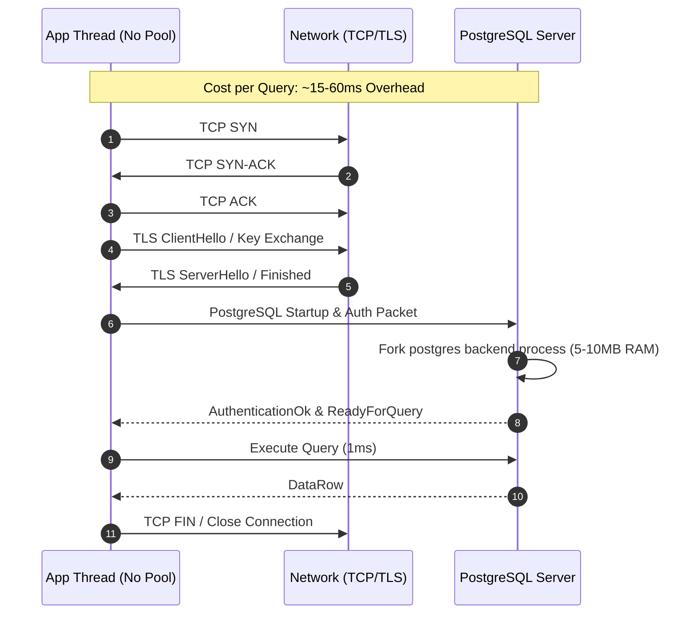
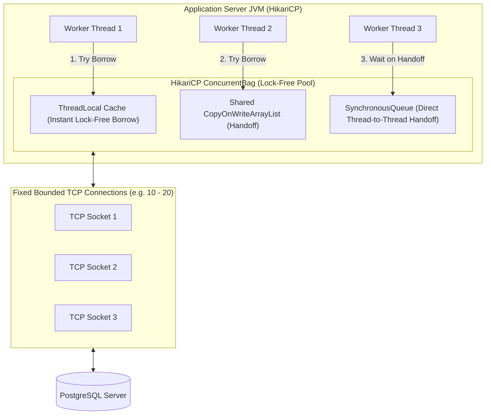
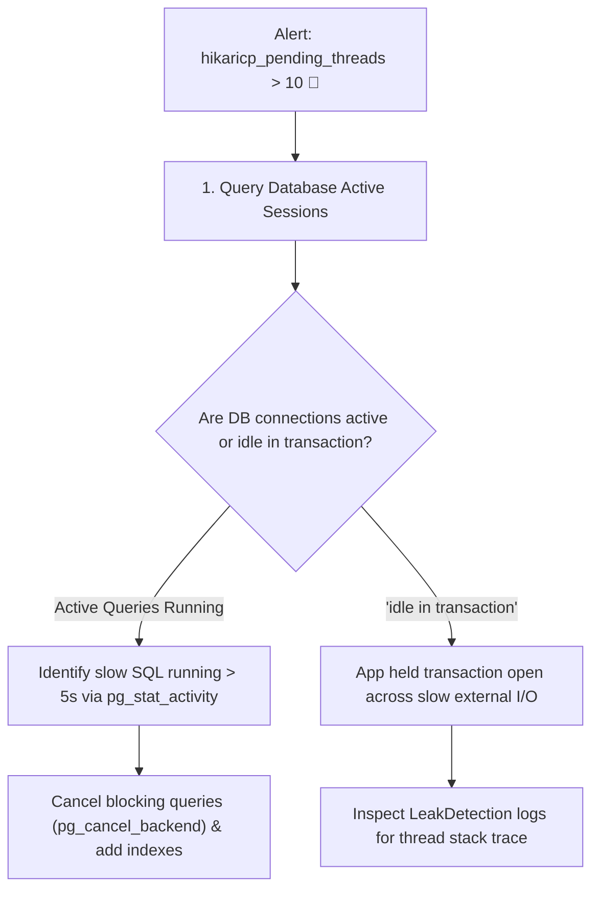

# Database Connection Pooling and HikariCP Internals

---

## 1. What Is It?
A **Database Connection Pool** is an in-memory cache of physical database connection objects maintained within the application JVM. Instead of opening and tearing down a new physical network connection for every HTTP request or database transaction, application worker threads borrow an existing pre-authenticated connection from the pool, execute their queries, and return the connection back to the pool for reuse.

**HikariCP** is the industry-standard, ultra-high-performance JDBC connection pool library in the Java ecosystem and the default connection pool in Spring Boot 3.

---

## 2. Why Does It Exist?
Opening a physical database connection is one of the most expensive operations in backend engineering:
1. **TCP 3-Way Handshake**: $1\text{ RTT}$ ($1-50\text{ms}$).
2. **TLS 1.3 Cryptographic Negotiation**: $1\text{ RTT}$ + asymmetric key calculation.
3. **Database Authentication & Handshake**: SCRAM-SHA-256 / password verification exchange.
4. **Backend Process Spawning (PostgreSQL)**: PostgreSQL allocates a dedicated OS process (`postgres`) consuming $5-10\text{MB}$ of server RAM, initializing catalog caches, connection memory, and transaction states.



Without a connection pool, handling 1,000 req/sec would fork 1,000 OS processes per second on the database server, instantly causing kernel CPU context-switching thrashing and total database collapse.

---

## 3. Mental Model



---

## 4. How Does It Work?

### The Lifecycle of a Pooled Connection
1. **Application Startup**: HikariCP pre-warms the pool up to `minimumIdle` (or `maximumPoolSize`), establishing persistent authenticated TCP sockets to the database.
2. **Borrow Connection (`dataSource.getConnection()`)**:
   - The thread checks its `ThreadLocal` cache for a connection it previously used.
   - If not found or in use, it scans the shared list using lock-free Compare-And-Swap (`CAS`) operations.
   - If all connections are active, the thread blocks on a `SynchronousQueue` waiting up to `connectionTimeout` (default: 30,000ms).
3. **Execute & Close (`connection.close()`)**:
   - Calling `close()` **does not drop the TCP socket**.
   - HikariCP intercepts the call via a dynamic proxy, resets connection state (clears warnings, rolls back uncommitted transactions), marks the connection `STATE_NOT_IN_USE`, and notifies waiting threads.

---

## 5. Internal Working

### HikariCP High-Performance Architecture
HikariCP achieves microsecond connection acquisition through three core optimizations:

1. **`ConcurrentBag` (Lock-Free Container)**:
   - Eliminates standard synchronized locks.
   - Uses `ThreadLocal` connection caching: A thread repeatedly executing queries borrows the exact same connection without touching shared memory.
   - Uses Java `AtomicInteger` CAS state transitions (`STATE_NOT_IN_USE` $\longrightarrow$ `STATE_IN_USE` $\longrightarrow$ `STATE_RESERVED` $\longrightarrow$ `STATE_REMOVED`).

2. **`FastList` (Optimized ArrayList Replacement)**:
   - Standard JDBC `Statement` and `ResultSet` tracking in `ArrayList` executes $O(N)$ linear scans and boundary checks when removing closed statements.
   - `FastList` eliminates boundary checks and scans from the tail of the list ($O(1)$ removal for LIFO statement closures).

3. **Bytecode-Generated Proxies**:
   - Uses Javassist to generate ultra-compact connection and statement delegate classes directly in JVM bytecode, fitting inside CPU L1/L2 instruction caches.

---

## 6. Example

### Production Spring Boot `application.yml` HikariCP Configuration
```yaml
spring:
  datasource:
    url: jdbc:postgresql://db.production.internal:5432/core_db?sslmode=verify-full
    username: app_user
    password: ${DB_PASSWORD}
    driver-class-name: org.postgresql.Driver
    hikari:
      pool-name: CoreHikariCP
      # Connection sizing
      maximum-pool-size: 20
      minimum-idle: 20 # Recommended: Fixed pool size in production
      
      # Timeouts
      connection-timeout: 30000 # 30s before throwing CannotGetJdbcConnectionException
      idle-timeout: 600000 # 10m (ignored when maximum-pool-size == minimum-idle)
      max-lifetime: 1800000 # 30m: Close and retire connection to prevent memory leaks / stale state
      
      # Health & Leak Detection
      keepalive-time: 120000 # 2m: Ping connection to prevent firewall TCP drop
      leak-detection-threshold: 5000 # 5s: Log stack trace if thread holds connection > 5s
      connection-test-query: # Leave empty; uses JDBC4 Connection.isValid() which is faster
```

---

## 7. Implementation

### Programmatic HikariCP Configuration with Micrometer Metrics
```java
package com.backend.engineering.databases.config;

import com.zaxxer.hikari.HikariConfig;
import com.zaxxer.hikari.HikariDataSource;
import io.micrometer.core.instrument.MeterRegistry;
import org.springframework.context.annotation.Bean;
import org.springframework.context.annotation.Configuration;

import javax.sql.DataSource;

@Configuration
public class DataSourceConfig {

    @Bean
    public DataSource dataSource(MeterRegistry meterRegistry) {
        HikariConfig config = new HikariConfig();
        config.setPoolName("ProductionHikariPool");
        config.setJdbcUrl("jdbc:postgresql://localhost:5432/orders_db");
        config.setUsername("postgres");
        config.setPassword("secret");

        // Optimal pool sizing: Fixed pool prevents runtime allocation jitter
        config.setMaximumPoolSize(20);
        config.setMinimumIdle(20);

        // Fail fast if database is unreachable during startup or spike
        config.setConnectionTimeout(5000); // 5 seconds
        config.setMaxLifetime(1800000); // 30 minutes
        config.setLeakDetectionThreshold(4000); // 4 seconds

        HikariDataSource dataSource = new HikariDataSource(config);

        // Bind HikariCP metrics directly to Prometheus registry
        dataSource.setMetricRegistry(meterRegistry);

        return dataSource;
    }
}
```

---

## 8. Performance & Sizing Formula

### The PostgreSQL & HikariCP Sizing Formula
A common junior engineering mistake is configuring `maximumPoolSize = 500` thinking it increases throughput. In reality, large connection pools cause massive CPU cache-thrashing, memory overhead, and disk queue congestion on the database server.

$$\textbf{Pool Sizing Formula: } \text{Connections} = (\text{CoreCount} \times 2) + \text{EffectiveSpindleCount}$$

- On a 8-core database server with SSD storage ($\text{Spindle} \approx 1$):
  $$\text{Optimal Pool Size} = (8 \times 2) + 1 = 17 \approx 20\text{ connections}$$
- **20 connections can easily saturate the CPU/disk bandwidth of an 8-core DB server, serving $> 20,000\text{ queries/sec}$.**

---

## 9. Failure Scenarios

1. **Connection Pool Starvation**:
   - *Failure*: Under high traffic, long-running slow queries ($> 2\text{s}$) or unindexed joins occupy all 20 pooled connections. Subsequent fast 2ms transactions queue up in `HikariCP`, hit `connectionTimeout` (30s), and throw `SQLTransientConnectionException: Connection is not available`.
   - *Mitigation*: Set strict query timeouts (`spring.jpa.properties.jakarta.persistence.query.timeout=3000`), isolate slow reporting queries into a separate read-only DataSource, and alert on `hikaricp_pending_threads > 5`.

2. **Connection Leaks (Holding Connections Across External Network Calls)**:
   - *Failure*: An engineer begins a `@Transactional` database transaction and then performs a blocking HTTP REST call to an external payment gateway. If the gateway hangs for 30s, that database connection is held hostage, starving the entire application pool.
   - *Mitigation*: Configure `leakDetectionThreshold = 5000` to automatically log stack traces of threads holding connections $> 5\text{s}$. **Never make external HTTP/network calls inside transactional boundaries.**

---

## 10. Observability

### Essential Prometheus HikariCP Metrics
```text
# 1. Number of application threads actively waiting to acquire a connection (CRITICAL ALERT)
hikaricp_pending_threads{pool="ProductionHikariPool"} > 0

# 2. Number of connections currently borrowed and executing queries
hikaricp_active_connections{pool="ProductionHikariPool"}

# 3. Number of idle connections ready in pool
hikaricp_idle_connections{pool="ProductionHikariPool"}

# 4. Timer histogram of connection acquire wait time (p99 should be < 5ms)
hikaricp_connection_acquire_seconds_max{pool="ProductionHikariPool"}
```

---

## 11. Debugging

### Step-by-Step Triage for Connection Starvation Incident


### PostgreSQL Active Session Query
```sql
SELECT pid, now() - query_start AS duration, state, query 
FROM pg_stat_activity 
WHERE state != 'idle' 
ORDER BY duration DESC;
```

---

## 12. Scaling

1. **Client-Side Sizing Across Multiple Application Instances**:
   - If PostgreSQL `max_connections = 200`, and you deploy 10 Spring Boot microservice replicas:
   - Each replica should have `maximumPoolSize = 15` ($10 \times 15 = 150 \text{ connections}$, leaving 50 connections for DB admin, backups, and migrations).
2. **Server-Side Connection Pooling (PgBouncer)**:
   - When deploying hundreds of Kubernetes pods ($> 1,000$ total connections), PostgreSQL backend process memory explodes.
   - Place **PgBouncer** in **Transaction Pooling Mode** between application pods and PostgreSQL. PgBouncer multiplexes 5,000 application client connections over 50 physical PostgreSQL connections.

---

## 13. Trade-offs

| Pool Setting | Higher Value | Lower Value | Recommended |
|---|---|---|---|
| `maximumPoolSize` | Handles brief concurrency bursts; risks DB CPU saturation | Protects database from overload; risks app thread queueing | $10-30$ per instance (Calculate via formula) |
| `connectionTimeout` | Reduces immediate 500 errors; inflates client request latency | Fails fast, enables graceful degradation | $3,000 - 5,000\text{ms}$ |
| `leakDetectionThreshold` | Low overhead; catches bugs | If $< 2,000\text{ms}$, false positives on legitimate batch jobs | $4,000 - 5,000\text{ms}$ |

---

## 14. When to Use
- Mandatory for all production OLTP backend services connecting to relational databases (PostgreSQL, MySQL, Oracle, SQL Server).
- Whenever connection reuse, bounded resource consumption, and predictable database load are required.

---

## 15. When NOT to Use
- Ephemeral, short-lived serverless functions (AWS Lambda) executing single invocations (use AWS RDS Proxy instead of client-side HikariCP).
- Non-relational databases with native multiplexed asynchronous multiplexing (e.g., Redis Netty client Lettuce, Cassandra driver).

---

## 16. Interview Questions

### Q1: Why does increasing the connection pool size from 20 to 200 often make database performance worse under heavy load?
<details>
<summary>Reveal Answer</summary>

**Answer**:
A database server has a fixed number of CPU cores and storage I/O channels. 
When 200 active connections execute concurrent queries on an 8-core server:
1. **CPU Context Switching**: The OS kernel spends more CPU cycles switching execution contexts between 200 competing database processes than doing actual query execution.
2. **Disk and Lock Contention**: 200 transactions compete for page buffer locks, write-ahead log (WAL) insertion locks, and row-level locks, leading to severe lock convoying.
3. **CPU Cache Eviction**: L1/L2/L3 hardware caches are repeatedly invalidated as 200 processes rotate through CPU cores.
By keeping the connection pool bounded to around $(\text{Cores} \times 2)$, the database processes queries at maximum CPU efficiency with minimal lock waiting and zero cache-thrashing, resulting in significantly higher overall throughput and lower p99 latency.
</details>

### Q2: What is the difference between `maxLifetime` and `idleTimeout` in HikariCP, and why is `maxLifetime` critical in cloud environments?
<details>
<summary>Reveal Answer</summary>

**Answer**:
- `idleTimeout` specifies the maximum time a connection is allowed to sit unused in the pool before being retired (only applies when `minimumIdle < maximumPoolSize`).
- `maxLifetime` specifies the **absolute maximum age** of a connection in the pool, whether active or idle. When a connection reaches `maxLifetime` (default: 30 minutes), HikariCP retires it upon its next return to the pool and replaces it with a fresh connection.
- `maxLifetime` is critical in cloud environments because:
  1. Cloud load balancers (AWS NLB, Azure LB) and stateful firewalls silently terminate TCP connections that remain open for long periods without sending TCP RST packets.
  2. It forces regular DNS re-resolution during database cluster failovers or Aurora replica failovers.
  3. It cleans up accumulated server-side memory bloat and statement plan caches in long-lived database backend processes.
</details>

---

## 17. Practical Exercise
1. Configure a Spring Boot application with HikariCP `maximumPoolSize = 5` and `connectionTimeout = 2000`.
2. Write an endpoint simulating a slow query (`Thread.sleep(3000)` inside `@Transactional`).
3. Send 10 concurrent requests using `curl` or `wrk` and observe the exact moment HikariCP throws `SQLTransientConnectionException`.
4. Enable `leakDetectionThreshold = 2000` and observe the exact stack trace logged in stdout when a connection is held beyond the threshold.

---

## 18. Quick Revision
- **Connection Cost**: Opening connections incurs TCP, TLS, authentication, and server process memory overhead.
- **HikariCP Internals**: Built on `ConcurrentBag` (lock-free `ThreadLocal`), `FastList`, and bytecode generation.
- **Sizing Formula**: $\text{Pool Size} = (\text{CPUs} \times 2) + \text{Spindles}$. Smaller bounded pools maximize throughput.
- **Fixed Pool Standard**: In production, set `minimumIdle == maximumPoolSize` to eliminate allocation latency spikes.
- **Golden Rule**: **Never perform external HTTP or slow RPC calls inside a database transaction boundary.**
