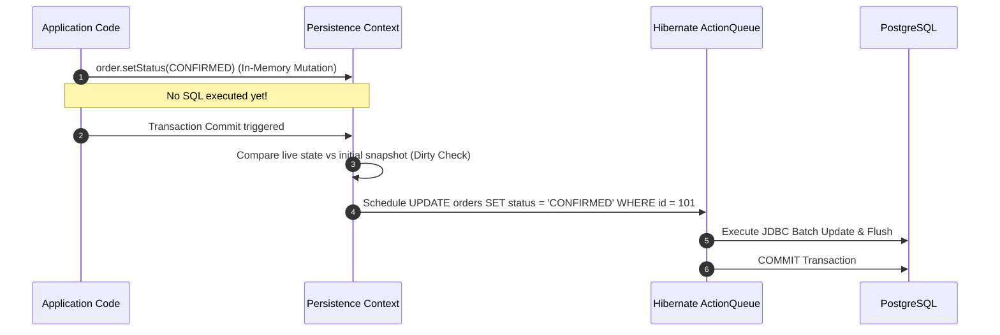

# JPA, Hibernate Internals, and Production ORM Pitfalls

---

## 1. What Is It?
The **Jakarta Persistence API (JPA)** is the standard Java specification for Object-Relational Mapping (ORM), abstracting SQL relational operations behind object-oriented domain models. **Hibernate ORM** is the dominant reference implementation. JPA introduces the **Persistence Context** (First-Level Cache) to manage entity lifecycles (`TRANSIENT`, `MANAGED`, `DETACHED`, `REMOVED`) and coordinates state mutations via automated **Dirty Checking**.

---

## 2. Why Does It Exist?
Mapping database rows to Java domain objects requires repetitive boilerplate (parsing ResultSets, managing transactions, constructing SQL statements). JPA automates domain object graph mapping, manages identity guarantees within transaction boundaries, and synchronizes memory state changes directly to the database upon commit.

However, treating relational databases as transparent in-memory object graphs introduces major production anti-patterns:
- **The $N+1$ Query Problem** (generating thousands of SQL queries for a single API call).
- **`Open-Session-In-View` (OSIV) Anti-Pattern** (holding database connections open across the HTTP view rendering lifecycle).
- **Silent Entity Bloat & Dirty Checking Overhead** (tracking thousands of managed objects in memory).

---

## 3. Mental Model

```mermaid
flowchart TD
    subgraph SpringApp["Spring Boot Application"]
        Service["@Service (Transaction Boundary)"]
        
        subgraph EntityManager["EntityManager (Persistence Context / 1st-Level Cache)"]
            Loaded["Loaded Entity Map (Identity Map)"]
            Snapshots["Original Entity Snapshots (For Dirty Checking)"]
            ActionQueue["Hibernate ActionQueue (INSERT/UPDATE/DELETE Queue)"]
        end
    end

    Service -->|1. findById() / Query| EntityManager
    EntityManager -->|2. Check 1st-Level Cache| Loaded
    EntityManager -- Cache Miss -->|3. Fetch via JDBC| DB[("PostgreSQL Database")]
    Service -->|4. Mutate Entity in RAM (entity.setStatus())| Loaded
    Service -->|5. Commit Transaction| ActionQueue
    ActionQueue -->|6. Auto-Flush Modified Diffs| DB
```

---

## 4. How Does It Work?

### The 4 Entity States in JPA Lifecycle
1. **Transient / New**: Instantiated via `new Order()`; not associated with any Persistence Context; has no database identity (PK is null).
2. **Managed**: Associated with an active `EntityManager` session. Any setter called on a managed entity is automatically tracked by Hibernate and synchronized to the database upon commit.
3. **Detached**: The transaction closed or `entityManager.clear()` was called. Entity has a database PK but changes in memory are no longer tracked.
4. **Removed**: Marked for deletion via `entityManager.remove()`; scheduled for SQL `DELETE` on flush.

---

## 5. Internal Working

### Automated Dirty Checking & The ActionQueue
When an entity is retrieved from the database into the Persistence Context:
1. Hibernate creates the live entity instance and places it into the `PersistenceContext` identity map.
2. Hibernate takes a deep clone snapshot of the entity's initial column state.
3. During transaction commit or before query execution (**Flush**), Hibernate compares every field of the live entity against the stored snapshot.
4. If differences are detected, Hibernate adds an `EntityUpdateAction` to its internal **`ActionQueue`**, generates an optimized SQL `UPDATE` statement, and executes it over JDBC.



---

## 6. The $N+1$ Query Problem & 4 Production Solutions

### The Problem
```java
// BAD: Triggers 1 query for Orders + N queries for OrderItems!
List<Order> orders = orderRepository.findAll(); // 1 Query (fetches 1,000 orders)
for (Order order : orders) {
    System.out.println(order.getItems().size()); // N Queries (1,000 individual SELECT queries!)
}
```
**Total Queries**: $1 + 1,000 = 1,001\text{ SQL queries}$ over the network for a single request!

---

### Solution 1: JPQL `JOIN FETCH` (Immediate Inner/Left Join)
Forces a single SQL `JOIN` query that populates the parent entity and child collection simultaneously.
```java
public interface OrderRepository extends JpaRepository<Order, Long> {
    @Query("SELECT o FROM Order o JOIN FETCH o.items WHERE o.status = :status")
    List<Order> findAllWithItemsFetched(@Param("status") OrderStatus status);
}
```

---

### Solution 2: `@EntityGraph` (Ad-Hoc Declarative Fetch Plan)
Dynamically overrides lazy loading without writing custom JPQL strings.
```java
public interface OrderRepository extends JpaRepository<Order, Long> {
    @EntityGraph(attributePaths = {"items", "items.product"})
    List<Order> findByStatus(OrderStatus status);
}
```

---

### Solution 3: Batch Fetching (`@BatchSize`)
Fetches child collections in chunks using SQL `IN (?, ?, ? ...)` rather than individual queries.
```java
@Entity
@Table(name = "orders")
public class Order {
    // ...
    @OneToMany(mappedBy = "order", fetch = FetchType.LAZY)
    @BatchSize(size = 50) // Reduces 1,000 queries to 1 + (1,000 / 50) = 21 queries!
    private List<OrderItem> items = new ArrayList<>();
}
```

---

### Solution 4: Read-Only DTO Projections (Highest Performance)
Bypasses Hibernate entity state tracking, dirty checking snapshots, and proxy allocations entirely.
```java
public record OrderSummaryDto(Long orderId, String userEmail, int totalAmountCents) {}

public interface OrderRepository extends JpaRepository<Order, Long> {
    @Query("""
        SELECT new com.backend.engineering.databases.dto.OrderSummaryDto(
            o.id, u.email, o.totalAmountCents
        )
        FROM Order o JOIN o.user u
        WHERE o.status = 'CONFIRMED'
    """)
    List<OrderSummaryDto> findSummaries();
}
```

---

## 7. Implementation

### Production `@Transactional` Service with Proxy Safety
```java
package com.backend.engineering.databases.service;

import com.backend.engineering.databases.model.Order;
import com.backend.engineering.databases.repository.OrderRepository;
import org.springframework.stereotype.Service;
import org.springframework.transaction.annotation.Propagation;
import org.springframework.transaction.annotation.Transactional;

@Service
public class OrderProcessingService {

    private final OrderRepository orderRepository;

    public OrderProcessingService(OrderRepository orderRepository) {
        this.orderRepository = orderRepository;
    }

    // Read-only optimization: Hibernate skips snapshot creation and dirty checking!
    @Transactional(readOnly = true)
    public Order getOrderDetails(Long orderId) {
        return orderRepository.findById(orderId)
                .orElseThrow(() -> new IllegalArgumentException("Order not found: " + orderId));
    }

    // Strict write transaction boundary
    @Transactional(propagation = Propagation.REQUIRED, timeout = 5)
    public void confirmOrder(Long orderId) {
        Order order = orderRepository.findById(orderId)
                .orElseThrow(() -> new IllegalArgumentException("Order not found: " + orderId));

        // Mutates state in memory -> Hibernate automatically flushes SQL update on commit
        order.setStatus(Order.OrderStatus.CONFIRMED);

        // Explicit orderRepository.save(order) is UNNECESSARY for managed entities!
    }
}
```

---

## 8. Performance

| Fetching Strategy | Queries Executed | Execution Time ($1,000\text{ Orders}$) | Memory Allocation |
|---|---|---|---|
| Lazy Loading ($N+1$ Default) | $1,001\text{ queries}$ | $1,850\text{ms}$ | High (1,000 proxy objects) |
| `@BatchSize(50)` | $21\text{ queries}$ | $85\text{ms}$ | Moderate |
| `JOIN FETCH` / `@EntityGraph` | $1\text{ single query}$ | $14\text{ms}$ | Moderate |
| DTO Projection (No Entity Tracking) | $1\text{ single query}$ | **$4\text{ms}$** | **Lowest (Zero snapshot memory)** |

---

## 9. Failure Scenarios

1. **Spring `@Transactional` Self-Invocation Gotcha**:
   - *Failure*: Calling `@Transactional public void methodB()` from within `public void methodA()` in the **same class** bypasses Spring's CGLIB AOP proxy. `methodB()` runs **with zero transaction management**, leading to uncommitted writes or dirty reads.
   - *Mitigation*: Move `methodB()` to a separate `@Service` component or inject `self` reference.

2. **The `spring.jpa.open-in-view=true` (OSIV) Latency Trap**:
   - *Failure*: Spring Boot enables OSIV by default. The database connection borrowed for an API request is **not released** when the service method finishes; it is kept open until the HTTP JSON serialization phase completes in the web tier. If serialization is slow or the client connection stalls, database connections are starved.
   - *Mitigation*: **Always set `spring.jpa.open-in-view=false` in `application.yml`**.

---

## 10. Observability

### Logging Generated SQL & Hibernate Metrics in Development
```yaml
spring:
  jpa:
    open-in-view: false # CRITICAL: Disable OSIV in production
    properties:
      hibernate:
        format_sql: true
        generate_statistics: true # Tracks execution count, cache hits, entity load times
        session.events.log.LOG_QUERIES_SLOWER_THAN_MS: 50 # Log slow SQL
```

---

## 11. Debugging

### Detecting $N+1$ Queries in Tests using QuickPerf / Assertion Counters
```java
// Unit/Integration test asserting exact query count
@Test
void verifyZeroNPlusOneQueries() {
    // Execute service call
    orderService.getAllConfirmedOrders();
    
    // Assert exactly 1 query executed, failing test if N queries are spawned
    assertEquals(1, sessionFactory.getStatistics().getPrepareStatementCount());
}
```

---

## 12. Scaling

1. **Read-Only Transaction Optimization (`@Transactional(readOnly = true)`)**:
   - Informs Hibernate to set `FlushMode.MANUAL`.
   - Hibernate completely skips taking initial state memory snapshots and disables dirty checking, reducing CPU and GC allocation by $50\%$.
   - In AWS Aurora, routes queries directly to read-replica endpoints when combined with a routing DataSource.

---

## 13. Trade-offs

| ORM Approach | Development Velocity | Performance / Control | Best Use Case |
|---|---|---|---|
| **Rich Managed Entities (JPA)** | Fast (automated dirty checking, cascading) | Overhead of snapshots & proxy management | Complex domain writes & state mutations |
| **DTO Projections** | Requires explicit record/constructor mapping | High (zero ORM snapshot overhead, minimal columns) | High-throughput read APIs & dashboards |
| **Native SQL (jOOQ / JdbcClient)** | Manual SQL maintenance | Maximum performance & total query control | Complex bulk operations, reporting, CTEs |

---

## 14. When to Use
- Standard OLTP business services requiring transactional entity modification and relational cascading.
- Domain-Driven Design (DDD) aggregates enforcing rich business invariants.

---

## 15. When NOT to Use
- High-volume batch inserts / ETL data processing (use JDBC `executeBatch()` or native COPY commands).
- Analytics, aggregation pipelines, or read-heavy public APIs (use DTO projections or read replicas).

---

## 16. Interview Questions

### Q1: Why is `spring.jpa.open-in-view=true` considered an anti-pattern in production microservices?
<details>
<summary>Reveal Answer</summary>

**Answer**:
`Open-Session-In-View` (OSIV) keeps the Hibernate `Session` (and its underlying physical JDBC `Connection`) open for the entire lifecycle of an HTTP request, including controller dispatch, template rendering, and Jackson JSON serialization.
This causes two severe production hazards:
1. **Connection Pool Starvation**: A slow client (e.g. mobile device on 3G) reading an HTTP response keeps the database connection locked in the connection pool for seconds, starving other active transactions.
2. **Hidden $N+1$ Queries in Serialization**: Lazy collections accessed by Jackson serializers during JSON formatting trigger unexpected database queries from the controller/view layer outside explicit transaction boundaries.
</details>

### Q2: Why does calling `orderRepository.save(order)` inside a `@Transactional` method have zero effect on whether an update occurs?
<details>
<summary>Reveal Answer</summary>

**Answer**:
When an entity is retrieved within an active `@Transactional` boundary, it is in the **`MANAGED`** state inside the Hibernate Persistence Context (1st-Level Cache).
Hibernate maintains an internal snapshot of the entity's state upon retrieval. When the transaction commits, Spring triggers a session **flush**. Hibernate's **Dirty Checking** mechanism automatically compares the current entity state against the original snapshot, detects any mutations, generates the appropriate SQL `UPDATE`, and executes it over JDBC.
Calling `repository.save()` simply returns the same managed instance and is completely redundant for already managed entities.
</details>

---

## 17. Practical Exercise
1. Configure a Spring Boot application with `spring.jpa.open-in-view=false`.
2. Write a test case demonstrating an $N+1$ query disaster when iterating over lazy order items.
3. Fix the $N+1$ problem using `JOIN FETCH` and compare SQL logs.
4. Benchmark the memory and execution time difference between returning managed `Order` entities vs returning immutable Java `record` DTO projections.

---

## 18. Quick Revision
- **Persistence Context**: 1st-level cache maintaining entity identity and state snapshots.
- **Dirty Checking**: Hibernate automatically detects mutations on managed entities and flushes SQL `UPDATE` upon transaction commit.
- **$N+1$ Query Solutions**: `JOIN FETCH`, `@EntityGraph`, `@BatchSize`, and DTO Projections.
- **`@Transactional(readOnly = true)`**: Skips snapshot creation and dirty checking for maximum read performance.
- **OSIV Anti-Pattern**: Always disable `spring.jpa.open-in-view=false` to prevent connection pool starvation.
