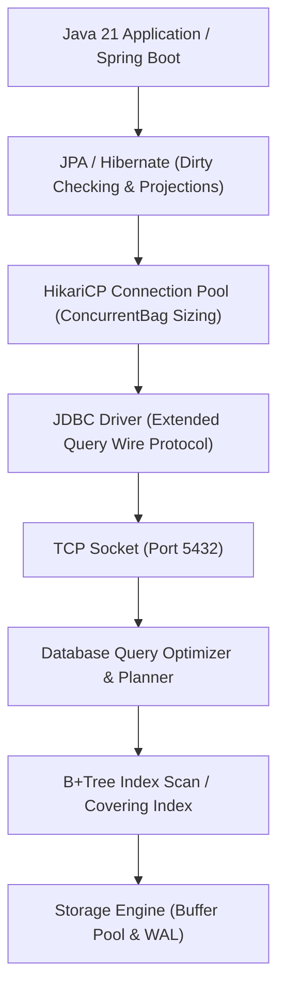

# Module 07: Databases (SQL & NoSQL)

Master the persistence layer: relational modeling, physical B+Tree indexes, join algorithms, JDBC wire protocols, HikariCP connection pool mechanics, and production Hibernate ORM optimizations.

---

## 🗺️ Module Architecture & Request Flow

---

## 📚 Curriculum Lessons

| # | Lesson | Core Focus & Mechanics |
|:---:|---|---|
| **01** | [`01-relational-data-modeling-and-normalization.md`](./01-relational-data-modeling-and-normalization.md) | Relational constraints, 1NF/2NF/3NF/BCNF, modification anomalies, and strategic denormalization for OLTP. |
| **02** | [`02-indexes-b-trees-and-query-execution.md`](./02-indexes-b-trees-and-query-execution.md) | B+Tree leaf doubly-linked chains, leftmost prefix rule, covering indexes (`INCLUDE`), and `CREATE INDEX CONCURRENTLY`. |
| **03** | [`03-joins-aggregations-and-query-optimization.md`](./03-joins-aggregations-and-query-optimization.md) | Nested Loop vs Hash Join vs Merge Join, Window functions (`ROW_NUMBER`, `DENSE_RANK`), and `work_mem` disk spills. |
| **04** | [`04-jdbc-and-prepared-statements.md`](./04-jdbc-and-prepared-statements.md) | JDBC wire protocols (`Parse`/`Bind`/`Execute`), generic plan caching, batching (`reWriteBatchedInserts`), and streaming cursors. |
| **05** | [`05-connection-pooling-and-hikaricp.md`](./05-connection-pooling-and-hikaricp.md) | HikariCP `ConcurrentBag`, pool sizing formula $((\text{Cores} \times 2) + 1)$, leak detection, and pool starvation triage. |
| **06** | [`06-jpa-hibernate-and-orm-pitfalls.md`](./06-jpa-hibernate-and-orm-pitfalls.md) | Persistence context, dirty checking, 4 solutions to $N+1$ queries (`JOIN FETCH`, `@EntityGraph`, `@BatchSize`, DTO Projections), and disabling OSIV. |

---

## ⚡ Key Production Takeaways

1. **Index All Foreign Keys**: Prevent full table share locks and catastrophic cascaded delete blocking.
2. **Leftmost Prefix Discipline**: Structure composite index column ordering to match high-frequency equality filters before range filters.
3. **Connection Pool Sizing**: Bounding connection pools to $(\text{Cores} \times 2) + \text{Spindles}$ yields higher throughput and lower latency than oversized pools.
4. **Never Block in Transactions**: Never make remote HTTP or long-running RPC calls inside `@Transactional` blocks to prevent connection pool exhaustion.
5. **Always Disable OSIV**: Set `spring.jpa.open-in-view=false` to release physical database connections immediately after service execution.
