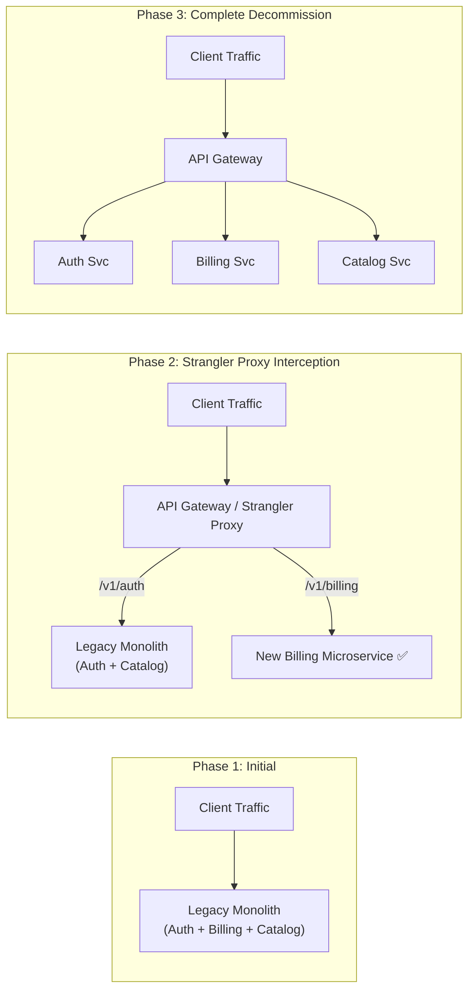

# Lesson 01: Microservices Decomposition & Domain-Driven Design

Master Domain-Driven Design (DDD) principles, Bounded Contexts, Aggregate Roots, Monolith-to-Microservices decomposition strategies, and the Strangler Fig Pattern.

---

## 1. What Is It?
- **Domain-Driven Design (DDD)**: An architectural philosophy that aligns software structure with business domains.
- **Bounded Context**: An explicit linguistic and functional boundary within which a domain model has a single, unambiguous meaning (e.g., `Account` in the Billing context means an invoice ledger, while `Account` in the Security context means login credentials).
- **Strangler Fig Pattern**: An incremental migration pattern where new microservice endpoints gradually intercept traffic from a legacy monolith until the monolith is entirely decommissioned.

---

## 2. Why Does It Exist?
"Big Bang" rewrites fail $90\%$ of the time due to unforeseen edge cases, data inconsistencies, and prolonged downtime. The Strangler Fig pattern provides zero-downtime, low-risk incremental migration.

---

## 3. Mental Model: The Strangler Fig Migration Progression



---

## 4. How Does It Work: DDD Core Tactical Building Blocks

| Building Block | Definition | Mutability | Example |
|---|---|---|---|
| **Entity** | Object defined by unique identifier across time | Mutable | `Order` (ID: `#1001`), `User` |
| **Value Object** | Immutable object defined purely by its attributes | **Immutable** | `Money(amount: 100, currency: USD)` |
| **Aggregate Root**| Cluster of entities/value objects treated as a single transactional consistency boundary | Mutable via Root | `Order` (Root) containing `OrderItems` |
| **Domain Event** | Record of a significant business occurrence | **Immutable** | `OrderPlacedEvent`, `PaymentFailedEvent` |

---

## 5. Internal Working: Aggregate Root Consistency Invariant

In DDD, external services must **never mutate internal child entities directly**. All operations must flow through the **Aggregate Root**:

```java
// ❌ WRONG (Violates DDD Aggregate Invariant):
orderItemRepository.save(new OrderItem(orderId, item, price));

// ✅ CORRECT (Root enforces transactional business rules):
OrderAggregate order = orderRepository.findById(orderId).orElseThrow();
order.addItem(productId, quantity, price); // Root checks max items & recalculates total
orderRepository.save(order); // Single atomic transaction
```

---

## 6. Example & Production Java 21 Code

Production DDD Aggregate Root in Java 21:

```java
package com.backend.microservices.ddd;

import java.math.BigDecimal;
import java.util.ArrayList;
import java.util.Collections;
import java.util.List;
import java.util.Objects;

public class OrderAggregate {

    public enum OrderStatus { CREATED, CONFIRMED, SHIPPED, CANCELLED }

    public record Money(BigDecimal amount, String currency) {
        public Money {
            Objects.requireNonNull(amount);
            Objects.requireNonNull(currency);
            if (amount.compareTo(BigDecimal.ZERO) < 0) {
                throw new IllegalArgumentException("Amount cannot be negative");
            }
        }

        public Money add(Money other) {
            if (!this.currency.equals(other.currency())) {
                throw new IllegalArgumentException("Currency mismatch: " + this.currency + " vs " + other.currency());
            }
            return new Money(this.amount.add(other.amount()), this.currency);
        }
    }

    public record OrderItem(String productId, int quantity, Money unitPrice) {
        public Money subtotal() {
            return new Money(unitPrice.amount().multiply(BigDecimal.valueOf(quantity)), unitPrice.currency());
        }
    }

    private final String orderId;
    private final String customerId;
    private final List<OrderItem> items = new ArrayList<>();
    private OrderStatus status;
    private Money totalAmount;

    public OrderAggregate(String orderId, String customerId, String currency) {
        this.orderId = Objects.requireNonNull(orderId);
        this.customerId = Objects.requireNonNull(customerId);
        this.status = OrderStatus.CREATED;
        this.totalAmount = new Money(BigDecimal.ZERO, currency);
    }

    // Invariant Enforcement: Only Root can add items and mutate totals
    public void addItem(String productId, int quantity, Money unitPrice) {
        if (this.status != OrderStatus.CREATED) {
            throw new IllegalStateException("Cannot add items to an order in status: " + this.status);
        }
        if (items.size() >= 50) {
            throw new IllegalStateException("Exceeded maximum items limit (50) per order");
        }

        OrderItem newItem = new OrderItem(productId, quantity, unitPrice);
        items.add(newItem);
        this.totalAmount = this.totalAmount.add(newItem.subtotal());
    }

    public void confirm() {
        if (items.isEmpty()) {
            throw new IllegalStateException("Cannot confirm empty order");
        }
        this.status = OrderStatus.CONFIRMED;
    }

    public List<OrderItem> getItems() {
        return Collections.unmodifiableList(items); // Prevent external list tampering
    }

    public OrderStatus getStatus() { return status; }
    public Money getTotalAmount() { return totalAmount; }
    public String getOrderId() { return orderId; }
}
```

---

## 7. Performance Characteristics
- Scoping transactions strictly to Aggregate Roots eliminates cross-table distributed locks, keeping database transaction lock durations $< 2\text{ms}$.

---

## 8. Failure Scenarios & Edge Cases
- **Distributed Monolith Anti-Pattern**: Splitting code into 20 microservices but keeping a single shared PostgreSQL database. Every schema change breaks multiple services, and network round-trips destroy latency.
  - **Rule**: Every microservice **must own its private database schema** (Database-per-Service pattern).

---

## 9. Observability (Logs, Metrics, Traces)
```text
# Strangler Proxy Metrics
strangler_proxy_requests_total{target="monolith",path="/v1/auth"} 45000
strangler_proxy_requests_total{target="new_microservice",path="/v1/billing"} 89000
```

---

## 10. Debugging & Troubleshooting
1. **Detect Shared Database Anti-Patterns**:
   ```bash
   # Audit repository database connection strings
   grep -r "spring.datasource.url" */src/main/resources/
   ```

---

## 11. Scaling Considerations
- Keep Aggregates small. Large Aggregates containing hundreds of child entities cause high optimistic locking contention (`OptimisticLockException`).

---

## 12. Architectural Trade-offs
| Architecture | Team Autonomy | Operational Complexity | Network Overhead |
|---|---|---|---|
| **Modular Monolith** | Moderate | **Lowest** | **Zero (In-Memory)** |
| **Microservices** | **Maximum** | High (K8s, Tracing, CI/CD) | Moderate (Network hops) |

---

## 13. When to Use
- Use **Strangler Fig** when migrating high-traffic legacy systems to modern cloud microservices.
- Use **DDD Aggregate Roots** when managing complex transactional business invariants.

---

## 14. When NOT to Use
- Do not split a monolith into microservices if a single small team ($< 6$ engineers) owns the entire product.

---

## 15. SDE2 / Senior Interview Questions & Answers
### Q1: What is a Bounded Context in DDD, and how does it prevent data model corruption across microservices?
<details>
<summary>Reveal Answer</summary>

**Answer**:
- **Definition**: A Bounded Context is an explicit boundary within which a specific domain model and ubiquitous language applies cleanly.
- **The Problem**: In a monolithic unified data model, the concept of a `User` or `Product` tries to satisfy every department simultaneously. The `User` class ends up with 95 database columns: password hashes for Auth, credit card IDs for Billing, shipping addresses for Logistics, and recommendation tags for Marketing. A change by the Marketing team can accidentally break User Authentication.
- **How Bounded Contexts Solve It**:
  1. Each microservice defines its own minimal model tailored strictly to its business context.
  2. The **Auth Service** defines `User { id, email, passwordHash, mfaEnabled }`.
  3. The **Billing Service** defines `Customer { customerId, billingAddress, stripeId }`.
  4. The **Shipping Service** defines `Recipient { recipientId, street, postalCode, deliveryInstructions }`.
  5. Services communicate via explicit APIs or Domain Events (`UserCreatedEvent`) rather than a shared monolithic table.
</details>

---

## 16. Practical Exercise
1. Model an `EcommerceCart` Aggregate Root that enforces a maximum weight limit rule before adding items.

---

## 17. Quick Revision Summary
- Apply **Domain-Driven Design (DDD)** to define clear Bounded Contexts.
- Use the **Strangler Fig Pattern** for zero-downtime monolith migration.
- Enforce the **Database-per-Service** rule to prevent distributed monoliths.
