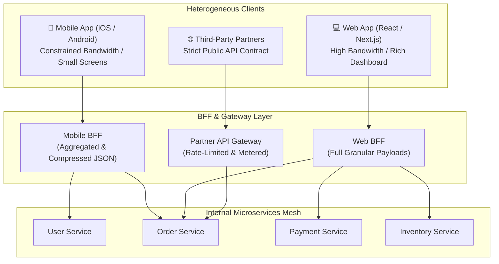

# Lesson 02: API Gateway Pattern & Backend-For-Frontend (BFF)

Master API Gateway architecture, Netty-based reactive routing, Backend-For-Frontend (BFF) patterns for heterogeneous clients, SSL termination, and request aggregation.

---

## 1. What Is It?
- **API Gateway**: A reverse proxy that acts as the single entry point for all external client traffic, handling routing, cross-cutting concerns (authentication, rate limiting, SSL termination), and protocol translation.
- **BFF (Backend-For-Frontend)**: A dedicated gateway layer tailored specifically to the requirements of a particular client type (e.g., Mobile BFF vs Web BFF vs Third-Party Public API BFF).

---

## 2. Why Does It Exist?
Mobile devices on cellular networks have limited bandwidth and high latency. Direct microservice communication requires a mobile app to make 10 separate HTTP requests to render a single screen. A BFF aggregates those 10 backend calls into a single compact JSON response.

---

## 3. Mental Model: API Gateway vs Backend-For-Frontend (BFF)



---

## 4. How Does It Work: API Gateway Responsibilities

| Responsibility | Gateway Layer | Internal Microservices |
|---|---|---|
| **SSL / TLS Termination** | Handled at Edge ($0\text{ms}$ service overhead) | Plain HTTP / mTLS |
| **Authentication & JWKS** | Validates JWT RS256 Signature | Trusts `X-User-Id` downstream header |
| **Rate Limiting** | Enforces IP/Token Leaky Bucket | Focuses purely on domain logic |
| **Request Aggregation** | Merges 5 backend calls into 1 DTO | Returns atomic domain entities |

---

## 5. Internal Working: Reactive Non-Blocking Routing (Netty / Spring Cloud Gateway)

Traditional gateways (e.g. Zuul 1.x) used **Thread-per-Request** blocking I/O. When downstream microservices slowed down, gateway thread pools were exhausted within seconds.

Modern gateways (Spring Cloud Gateway, Envoy, Kong) use **Netty Event Loops with non-blocking epoll I/O**. A single gateway pod with 4 CPU cores can easily route $> 50,000\text{ req/sec}$.

---

## 6. Example & Production Java 21 Code

Spring Cloud Gateway Route Configuration with Token Relay Filter:

```java
package com.backend.microservices.gateway;

import org.springframework.cloud.gateway.route.RouteLocator;
import org.springframework.cloud.gateway.route.builder.RouteLocatorBuilder;
import org.springframework.context.annotation.Bean;
import org.springframework.context.annotation.Configuration;

@Configuration
public class GatewayRouteConfig {

    @Bean
    public RouteLocator customRouteLocator(RouteLocatorBuilder builder) {
        return builder.routes()
            // Route 1: Orders Service with Circuit Breaker and Token Extraction
            .route("orders-service", r -> r
                .path("/v1/orders/**")
                .filters(f -> f
                    .rewritePath("/v1/orders/(?<segment>.*)", "/orders/${segment}")
                    .circuitBreaker(c -> c
                        .setName("ordersCircuitBreaker")
                        .setFallbackUri("forward:/fallback/orders")
                    )
                    .addRequestHeader("X-Gateway-Source", "MobileBFF")
                )
                .uri("lb://ORDERS-SERVICE") // Client-Side Load Balanced
            )
            // Route 2: Payment Service with Request Rate Limiter
            .route("payments-service", r -> r
                .path("/v1/payments/**")
                .filters(f -> f
                    .stripPrefix(1)
                )
                .uri("lb://PAYMENT-SERVICE")
            )
            .build();
    }
}
```

---

## 7. Performance Characteristics
- Non-blocking reactive routing in Spring Cloud Gateway adds $< 1.2\text{ms}$ p99 proxy latency overhead under a load of $10,000\text{ req/sec}$.

---

## 8. Failure Scenarios & Edge Cases
- **Cascading Gateway Exhaustion**: If a downstream service hangs without timeouts, and the gateway does not configure reactive connection/read timeouts, gateway open sockets multiply until the OS runs out of file descriptors (`Too many open files`).
  - **Mitigation**: Configure strict `response-timeout: 3s` and `connect-timeout: 500ms` on every route.

---

## 9. Observability (Logs, Metrics, Traces)
```text
# Gateway Metrics
gateway_requests_total{route_id="orders-service",status="200"} 124000
gateway_requests_total{route_id="orders-service",status="504"} 14
gateway_request_latency_seconds_bucket{route_id="orders-service",le="0.05"} 123800
```

---

## 10. Debugging & Troubleshooting
1. **Trace Request Routing**:
   ```bash
   curl -i -H "X-Debug-Route: true" https://api.production.com/v1/orders/101
   ```

---

## 11. Scaling Considerations
- Place a layer 4 Cloud Load Balancer (AWS NLB / GCP Cloud Armor) in front of the API Gateway cluster for high availability and DDoS absorption.

---

## 12. Architectural Trade-offs
| Pattern | Network Round-Trips | Client Coupling | Deployment Complexity |
|---|---|---|---|
| **Direct Client to Microservice**| High ($N$ requests) | High | Low |
| **Single Monolithic API Gateway**| Low ($1$ request) | Medium | Moderate |
| **Backend-For-Frontend (BFF)** | **Lowest ($1$ request)**| **Zero (Tailored)**| Moderate (1 BFF per client team) |

---

## 13. When to Use
- Use **BFF** whenever your backend supports distinctly different platforms (iOS/Android mobile apps vs Desktop Web apps).

---

## 14. When NOT to Use
- Do not build a complex BFF layer if you only have a single web application and no mobile apps.

---

## 15. SDE2 / Senior Interview Questions & Answers
### Q1: What is the Backend-For-Frontend (BFF) pattern, and what specific problems does it solve compared to a single shared API Gateway?
<details>
<summary>Reveal Answer</summary>

**Answer**:
- **The Problem with a Single Shared Gateway**:
  - Different client interfaces have radically different UI data requirements, network constraints, and release lifecycles.
  - A mobile app on a 3G network needs a compact, 2KB response with only 4 fields.
  - A desktop admin dashboard needs a 200KB response with 40 fields and nested relational tables.
  - Putting all client formatting logic into a single generic gateway causes team friction and bloated, unoptimized payloads.
- **How BFF Solves It**:
  1. A separate, lightweight gateway service is created for each client type (**Mobile BFF**, **Web BFF**, **Public API BFF**).
  2. The Mobile Team owns the Mobile BFF and can optimize endpoints, batch requests, and translate binary protocols (Protobuf) without coordinating with the Web team.
  3. The internal domain microservices remain clean, reusable, and decoupled from client-specific presentation quirks.
</details>

---

## 16. Practical Exercise
1. Configure a Spring Cloud Gateway route with a fallback filter that returns cached data when the downstream microservice throws HTTP 500.

---

## 17. Quick Revision Summary
- Use **API Gateways** for centralized SSL, rate limiting, and auth offloading.
- Use **BFF (Backend-For-Frontend)** to decouple mobile and web client payloads.
- Always configure strict **non-blocking timeouts** to prevent thread/socket exhaustion.
