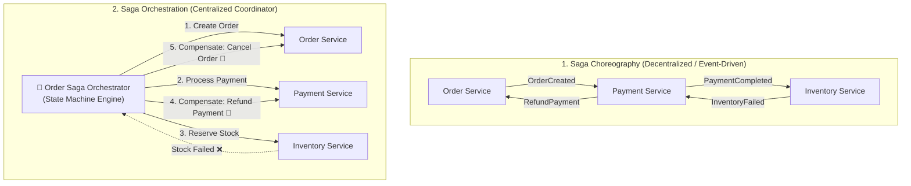

# Lesson 04: Distributed Transactions & Saga Pattern

Master distributed transaction management, the failure modes of Two-Phase Commit (2PC), Saga Orchestration vs Saga Choreography, Compensating Transactions, and Semantic Rollbacks.

---

## 1. What Is It?
- **Distributed Transaction**: A business transaction that spans across multiple microservices and their private databases.
- **Saga Pattern**: A design pattern that manages distributed transactions as a sequence of local database transactions. Each local transaction updates the database and publishes a message/event to trigger the next step. If a step fails, the Saga executes **Compensating Transactions** to undo the previous steps.

---

## 2. Why Does It Exist?
Traditional **Two-Phase Commit (2PC / XA Transactions)** relies on distributed locks across multiple databases. In modern microservices, 2PC creates catastrophic latency, distributed deadlocks, and is not supported by NoSQL and modern messaging systems.

---

## 3. Mental Model: Saga Choreography vs Saga Orchestration



---

## 4. How Does It Work: Comparing Choreography vs Orchestration

| Dimension | Saga Choreography | Saga Orchestration |
|---|---|---|
| **Coordination** | Decentralized (Kafka Events) | **Centralized (Saga Orchestrator State Machine)** |
| **Complexity** | Becomes hard to trace with $> 4$ services | **Clear, visual workflow & status tracking** |
| **Coupling** | Loosely coupled | Orchestrator knows all participating services |
| **Failure Handling** | Complex cyclic compensation events | **Centralized, deterministic compensation** |
| **Best For** | Simple 2–3 step workflows | **Complex enterprise multi-step transactions** |

---

## 5. Internal Working: Compensating Transactions vs ACID Rollback

In a standard ACID database, `ROLLBACK` wipes uncommitted writes from the transaction log as if they never happened.

In a Saga, previous local transactions have **already been committed** to their respective databases and visible to other users. A **Compensating Transaction** does not erase history — it applies a new semantic reversal transaction (e.g., executing a credit refund to cancel a previous debit charge).

---

## 6. Example & Production Java 21 Code

Production Order Saga Orchestrator with Compensating Rollbacks:

```java
package com.backend.microservices.saga;

import org.slf4j.Logger;
import org.slf4j.LoggerFactory;
import org.springframework.stereotype.Service;

import java.math.BigDecimal;
import java.util.ArrayDeque;
import java.util.Deque;

@Service
public class OrderSagaOrchestrator {

    private static final Logger log = LoggerFactory.getLogger(OrderSagaOrchestrator.class);

    private final OrderServiceClient orderService;
    private final PaymentServiceClient paymentService;
    private final InventoryServiceClient inventoryService;

    public OrderSagaOrchestrator(
        OrderServiceClient orderService,
        PaymentServiceClient paymentService,
        InventoryServiceClient inventoryService
    ) {
        this.orderService = orderService;
        this.paymentService = paymentService;
        this.inventoryService = inventoryService;
    }

    public record SagaContext(String orderId, String userId, BigDecimal amount, String productId, int quantity) {}

    public boolean executeOrderSaga(SagaContext ctx) {
        Deque<Runnable> compensations = new ArrayDeque<>();

        try {
            // Step 1: Create Order in PENDING state
            log.info("Saga Step 1: Creating order {}", ctx.orderId());
            orderService.createPendingOrder(ctx.orderId(), ctx.userId());
            compensations.push(() -> orderService.cancelOrder(ctx.orderId(), "SAGA_ABORTED"));

            // Step 2: Charge Payment
            log.info("Saga Step 2: Authorizing payment for order {}", ctx.orderId());
            String paymentId = paymentService.charge(ctx.userId(), ctx.amount());
            compensations.push(() -> paymentService.refund(paymentId, ctx.amount()));

            // Step 3: Reserve Inventory
            log.info("Saga Step 3: Reserving inventory for product {}", ctx.productId());
            inventoryService.reserveStock(ctx.productId(), ctx.quantity());
            compensations.push(() -> inventoryService.releaseStock(ctx.productId(), ctx.quantity()));

            // Step 4: Finalize Order
            orderService.approveOrder(ctx.orderId());
            log.info("Order Saga completed successfully for {}", ctx.orderId());
            return true;

        } catch (Exception e) {
            log.error("Saga failed at step! Executing {} compensating transactions...", compensations.size(), e);
            rollback(compensations);
            return false;
        }
    }

    private void rollback(Deque<Runnable> compensations) {
        while (!compensations.isEmpty()) {
            Runnable compensationAction = compensations.pop();
            try {
                compensationAction.run(); // Execute LIFO rollback
            } catch (Exception e) {
                log.error("CRITICAL: Compensating transaction failed! Must alert on-call or write to Dead Letter Queue", e);
            }
        }
    }
}
```

---

## 7. Performance Characteristics
- Saga execution distributes database writes asynchronously across independent systems, eliminating blocking 2PC locks and enabling $> 10,000\text{ tx/sec}$.

---

## 8. Failure Scenarios & Edge Cases
- **Compensating Transaction Failure**: The inventory service fails, the orchestrator attempts to refund payment, but the payment service is unreachable!
  - **Mitigation**: Compensating actions **must be idempotent**. Failed compensations are retried automatically with exponential backoff and published to a **Dead Letter Queue (DLQ)** for manual operator intervention.

---

## 9. Observability (Logs, Metrics, Traces)
```text
# Saga Metrics
saga_executions_total{saga="order",status="success"} 54000
saga_executions_total{saga="order",status="compensated"} 320
saga_compensation_failures_total{saga="order"} 0
```

---

## 10. Debugging & Troubleshooting
1. **Correlate Saga Steps via W3C Traceparent**:
   ```bash
   grep "traceparent: 00-4bf92f3577b34da6a3ce929d0e0e4736" /var/log/services/*.log
   ```

---

## 11. Scaling Considerations
- For complex multi-hour or multi-day Sagas, use workflow engines like **Temporal** or **AWS Step Functions** to persist saga state safely across server crashes.

---

## 12. Architectural Trade-offs
| Pattern | Atomicity Guarantee | Throughput | Lock Duration |
|---|---|---|---|
| **Two-Phase Commit (2PC)** | Strong ACID | Low ($< 200\text{ tx/s}$) | Long (Locks held across network) |
| **Saga Pattern** | **Eventual Consistency**| **Ultra-High ($> 10,000\text{ tx/s}$)**| **Minimal (Local DB locks only)** |

---

## 13. When to Use
- Use **Saga Orchestration** for business-critical multi-service transactional flows (orders, billing, bookings).

---

## 14. When NOT to Use
- Do not use Sagas within a single monolithic database boundary (use standard `@Transactional` ACID instead).

---

## 15. SDE2 / Senior Interview Questions & Answers
### Q1: Why is Two-Phase Commit (2PC) considered an anti-pattern in distributed microservices, and how does the Saga pattern solve its flaws?
<details>
<summary>Reveal Answer</summary>

**Answer**:
- **Why 2PC Fails at Scale**:
  1. **Blocking Protocol**: During Phase 1 (Prepare), all participating databases acquire row locks and hold them while waiting for the Coordinator's Phase 2 (Commit) command. If the coordinator or network lags, database locks remain open, exhausting database connection pools across all services.
  2. **Single Point of Failure**: If the Coordinator crashes mid-commit, all databases are left in an uncertain, locked state.
  3. **Incompatible Technologies**: Modern microservices use heterogeneous databases (PostgreSQL, MongoDB, Kafka, Redis), many of which do not support XA/2PC protocols.
- **How Saga Solves It**:
  1. Breaks the global transaction into independent local database transactions.
  2. Each service immediately commits its local transaction and releases row locks in $< 5\text{ms}$.
  3. If a subsequent step fails, compensating transactions are triggered to semantically reverse committed actions without holding global distributed locks.
</details>

---

## 16. Practical Exercise
1. Implement an idempotent compensation endpoint in Java that accepts repeated `POST /refunds` with the same `transactionId` without duplicate debiting.

---

## 17. Quick Revision Summary
- Avoid **2PC** in microservices due to blocking distributed locks.
- Use **Saga Orchestration** with centralized state machines for complex multi-step workflows.
- All **Compensating Transactions** must be strictly idempotent and retriable.
